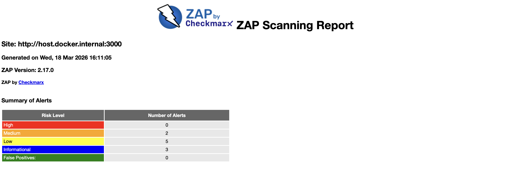
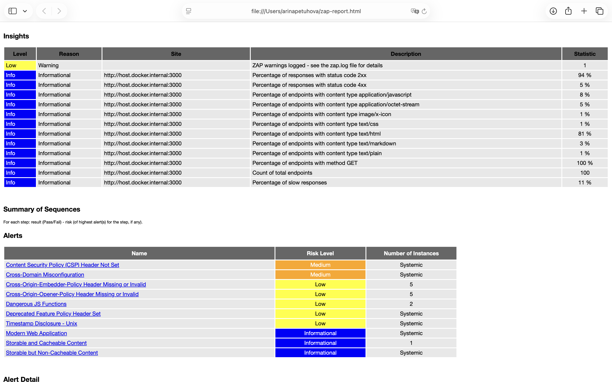
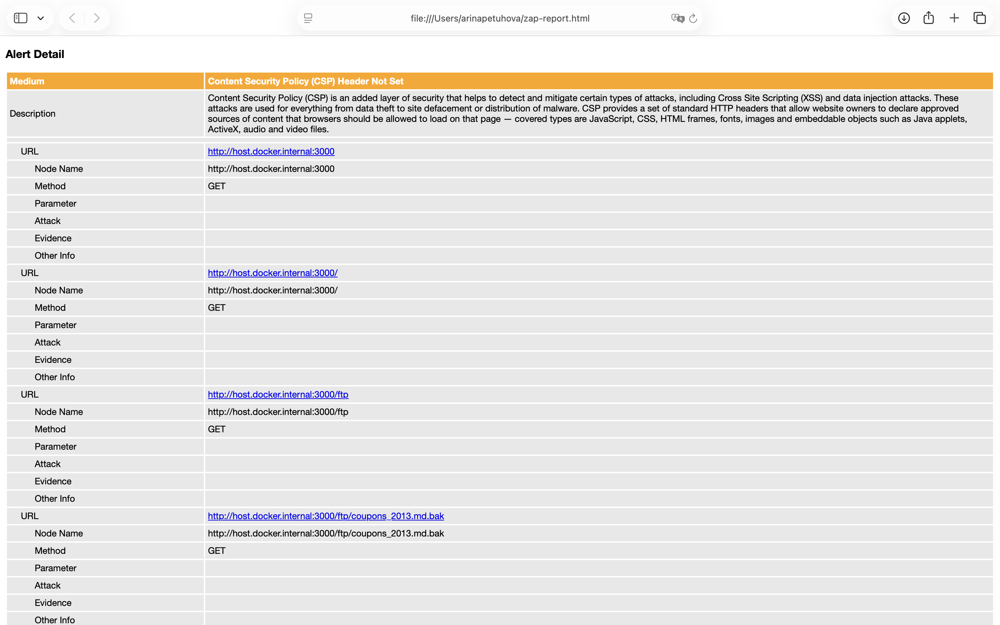
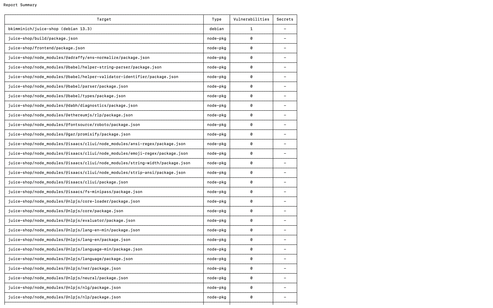
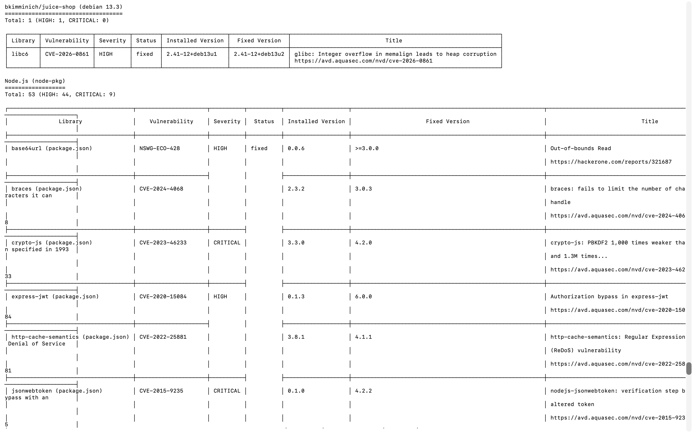
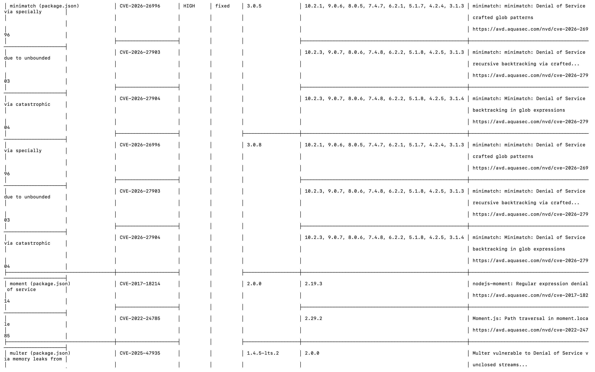
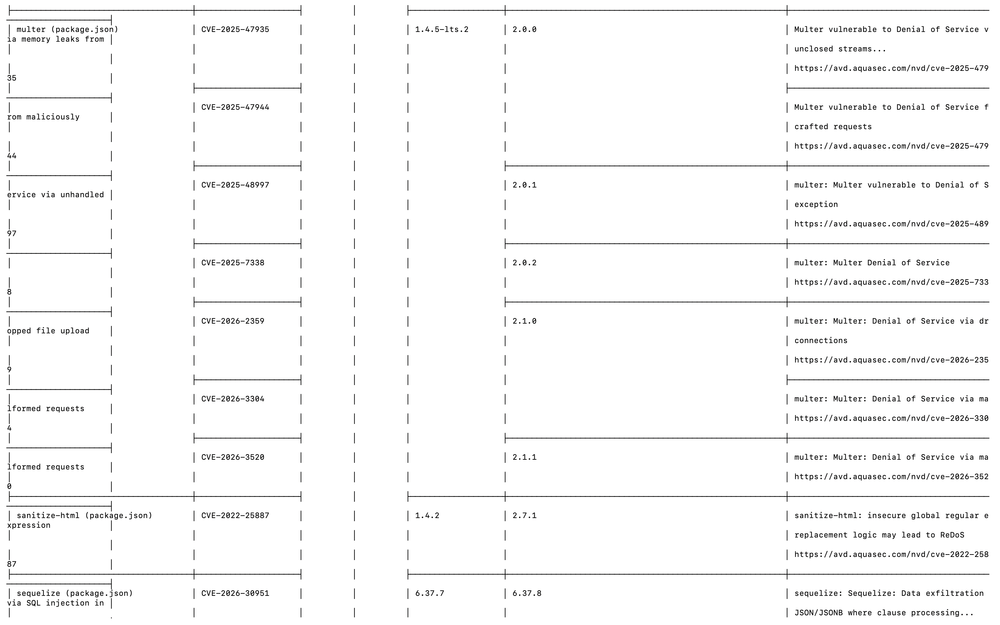
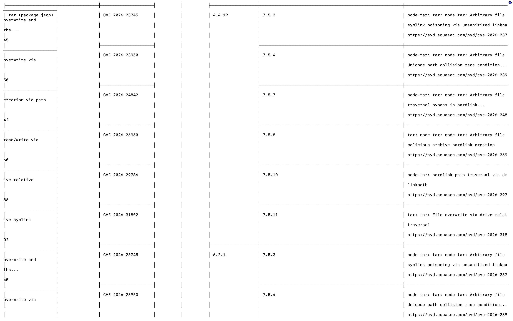
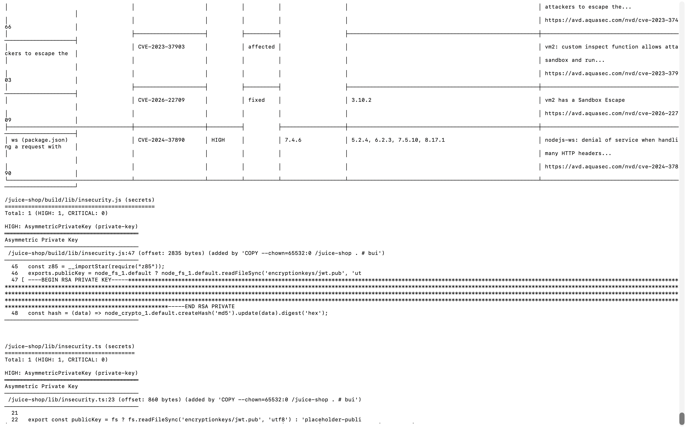

# Lab 9 Submission
## Task 1: Web Application Scanning with OWASP ZAP 
#### Number of Medium risk vulnerabilities found:
1. Content Security Policy (CSP) Header Not Set
2. Cross-Domain Misconfiguration

#### Description of the 2 most interesting vulnerabilities:
1. Content Security Policy (CSP) Header Not Set (Medium)
This vulnerability means the web application does not have a Content Security Policy header configured. CSP is a critical security layer that helps prevent Cross-Site Scripting (XSS) and data injection attacks by telling the browser which sources of content are trusted to load on the page. Without it, the application is more vulnerable to malicious script injection, where attackers could potentially steal user data or deface the website.

2. Cross-Domain Misconfiguration (Medium)
The scan found that the server has an overly permissive CORS (Cross-Origin Resource Sharing) policy with `Access-Control-Allow-Origin: *` configured. This means any website can make requests to this application and read the responses. While this is less risky for unauthenticated APIs, it could allow attackers to bypass IP whitelisting or access sensitive data that should be restricted to specific domains only.

#### Security headers status (which are present/missing and why they matter):
**Missing Headers:**
- **Content-Security-Policy:** This header prevents XSS attacks by controlling which resources can load
- **Cross-Origin-Embedder-Policy** This prevents documents from loading cross-origin resources without permission
- **Cross-Origin-Opener-Policy** This isolates browsing contexts to prevent data leaks

**Present but Problematic Headers:**
- **Access-Control-Allow-Origin:** Present but set to * (wildcard). This is too permissive and allows any domain to access resources
- **Feature-Policy:** Present but deprecated. Should be replaced with Permissions-Policy header

**Why matters:**
These headers are essential for modern web security. CSP prevents malicious script execution, CORS controls cross-domain access, and COOP/COEP provide isolation against side-channel attacks. Missing them leaves the application vulnerable to common attacks like XSS, data theft, and cross-origin exploits.

#### Screenshot of ZAP HTML report overview:

#### Analysis:
Based on the scan and general security trends, the most common vulnerabilities in web applications are:
1. **Security Misconfigurations:** Like missing CSP headers and permissive CORS policies, these are extremely common because they require manual configuration and are easy to overlook during development.
2. **Information Disclosure:** Timestamp disclosures and cacheable content (both found in the scan) are frequent issues where applications accidentally leak system information or sensitive data through headers or responses.
3. **Outdated or Deprecated Features:** Using deprecated headers like`Feature-Policy` instead of `Permissions-Policy` shows how applications often lag behind evolving security standards.
4. **Client-Side Vulnerabilities:** Dangerous JS functions (like `bypassSecurityTrustHtml`) found in this scan represent common risks where developers bypass security mechanisms for convenience.

## Task 2: Container Vulnerability Scanning with Trivy
#### Total count of CRITICAL and HIGH vulnerabilities:
**CRITICAL:** 9 vulnerabilities

**HIGH:** 44 vulnerabilities

#### List of 2 vulnerable packages with their CVE IDs:
1. **crypto-js (package.json) - CVE-2023-46233 (CRITICAL)**

- Vulnerability: PBKDF2 is 1,000 times weaker than specified in 1993 and 1.3 million times weaker than current standards
- Installed version: 3.3.0
- Fixed version: 4.2.0

2. **jsonwebtoken (package.json) - CVE-2015-9235 (CRITICAL)**

- Vulnerability: Verification step can be bypassed with an altered token
- Installed version: 0.1.0 and 0.4.0
- Fixed version: 4.2.2

#### Most common vulnerability type found:
The most common vulnerability type found is **Denial of Service (DoS) and Path Traversal issues**, particularly in packages like `multer`, `tar`, and `minimatch`. These vulnerabilities allow attackers to crash the application, overwrite files, or access sensitive data through maliciously crafted requests or archive files.

#### Screenshot of Trivy terminal output showing critical findings:

#### Analysis: 
Container image scanning is important because it finds security problems in your application before they go live. This scan found 53 critical and high vulnerabilities, including issues that could let attackers bypass login systems or crash the application. If these problems make it to production, hackers could steal data or take down your website. Scanning catches these issues early when they're easy and cheap to fix, rather than after deployment when they could cause real damage to your users and business.

#### Reflection:
I would add Trivy scanning at two key points in the pipeline. First, on every pull request, I'd run a scan and fail the build if critical vulnerabilities are found, this prevents bad code from ever being merged. Second, right after building the container image, I'd scan it again and block it from being pushed to the registry if it has high-risk issues. This creates a security gate that automatically stops vulnerable images from reaching production, without needing manual checks. The whole process runs automatically every time code changes, keeping security simple and consistent.