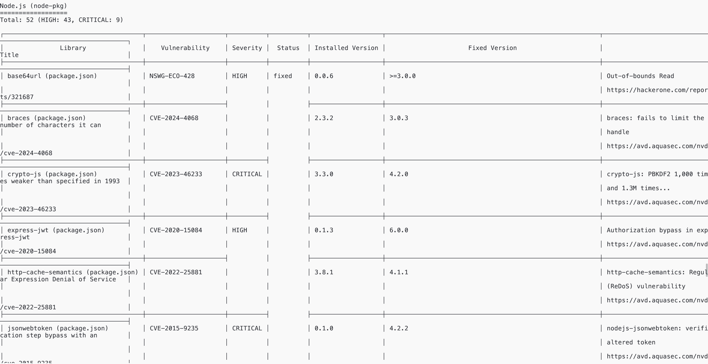

# Lab 9

## Task 1

**Number of Medium risk vulnerabilities found:**

2

**Description of the 2 most interesting vulnerabilities:** 

1. Dangerous JS Functions: A dangerous JS function seems to be in use that would leave the site vulnerable.

2. Cross-Domain Misconfiguration: Web browser data loading may be possible, due to a Cross Origin Resource Sharing (CORS) misconfiguration on the web server.

**Security headers status (which are present/missing and why they matter):**

Content Security Policy (CSP) is an added layer of security that helps to detect and mitigate certain types of attacks, including Cross Site Scripting (XSS) and data injection attacks. These attacks are used for everything from data theft to site defacement or distribution of malware. CSP provides a set of standard HTTP headers that allow website owners to declare approved sources of content that browsers should be allowed to load on that page — covered types are JavaScript, CSS, HTML frames, fonts, images and embeddable objects such as Java applets, ActiveX, audio and video files.

**Screenshot of ZAP HTML report overview:** 

**Analysis: What type of vulnerabilities are most common in web applications?** 

The most common vulnerabilities in web app include Remote Code Execution, SQL injection, cross-site scripting (XSS), security misconfiguration, etc. These vulnerabilities can lead to unauthorized access, data breaches, and other security issues if not properly addressed.

## Task 2

**Number of vulnerabilities found:**

Total: 52 (HIGH: 43, CRITICAL: 9)

**List of 2 vulnerable packages with their CVE IDs:**

base64url — NSWG-ECO-428
braces — CVE-2024-4068

**Most common vulnerability type found:** 

Denial of Service, including Redos memory leaks and catastrophic backtracking.

**Screenshot of Trivy terminal output showing critical findings:**

**Analysis: Why is container image scanning important before deploying to production?:** 
Container image scanning is crucial because it helps catch vulnerabilities in dependencies and OS packages before they reach production, preventing potential exploitation by attackers. Additionally, it helps detect hardcoded secrets (such as API keys), prevents unauthorized access, and ensures the overall security posture of the application and its users.

**Reflection: How would you integrate these scans into a CI/CD pipeline?:**

Add the scanning steps to the CI/CD pipeline to ensure continuous security:
1. **Fail the Build (Gatekeeping):** Configure the pipeline to automatically fail and block the deployment if vulnerabilities of a certain severity threshold (e.g., HIGH or CRITICAL) are detected.
2. **Pipeline Placement:** Run container scanning (e.g., Trivy) immediately after building the Docker image but before pushing it to the container registry. Run DAST (e.g., ZAP) against a deployed staging environment.
3. **Shift-Left Approach:** Trigger scans on Pull Requests/Merge Requests so developers are notified about introduced vulnerabilities before the code is merged into the main branch.
4. **Alerting:** Automatically generate reports and send alerts (e.g., via Slack or Jira) to the development team when new threats are found.
