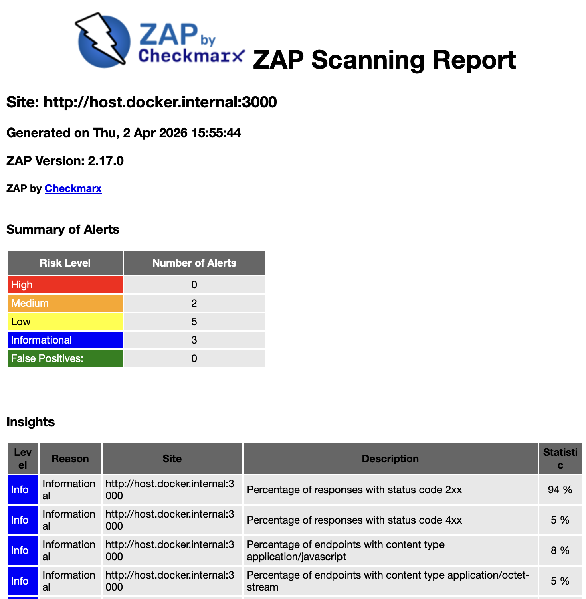
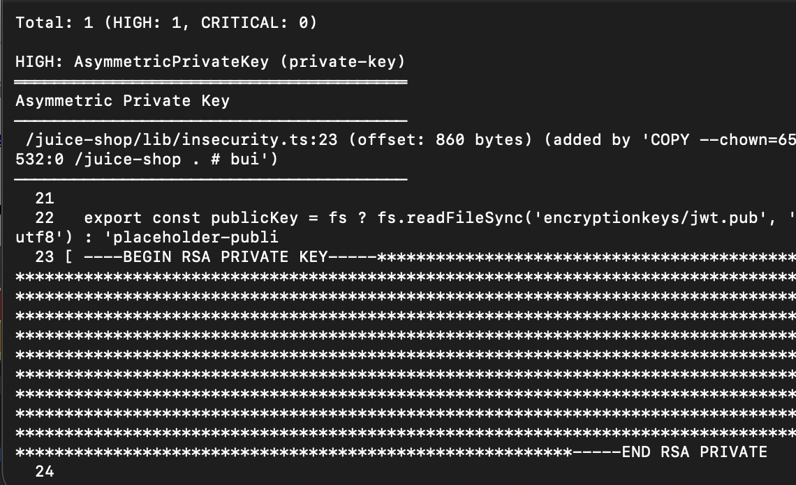

## Task 1 

### 1. Количество уязвимостей уровня Medium - 2
### 2. Две наиболее интересные уязвимости

1. **Content Security Policy (CSP) Header Not Set**  
   Описание: В приложении отсутствует заголовок Content Security Policy (CSP), который ограничивает источники загружаемого контента.  
   Риск: Это может позволить выполнение вредоносных скриптов (XSS-атаки) и внедрение вредоносного кода.  
   Почему это важно: Без CSP браузер не ограничивает загрузку ресурсов, что увеличивает вероятность атак, связанных с внедрением кода и утечкой данных.

2. **Cross-Domain Misconfiguration**  
   Описание: Обнаружена неправильная настройка CORS (Cross-Origin Resource Sharing), позволяющая доступ к ресурсам с любых доменов (`Access-Control-Allow-Origin: *`).  
   Риск: Злоумышленник может выполнять кросс-доменные запросы и получать доступ к данным приложения.  
   Почему это важно: Это может привести к утечке данных и несанкционированному доступу к API.

### 3. 

- Присутствуют:  
  Базовые HTTP-заголовки присутствуют, однако большинство защитных заголовков отсутствует.

- Отсутствуют:  
  - Content-Security-Policy  
  - Cross-Origin-Embedder-Policy  
  - Cross-Origin-Opener-Policy  
  - Частично некорректно настроены CORS-заголовки  

- Почему это важно:  
  Заголовки безопасности помогают защитить веб-приложение от атак, таких как XSS, clickjacking и утечка данных. Их отсутствие означает, что браузер не применяет дополнительные механизмы защиты, что увеличивает поверхность атаки.

### 4. Скриншот отчёта OWASP ZAP

### 5. Анализ

Наиболее распространённые уязвимости в веб-приложениях — это ошибки конфигурации безопасности, отсутствие защитных заголовков и проблемы с обработкой пользовательского ввода. Эти уязвимости часто возникают из-за того, что разработчики уделяют больше внимания функциональности, чем безопасности.

## Task 2 

### 1. Количество уязвимостей
- CRITICAL: 0 
- HIGH: 1

### 2. Два уязвимых пакета с CVE

1. **Debian base package (glibc / system library)** 
2. **Embedded private key in source code (juice-shop/lib/insecurity.ts)** — Hardcoded secret vulnerability  

### 3. Наиболее распространённый тип уязвимости

Наиболее распространённые уязвимости связаны с системными пакетами операционной системы (Debian), а также с утечками секретов (например, приватных ключей) в исходном коде.

### 4. Скриншот вывода Trivy

### 5. Анализ

Сканирование контейнеров перед развертыванием важно, поскольку уязвимости в базовых образах и зависимостях могут попасть в продакшн. Это может привести к эксплуатации известных CVE. Раннее обнаружение позволяет своевременно обновить или заменить уязвимые компоненты.
### 6. Рефлексия (интеграция в CI/CD)

Сканирование можно встроить в CI/CD пайплайн следующим образом:
- запуск Trivy на этапе сборки Docker-образа  
- остановка пайплайна при наличии HIGH/CRITICAL уязвимостей  
- запуск OWASP ZAP на тестовом окружении (staging)  
- сохранение отчётов как артефактов сборки  
- проверка безопасности перед релизом  
