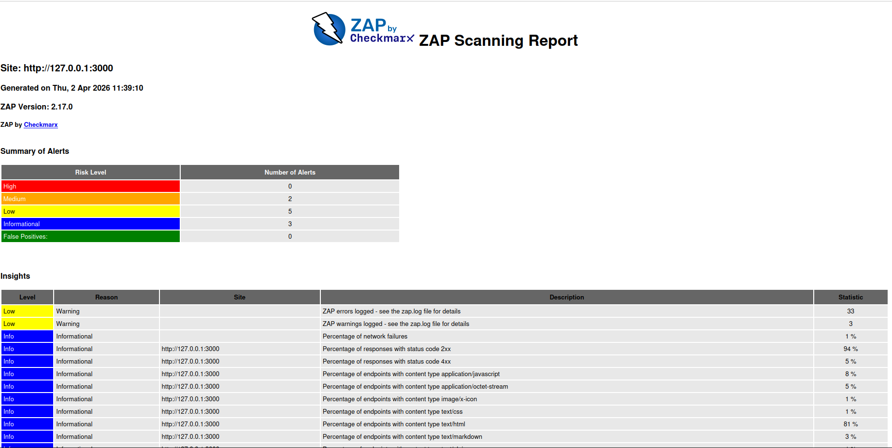
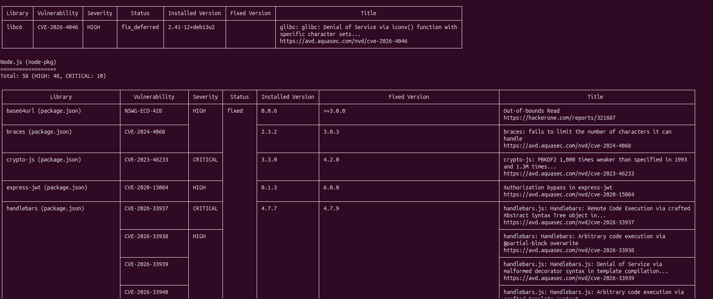

# Task 1 

# Task 1 

## 1) Number of Medium risk vulnerabilities found

The ZAP HTML report showed **2 Medium-risk vulnerabilities**.

According to the report summary:
- High: 0
- Medium: 2
- Low: 5
- Informational: 3
- False Positives: 0

---

## 2) Description of the 2 most interesting vulnerabilities

### 1. Content Security Policy (CSP) Header Not Set [10038]

This warning means that the application does not send the `Content-Security-Policy` header in the HTTP response.

Why it matters:  
The CSP header tells the browser which scripts, styles, and resources are allowed to run on the page. If this header is missing, the browser applies fewer restrictions. This makes client-side attacks, especially Cross-Site Scripting (XSS), more dangerous. If an attacker injects malicious JavaScript into the application, the lack of CSP can make exploitation easier.

Examples of affected pages:
- `/`
- `/sitemap.xml`
- `/ftp`

### 2. Cross-Domain Misconfiguration [10098]

This warning means that the application may be too loosely configured for cross-origin access.

Why it matters:  
Cross-domain rules control how a website can be accessed from other origins. If the configuration is too permissive, another website may be able to interact with the application in unintended ways. This can increase the risk of data exposure, abuse of resources, or unauthorized cross-origin requests.

Examples of affected resources:
- `/`
- `/robots.txt`
- `/sitemap.xml`
- `/assets/public/favicon_js.ico`
---
## 3) Security headers status (which are present/missing and why they matter)

### Missing or problematic headers/policies
- Content-Security-Policy header not set
- Cross-Origin-Embedder-Policy header missing or invalid
- Deprecated Feature Policy header set

### Headers/policies checked by ZAP
- Anti-clickjacking Header
- X-Content-Type-Options
- Strict-Transport-Security
- Cookie-related protections and passive header checks

Why they matter:  
Security headers provide an extra protection layer in the browser. Missing headers make web applications easier to attack even if the application itself still works normally. For example, missing CSP increases XSS risk, weak cross-origin policies can allow unsafe interactions from other origins, and missing browser protections reduce resistance to clickjacking and unsafe resource loading.

---
## 4) Screenshot of ZAP HTML report overview

---
## 5) Analysis: What type of vulnerabilities are most common in web applications?

The most common vulnerabilities in web applications are usually related to insecure configuration, missing security headers, weak input validation, and improper access control. In practice, many applications are deployed with missing browser-side protections such as CSP, unsafe cross-origin settings, or weak cookie and session configuration. These issues are common because developers often focus first on functionality and only later on security hardening. As a result, configuration weaknesses and missing protections are among the most frequent problems found in real web applications.

---
# Task 2

## 1) Total count of CRITICAL and HIGH vulnerabilities

The Trivy scan of the `bkimminich/juice-shop` container image reported:

- CRITICAL vulnerabilities: **10**
- HIGH vulnerabilities: **49**

---
## 2) List of 2 vulnerable packages with their CVE IDs

1. **libc6**
   - CVE: **CVE-2026-4046**
   - Severity: **HIGH**

2. **crypto-js (package.json)**
   - CVE: **CVE-2023-46233**
   - Severity: **CRITICAL**

---
## 3) Most common vulnerability type found

The most common vulnerability type found was vulnerabilities in **Node.js / npm packages**.

This is because the Debian layer contained only 1 HIGH vulnerability, while the Node.js package section contained 58 findings in total, including 48 HIGH and 10 CRITICAL vulnerabilities. Therefore, most issues came from outdated application dependencies rather than the base operating system layer.

---
## 4. Screenshot of Trivy terminal output showing critical findings

---
## 5) Analysis: Why is container image scanning important before deploying to production?

Container image scanning is important because an application can still be insecure even if its own code works correctly. A container image may include outdated operating system packages, third-party libraries, and application dependencies with publicly known CVEs. If such an image is deployed to production, attackers may exploit these vulnerabilities to cause denial of service, bypass authentication, escape sandboxes, or execute malicious code. Scanning helps identify these risks before deployment and reduces the attack surface.

---
## 6) Reflection: How would you integrate these scans into a CI/CD pipeline?

I would integrate container image scanning into the CI/CD pipeline right after the Docker image build stage. First, the pipeline would build the image. Then it would automatically run Trivy to scan the image for HIGH and CRITICAL vulnerabilities. If CRITICAL vulnerabilities are found, the pipeline should fail and block deployment. The scan results should also be saved as artifacts and optionally sent to the team. This would prevent vulnerable images from being deployed to staging or production and make security checks a regular part of the development workflow.