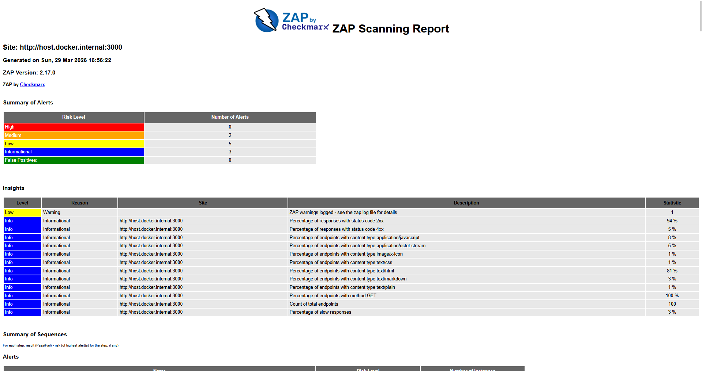
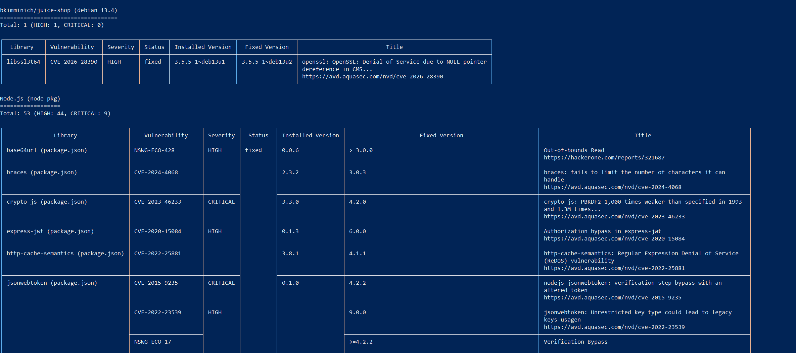

# Lab 9 — Web Application and Container Security Scanning

---

## Task 1 — Web Application Scanning with OWASP ZAP

### ZAP Report Overview

---

### Number of Medium Risk Vulnerabilities
2 Medium vulnerabilities were identified.

---

### Selected Vulnerabilities

#### 1. Content Security Policy (CSP) Header Not Set
This vulnerability indicates that the application does not define a Content Security Policy. CSP is a security mechanism that helps prevent attacks such as Cross-Site Scripting (XSS) and data injection. Without CSP, malicious scripts can be executed in the user's browser, potentially leading to data theft or session hijacking.

#### 2. Cross-Domain Misconfiguration
This issue occurs when cross-origin resource sharing (CORS) is improperly configured. It can allow unauthorized domains to access sensitive resources, potentially exposing user data or enabling malicious interactions from external sites.

---

### Security Headers Analysis

The following important security headers are missing or improperly configured:

- Content-Security-Policy (CSP) – protects against XSS and injection attacks  
- Cross-Origin-Embedder-Policy – controls resource isolation  
- Cross-Origin-Opener-Policy – prevents cross-origin interactions  
- X-Frame-Options – prevents clickjacking attacks  
- X-Content-Type-Options – prevents MIME-type sniffing  
- Strict-Transport-Security – enforces HTTPS connections  

Missing these headers reduces the overall security of the application and increases the risk of various client-side attacks.

---

### Most Interesting Vulnerability

The most interesting vulnerability is the missing Content Security Policy (CSP) header.

This is critical because CSP acts as a strong defense against XSS attacks. Without it, attackers can inject malicious scripts into the application, which may lead to data theft, session hijacking, or full account compromise.

---

### Analysis

The most common types of vulnerabilities in web applications are related to misconfiguration and missing security controls, such as headers. These issues often arise due to insecure defaults or lack of proper security hardening. Additionally, client-side vulnerabilities like XSS remain common because modern applications rely heavily on JavaScript.

---

## Task 2 — Container Vulnerability Scanning with Trivy

### Trivy Scan Result

---

### Vulnerability Summary

The Trivy scan identified the following vulnerabilities in the Juice Shop container image:

- CRITICAL: 9  
- HIGH: 44  

---

### Example Vulnerabilities

#### 1. crypto-js — CVE-2023-46233 (CRITICAL)
This vulnerability weakens the PBKDF2 implementation, making cryptographic operations significantly less secure. Attackers could exploit this to compromise encrypted data.

#### 2. lodash — CVE-2019-10744 (CRITICAL)
This is a prototype pollution vulnerability that allows attackers to modify object properties, potentially leading to arbitrary code execution or unexpected application behavior.

#### 3. jsonwebtoken — CVE-2015-9235 (CRITICAL)
This vulnerability allows bypassing token verification, which could lead to unauthorized access to protected resources.

---

### Most Common Vulnerability Type

The majority of vulnerabilities are found in Node.js dependencies (npm packages). This highlights the importance of regularly updating third-party libraries and managing dependencies securely.

---

### Analysis

Container images often contain many third-party libraries, which increases the attack surface. Most vulnerabilities come from outdated or vulnerable dependencies. Regular scanning and patching are essential to maintain container security.