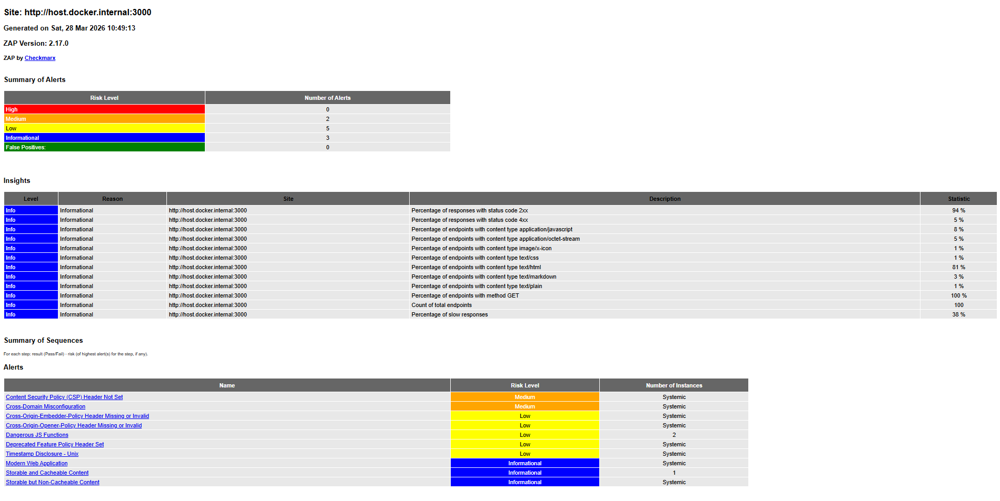
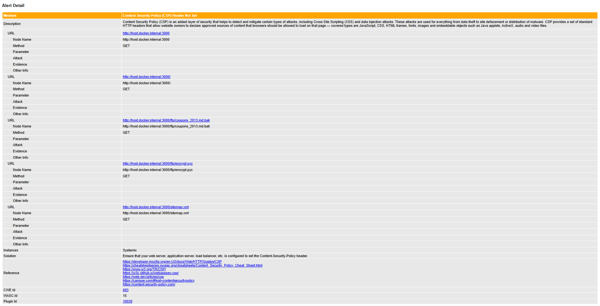
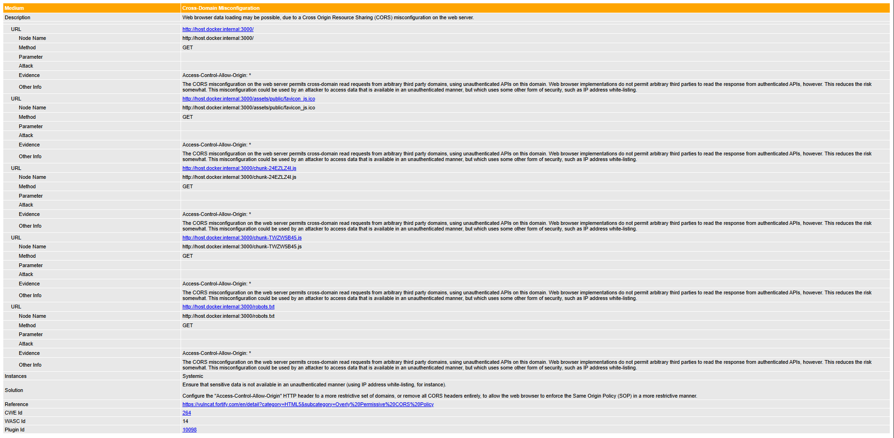
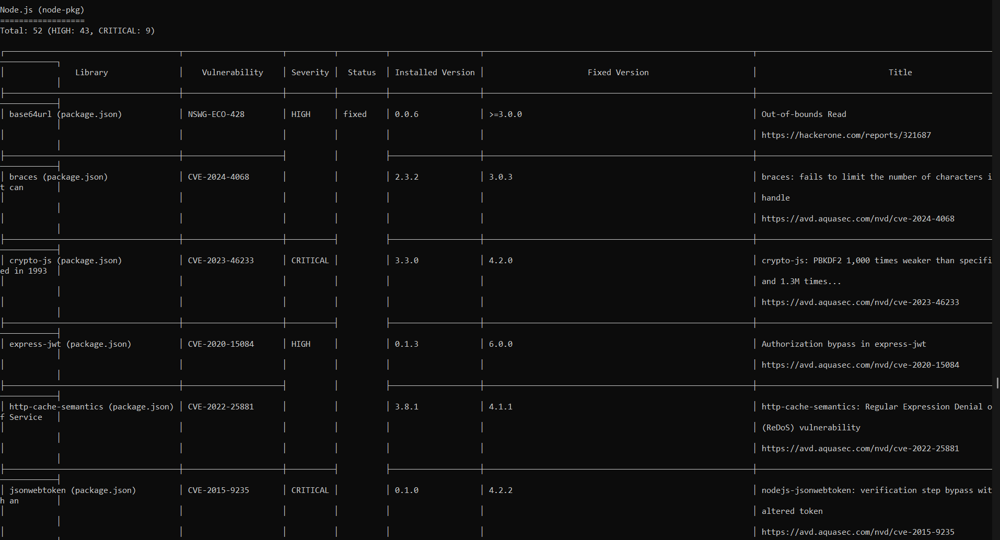
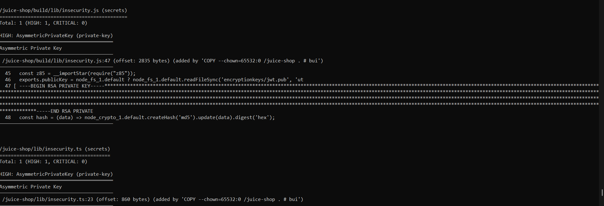

# Task 1 — Web Application Scanning with OWASP ZAP

## Screenshot of ZAP HTML report










## Number of Medium risk vulnerabilities found

*2 medium-risk vulnerabilities identified:*
```
Content Security Policy (CSP) Header Not Set - The CSP header is missing, increasing the risk of XSS and data injection attacks.

```
Cross-Domain Misconfiguration - Improper CORS configuration (Access-Control-Allow-Origin: *), allowing arbitrary third-party domains to read server responses.


## Description of the 2 most interesting vulnerabilities


```
Content Security Policy (CSP) Header Not Set
CSP is a critical security header that prevents XSS attacks by controlling which resources the browser can load. Its absence leaves the application vulnerable to script injection, allowing attackers to steal sessions or deface the site. This issue is systemic across all endpoints, making the entire application exposed.

Cross-Domain Misconfiguration
The server uses Access-Control-Allow-Origin: *, permitting any third-party website to read its responses. This violates the Same Origin Policy and could allow attackers to extract sensitive data from unauthenticated APIs. Such permissive CORS settings are a common but dangerous misconfiguration often left over from development.
```


## Security headers status (which are present/missing and why they matter)

```
The application is missing several critical security headers. Content-Security-Policy is not set, which leaves the site vulnerable to XSS attacks by allowing any script to execute. Cross-Origin-Embedder-Policy and Cross-Origin-Opener-Policy are also absent, meaning the application lacks isolation protections against cross-origin attacks like Spectre. The Access-Control-Allow-Origin header is present but configured with a wildcard *, permitting any domain to read responses-a risky misconfiguration. Additionally, the deprecated Feature-Policy header is used instead of the modern Permissions-Policy. Without proper security headers, the browser cannot enforce key protections, significantly increasing the application's attack surface.
```


## Analysis: What type of vulnerabilities are most common in web applications?

```
The most common vulnerabilities in web applications are injection flaws (such as SQL injection and cross-site scripting), broken authentication (weak session management and credential handling), and security misconfigurations (like missing security headers and permissive CORS settings). These issues typically arise from insufficient input validation, improper use of security controls, and default or overly permissive configurations. According to the OWASP Top 10, these categories consistently rank as the most frequent and critical risks across modern web applications.
```


# Task 2 — Container Vulnerability Scanning with Trivy

## Total number of CRITICAL vulnerabilities

```
There are 9 critical vulnerabilities in the Node.js dependencies. These include severe issues such as CVE-2023-46233 in crypto-js, which makes PBKDF2 encryption 1,000 times weaker than specified, and CVE-2015-9235 in jsonwebtoken, which allows attackers to bypass verification with altered tokens. Critical vulnerabilities typically lead to full system compromise, authentication bypass, or complete data exposure.
```


## Total number of HIGH vulnerabilities


```
There are 43 high vulnerabilities across the Node.js packages, plus an additional high-severity finding from the embedded RSA private key in the source code. High vulnerabilities include authorization bypass in express-jwt (CVE-2020-15084) and ReDoS attacks in braces and http-cache-semantics. These issues can lead to denial of service, unauthorized access, or sensitive information disclosure.
```

## List of 2 vulnerable packages with their CVE IDs

*crypto-js (CVE-2023-46233)*

```
This critical vulnerability affects version 3.3.0 and is fixed in 4.2.0. The issue causes the PBKDF2 implementation to be 1,000 times weaker than the specified configuration and 1.3 million times weaker than best practices, making password hashes significantly easier to crack.
```

*jsonwebtoken (CVE-2015-9235)*

```
This critical vulnerability affects version 0.1.0 and is fixed in 4.2.2. The flaw allows attackers to bypass the verification step by using an altered or malformed token, potentially gaining unauthorized access to protected resources.
```


## Most common vulnerability type found

```
The most common vulnerability type found is cryptographic weaknesses, exemplified by the critical vulnerabilities in crypto-js (PBKDF2 misconfiguration) and jsonwebtoken (verification bypass). This is followed by security misconfigurations, including the hardcoded RSA private key in source code and outdated dependency versions with known exploits.
```


## Screenshot of Trivy terminal 







## Analysis: Why is container image scanning important before deploying to production?

```
Container image scanning identifies known vulnerabilities in dependencies, base images, and application code before they reach production environments. Without scanning, critical issues like the 52 vulnerabilities found in this Node.js application-including 9 critical flaws in packages like crypto-js and jsonwebtoken-would be deployed and exposed to attackers. Scanning provides visibility into security posture, enables risk-based decision making, and prevents supply chain attacks that exploit vulnerable third-party components.
```

## Reflection: How would you integrate these scans into a CI/CD pipeline?

```
I would integrate container scanning as a mandatory gate in the CI/CD pipeline immediately after the image build step, using tools like Trivy, Snyk, or Docker Scout. The pipeline should fail if critical or high vulnerabilities exceed defined thresholds, preventing vulnerable images from being pushed to registries or deployed to production. Additionally, I would schedule recurring scans of already-deployed images and generate reports for the security team to ensure ongoing compliance and timely remediation of newly discovered vulnerabilities.
```