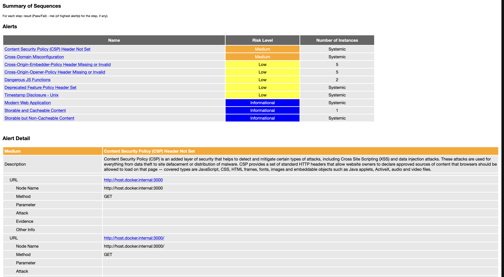

### Task 1

#### OWASP ZAP baseline scan

```bash
$ docker run -d --name juice-shop -p 3000:3000 bkimminich/juice-shop
...

$ docker run --rm -u zap -v $(pwd):/zap/wrk:rw \
  -t ghcr.io/zaproxy/zaproxy:stable zap-baseline.py \
  -t http://host.docker.internal:3000 \
  -g gen.conf \
  -r zap-report.html
Total of 123 URLs
...
FAIL-NEW: 0     FAIL-INPROG: 0  WARN-NEW: 6     WARN-INPROG: 0  INFO: 0 IGNORE: 0       PASS: 60
```

Generated report overview:



#### Findings

- Number of Medium risk vulnerabilities found: `2`
- Total warning-level findings in baseline output: `6`

The 2 most interesting Medium findings were:

1. **Content Security Policy (CSP) Header Not Set**
   - The report marks this as `Medium`.
   - Without CSP, the browser has fewer restrictions on which scripts and resources can be loaded.
   - This can make XSS-style attacks easier.

2. **Cross-Domain Misconfiguration**
   - The report marks this as `Medium`.
   - Cross-origin settings may be too permissive.
   - This can expose resources to unintended origins.

#### Security headers status

From the report:

- Missing / invalid:
  - `Content-Security-Policy`
  - `Cross-Origin-Embedder-Policy`
  - `Cross-Origin-Opener-Policy`
- Not raised as problems by the baseline scan:
  - anti-clickjacking header
  - `X-Content-Type-Options`

These headers matter because they help browsers enforce safer behavior and reduce the impact of script injection, MIME confusion, and cross-origin abuse.

#### Analysis

The most common web application issues are usually weak browser-side protections, missing security headers, unsafe JavaScript behavior, information disclosure, and cross-origin misconfigurations. Even when there is no direct exploit shown by the baseline scan, these weaknesses make the application easier to attack.

#### Cleanup

```bash
$ docker stop juice-shop && docker rm juice-shop
juice-shop
juice-shop
```

### Task 2

#### Trivy scan summary

From the Trivy output:

- Total `CRITICAL` vulnerabilities: `19`
- Total `HIGH` vulnerabilities: `46`

Summary shown by Trivy:

```text
Node.js (node-pkg)
==================
Total: 65 (HIGH: 46, CRITICAL: 19)
```

#### Vulnerable packages

Two example vulnerable packages from the scan:

1. `crypto-js`
   - `CVE-2023-46233`
   - Severity: `CRITICAL`
   - Title: `PBKDF2 1,000 times weaker than specified`

2. `jsonwebtoken`
   - `CVE-2015-9235`
   - Severity: `CRITICAL`
   - Title: `verification step bypass with an altered token`

Other vulnerable packages also appeared in the report, for example:
- `lodash`
- `marsdb`
- `tar`
- `vm2`
- `ws`

#### Most common vulnerability type

The most common issue type was vulnerable or outdated third-party Node.js dependencies. A lot of findings were related to:
- denial of service
- sandbox escape / arbitrary code execution
- verification / authentication bypass
- prototype pollution

#### Additional findings

Trivy also detected secret material in the image:

```text
/juice-shop/build/lib/insecurity.js  -> AsymmetricPrivateKey
/juice-shop/lib/insecurity.ts        -> AsymmetricPrivateKey
```

#### Analysis

Container image scanning is important before production because vulnerabilities are often already present in the base image or bundled dependencies before the application even starts. If these issues are not found early, they can be deployed directly into production environments.

#### Reflection

I would integrate these scans into CI/CD by running:
- ZAP baseline scans against preview or test deployments
- Trivy image scans right after the image build step

I would fail the pipeline on critical findings, store reports as CI artifacts, and require remediation before deployment to production.

#### Cleanup

```bash
$ docker rmi bkimminich/juice-shop
Untagged: bkimminich/juice-shop:latest
Deleted: sha256:a8139c141311c7f31fcf2e611125246928f703ee42827de33983fd9425d1b2f6
```

