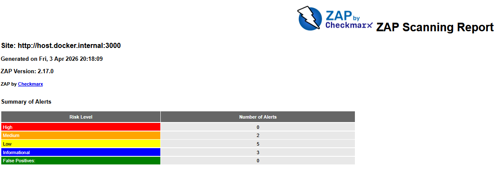
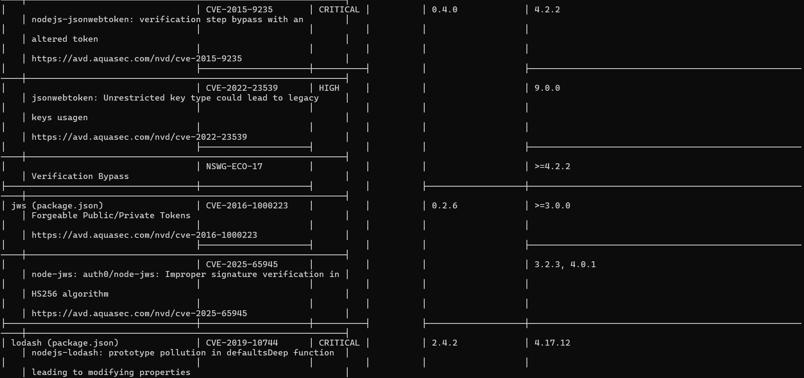

# **Lab 9 — Introduction to DevSecOps Tools**

## **Task 1 — Web Application Scanning with OWASP ZAP**

### **1. Number of Medium risk vulnerabilities found**

There are `2` medium risk vulnerabilities found.

### **2. Description of the 2 most interesting vulnerabilities**

* [Medium] **Content Security Policy (CSP) Header Not Set**. The CSP header is missing allowing to conduct XSS-attacks and inject unsafe resources.
* [Medium] **Cross-Domain Misconfiguration**. The data providen by the website unauthenticated API can be intercepted.

### **3. Security headers status**

The missing headers:

1. **Content-Security-Policy**: prevents XSS-attacks,
2. **Cross-Origin-Embedder-Policy**: prevents side-channel attacks like Spectre,
3. **Cross-Origin-Opener-Policy**: isolates browsing contexts,
4. **Permissions-Policy**: restricts features (like accessing a microphone).

The present header:

1. **Feature-Policy**: controls browser features.

### **4. Screenshot of ZAP HTML report overview**

### **Analysis: most common vulnerabilities in web applications**

Cross-site scripting (XSS), SQL injection, Cross-site request forgery (CSRF).

## **Task 2 — Container Vulnerability Scanning with Trivy**

### **Total count of CRITICAL and HIGH vulnerabilities**

There are `51` HIGH and `10` CRITICAL vulnerabilities.

* `crypto-js → CVE-2023-46233 (CRITICAL)`

* `handlebars → CVE-2026-33937 (CRITICAL)`

### **Most common vulnerability type found**

Remote Code Execution (RCE)

### **Screenshot of Trivy terminal output showing critical findings**

### **Analysis: Why is container image scanning important before deploying to production?**

Detects critical RCE and weak encryption (like in crypto-js) that could allow an attacker to completely compromise a container. Prevents secret leaks.

### **Reflection: How would you integrate these scans into a CI/CD pipeline?**

Add a post-image build step:
`trivy image --severity HIGH,CRITICAL --exit-code 1 --ignore-unfixed`

Cache the Trivy database for speed.

If any errors are found (like 10 CRITICAL), block the deployment and send a notification to Slack/Jira.

