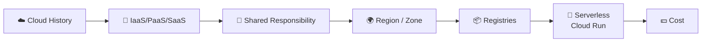
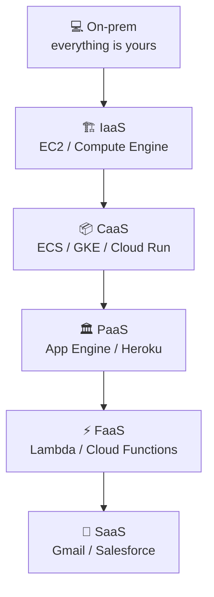
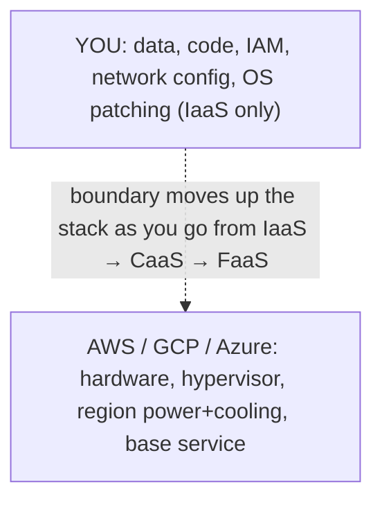
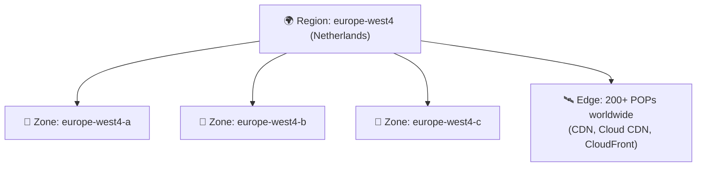
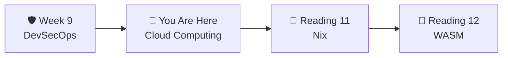

# 📌 Lecture 10 — Cloud Computing: Ship QuickNotes to the Real World

---

## 📍 Slide 1 – 💥 The Day Half the Internet Lived in us-east-1

* 🗓️ **December 7, 2021, 15:34 UTC** — an automated AWS internal-network scaling event misbehaves in **us-east-1**
* 🪦 Within minutes, Lambda, Cognito, DynamoDB, Connect, EventBridge are all degraded — anything that *used* those internally is degraded too
* 🌐 Cascading impact: **Netflix, Disney+, Robinhood, Roomba, Slack, parts of AWS's own console**. Even AWS engineers couldn't log in to fix the problem (Cognito was down)
* ⏳ **Eight hours** of major impact, days of follow-up
* 🎓 **Lesson:** "Cloud" doesn't mean "infinite reliability". It means "someone else's reliable" — and that "someone else" can have an event that takes you with them

> 🤔 **Think:** Your QuickNotes deploy this week will run on someone else's infrastructure. What happens to it when that infrastructure has a bad afternoon?

---

## 📍 Slide 2 – 🎯 Learning Outcomes

| # | 🎓 Outcome |
|---|-----------|
| 1 | ✅ Place workloads on the IaaS / PaaS / CaaS / FaaS / SaaS spectrum |
| 2 | ✅ Explain the **shared responsibility** model |
| 3 | ✅ Pick a region/zone with intent — for latency, data residency, cost |
| 4 | ✅ Push the QuickNotes image to a real container registry |
| 5 | ✅ Deploy QuickNotes to a **hosted container platform** with a public URL (the lab uses card-free Hugging Face Spaces + Cloudflare Tunnel — same patterns as Cloud Run / Lambda) |
| 6 | ✅ Read a cloud bill — recognize the 3-4 line items that dominate it |

---

## 📍 Slide 3 – 🗺️ Lecture Overview



* 📍 Slides 1-5 — Cloud history, the layers, shared responsibility
* 📍 Slides 6-9 — Regions, zones, latency, data residency
* 📍 Slides 10-13 — Containers in the cloud: registries, Cloud Run
* 📍 Slides 14-17 — Cost, incidents, lab, takeaways

---

## 📍 Slide 4 – 📜 A Compressed History

* 🛒 **March 14, 2006** — AWS launches **S3**. First object storage as a service
* 🖥️ **August 25, 2006** — AWS launches **EC2** (private beta in 2005). VMs by the hour
* 🟦 **2008-2010** — Google App Engine, then Compute Engine; Microsoft Azure GA (Feb 2010)
* 🎁 **2014** — **AWS Lambda** introduces **serverless** (FaaS): pay per ms of execution
* 🐳 **2017-2019** — Managed Kubernetes (GKE, EKS, AKS); container PaaS (Cloud Run 2019 GA)
* 🪐 **2024-2026** — Most workloads are containers; serverless (Cloud Run / Lambda) dominates burst-y traffic; VMs remain for "needs full Linux" cases

| Year | Service | What it offered |
|-----:|---------|-----------------|
| 2006 | S3 | Storage as a service |
| 2006 | EC2 | Compute by the hour |
| 2008 | App Engine | Managed runtime |
| 2014 | Lambda | Per-execution billing |
| 2019 | Cloud Run | Container-as-a-service |

---

## 📍 Slide 5 – 🥪 The Service-Model Stack



| Layer | You manage | Cloud provider manages | Example |
|-------|------------|------------------------|---------|
| **IaaS** | OS + app + everything | Hardware, hypervisor | EC2, Compute Engine |
| **CaaS** | Container image | OS, scaling | ECS, GKE, **Cloud Run** |
| **PaaS** | App code | Container, OS, scaling | App Engine, Heroku |
| **FaaS** | A function | Everything else | Lambda, Cloud Functions |
| **SaaS** | Configuration | The whole product | Gmail, Slack, Salesforce |

* 🎯 **You're climbing the stack** every lab: bare metal (Lab 4-5) → containers (Lab 6) → managed deploy (Lab 7 Ansible to VM) → CaaS (Lab 10 to Cloud Run)

---

## 📍 Slide 6 – 🤝 The Shared Responsibility Model



| What | IaaS | CaaS | FaaS |
|------|:----:|:----:|:----:|
| Data | 👤 | 👤 | 👤 |
| App code | 👤 | 👤 | 👤 |
| Runtime | 👤 | 👤 | ☁️ |
| Container image | 👤 | 👤 | ☁️ |
| Operating system | 👤 | ☁️ | ☁️ |
| Hypervisor | ☁️ | ☁️ | ☁️ |
| Hardware | ☁️ | ☁️ | ☁️ |

* 🛡️ **The boundary moves.** Your job in CaaS is the *image*, not the OS. In FaaS, it's the *function*, not even the image
* 🪤 But IAM, data, and network configuration are **always** your responsibility — and that's where most cloud breaches happen

---

## 📍 Slide 7 – 🌍 Regions, Zones, Edges



| Concept | Scope | What it means |
|---------|-------|---------------|
| **Region** | A geographic area (Netherlands, Iowa, …) | Independent failure domain at the region level |
| **Zone** | A datacenter within a region | Independent power, cooling, network |
| **Edge / POP** | Global CDN locations | Cache static content close to users |

* 🌐 Multi-zone = "survive a datacenter going dark". Multi-region = "survive a region going dark"
* 💸 Multi-region is **expensive**; multi-zone is usually free
* 🇩🇪 **Data residency**: GDPR requires EU user data to stay in EU regions — choose regions accordingly

---

## 📍 Slide 8 – 📦 Container Registries: Where Your Image Lives

(Recap of Lecture 6, with cloud focus)

| Registry | Best for | Auth |
|----------|----------|------|
| **GitHub Container Registry (ghcr.io)** | Public + private; OIDC from GH Actions | GitHub Personal Access Token / OIDC |
| **AWS ECR** | Pulls into ECS/EKS in same region (cheap egress) | IAM (`aws ecr get-login-password`) |
| **GCP Artifact Registry** | Pulls into GKE/Cloud Run in same project | Workload Identity / `gcloud auth` |
| **Azure Container Registry** | AKS, Container Apps | Entra ID / Service Principal |
| **Docker Hub** | Public images, broad reach | Login required for higher rate limits |

```bash
# ✅ ghcr.io, OIDC-friendly, free for public repos
$ echo $GITHUB_TOKEN | docker login ghcr.io -u USER --password-stdin
$ docker push ghcr.io/inno-devops-labs/quicknotes:v0.1.0
```

---

## 📍 Slide 9 – 🚀 Cloud Run in 5 Commands

**Cloud Run** is Google's container-as-a-service — fully managed, scale-to-zero, pay-per-request.

```bash
# 1) auth (one-time)
$ gcloud auth login
$ gcloud config set project YOUR_PROJECT

# 2) push the image
$ gcloud auth configure-docker europe-west4-docker.pkg.dev
$ docker tag quicknotes:v0.1.0 europe-west4-docker.pkg.dev/$PROJECT/qn/quicknotes:v0.1.0
$ docker push                              europe-west4-docker.pkg.dev/$PROJECT/qn/quicknotes:v0.1.0

# 3) deploy
$ gcloud run deploy quicknotes \
    --image europe-west4-docker.pkg.dev/$PROJECT/qn/quicknotes:v0.1.0 \
    --region europe-west4 \
    --port 8080 \
    --memory 256Mi --cpu 1 \
    --max-instances 5 \
    --allow-unauthenticated

# 4) hit it
$ curl https://quicknotes-XXXXXX-ew.a.run.app/health

# 5) tear down
$ gcloud run services delete quicknotes --region europe-west4
```

* 💸 **Generous free tier**: 2M requests/month, 360k vCPU-seconds. Lab 10 fits inside it
* ⚡ Cold start ~1-2s for a 15 MB Go image (way better than Java/Node)
* 🪪 OIDC from GitHub Actions = no service-account JSON to leak

---

## 📍 Slide 10 – 🪶 Alternative: Fly.io (no Google account required)

```toml
# fly.toml
app = "quicknotes-USERNAME"
primary_region = "ams"

[build]
  image = "ghcr.io/inno-devops-labs/quicknotes:v0.1.0"

[[services]]
  internal_port = 8080
  protocol = "tcp"

  [services.concurrency]
    soft_limit = 200
    hard_limit = 250

  [[services.ports]]
    port = 80
    handlers = ["http"]

  [[services.http_checks]]
    path = "/health"
    interval = "10s"
```

```bash
fly launch --no-deploy        # one-time
fly deploy
fly open                       # opens the URL in your browser
```

* 🌍 **Fly.io** runs your container globally close to users with a generous free tier — 3 micro-vms free
* 🇷🇺 **Useful when**: GCP / AWS account is hard to get (sanctions, payment cards); Fly.io accepts more payment methods

---

## 📍 Slide 11 – 💵 Reading a Cloud Bill

| Line item | What it is | Tactic to reduce |
|-----------|------------|------------------|
| 💾 **Storage** (S3 / GCS) | $/GB-month | Lifecycle policies; cold storage classes |
| 📤 **Egress** | $/GB out of the cloud | Same-region pulls; CDN |
| ⚡ **Compute** | vCPU-hours / second | Right-size; auto-scale; serverless |
| 🪪 **Cross-zone / cross-region** | $/GB between zones/regions | Co-locate chatty services |
| 🌐 **Load balancer** | $/hour + per LCU | Consolidate LBs; serverless = no LB |
| 🗃️ **Managed DB** | $/instance-hour + IOPS | Right-size; reserved instances |

* 🚨 **Egress will surprise you.** S3 → other cloud → other region can be $0.09/GB. A 1TB nightly backup is $90 you didn't budget for
* 💡 **Cloud Run free tier** plus a tiny Go image is the cheapest way to host QuickNotes — likely **$0** for the duration of this lab

---

## 📍 Slide 12 – 🛡️ Cloud Security Defaults That Matter

| Default | Why |
|---------|-----|
| **No long-lived keys** — use OIDC (Lecture 3) | Stolen short-lived creds expire in 15 min |
| **Least-privilege IAM** | A QuickNotes deploy service account doesn't need org-admin |
| **No public buckets** unless on purpose | The classic S3 / GCS breach |
| **Logging on, retained ≥ 90 days** | You'll need them during an incident |
| **VPC + private networking** | Don't expose the DB to the internet |
| **Budget alerts** | A runaway loop in CI can cost $1000/h |

* 🪤 **Famous Capital One breach (2019):** an SSRF + over-permissive IAM role exfiltrated 100M+ customer records. Least-privilege would have stopped it
* 🧪 In Lab 10 you'll use **least-privilege** Cloud Run service accounts — not the default `Editor` role

---

## 📍 Slide 13 – 🌐 Multi-Region & Disaster Recovery in 60 Seconds

| Strategy | RTO | RPO | Cost |
|----------|----:|----:|-----:|
| Backup only | 24h+ | 24h | $ |
| Pilot light (cold standby) | 1-4h | minutes | $$ |
| Warm standby | 5-30 min | seconds | $$$ |
| Multi-region active-active | 0 | 0 | $$$$ |

* 🎯 **RTO** = Recovery Time Objective (how long until you're back)
* 🎯 **RPO** = Recovery Point Objective (how much data you can lose)
* 🪶 For QuickNotes intro deploys, **backup only** is fine. Multi-region is SRE-Intro territory

---

## 📍 Slide 14 – ❌ Cloud Antipatterns

| 🔥 Antipattern | ✅ Better |
|----------------|----------|
| One huge instance because "VMs are cheap" | Right-size; auto-scale on CPU/req-rate |
| `0.0.0.0/0` ingress because "it just works" | Restrict to known CIDR or behind LB+WAF |
| Service-account JSON committed to Git | OIDC; secret manager; rotation policy |
| One AWS root account for everything | Org + accounts per environment; IAM Identity Center |
| No tags, no budgets | Mandate cost tags; alerts at 50/80/100% of budget |
| Multi-region "because that's what big companies do" | Multi-AZ first; multi-region only if you actually need it |

---

## 📍 Slide 15 – 🧪 Lab 10 Preview: Deploy QuickNotes to the Cloud

> 💡 The lab uses two platforms that are **truly free — no credit card required** — so Innopolis students aren't blocked by payment-card friction. The *concepts* (registry, CaaS, scale-to-zero, public URL, edge) are identical to Cloud Run / Lambda / Fargate.

* 📦 **Task 1 (6 pts):** Build the QuickNotes container image in your Lab 3 CI, push it to **`ghcr.io`** on a Git-tag trigger. Verify a fresh `docker pull` works from a clean machine
* 🚀 **Task 2 (4 pts):** Deploy that image to **Hugging Face Spaces** (Docker SDK) — free hosted container, public URL, sleeps after ~30 min idle (real scale-to-zero, slower than Cloud Run). Measure cold vs warm latency
* 🎁 **Bonus (2 pts):** Expose the same QuickNotes through a **Cloudflare Tunnel** (`cloudflared`, no account / no domain / no card required) and compare hosted-container latency vs local-via-edge latency
* 📜 Deliverable: `submissions/lab10.md` — registry push log, HF Spaces URL, cold-start measurements, (Bonus) cross-platform comparison table

---

## 📍 Slide 16 – 🧠 Key Takeaways

1. ☁️ **Cloud is "someone else's reliable"** — read every provider's SLA and shared-responsibility doc
2. 🥪 **The stack is a spectrum** — IaaS → CaaS → FaaS → SaaS — pick what matches your team's responsibility budget
3. 🌍 **Regions are independent; zones aren't always; edges are caches** — design with the boundary in mind
4. 📦 **Push to a registry, deploy a container** — the modern minimum viable cloud workflow
5. 💸 **Egress is what surprises you** — budget for it; alert on overruns
6. 🛡️ **Least-privilege IAM + OIDC** — the two settings that prevent most cloud breaches

---

## 📍 Slide 17 – 🚀 What's Next + 📚 Resources

* 📍 **Bonus readings:** Reproducible Builds with Nix (R11) + WebAssembly Containers (R12)
* 🧪 **Lab 10:** Push to `ghcr.io` from CI on tag; deploy to Hugging Face Spaces (card-free); Bonus: Cloudflare Tunnel + cross-platform latency comparison
* 📖 **Read:**
  * 📕 *Cloud Native Patterns* — Cornelia Davis (2019) — Chapters 1-5
  * 📗 [AWS Well-Architected Framework](https://aws.amazon.com/architecture/well-architected/) (the five pillars)
  * 📘 [Google Cloud architecture center](https://cloud.google.com/architecture)
  * 📝 [AWS us-east-1 December 2021 outage summary](https://aws.amazon.com/message/12721/)
  * 📝 [Capital One 2019 breach analysis](https://krebsonsecurity.com/2019/07/capital-one-data-theft-impacts-106m-people/)
* 🛠️ **Tools to try this week:** `gcloud` CLI, `flyctl`, `aws` CLI v2



> 🎯 **Remember:** "It's running in the cloud" is not an outcome. The outcome is: **users can reach it; it's monitored; it scales; it's secure; it doesn't break the budget.** The 10 lectures of this course are *what gets you there*.
