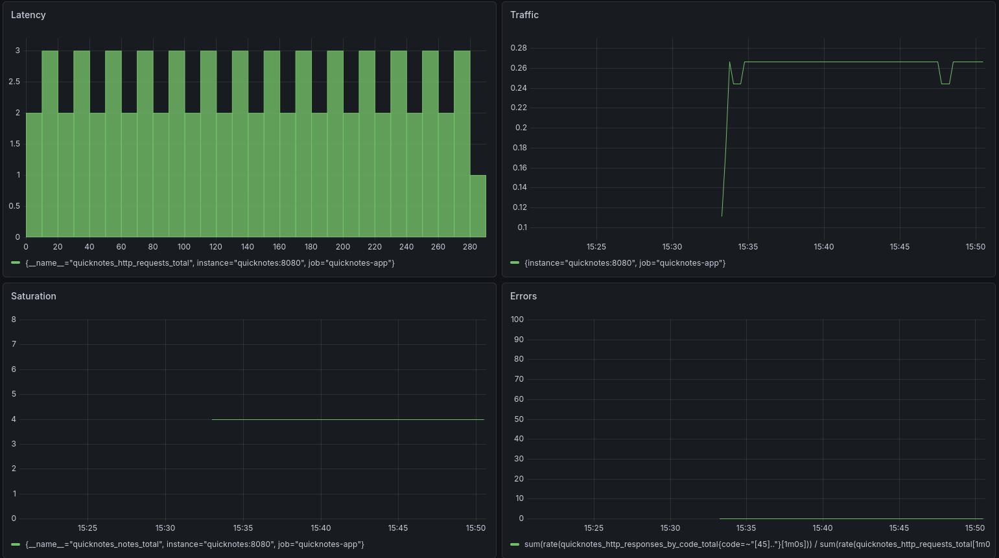
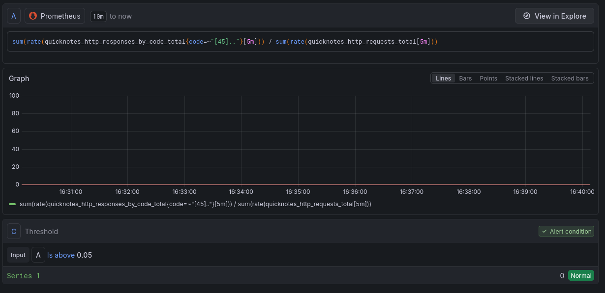
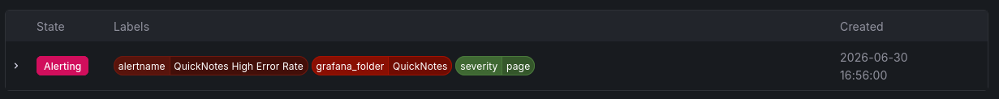

# Lab 8 submission
### Configuration files
[`prometheus.yml`](../monitoring/prometheus/prometheus.yml)\
[`datasource.yml`](../monitoring/grafana/provisioning/datasources/datasource.yml)\
[`dashboard.yml`](../monitoring/grafana/provisioning/dashboards/dashboard.yml)\
[`golden-signals.json`](../monitoring/grafana/provisioning/dashboards/golden-signals.json)

### Grafana screenshot


### Prometheus
```sh
$ curl -S http://localhost:9090/api/v1/targets | jq '.data.activeTargets[].health'
"up"
```

### Alert rule


### Alert firing state


### Runbook
[Link](../docs/runbook/high-error-rate.md)

### Design questions
a) In a pull model, the Prometheus server acts as the client and must be able to reach the application's metrics endpoint. If Prometheus cannot network-resolve or connect to QuickNotes, it marks the target as `DOWN` in the UI, resulting in a gap in metric collection while the application itself continues running unhindered.\
b) Setting the interval to `5s` drastically increases TSDB storage overhead and may cause CPU spikes due to continuous scraping, while offering diminishing returns for standard dashboard metrics. Setting it to `5m` creates massive telemetry blind spots, rendering Prometheus unable to compute short-term `rate()` functions effectively and delaying alert triggers by at least 5 minutes.\
c) The `rate()` function is the correct choice for the Traffic panel because it calculates the per-second average rate of increase over the entire specified time window, smoothing out temporary spikes. In contrast, `irate()` only looks at the last two data points, making it too volatile for a high-level overview dashboard, and `delta()` calculates absolute change which does not represent traffic speed/throughput.\
d) Provisioning Grafana from files treats your dashboards and datasources as infrastructure-as-code (IaC), allowing them to be version-controlled, reviewed via PRs, and easily replicated across environments. It guarantees that any developer running `docker compose up` instantly gets an identical, pre-configured monitoring setup without manual intervention.\
e) Why "sustained for 5 minutes" instead of "fire immediately on first bad request"?
Requiring a sustained breach for 5 minutes acts as a low-pass filter that prevents flapping and transient network blips from waking up engineers on call. Single bad requests (like a casual 404 or a brief timeout during normal operation) resolve themselves and do not represent a systemic, actionable infrastructure failure\
f) An example of a cause alert would be firing a page when "QuickNotes CPU usage exceeds 90%." This is worse because high CPU utilization is internal telemetry that does not inherently mean users are having a bad experience—the application might simply be handling high load efficiently while maintaining low latency and 0% errors.
g) An alert is universally considered too noisy if more than 20% of its pages result in "false alarms" where no user-facing degradation occurred or no immediate operational engineering action was required. High false-alarm rates degrade trust in monitoring, causing engineers to instinctively silence or ignore critical notifications.