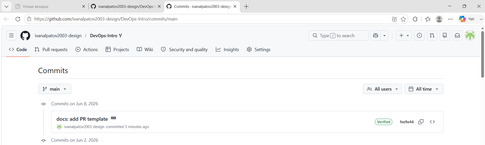

# Lab 1 Submission — Ivan Alpatov

## Task 1 — SSH Commit Signing & QuickNotes

### Running QuickNotes locally

I ran the Go service from `app/` with `go run .` and confirmed all three endpoints respond correctly.

> Note: I ran the curl sequence twice during testing, so the seed-note count shown below starts at 5 instead of the lab's stated 4 — the extra note is from an earlier test POST. Behavior is otherwise identical.

```
=== /health ===
{
    "notes": 5,
    "status": "ok"
}

=== /notes (before POST) ===
[
    { "id": 1, "title": "Welcome to QuickNotes", ... },
    { "id": 2, "title": "Read app/main.go first", ... },
    { "id": 3, "title": "DevOps mantra", ... },
    { "id": 4, "title": "Endpoint cheat-sheet", ... },
    { "id": 5, "title": "hello", "body": "first POST", ... }
]

=== POST /notes ===
{
    "id": 6,
    "title": "hello",
    "body": "first POST",
    "created_at": "2026-06-08T13:15:08.714165651Z"
}

=== /notes (after POST) ===
[ ... 6 notes total ... ]
```

### SSH commit signing — proof

Configured Git 2.43 to sign every commit with my ED25519 SSH key (`~/.ssh/id_ed25519.pub`), registered the same public key on GitHub under both Authentication and Signing roles, and added a local `allowed_signers` file so Git can verify signatures locally.

Local verification:

```
commit fee9e4429fece2c8736c299392bdda9e7d9b1cc5 (HEAD -> main)
Good "git" signature for ivanalpatov2003@gmail.com with ED25519 key SHA256:cU4NMBRxvi29DrWnRnZsfjLjUbAR9lc65rNYG/hbXGs
Author: Ivan Alpatov <ivanalpatov2003@gmail.com>
Date:   Mon Jun 8 16:20:32 2026 +0300

    docs: add PR template

    Signed-off-by: Ivan Alpatov <ivanalpatov2003@gmail.com>
```

Remote verification: commit `fee9e44` shows the green **Verified** badge on GitHub:



### Why signed commits matter

Git's commit metadata is unauthenticated by default — anyone can set any name and email in `git config`, and the commit history will silently accept it. The March 2024 **xz-utils** incident showed why this matters at the ecosystem level: an attacker calling themselves "Jia Tan" spent two years building maintainer trust on a tiny but foundational compression library, then slipped in a backdoor that nearly compromised every SSH daemon on Linux. It was caught by pure luck, days before shipping widely. Signed commits don't prevent social engineering, but they raise the bar — reviewers can cryptographically verify *"this commit really came from the holder of this key"* instead of trusting a name in plain text.

---

## Task 2 — Pull Request Template

Added `.github/pull_request_template.md` to `main` so future PRs auto-populate with Goal / Changes / Testing / Checklist sections. The template appears in the PR description when opening the Lab 1 PR.

---

## Task 3 — GitHub Community

Actions completed:

- Starred `inno-devops-labs/DevOps-Intro` (course repo)
- Starred `simple-container-com/api`
- Following @Cre-eD, @Naghme98, @pierrepicaud
- Following 3+ classmates: @12PAIN, @infernaltiger, @MostafaKhaled2017

**Why stars and follows matter:** Starring is the open-source equivalent of a public bookmark — it signals trust in a project, helps the maintainer gauge interest, and keeps the repo discoverable in your own profile for later reference. Following developers turns a Git host into a social graph: you see what your teammates and mentors are pushing, which surfaces both interesting projects and patterns of practice, and it becomes the lightweight backchannel that lets a distributed team notice each other's work without anyone having to broadcast it.
