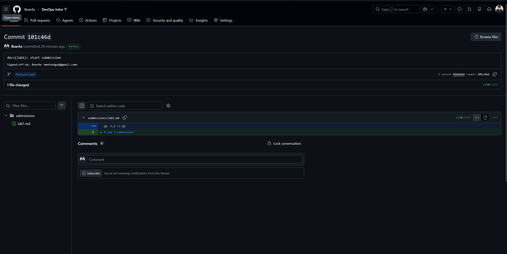
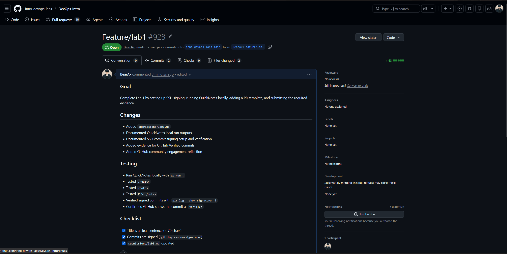
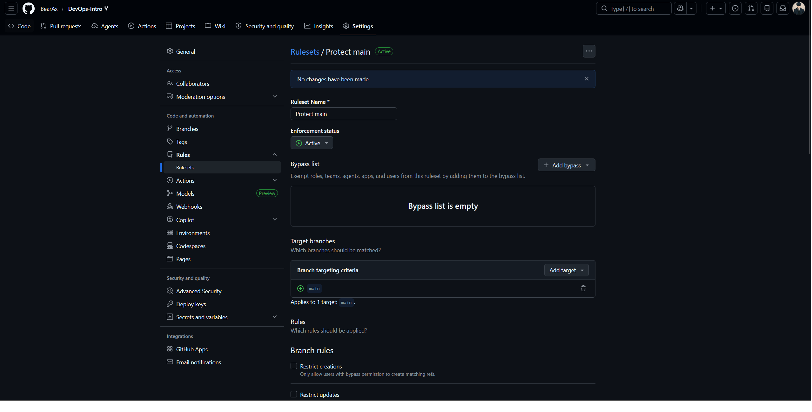
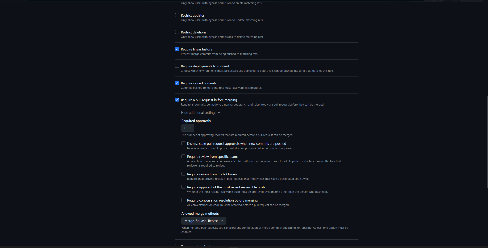

# Lab 1 Submission

## Task 1 - SSH Signing and First Signed Commit

### Prerequisites Verified

```text
git version 2.54.0.windows.1
go version go1.26.4 windows/amd64
OpenSSH_for_Windows_9.5p2, LibreSSL 3.8.2
```

### QuickNotes Local Run

I ran QuickNotes locally against a clean temporary data file so the service started from the expected 4-note seed state.

#### GET /health

```json
{
  "notes": 4,
  "status": "ok"
}
```

#### GET /notes

```json
[
  {
    "id": 1,
    "title": "Welcome to QuickNotes",
    "body": "This is the project you'll containerize, deploy, monitor, and harden across all 10 labs.",
    "created_at": "2026-01-15T10:00:00Z"
  },
  {
    "id": 2,
    "title": "Read app/main.go first",
    "body": "Start by understanding the entry point - env vars, signal handling, graceful shutdown.",
    "created_at": "2026-01-15T10:05:00Z"
  },
  {
    "id": 3,
    "title": "DevOps mantra",
    "body": "If it hurts, do it more often.",
    "created_at": "2026-01-15T10:10:00Z"
  },
  {
    "id": 4,
    "title": "Endpoint cheat-sheet",
    "body": "GET /notes  GET /notes/{id}  POST /notes  DELETE /notes/{id}  GET /health  GET /metrics",
    "created_at": "2026-01-15T10:15:00Z"
  }
]
```

#### POST /notes

```json
{
  "id": 5,
  "title": "hello",
  "body": "first POST",
  "created_at": "2026-06-07T09:53:39.7889768Z"
}
```

#### GET /notes After POST

```json
[
  {
    "id": 5,
    "title": "hello",
    "body": "first POST",
    "created_at": "2026-06-07T09:53:39.7889768Z"
  },
  {
    "id": 1,
    "title": "Welcome to QuickNotes",
    "body": "This is the project you'll containerize, deploy, monitor, and harden across all 10 labs.",
    "created_at": "2026-01-15T10:00:00Z"
  },
  {
    "id": 2,
    "title": "Read app/main.go first",
    "body": "Start by understanding the entry point - env vars, signal handling, graceful shutdown.",
    "created_at": "2026-01-15T10:05:00Z"
  },
  {
    "id": 3,
    "title": "DevOps mantra",
    "body": "If it hurts, do it more often.",
    "created_at": "2026-01-15T10:10:00Z"
  },
  {
    "id": 4,
    "title": "Endpoint cheat-sheet",
    "body": "GET /notes  GET /notes/{id}  POST /notes  DELETE /notes/{id}  GET /health  GET /metrics",
    "created_at": "2026-01-15T10:15:00Z"
  }
]
```

### Signed Commit Verification

```text
commit 101c46da5e4a0890c0310e0e407adbb17475dfc3
Good "git" signature for medvedguk@gmail.com with ED25519 key SHA256:pvAaeUNT8jpJ+FusyKkvPM4x2Z1kjYJcBnR0JcCB2lg
Author: BearAx <medvedguk@gmail.com>
Date:   Sun Jun 7 12:42:07 2026 +0300

    docs(lab1): start submission

    Signed-off-by: BearAx <medvedguk@gmail.com>
```

### Why Signed Commits Matter

Signed commits give reviewers provenance and integrity checks: the commit can be tied to a specific identity, and any tampering becomes much easier to spot. The March 2024 xz backdoor showed how dangerous it is when trust in a supply chain is weak; signed history is not a complete defense, but it raises the cost of impersonation, history rewriting, and quietly introducing untrusted changes.

### Verified Badge Evidence

Verified badge screenshot:



## Task 2 - Pull Request Template and First PR

I prepared the required GitHub PR template at `.github/pull_request_template.md` with sections for Goal, Changes, Testing, and Checklist. Because GitHub PR templates are read from the default branch, this file should be committed and pushed on `main` before opening the lab PR.

### PR Evidence To Add After Push



## Task 3 - GitHub Community

Starring repositories is useful because it both bookmarks projects for future reference and signals community interest to maintainers. Following other developers helps in team projects and professional growth because it makes their work visible, surfaces useful tools and practices, and strengthens professional connections over time.

### Community Checklist

- [x] Starred `inno-devops-labs/DevOps-Intro`
- [x] Starred `simple-container-com/api`
- [x] Followed `@Cre-eD`
- [x] Followed `@Naghme98`
- [x] Followed `@pierrepicaud`
- [x] Followed at least 3 classmates

## Bonus Task - Branch Protection and Required Signed Commits

### Evidence To Add After GitHub Setup




```text
remote: error: GH013: Repository rule violations found for refs/heads/main.
remote:
remote: - Changes must be made through a pull request.
remote:
remote: - Commits must have verified signatures.
remote:   Found 1 violation:
remote:
remote:   0a81b5f122ddd1c6ec3b96c69b54060c10dfba0c
remote:
 ! [remote rejected] main -> main (push declined due to repository rule violations)
error: failed to push some refs to 'github.com:BearAx/DevOps-Intro.git'
```

### Reflection

If Knight Capital had branch protection and required signed commits on the production deploy branch, the path to production would have been slower, more reviewable, and easier to audit. A pull-request gate would have forced the release through an explicit review step, while required signatures would have made ownership and provenance of each deployable change much clearer. Linear history would also have made it easier to trace exactly what was promoted and to coordinate rollback during the incident. These controls would not remove all operational risk, but they would add several strong barriers before unsafe code reached production.
