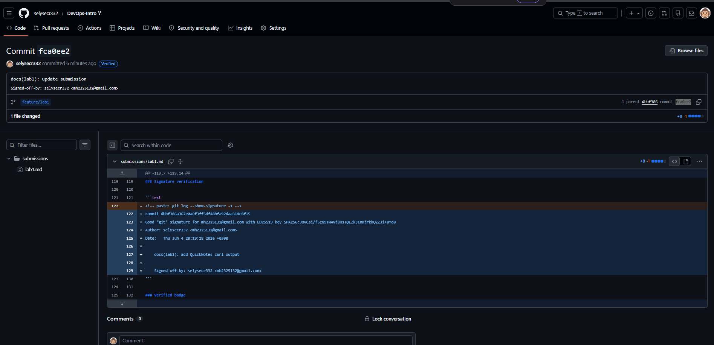
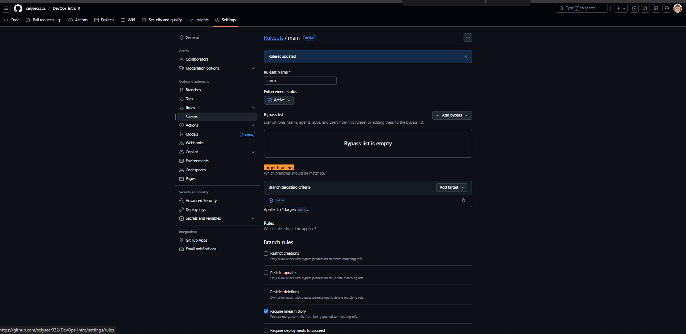
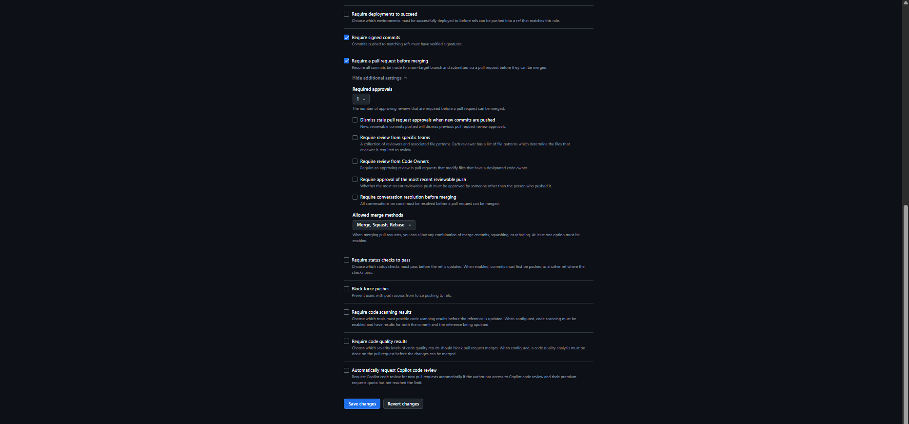

# Lab 1 — Submission

**Student:** Mahmoud Hassan 
**GitHub:** @selysecr332  
**Date:** 00.06.2026

---

## Task 1 — QuickNotes + SSH commit signing

### QuickNotes run (`Invoke-RestMethod` output)

**`GET /health`**

```json
{
    "notes":  5,
    "status":  "ok"
}
```

**`GET /notes`** (before second POST — 5 notes; includes one note from earlier test run)

```json
{
    "value":  [
                  {
                      "id":  1,
                      "title":  "Welcome to QuickNotes",
                      "body":  "This is the project you'll containerize, deploy, monitor, and harden across all 10 labs.",
                      "created_at":  "2026-01-15T10:00:00Z"
                  },
                  {
                      "id":  2,
                      "title":  "Read app/main.go first",
                      "body":  "Start by understanding the entry point — env vars, signal handling, graceful shutdown.",
                      "created_at":  "2026-01-15T10:05:00Z"
                  },
                  {
                      "id":  3,
                      "title":  "DevOps mantra",
                      "body":  "If it hurts, do it more often.",
                      "created_at":  "2026-01-15T10:10:00Z"
                  },
                  {
                      "id":  4,
                      "title":  "Endpoint cheat-sheet",
                      "body":  "GET /notes  GET /notes/{id}  POST /notes  DELETE /notes/{id}  GET /health  GET /metrics",
                      "created_at":  "2026-01-15T10:15:00Z"
                  },
                  {
                      "id":  5,
                      "title":  "hello",
                      "body":  "first POST",
                      "created_at":  "2026-06-04T16:56:26.5730911Z"
                  }
              ],
    "Count":  5
}
```

**`POST /notes`**

```json
{
    "id":  6,
    "title":  "hello",
    "body":  "first POST",
    "created_at":  "2026-06-04T16:59:48.7766322Z"
}
```

**`GET /notes`** (after POST — 6 notes)

```json
{
    "value":  [
                  {
                      "id":  1,
                      "title":  "Welcome to QuickNotes",
                      "body":  "This is the project you'll containerize, deploy, monitor, and harden across all 10 labs.",
                      "created_at":  "2026-01-15T10:00:00Z"
                  },
                  {
                      "id":  2,
                      "title":  "Read app/main.go first",
                      "body":  "Start by understanding the entry point — env vars, signal handling, graceful shutdown.",
                      "created_at":  "2026-01-15T10:05:00Z"
                  },
                  {
                      "id":  3,
                      "title":  "DevOps mantra",
                      "body":  "If it hurts, do it more often.",
                      "created_at":  "2026-01-15T10:10:00Z"
                  },
                  {
                      "id":  4,
                      "title":  "Endpoint cheat-sheet",
                      "body":  "GET /notes  GET /notes/{id}  POST /notes  DELETE /notes/{id}  GET /health  GET /metrics",
                      "created_at":  "2026-01-15T10:15:00Z"
                  },
                  {
                      "id":  5,
                      "title":  "hello",
                      "body":  "first POST",
                      "created_at":  "2026-06-04T16:56:26.5730911Z"
                  },
                  {
                      "id":  6,
                      "title":  "hello",
                      "body":  "first POST",
                      "created_at":  "2026-06-04T16:59:48.7766322Z"
                  }
              ],
    "Count":  6
}
```

### Signature verification

```text
commit dbbf386a367e0a8f3ff5df48bfa92daa314e8f15
Good "git" signature for mh2325132@gmail.com with ED25519 key SHA256:9OvCsi/f5zN9TWAVj8HsTQLZkJEnKjrkkQZZJi+BYe0
Author: selysecr332 <mh2325132@gmail.com>
Date:   Thu Jun 4 20:19:28 2026 +0300

    docs(lab1): add QuickNotes curl output

    Signed-off-by: selysecr332 <mh2325132@gmail.com>
```

### Verified badge



### Why signed commits matter

In March 2024, a malicious backdoor was discovered in xz-utils after an attacker gained maintainer trust over months. Signed commits let reviewers verify that a change really came from a specific key holder, making supply-chain impersonation much harder. They do not replace code review, but they add cryptographic proof of who authored each commit.

---

## Task 2 — PR template + first PR

- Course PR: https://github.com/inno-devops-labs/DevOps-Intro/pull/974
- Fork PR: https://github.com/selysecr332/DevOps-Intro/pull/1

---

## Task 3 — GitHub community

- [x] Starred course repo (`inno-devops-labs/DevOps-Intro`) + `simple-container-com/api`
- [x] Following @Cre-eD, @Naghme98, @pierrepicaud + 3 classmates

### Why stars and follows matter

Starring repositories bookmarks useful projects and signals community interest — it helps maintainers gain visibility and lets you quickly return to tools you may use later (like the course repo or `simple-container-com/api` for container work). Following developers on GitHub surfaces their activity in your feed, which makes it easier to discover projects, stay aligned with classmates' work, and build professional connections beyond the classroom.

---

## Bonus — Branch protection + required signed commits

### Branch protection screenshot





### Unsigned push rejection

```text
remote: error: GH013: Repository rule violations found for refs/heads/main.
remote: Review all repository rules at https://github.com/selysecr332/DevOps-Intro/rules?ref=refs%2Fheads%2Fmain
remote:
remote: - Changes must be made through a pull request.
remote:
remote: - Commits must have verified signatures.
remote:   Found 1 violation:
remote:
remote:   a8b4bd1a3bfbc1da6301abb9807c12b3d4130f88
remote:
 ! [remote rejected] main -> main (push declined due to repository rule violations)
error: failed to push some refs to 'https://github.com/selysecr332/DevOps-Intro.git'
```

### Reflection

On Knight Capital's deploy day (August 2012), a manual release missed one of eight servers and left dead code running in production — within 45 minutes that caused $440M in losses. If their production deploy branch had required signed commits, every change would need a verifiable author key, making unauthorized or mistaken pushes harder to land silently. Requiring pull requests and linear history would have forced review and a clear audit trail before code reached prod, instead of a rushed manual push at market open. Branch protection does not replace testing or rollback, but it adds guardrails that slow down exactly the kind of "one server got skipped" failure mode that destroyed the company.

---

## Lab 1 completion checklist

### Setup & prerequisites

- [x] Forked `inno-devops-labs/DevOps-Intro` → `selysecr332/DevOps-Intro`
- [x] Cloned fork locally; `upstream` remote configured
- [x] Go 1.24+ installed; QuickNotes runs from `app/`
- [x] SSH key created; Git signing configured (`gpg.format ssh`, `commit.gpgsign`)
- [x] SSH key added on GitHub as **Signing Key**
- [x] Branch `feature/lab1` created; all lab commits signed

### Task 1 — SSH signing + QuickNotes (6 pts)

- [x] `GET /health` output captured
- [x] `GET /notes` output captured
- [x] `POST /notes` output captured
- [x] `GET /notes` after POST captured
- [x] `git log --show-signature -1` shows **Good "git" signature**
- [x] Verified badge screenshot (`screenshots/Lab_1/lab1-verified.png`)
- [x] Explanation of why signed commits matter (xz-utils, March 2024)

### Task 2 — PR template + first PR (3 pts)

- [x] `.github/pull_request_template.md` on fork `main`
- [x] PR description filled; checklist ticked on GitHub
- [x] Course PR: https://github.com/inno-devops-labs/DevOps-Intro/pull/974
- [x] Fork PR: https://github.com/selysecr332/DevOps-Intro/pull/1
- [x] PR contains only Lab 1 work on branch `feature/lab1`

### Task 3 — GitHub community (1 pt)

- [x] Starred `inno-devops-labs/DevOps-Intro`
- [x] Starred `simple-container-com/api`
- [x] Following @Cre-eD, @Naghme98, @pierrepicaud
- [x] Following 3+ classmates
- [x] GitHub Community section written

### Bonus — Branch protection (2 pts)

- [x] Ruleset **Active** on fork `main` (targets `main`)
- [x] Require signed commits enabled
- [x] Require a pull request before merging enabled
- [x] Require linear history enabled
- [x] Branch protection screenshots (`bones_1.png`, `bones_2.png`)
- [x] Unsigned push rejected; `remote: error:` output captured
- [x] Knight Capital reflection (3–4 sentences)

### Submission

- [x] `submissions/lab1.md` includes Task 1, Task 2, Task 3, and Bonus sections
- [x] All commits on PR show **Verified** on GitHub
- [x] Pushed to `origin/feature/lab1`
- [x] Both PR URLs submitted on Moodle
