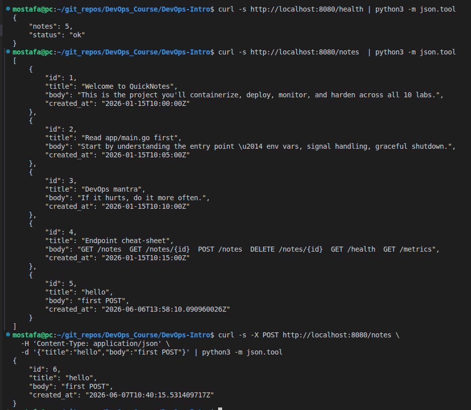
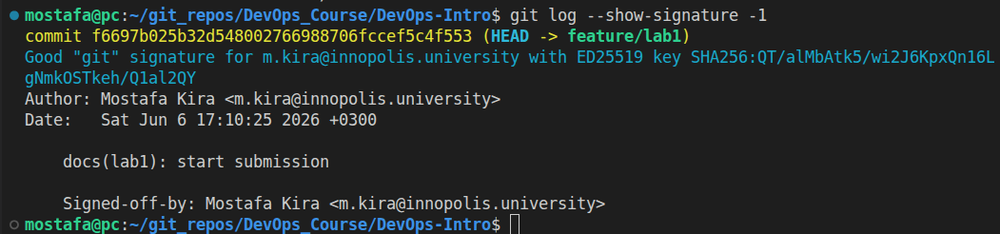
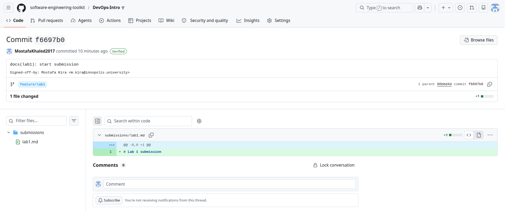
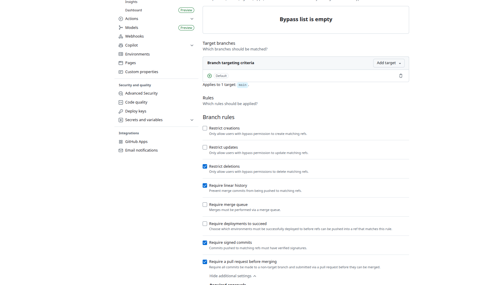
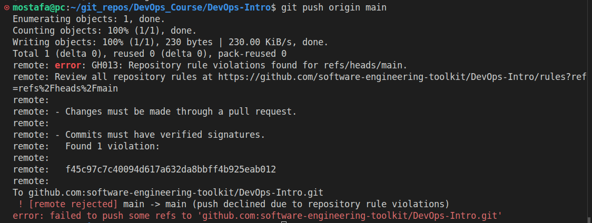

# Lab 1 submission

## Task 1

### The output of curl against /health, /notes, and POST /notes

This screnshot shows the output of curl against the /health, /notes, and POST /notes endpoints:

### Output of git log --show-signature -1 showing Good signature

After launching the command `git log --show-signature -1`, the output shows a "Good signature" from the commit:

### A screenshot of the Verified badge on your platform's PR/commit page

Here is a screenshot showing the Verified badge on the PR/commit page:

Signed commits matter because they let reviewers verify that a commit really came from the claimed developer and was not forged or tampered with after the fact. The xz-utils backdoor discovered in March 2024 showed how dangerous trusted maintainer access can become when attackers compromise the software supply chain. Requiring signed commits adds an extra identity and integrity check before code is trusted, reviewed, merged, or deployed.

## Task 2

The file `.github/pull_request_template.md` has been created in main branch of the repository.

## Task 3

### GitHub Community

Starring repositories matters because it helps people bookmark useful projects, signals community interest, and gives maintainers visibility and encouragement. Following developers helps teams stay aware of each other’s work, discover useful projects through shared activity, and build professional connections over time.

## Bonus Task

Here is a screenshot of the protection rules I set up for the main branch of my repository:

And this is the rejection message I received when trying to push directly to the main branch:

With branch protection and required signing on the prod deploy branch, Knight Capital’s deploy day would likely have slowed down before it became catastrophic. Unreviewed or unsigned changes could not have been merged or promoted directly, forcing a visible approval trail before production release. That would not guarantee the bug was caught, but it would make the deployment harder to rush, harder to bypass, and easier to audit. The biggest benefit would have been turning a risky manual release into a controlled checkpoint instead of a silent failure path.
