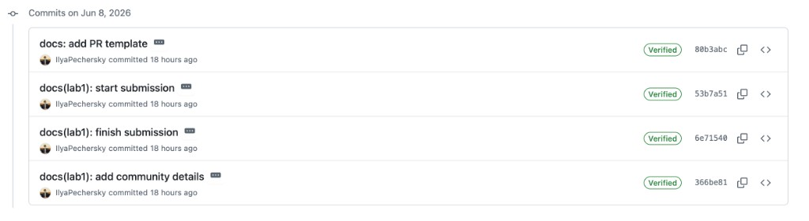
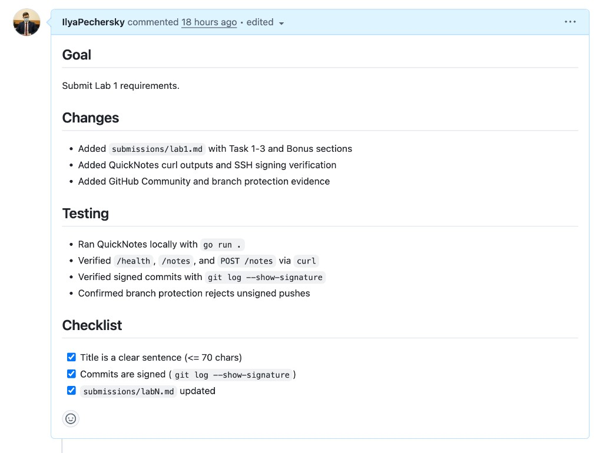
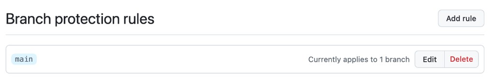

# Lab 1 Submission

## Task 1 - QuickNotes + SSH Signing

### curl output

`GET /health`

```json
{"notes":4,"status":"ok"}
```

`GET /notes`

```json
[{"id":2,"title":"Read app/main.go first","body":"Start by understanding the entry point - env vars, signal handling, graceful shutdown.","created_at":"2026-01-15T10:05:00Z"},{"id":3,"title":"DevOps mantra","body":"If it hurts, do it more often.","created_at":"2026-01-15T10:10:00Z"},{"id":4,"title":"Endpoint cheat-sheet","body":"GET /notes  GET /notes/{id}  POST /notes  DELETE /notes/{id}  GET /health  GET /metrics","created_at":"2026-01-15T10:15:00Z"},{"id":1,"title":"Welcome to QuickNotes","body":"This is the project you'll containerize, deploy, monitor, and harden across all 10 labs.","created_at":"2026-01-15T10:00:00Z"}]
```

`POST /notes`

```json
{"id":5,"title":"hello","body":"first POST","created_at":"2026-06-08T16:29:35.960733Z"}
```

### Signature verification

```bash
git log --show-signature -1
```

```text
commit 53b7a51
Good "git" signature for foodgamesimple@mail.ru with ED25519 key SHA256:e1sAHFFYl4uOnpFOwThMC3M+fNgpvd5/MBZp5ekpbJc
Author: IlyaPechersky <foodgamesimple@mail.ru>
Date:   Mon Jun 8 19:34:55 2026 +0300

    docs(lab1): start submission
```

### Verified badge

All commits in PR #949 show the Verified badge:



### Why signing matters

The xz-utils incident in March 2024 showed that a trusted maintainer account can still be used to inject malicious code over time. Signed commits prove the commit was produced by the owner of a specific key, so identity spoofing is much harder. This adds a basic but important supply-chain check for reviews and release pipelines.

## Task 2 - PR Template

I added `.github/pull_request_template.md` on `main` in my fork before opening the lab PR. The PR body is auto-filled from this template, and I completed all checklist items.



## Task 3 - GitHub Community

I starred the course repository and `simple-container-com/api`. I also followed the professor, TAs, and classmates to track real project activity and learn from their workflows.

Classmates followed: `rasulzhan`, `rinat-khaibullin`, `AmirkhanM`.

## Bonus - Branch Protection

### Rules enabled on `main`

- Require signed commits
- Require a pull request before merging
- Require linear history

Screenshot:



### Unsigned push rejection

```text
remote: error: GH006: Protected branch update failed for refs/heads/main.
remote: - Commits must have verified signatures.
remote: - Changes must be made through a pull request.
```

### Reflection

Knight Capital lost 440 million dollars in 45 minutes partly because deployment controls were too weak and inconsistent across servers. A protected production branch with mandatory reviews and signed commits would force changes through one controlled path and block direct risky pushes. It would not solve every issue, but it would reduce the chance of accidental or untrusted code reaching production.
