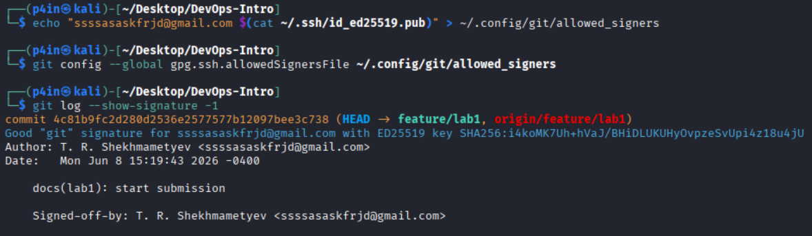
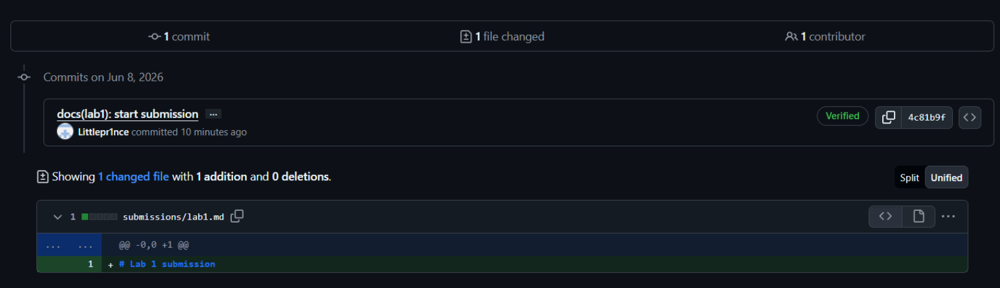
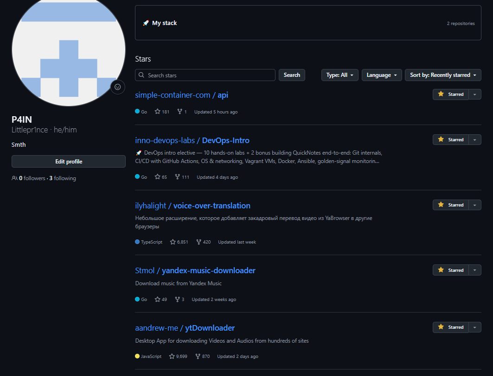
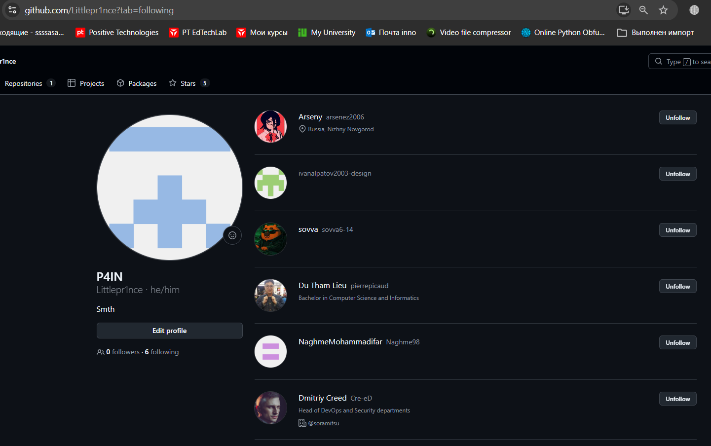
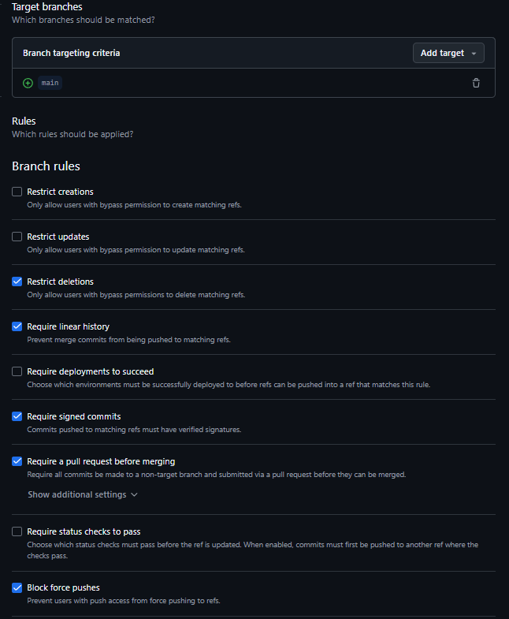

# Lab 1 submission
# Lab 1 DevOps Foundations: Fork, Sign, and Open Your First PR

**Student:** T.R. Shekhmametyev

## Task 1 — SSH Commit Signing & First Signed Commit
 
### 1.1: Fork the Course Repository

I forked the course repository to my personal GitHub account:
Repository: <https://github.com/Littlepr1nce/DevOps-Intro>

### 1.2: Run QuickNotes

I installed Go and launched the QuickNotes application.
I started checking the health endpoint.
at first there were 4 notes, after adding the POST it became 5

### Check Health 1

```
┌──(p4in㉿kali)-[~/Desktop]
└─$ curl -s http://localhost:8080/health | python3 -m json.tool
{
    "notes": 4,
    "status": "ok"
}
```

Initial number of notes: 4

### POST /notes

```
┌──(p4in㉿kali)-[~/Desktop]
└─$ curl -s -X POST http://localhost:8080/notes \
-H "Content-Type: application/json" \
-d '{"title":"hello","body":"first POST"}' | python3 -m json.tool
{
    "id": 5,
    "title": "hello",
    "body": "first POST",
    "created_at": "2026-06-08T16:41:52.116774118Z"
}
                                                                                                                                  
┌──(p4in㉿kali)-[~/Desktop]
└─$ curl -s http://localhost:8080/notes | python3 -m json.tool
[
    {
        "id": 1,
        "title": "Welcome to QuickNotes",
        "body": "This is the project you'll containerize, deploy, monitor, and harden across all 10 labs.",
        "created_at": "2026-01-15T10:00:00Z"
    },
    {
        "id": 2,
        "title": "Read app/main.go first",
        "body": "Start by understanding the entry point \u2014 env vars, signal handling, graceful shutdown.",
        "created_at": "2026-01-15T10:05:00Z"
    },
    {
        "id": 3,
        "title": "DevOps mantra",
        "body": "If it hurts, do it more often.",
        "created_at": "2026-01-15T10:10:00Z"
    },
    {
        "id": 4,
        "title": "Endpoint cheat-sheet",
        "body": "GET /notes  GET /notes/{id}  POST /notes  DELETE /notes/{id}  GET /health  GET /metrics",
        "created_at": "2026-01-15T10:15:00Z"
    },
    {
        "id": 5,
        "title": "hello",
        "body": "first POST",
        "created_at": "2026-06-08T16:41:52.116774118Z"
    }
]
            
```

### Check Health 2

```
┌──(p4in㉿kali)-[~/Desktop]
└─$ curl -s http://localhost:8080/health | python3 -m json.tool
{
    "notes": 5,
    "status": "ok"
}
```

After POST request the application contained 5 notes.


### 1.3 Configure SSH Signing

I generated an ED25519 SSH key pair and added the public key to GitHub as both an Authentication Key and a Signing Key.

After that I configured Git for SSH commit signing:
```bash
git config --global gpg.format ssh
git config --global user.signingkey ~/.ssh/id_ed25519.pub
git config --global commit.gpgsign true
```
### Signature Verification

After I verified the signature locally using:

```bash
git log --show-signature -1
```
Initially Git was unable to verify the SSH signature because the `allowedSignersFile` parameter was not configured.
I created the allowed signers file and configured Git to trust my SSH signing key:

```bash
mkdir -p ~/.config/git
echo "ssssasaskfrjd@gmail.com $(cat ~/.ssh/id_ed25519.pub)" > ~/.config/git/allowed_signers
git config --global gpg.ssh.allowedSignersFile ~/.config/git/allowed_signers
```
After configuration Git successfully verified the commit signature and displayed:

```text
Good "git" signature for ssssasaskfrjd@gmail.com
```



### 1.4 Make a Signed Commit

I created a signed commit in the feature/lab1 branch.
```bash
git switch -c feature/lab1
git add submissions/lab1.md
git commit -S -s -m "docs(lab1): start submission"
```
Commit message:

```text
docs(lab1): start submission
```
GitHub successfully verified the commit signature and marked the commit as **Verified**.



### 1.5 Why Signed Commits Matter

Signed commits provide cryptographic proof that a commit was created by the owner of a specific SSH key. This helps reviewers verify the identity of contributors and detect unauthorized or forged commits.

The importance of commit verification was highlighted by the xz-utils supply-chain attack in March 2024, where an attacker gained trust in the project and introduced a malicious backdoor. Signed commits improve software supply-chain security by making the origin of changes easier to verify and audit.


## Task 2 - Pull Request Template & First PR

I successfully made a pull request at the end of 2 tasks, just forgot about the third one, i closed it and finished it. 
I add some text here to display it.

## Task 3 - GitHub Community Engagement

I starred the course repository and the simple-container-com/api project.
I also followed the professor, teaching assistants, and 3 classmates.
Starring repositories helps open-source projects gain visibility and shows appreciation for useful work. It also makes interesting projects easier to find later.





## BONUS

### B.1 Branch Protection

I configured branch protection rules for the main branch in my fork.

Enabled rules:
Require signed commits
Require a pull request before merging
Require linear history




### B.2 Attempt to Bypass Protection

I created an unsigned commit and attempted to push it directly to the protected main branch.

GitHub rejected the push with the following message:
```bash
┌──(p4in㉿kali)-[~/Desktop/DevOps-Intro]
└─$ git -c commit.gpgsign=false commit --allow-empty -s -m "test: unsigned commit (should fail)"
[main 666f982] test: unsigned commit (should fail)
                                                                                                                                  
┌──(p4in㉿kali)-[~/Desktop/DevOps-Intro]
└─$ git push origin main
Enter passphrase for key '/home/p4in/.ssh/id_ed25519': 
Enumerating objects: 1, done.
Counting objects: 100% (1/1), done.
Writing objects: 100% (1/1), 230 bytes | 230.00 KiB/s, done.
Total 1 (delta 0), reused 0 (delta 0), pack-reused 0 (from 0)
remote: error: GH013: Repository rule violations found for refs/heads/main.
remote: Review all repository rules at https://github.com/Littlepr1nce/DevOps-Intro/rules?ref=refs%2Fheads%2Fmain
remote: 
remote: - Changes must be made through a pull request.
remote: 
remote: - Commits must have verified signatures.
remote:   Found 1 violation:
remote: 
remote:   666f98251bab016f9a01d6a3697e6e68996bc3c4
remote: 
To github.com:Littlepr1nce/DevOps-Intro.git
 ! [remote rejected] main -> main (push declined due to repository rule violations)
error: failed to push some refs to 'github.com:Littlepr1nce/DevOps-Intro.git'
```
This confirms that the protection rules are working correctly.

### B.3 Reflection

Branch protection and required signed commits help ensure that only reviewed and verified changes reach critical branches. If similar controls had been enforced during the Knight Capital deployment incident, unauthorized or unreviewed code would have been much harder to deploy directly into production. Requiring pull requests introduces peer review, while signed commits provide accountability and traceability. Together these controls reduce the risk of operational mistakes and supply-chain attacks.
