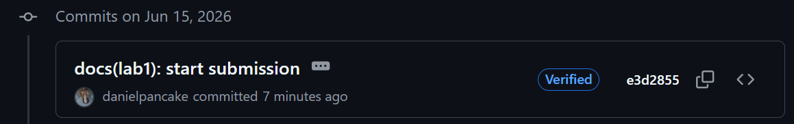

# Lab 1 submission

## Task 1

### QuickNotes run `/health`, `/notes`, `POST /notes`

```powershell
PS C:\Users\danielpancake> curl -s http://localhost:8080/health | py -m json.tool
{
    "notes": 4,
    "status": "ok"
}

PS C:\Users\danielpancake> curl -s http://localhost:8080/notes  | py -m json.tool
[
    {
        "id": 1,
        "title": "Welcome to QuickNotes",
        "body": "This is the project you'll containerize, deploy, monitor, and harden across all 10 labs.",
        "created_at": "2026-01-15T10:00:00Z"
    },
    {
        "id": 2,
        "title": "Read app/main.go first",
        "body": "Start by understanding the entry point \u0432\u0402\u201d env vars, signal handling, graceful shutdown.",
        "created_at": "2026-01-15T10:05:00Z"
    },
    {
        "id": 3,
        "title": "DevOps mantra",
        "body": "If it hurts, do it more often.",
        "created_at": "2026-01-15T10:10:00Z"
    },
    {
        "id": 4,
        "title": "Endpoint cheat-sheet",
        "body": "GET /notes  GET /notes/{id}  POST /notes  DELETE /notes/{id}  GET /health  GET /metrics",
        "created_at": "2026-01-15T10:15:00Z"
    }
]

PS C:\Users\danielpancake> curl -s -X POST http://localhost:8080/notes -H 'Content-Type: application/json' -d '{"title":"hello","body":"first POST"}' | py -m json.tool
{
    "id": 5,
    "title": "hello",
    "body": "first POST",
    "created_at": "2026-06-15T09:55:15.2678968Z"
}
```

### Signed commit verification & Verified badge

```powershell
PS D:\Desktop\DevOps-Intro> git log --show-signature -1

commit e3d2855371da8a8f0d6613c0140b20dac93cb803 (HEAD -> feature/lab1)
Good "git" signature for 45727078+danielpancake@users.noreply.github.com with ED25519 key SHA256:9X3YQHiqrWoDjoaRwFmJ5YC04AAtZX8GDBNeS3atwEk
Author: danielpancake <45727078+danielpancake@users.noreply.github.com>
Date:   Mon Jun 15 15:02:53 2026 +0500

    docs(lab1): start submission

    Signed-off-by: danielpancake <45727078+danielpancake@users.noreply.github.com>
```



### Why signed commits matter

Signed commits use cryptographic signatures to verify who created a commit, helping reviewers trust the source of code changes and prevent impersonation. The `xz-utils` backdoor showed that even trusted contributors can introduce malicious code, but commit signing provides an auditable record of authorship and strengthens software supply-chain security.

## Task 2

The PR template was added to my fork's `main` at `.github/pull_request_template.md`

## Task 3

### GitHub Community

**Why starring repositories matters:** Starring a repository helps you save projects you find useful and shows support for the people who maintain them. It also helps good open-source projects become more visible to others.

**How following developers helps:** Following developers lets you see what they are building and contributing to, making it easier to discover useful projects, learn from others, and stay updated on your teammates' work.
