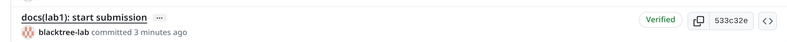
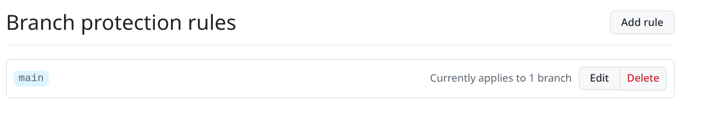

# Lab 1 submission

## Task 1 — SSH Commit Signing & First Signed Commi
## Outpup curl against /health
{
    "notes": 5,
    "status": "ok"
}

## Output of curl against /notes
[
    {
        "id": 1,
        "title": "Welcome to QuickNotes",
        "body": "This is the project you'll containerize, deploy, monitor, and harden across all 10 labs.",
        "created_at": "2026-01-15T10:00:00Z"
    },
    {
        "id": 2,
        "title": "Read app/main.go first",
        "body": "Start by understanding the entry point \u2014 env vars, signal handling, graceful shutdown.",
        "created_at": "2026-01-15T10:05:00Z"
    },
    {
        "id": 3,
        "title": "DevOps mantra",
        "body": "If it hurts, do it more often.",
        "created_at": "2026-01-15T10:10:00Z"
    },
    {
        "id": 4,
        "title": "Endpoint cheat-sheet",
        "body": "GET /notes  GET /notes/{id}  POST /notes  DELETE /notes/{id}  GET /health  GET /metrics",
        "created_at": "2026-01-15T10:15:00Z"
    }
]

## Output of curl against POST /notes
{
    "id": 5,
    "title": "hello",
    "body": "first POST",
    "created_at": "2026-06-04T22:44:57.201845403Z"
}

### curl /notes after POST
[
    {
        "id": 1,
        "title": "Welcome to QuickNotes",
        "body": "This is the project you'll containerize, deploy, monitor, and harden across all 10 labs.",
        "created_at": "2026-01-15T10:00:00Z"
    },
    {
        "id": 2,
        "title": "Read app/main.go first",
        "body": "Start by understanding the entry point \u2014 env vars, signal handling, graceful shutdown.",
        "created_at": "2026-01-15T10:05:00Z"
    },
    {
        "id": 3,
        "title": "DevOps mantra",
        "body": "If it hurts, do it more often.",
        "created_at": "2026-01-15T10:10:00Z"
    },
    {
        "id": 4,
        "title": "Endpoint cheat-sheet",
        "body": "GET /notes  GET /notes/{id}  POST /notes  DELETE /notes/{id}  GET /health  GET /metrics",
        "created_at": "2026-01-15T10:15:00Z"
    },
    {
        "id": 5,
        "title": "hello",
        "body": "first POST",
        "created_at": "2026-06-04T22:44:57.201845403Z"
    }
]

## Output of `git log --show-signature -1`
commit a7c94d797f0574df16215d13c0c321ab3278ee0f (HEAD -> feature/lab1)
Good "git" signature for djbubu28@yahoo.com with ED25519 key SHA256:QARDeDo9ASATwzSKffgwflEQuIS3bgo/m5fIrCCrgpY

## Why signed commits matter 
In 2024, a malicious backdoor was discovered in the compression software XZ Utils, it would allow unauthorized remote access to any Linux system running the compromised version via SSH.. After and investigation it was esteblished that the exploit was introduced by a contributor going by the alias of "Jia Tan". The incident highlighted how unsigned, unverified commits from untrusted contributors can silently compromise critical infrastructure.

 ## GitHub Community
 
Starring repositories serves as a bookmarking system and a signal of community trust. A high star count indicates a project is widely used and maintained, making it easier for developers to discover reliable tools. It also encourages open-source maintainers by showing appreciation for their work.

Following developers creates a live feed of their activity on GitHub, helping you discover new projects, stay updated on their work, and build professional connections that extend beyond the classroom into real-world collaboration

## Bonus Task — Branch Protection & Required Signed

### Output of `git commit -S=false -s --allow-empty -m "test: unsigned commit (should fail)"``
error: Couldn't load public key =false: No such file or directory?
fatal: failed to write commit object

