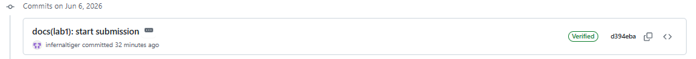

# Lab 1 Submission

## Task 1: SSH Commit Signing & QuickNotes

### QuickNotes Output

#### 1. Health Check
```bash
$ curl -s http://localhost:8080/health | python3 -m json.tool
{
    "notes": 5,
    "status": "ok"
}
```
#### 2. List Notes
```bash
$ curl -s http://localhost:8080/notes | python3 -m json.tool
[
    {
        "id": 2,
        "title": "Read app/main.go first",
        "body": "Start by understanding the entry point \u0432\u0402\u201d env vars, signal handling, graceful shutdown.",
        "created_at": "2026-01-15T10:05:00Z"
    },
    {
        "id": 3,
        "title": "DevOps mantra",
        "body": "If it hurts, do it more often.",
        "created_at": "2026-01-15T10:10:00Z"
    },
    {
        "id": 4,
        "title": "Endpoint cheat-sheet",
        "body": "GET /notes  GET /notes/{id}  POST /notes  DELETE /notes/{id}  GET /health  GET /metrics",
        "created_at": "2026-01-15T10:15:00Z"
    },
    {
        "id": 5,
        "title": "hello",
        "body": "first POST",
        "created_at": "2026-06-06T16:07:58.0787882Z"
    },
    {
        "id": 6,
        "title": "hello",
        "body": "first POST",
        "created_at": "2026-06-06T16:08:30.3011342Z"
    },
    {
        "id": 1,
        "title": "Welcome to QuickNotes",
        "body": "This is the project you'll containerize, deploy, monitor, and harden across all 10 labs.",
        "created_at": "2026-01-15T10:00:00Z"
    }
]
```

#### 3. Create Note (POST)
```bash
$ curl -s -X POST http://localhost:8080/notes -H "Content-Type: application/json" -d "{\"title\":\"hello\",\"body\":\"first POST\"}" | python -m json.tool
{
    "id": 7,
    "title": "hello",
    "body": "first POST",
    "created_at": "2026-06-06T18:16:00.2741261Z"
}
```

### Signed Commit Verification

```bash
git log --show-signature -1
commit d394ebafec773b95fe8adf38c5b18d0860dbfd5e (HEAD -> feature/lab1, origin/feature/lab1)
Good "git" signature for levakov2003@gmail.com with ED25519 key SHA256:Uy5EthB3DwEUnS1a18RY23swxV+0kSuppzGEkQURsgQ
Author: Levak <levakov2003@gmail.com>
Date:   Sat Jun 6 20:46:45 2026 +0300

    docs(lab1): start submission

    Signed-off-by: Levak <levakov2003@gmail.com>
```

### Verified Badge Screenshot


###  Why signed commits matter 
Signed commits provide cryptographic proof of code provenance, ensuring that changes were actually made by the claimed author.
This is crucial for preventing supply chain attacks like the March 2024 xz-utils incident, where an attacker used a social-engineered account to slip a backdoor into a critical data compression Linux library.
If strict signature verification had been enforced, the unauthorized commits from the compromised account would have been immediately flagged as unverified, stopping the attack before it reached production.

## Task 2: Pull Request Template

Added template to main branch, opened a lab PR.

## Task 3:  GitHub Community Engagement

### Actions Completed
- Starred: [inno-devops-labs/DevOps-Intro](https://github.com/inno-devops-labs/DevOps-Intro)
- Starred: [simple-container-com/api](https://github.com/simple-container-com/api)
- Following: [@Cre-eD](https://github.com/Cre-eD), [@Naghme98](https://github.com/Naghme98), [@pierrepicaud](https://github.com/pierrepicaud)
- Following 3+ classmates: [@alpa4](https://github.com/alpa4), [@Aleksandr Romanov
](https://github.com/Dekart-hub), [@Mostafa Kira
](https://github.com/MostafaKhaled2017), [@Hidancloud](https://github.com/Hidancloud), [@lime413](https://github.com/lime413)

###  GitHub Community
Starring repositories acts as a personal bookmarking system and a public signal of appreciation that helps maintainers gauge interest and
boosts a project's discoverability in the open-source ecosystem.
Following developers and teammates creates a light professional network that surfaces their activity, making it easier to check their work and learn from it,
spot collaboration opportunities, and stay aligned with the team's technical direction without formal meetings.