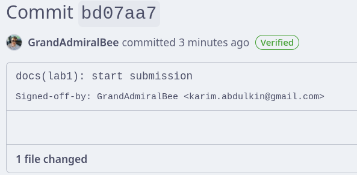
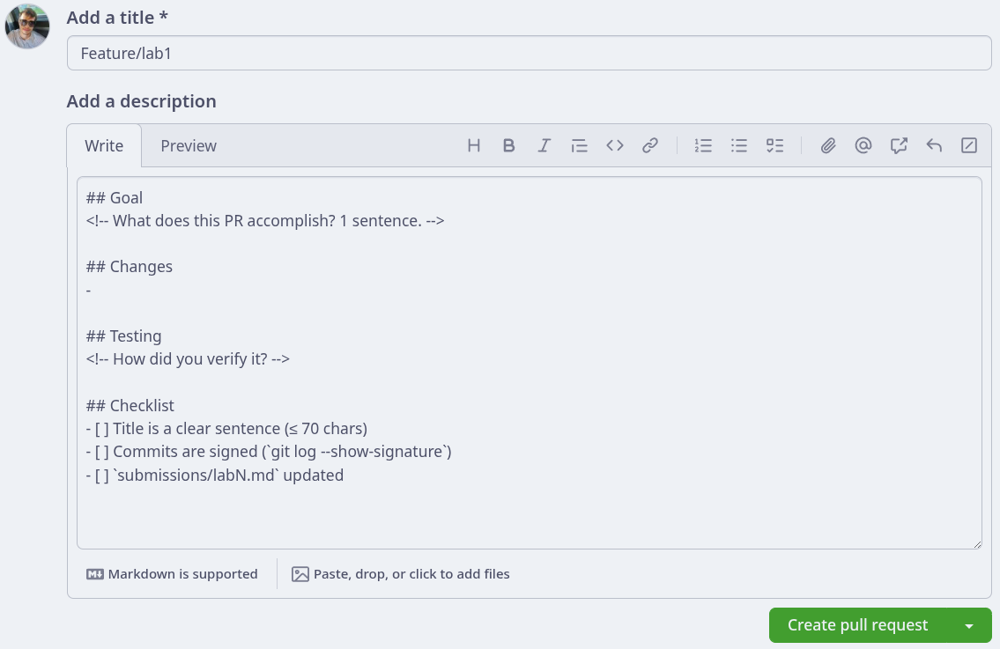

# Lab 1 — DevOps Foundations: Fork, Sign, and Open Your First PR

**Author:** Karim Abdulkin (@GrandAdmiralBee)
**Fork:** https://github.com/GrandAdmiralBee/DevOps-Intro
**Branch:** `feature/lab1`

---

## Task 1 — SSH Commit Signing & QuickNotes Run (6 pts)

### 1.2 — QuickNotes locally

`go run .` from `app/` started the service on `:8080`. Captured outputs below.

**`GET /health`**

```json
{
    "notes": 4,
    "status": "ok"
}
```

**`GET /notes` (initial, 4 seed notes)**

```json
[
    {
        "id": 2,
        "title": "Read app/main.go first",
        "body": "Start by understanding the entry point — env vars, signal handling, graceful shutdown.",
        "created_at": "2026-01-15T10:05:00Z"
    },
    {
        "id": 3,
        "title": "DevOps mantra",
        "body": "If it hurts, do it more often.",
        "created_at": "2026-01-15T10:10:00Z"
    },
    {
        "id": 4,
        "title": "Endpoint cheat-sheet",
        "body": "GET /notes  GET /notes/{id}  POST /notes  DELETE /notes/{id}  GET /health  GET /metrics",
        "created_at": "2026-01-15T10:15:00Z"
    },
    {
        "id": 1,
        "title": "Welcome to QuickNotes",
        "body": "This is the project you'll containerize, deploy, monitor, and harden across all 10 labs.",
        "created_at": "2026-01-15T10:00:00Z"
    }
]
```

**`POST /notes` — creates note #5**

```bash
curl -s -X POST http://localhost:8080/notes \
  -H 'Content-Type: application/json' \
  -d '{"title":"hello","body":"first POST"}'
```

```json
{
    "id": 5,
    "title": "hello",
    "body": "first POST",
    "created_at": "2026-06-16T09:57:58.43363076Z"
}
```

**`GET /notes` after POST — 5 notes total**

```json
[
    { "id": 3, "title": "DevOps mantra", "body": "If it hurts, do it more often.", "created_at": "2026-01-15T10:10:00Z" },
    { "id": 4, "title": "Endpoint cheat-sheet", "body": "GET /notes  GET /notes/{id}  POST /notes  DELETE /notes/{id}  GET /health  GET /metrics", "created_at": "2026-01-15T10:15:00Z" },
    { "id": 5, "title": "hello", "body": "first POST", "created_at": "2026-06-16T09:57:58.43363076Z" },
    { "id": 1, "title": "Welcome to QuickNotes", "body": "This is the project you'll containerize, deploy, monitor, and harden across all 10 labs.", "created_at": "2026-01-15T10:00:00Z" },
    { "id": 2, "title": "Read app/main.go first", "body": "Start by understanding the entry point — env vars, signal handling, graceful shutdown.", "created_at": "2026-01-15T10:05:00Z" }
]
```

### 1.3 — SSH signing config

```bash
git config --global gpg.format ssh
git config --global user.signingkey ~/.ssh/id_ed25519.pub
git config --global commit.gpgsign true
git config --global tag.gpgsign true
```

The same `~/.ssh/id_ed25519.pub` was added to GitHub twice — once as **Authentication Key** and once as **Signing Key** (separate roles).

Verified SSH auth:

```text
$ ssh -T git@github.com
Hi GrandAdmiralBee! You've successfully authenticated, but GitHub does not provide shell access.
```

To make local signature *verification* work (separate from creating signatures), an allowed-signers file was registered:

```bash
mkdir -p ~/.config/git
printf '%s %s\n' "karim.abdulkin@gmail.com" "$(cat ~/.ssh/id_ed25519.pub)" \
  > ~/.config/git/allowed_signers
git config --global gpg.ssh.allowedSignersFile ~/.config/git/allowed_signers
```

### 1.4 — Signed commit on `feature/lab1`

```text
$ git log --show-signature -1
commit bd07aa74cd07c4d8979f0e7cde1f68149fd46190
Good "git" signature for karim.abdulkin@gmail.com with ED25519 key SHA256:XvCfUeZDdYoI8od4q4/PZZU4OiyMs8bx0P8m2Z+Yxus
Author: GrandAdmiralBee <karim.abdulkin@gmail.com>
Date:   Tue Jun 16 13:00:13 2026 +0300

    docs(lab1): start submission

    Signed-off-by: GrandAdmiralBee <karim.abdulkin@gmail.com>
```

**Verified badge on GitHub:**



### Why signed commits matter

Without signing, the `Author` field on a commit is a plain string that anyone with push access can spoof — `git commit --author='Linus Torvalds <linus@…>'` is one line away from a fake attribution. SSH-signed commits cryptographically bind the commit to a key the platform has on file for a real account, so the "Verified" badge is a falsifiable claim about *who* authored, not just *what name* they typed.

The **xz-utils backdoor (CVE-2024-3094, March 2024)** showed why provenance matters in practice: an attacker spent two years building maintainer trust under the alias "Jia Tan" and then quietly shipped malicious tarballs that diverged from the public git history. Signed commits aren't a silver bullet (the xz attacker had legitimate access), but they make the *unauthored push* attack surface — where someone slips a single bad commit into a popular project through stolen credentials or a compromised CI step — measurably narrower, and they give reviewers and downstreams a verifiable anchor point.

---

## Task 2 — Pull Request Template & First PR (3 pts)

### 2.1 — PR template on `main`

Added `.github/pull_request_template.md` to the **default branch** of my fork (`GrandAdmiralBee/DevOps-Intro`), then opened this PR — GitHub auto-populated the description from the template.

Template content (verbatim):

```markdown
## Goal
<!-- What does this PR accomplish? 1 sentence. -->

## Changes
-

## Testing
<!-- How did you verify it? -->

## Checklist
- [ ] Title is a clear sentence (≤ 70 chars)
- [ ] Commits are signed (`git log --show-signature`)
- [ ] `submissions/labN.md` updated
```

### 2.2 — The PR itself

This submission is the PR — it lives at `feature/lab1` → `inno-devops-labs/DevOps-Intro:main`.
The PR description (Goal / Changes / Testing / Checklist) was auto-filled from the template:



Every commit on the branch shows the **Verified** badge.

---

## Task 3 — GitHub Community Engagement (1 pt)

**Done:**
- ⭐ Starred [`inno-devops-labs/DevOps-Intro`](https://github.com/inno-devops-labs/DevOps-Intro)
- ⭐ Starred [`simple-container-com/api`](https://github.com/simple-container-com/api)
- 👤 Following [@Cre-eD](https://github.com/Cre-eD), [@Naghme98](https://github.com/Naghme98), [@pierrepicaud](https://github.com/pierrepicaud)
- 👤 Following 3+ classmates from the course

**Why stars and follows matter.** Stars are a lightweight, public bookmark — they help me find my own way back to useful tooling, and they're a signal to maintainers that the work matters (and to other developers that a project is worth a second look). Following classmates and instructors turns the platform into a living feed of what people in my field are shipping and learning; in a team or job-search context that visibility translates directly into discovering collaborators, code-review styles, and opportunities you'd miss if you only consumed releases.

---

## Repro: how to run QuickNotes on NixOS

For reproducibility on NixOS I added a `devenv.nix` at repo root that pulls in `go`, `git`, `openssh`, `python3`, `curl`, `jq`, `gh`. Anyone with `devenv` installed can:

```bash
devenv shell
cd app && go run .
```

(These files are kept out of the lab PR — they're a local convenience, not a deliverable.)
