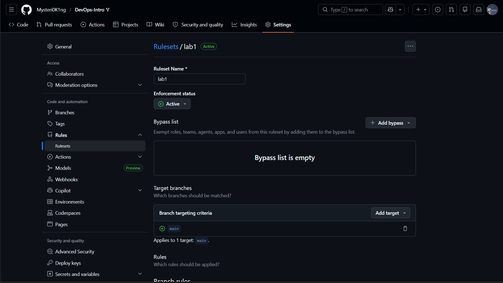
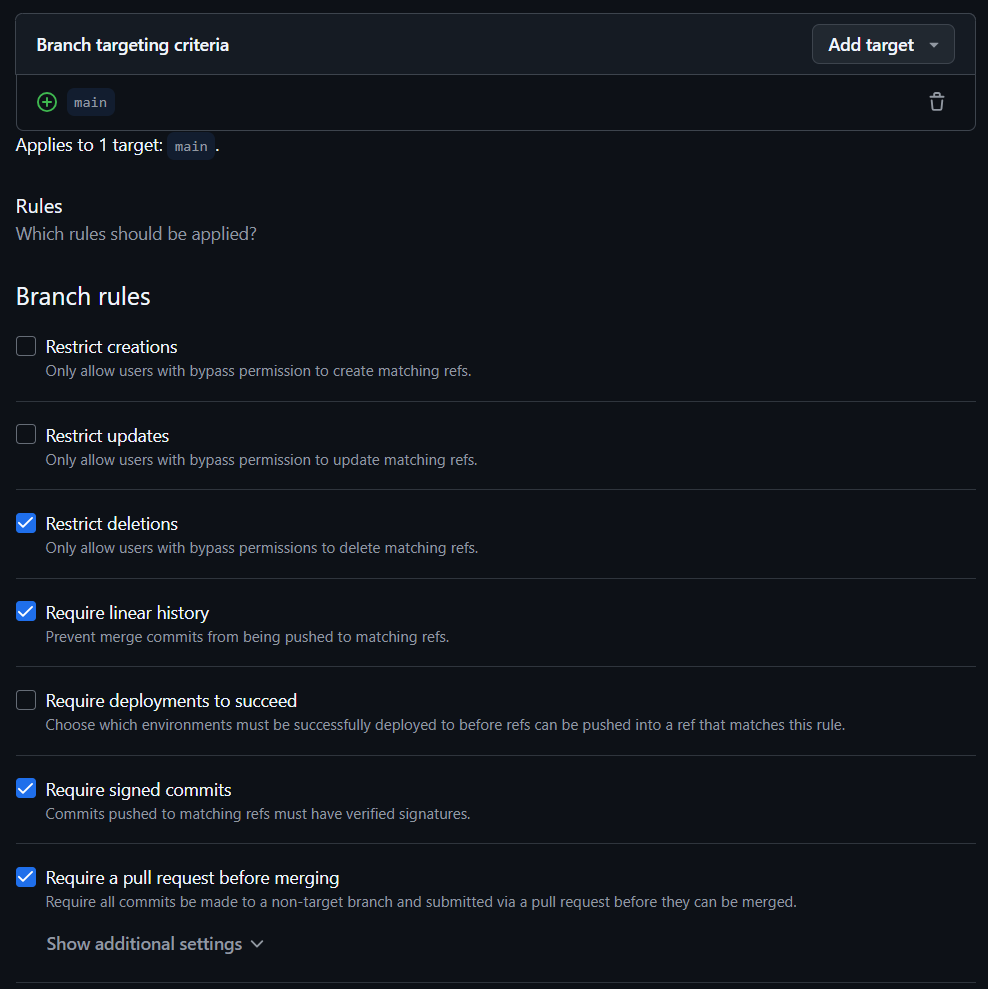

"# Lab 1 submission" 

## 1.1 Curls output

### GET /health

```bash
curl -s http://localhost:8080/health | python -m json.tool
```

### Output

```json
{
    "notes": 5,
    "status": "ok"
}
```

### GET /notes

```bash
curl -s http://localhost:8080/notes  | python -m json.tool
```

### Output

```json
[
    {
        "id": 1,
        "title": "Welcome to QuickNotes",
        "body": "This is the project you'll containerize, deploy, monitor, and harden across all 10 labs.",
        "created_at": "2026-01-15T10:00:00Z"
    },
    {
        "id": 2,
        "title": "Read app/main.go first",
        "body": "Start by understanding the entry point \u0432\u0402\u201d env vars, signal handling, graceful shutdown.",
        "created_at": "2026-01-15T10:05:00Z"
    },
    {
        "id": 3,
        "title": "DevOps mantra",
        "body": "If it hurts, do it more often.",
        "created_at": "2026-01-15T10:10:00Z"
    },
    {
        "id": 4,
        "title": "Endpoint cheat-sheet",
        "body": "GET /notes  GET /notes/{id}  POST /notes  DELETE /notes/{id}  GET /health  GET /metrics",
        "created_at": "2026-01-15T10:15:00Z"
    }
]

```

### POST /notes

```bash
curl -s -X POST http://localhost:8080/notes \
> -H 'Content-Type: application/json' \
> -d '{"title":"hello","body":"first POST"}' | python -m json.tool
```

### Output

```json
{
    "id": 5,
    "title": "hello",
    "body": "first POST",
    "created_at": "2026-06-08T08:49:23.6080851Z"
}

```

## 1.2 Output of git log --show-signature -1

```bash
commit 5d1a3197440cb1a7af5dbe55a52391d55d56d7a9 (HEAD -> feature/lab1)
Good "git" signature for nikita.sshankin@gmail.com with ED25519 key SHA256:YmuqnukZ7Vv/dkS/udvYvJErhfCYImVdz+nMrsHdP/s
Author: Nikita Schankin <nikita.sshankin@gmail.com>
Date:   Mon Jun 8 12:01:18 2026 +0300

    docs(lab1): start submission

    Signed-off-by: Nikita Schankin <nikita.sshankin@gmail.com>

```

## 1.3 A screenshot of the Verified badge


## 1.4 why signed commits matter

Signed commits help prove that a commit was really created by the claimed developer and was not forged by someone else. This matters because supply-chain attacks, like the xz-utils backdoor in March 2024, can happen when trust in maintainers or code history is abused. Signed commits improve code provenance: reviewers can better verify where changes came from and whether they were made by a trusted key.

## 3.3 A "GitHub Community" section

Starring repositories matters in open source because it helps useful projects become more visible and signals that the community finds them valuable. Following developers helps in team projects and professional growth because it makes it easier to learn from others’ work, track good practices, and build connections in the software development community.

## Bonus Task




```bash
git commit -S=false -s --allow-empty -m "test: unsigned commit (should fail)"
```

### Error output

```bash
error: Couldn't load public key =false: No such file or directory?

fatal: failed to write commit object

```

### Knight Capital's deploy reflection

With branch protection on the production deploy branch, Knight Capital’s release would likely have required review and approval before the code could reach production, making it harder for one missed manual step to cause a disaster. Required signing would also prove that every production change came from a trusted developer or deploy process, improving accountability and code provenance. If the old “Power Peg” code or the incomplete deployment had been caught during protected review/checks, the rogue server might never have gone live. Their deploy day would probably have been slower, but much safer: controlled, traceable, and easier to stop or roll back.
