# Lab 1 submission

### Output of `curl` against `/health`, `/notes`, and `POST /notes`

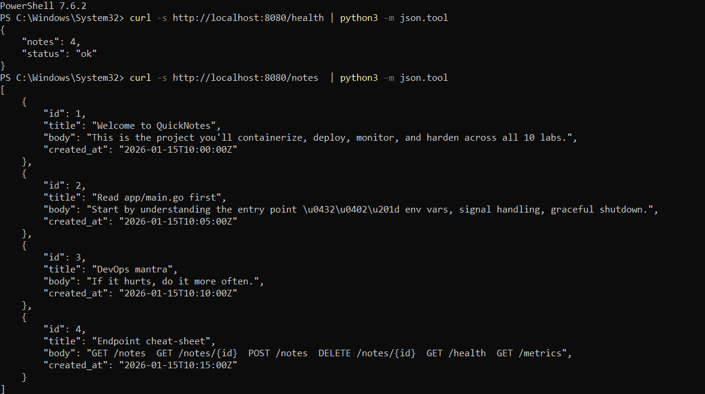
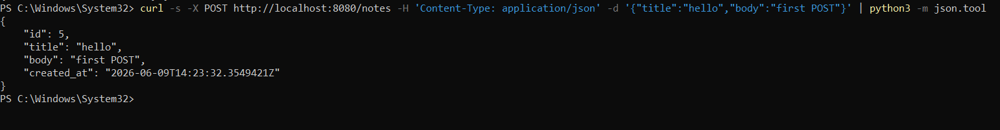
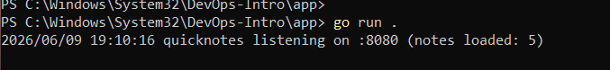
### Output of `git log --show-signature -1` showing **Good** signature

Nedeed to run command below for task to be done: 
```
echo "elfsgithub@gmail.com $(cat ~/.ssh/id_ed25519.pub)" > ~/.ssh/allowed_signers
```

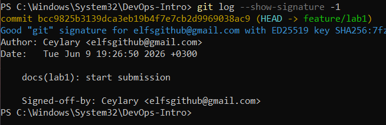

### A screenshot of the Verified badge on your platform's PR/commit page

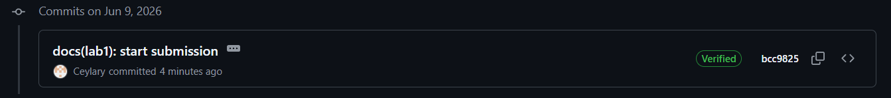

### A 2-3 sentence explanation: _why_ signed commits matter (referencing the xz-utils March 2024 story from Lecture 1)

Story from lecture - in **March 2024**, an attacker (account `JiaT75`) maintained the **xz-utils** project for two years and slipped in a backdoor that nearly compromised every SSH daemon on Linux. Because there was no sighning for commits it could be anyone who could commit compromised changes and there is no way of proving otherwise. Signed commits are proven to be from at least developer's device that holds this key, so that adds at least one security layer, which is good

Nocised that folder was copied into system folder, changed lokation of it.

### Task 2 

Changes were added to main branch 
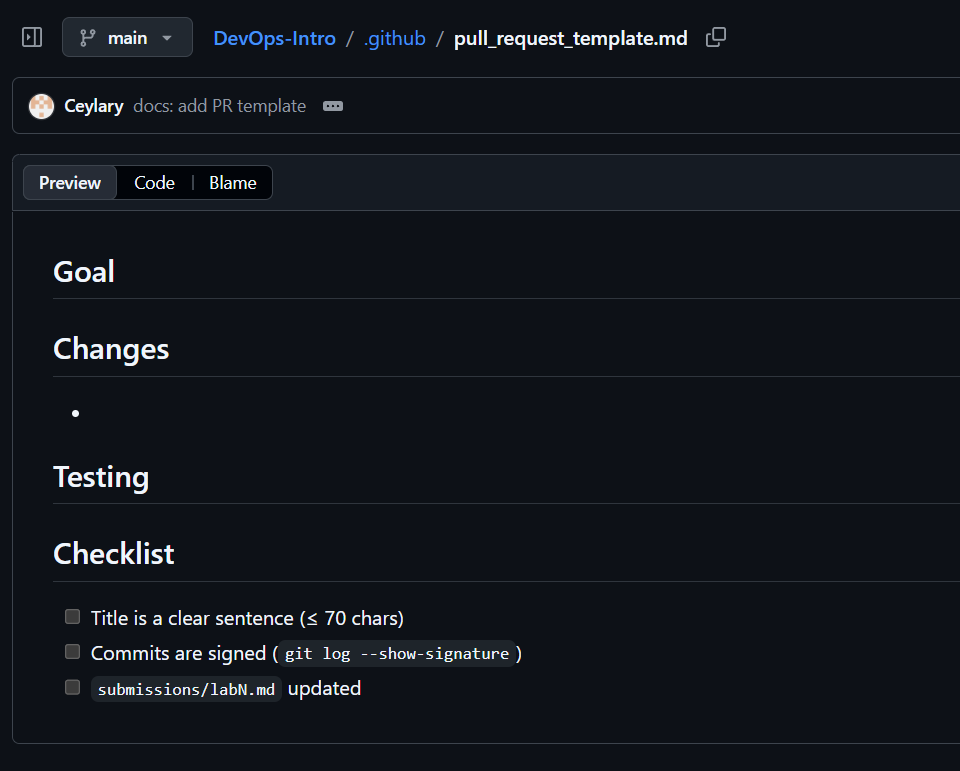

### Task 3 - GitHub Community Engagement

Stars: 
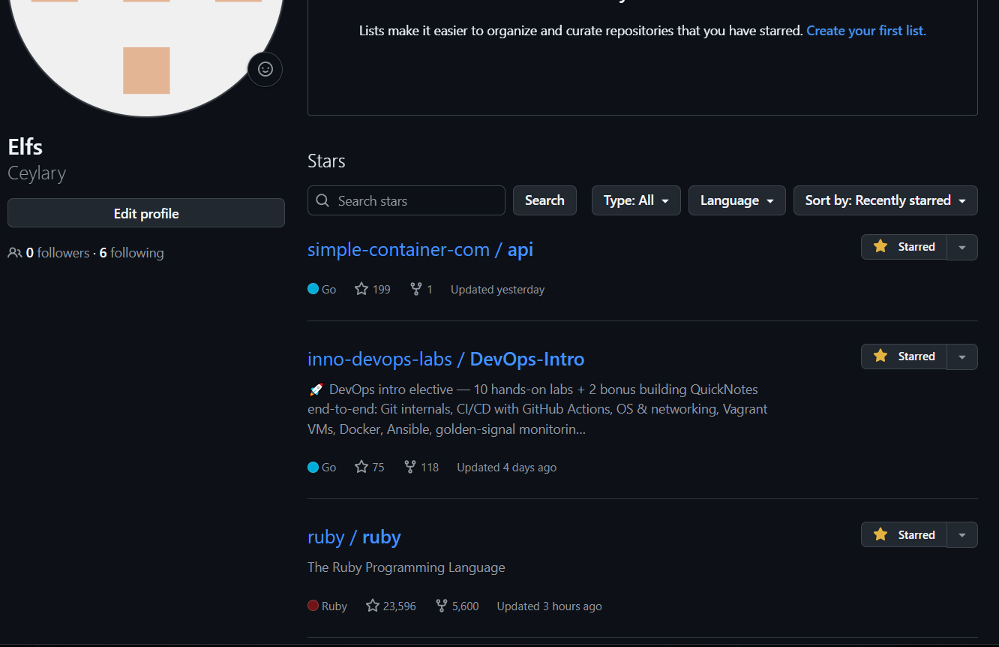

Follows:
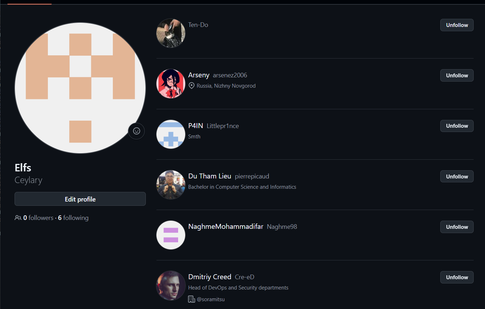

- Why starring repositories matters in open source:

Starring a repository is a way to show appreciation to maintainers and bookmark projects I find useful. Stars help open-source projects gain visibility and credibility, which attracts more contributors and users.

- How following developers helps in team projects and professional growth:

Following developers and teammates creates a feed of their activity on GitHub. This helps me stay updated on what my peers are working on, learn from their contributions, and collaborate more effectively in team projects, for them this is sign of my interest in their work.

### Bonus Task

Rules changed: 
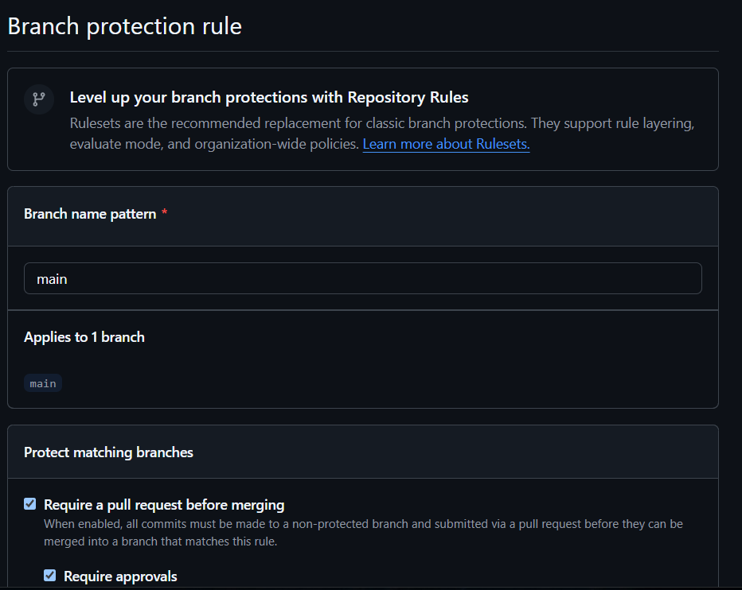
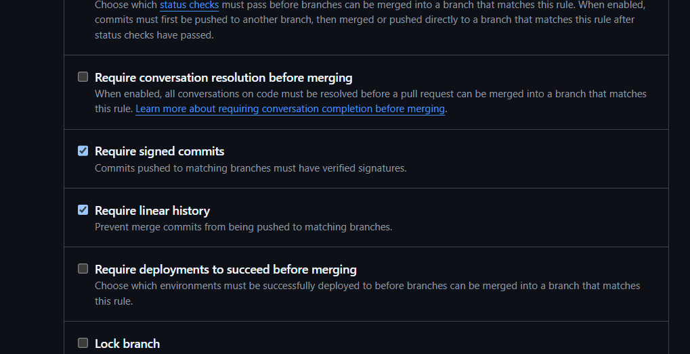

Tried to violate rules I made and got rejected. Command from task didn't work so I changed it. 
First attemt with command from task:
```
PS C:\Users\Admin\DevOps-Intro> git commit -S=false -s --allow-empty -m "test: unsigned commit (should fail)"
error: Couldn't load public key =false: No such file or directory?

fatal: failed to write commit object
```

Changed one + screenshot:
```
PS C:\Users\Admin\DevOps-Intro> git -c commit.gpgsign=false commit -s --allow-empty -m "test: unsigned commit (should fail)"
[main 834b47e] test: unsigned commit (should fail)
PS C:\Users\Admin\DevOps-Intro> git push origin main
Enter passphrase for key '/c/Users/Admin/.ssh/id_ed25519':
Enumerating objects: 1, done.
Counting objects: 100% (1/1), done.
Writing objects: 100% (1/1), 219 bytes | 219.00 KiB/s, done.
Total 1 (delta 0), reused 0 (delta 0), pack-reused 0 (from 0)
remote: Bypassed rule violations for refs/heads/main:
remote:
remote: - Commits must have verified signatures.
remote:   Found 1 violation:
remote:
remote:   834b47ef160013807c4d3873a51d6ce06aa33977
remote:
remote: - Changes must be made through a pull request.
remote:
To github.com:Ceylary/DevOps-Intro.git
   b0ec79b..834b47e  main -> main
```
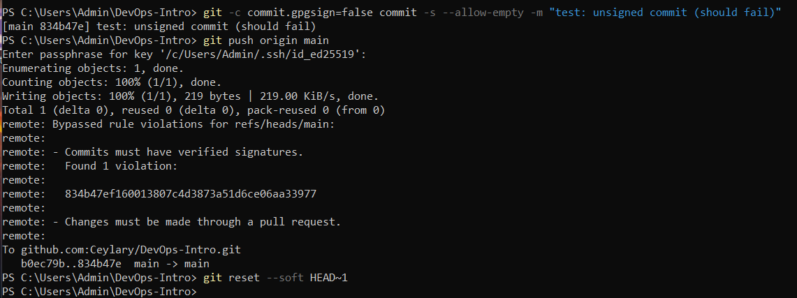

Reflection: 
What would Knight Capital's deploy day have looked like with branch protection + required signing on the prod deploy branch? 

If the production branch had required signed commits, the deploying developer would have been cryptographically identified — no anonymous or impersonated changes possible, it would create accountability. Branch protection could prevent all this situation from happening making mistake more visible before shanges was applied. All this protections could prevent this situation from happening.