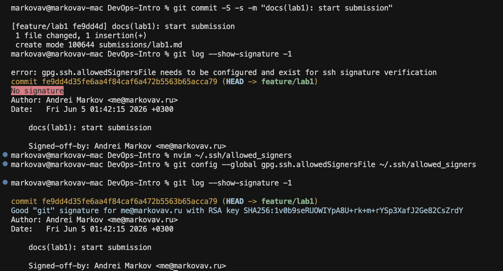
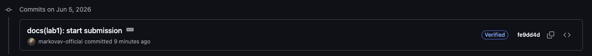

# Lab 1 submission

## Task 1 — SSH Commit Signing & QuickNotes

### QuickNotes: `curl` output

**`GET /health`**

```text
markovav@markovav-mac DevOps-Intro % curl -s http://localhost:8080/health | python3 -m json.tool
{
    "notes": 4,
    "status": "ok"
}
```

**`GET /notes`**

```text
markovav@markovav-mac DevOps-Intro % curl -s http://localhost:8080/notes  | python3 -m json.tool

[
    {
        "id": 1,
        "title": "Welcome to QuickNotes",
        "body": "This is the project you'll containerize, deploy, monitor, and harden across all 10 labs.",
        "created_at": "2026-01-15T10:00:00Z"
    },
    {
        "id": 2,
        "title": "Read app/main.go first",
        "body": "Start by understanding the entry point \u2014 env vars, signal handling, graceful shutdown.",
        "created_at": "2026-01-15T10:05:00Z"
    },
    {
        "id": 3,
        "title": "DevOps mantra",
        "body": "If it hurts, do it more often.",
        "created_at": "2026-01-15T10:10:00Z"
    },
    {
        "id": 4,
        "title": "Endpoint cheat-sheet",
        "body": "GET /notes  GET /notes/{id}  POST /notes  DELETE /notes/{id}  GET /health  GET /metrics",
        "created_at": "2026-01-15T10:15:00Z"
    }
]
```

**`POST /notes`**

```text
markovav@markovav-mac DevOps-Intro % curl -s -X POST http://localhost:8080/notes \              
  -H 'Content-Type: application/json' \
  -d '{"title":"hello","body":"first POST"}' | python3 -m json.tool
{
    "id": 5,
    "title": "hello",
    "body": "first POST",
    "created_at": "2026-06-04T23:00:29.863745Z"
}
```

---

### Signed commit: `git log --show-signature -1`

```text
markovav@markovav-mac DevOps-Intro % git log --show-signature -1

commit fe9dd4d35fe6aa4f84caf6a472b5563b65acca79 (HEAD -> feature/lab1)
Good "git" signature for me@markovav.ru with RSA key SHA256:1v0b9seRUOWIYpA8U+rk+m+rYSp3XafJ2Ge82CsZrdY
Author: Andrei Markov <me@markovav.ru>
Date:   Fri Jun 5 01:42:15 2026 +0300

    docs(lab1): start submission
    
    Signed-off-by: Andrei Markov <me@markovav.ru>
```

**Local verification issue:** The first `git log --show-signature -1` printed `gpg.ssh.allowedSignersFile needs to be configured and exist for ssh signature verification` and reported **No signature**, even though the commit was created with `-S`. SSH signing was enabled (`gpg.format ssh`, `commit.gpgsign true`), but Git had no local trust file mapping my email to the public key used for verification.

**Fix:** I created `~/.ssh/allowed_signers` with a line in the form `email namespaces="git" ssh-rsa AAAA...` (matching the key in `user.signingkey`), then set `git config --global gpg.ssh.allowedSignersFile ~/.ssh/allowed_signers`. After that, the same commit showed **Good "git" signature** locally — the screenshot below matches that second run.



---

### Verified badge (GitHub / GitLab)



---

### Why signed commits matter

Anyone can set arbitrary `user.name` and `user.email` in Git without proof of identity. In March 2024, the xz-utils backdoor incident showed how a long-trusted maintainer account (`JiaT75`) could slip malicious code into a dependency used by millions of Linux systems — a supply-chain attack that signed commits and provenance are meant to surface early ([Lecture 1](https://github.com/inno-devops-labs/DevOps-Intro/blob/main/lectures/lec1.md), Slide 16). A signed commit is a cryptographic claim that the holder of your SSH (or GPG) key actually authored that revision, so platforms can show **Verified** and reviewers can reject unauthenticated history before it merges.

---

## Task 2 — Pull Request Template & First PR

PR template added on fork `main`: `.github/pull_request_template.md`

---

## Task 3 — GitHub Community Engagement

### Checklist

- [x] Star the [course repository](https://github.com/inno-devops-labs/DevOps-Intro)
- [x] Star [simple-container-com/api](https://github.com/simple-container-com/api)
- [x] Follow professor [@Cre-eD](https://github.com/Cre-eD)
- [x] Follow TA [@Naghme98](https://github.com/Naghme98)
- [x] Follow TA [@pierrepicaud](https://github.com/pierrepicaud)
- [x] Follow classmate [@moflotas](https://github.com/moflotas)
- [x] Follow classmate [@Fil-126](https://github.com/Fil-126)
- [x] Follow classmate [@IlyaPechersky](https://github.com/IlyaPechersky)

### GitHub Community (1–2 sentences each)

- **Why starring repositories matters:** Stars bookmark projects you may reuse later (like QuickNotes across 10 labs) and signal community trust — the same kind of social proof that helps open-source maintainers get visibility and contributors find reliable tools. [Lecture 1](https://github.com/inno-devops-labs/DevOps-Intro/blob/main/lectures/lec1.md) frames DevOps as a collaborative discipline, not a solo job title; starring is a small way to participate in that ecosystem instead of only consuming it.

- **How following developers helps:** Following professors, TAs, and classmates surfaces what others ship — new repos, PR patterns, signed commits — which mirrors the **Sharing** pillar of CALMS from [Lecture 1](https://github.com/inno-devops-labs/DevOps-Intro/blob/main/lectures/lec1.md) (Slide 7): knowledge travels through people, not hoarded in silos. In team projects and after graduation, that feed becomes an informal discovery channel for tools, review habits, and collaborators.

---

## Bonus Task — Branch Protection

**Branch protection on `main`:** require signed commits, pull request before merging, and linear history.


**Unsigned push rejection (`remote: error:` line):**

```text
markovav@markovav-mac DevOps-Intro % git commit -S=false -s --allow-empty -m "test: unsigned commit (should fail)"

error: Couldn't load public key =false: No such file or directory?

fatal: failed to write commit object
markovav@markovav-mac DevOps-Intro % git commit --no-gpg-sign -s --allow-empty -m "test: unsigned commit (should fail)"
[main 396e58d] test: unsigned commit (should fail)
markovav@markovav-mac DevOps-Intro % git push origin main

Enumerating objects: 1, done.
Counting objects: 100% (1/1), done.
Writing objects: 100% (1/1), 221 bytes | 221.00 KiB/s, done.
Total 1 (delta 0), reused 0 (delta 0), pack-reused 0 (from 0)
remote: error: GH006: Protected branch update failed for refs/heads/main.
remote: 
remote: - Commits must have verified signatures.
remote:   Found 1 violation:
remote: 
remote:   396e58d683818ee7cb57af0c22071c3af98987a6
remote: 
remote: - Changes must be made through a pull request.
To github.com:markovav-official/DevOps-Intro.git
 ! [remote rejected] main -> main (protected branch hook declined)
error: failed to push some refs to 'github.com:markovav-official/DevOps-Intro.git'
```

**Local commit issue:** `git commit -S=false` does not turn signing off — Git treats `-S` as “sign with this key” and reads the argument literally as a key path named `=false`, hence `Couldn't load public key =false`. The lab’s intent is to create an unsigned commit locally; the correct flag is `--no-gpg-sign` (or `-c commit.gpgsign=false`). With that, the unsigned commit was created locally, but `git push origin main` was rejected by GitHub with `remote: error: GH006` — branch protection blocked both the missing signature and the direct push to `main`.

**Reflection (Knight Capital + branch protection):** On [August 1, 2012](https://github.com/inno-devops-labs/DevOps-Intro/blob/main/lectures/lec1.md) Knight Capital pushed SMARS to eight production servers manually; one server was missed and kept running stale code that re-activated **Power Peg**, costing **$440M in 45 minutes** ([Lecture 1](https://github.com/inno-devops-labs/DevOps-Intro/blob/main/lectures/lec1.md), Slide 1). A prod deploy branch with required signed commits, PR-only merges, and linear history would not replace automated, identical rollouts to every host — but it would eliminate “someone pushed straight to prod without review or proven identity” as a failure mode. Every production-bound change would trace to a **Verified** author and pass a review gate, aligning with the lecture’s lesson: *how* you ship matters as much as *what* you ship.
