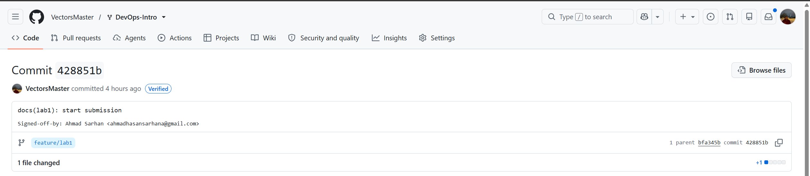

# Lab 1 submission

## Task 1 - SSH Commit Signing & First Signed Commit

Output of `curl` against endpoints:
- `/health`(After the POST)
```cli
curl -s http://localhost:8080/health | python3 -m json.tool
{
    "notes": 5,
    "status": "ok"
}
```

- `/notes`
```cli
curl -s http://localhost:8080/notes  | python3 -m json.tool
[
    {
        "id": 3,
        "title": "DevOps mantra",
        "body": "If it hurts, do it more often.",
        "created_at": "2026-01-15T10:10:00Z"
    },
    {
        "id": 4,
        "title": "Endpoint cheat-sheet",
        "body": "GET /notes  GET /notes/{id}  POST /notes  DELETE /notes/{id}  GET /health  GET /metrics",
        "created_at": "2026-01-15T10:15:00Z"
    },
    {
        "id": 5,
        "title": "hello",
        "body": "first POST",
        "created_at": "2026-06-28T14:41:07.521812343Z"
    },
    {
        "id": 1,
        "title": "Welcome to QuickNotes",
        "body": "This is the project you'll containerize, deploy, monitor, and harden across all 10 labs.",
        "created_at": "2026-01-15T10:00:00Z"
    },
    {
        "id": 2,
        "title": "Read app/main.go first",
        "body": "Start by understanding the entry point \u2014 env vars, signal handling, graceful shutdown.",
        "created_at": "2026-01-15T10:05:00Z"
    }
]
```

- `POST /notes`: (2nd POST, 6th note)
```cli
curl -s -X POST http://localhost:8080/notes \
  -H 'Content-Type: application/json' \
  -d '{"title":"Hello 2","body":"Second POST"}'
{"id":6,"title":"Hello 2","body":"Second POST","created_at":"2026-06-28T19:25:08.30887237Z"}
```

Output of `git log --show-signature -1` showing **Good** signature:
```cli
commit 428851b08a00f73934802bca69c2488d5b920242 (HEAD -> feature/lab1, origin/feature/lab1)
Good "git" signature for ahmadhasansarhana@gmail.com with RSA key SHA256:E3jxNqQOmWqV0tyNbDOrEN0PDgkqcYP0I8qC0Lf7GLE
Author: Ahmad Sarhan <ahmadhasansarhana@gmail.com>
Date:   Sun Jun 28 17:56:22 2026 +0300

    docs(lab1): start submission
    
    Signed-off-by: Ahmad Sarhan <ahmadhasansarhana@gmail.com>
```


A Screenshot of Verified  badge on your platform's PR/commit page



Why signed commits matter?
Signed commits matter because they give maintainers and users a cryptographic way to verify who authored or approved a change, instead of trusting only a username, email or repository access. In the XZ Utils backdoor case, malicious code was able to enter the release process after trust in a maintainer identity had been built over time, showing that software supply-chain attacks often target trust itself. Commit signing is not a complete defense, but it raises the bar by making suspicious, unsigned, or unexpectedly signed changes easier to detect before they become part of critical software.


## Task 2 - Pull Request Template & First PR 

Added a `.github/pull_request_template.md` 


## Task 3 - GitHub Community Engagement

Starring repositories matters in open source because it shows support, helps useful projects gain visibility.

Following developers helps to learn from their work, stay connected, and build professional relationships that support growth.