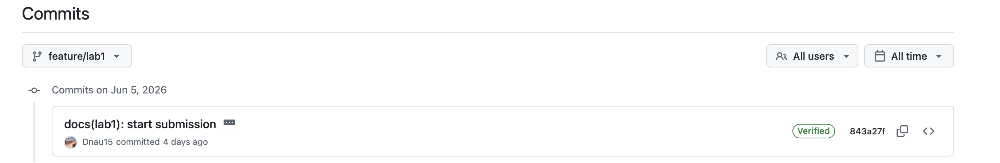
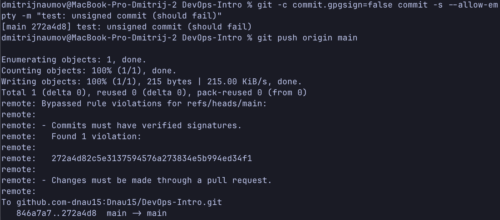

# Lab 1 submission

## Task 1
Request:
```
curl -s http://localhost:8080/health | python3 -m json.tool
```

Answer:
```
{
    "notes": 5,
    "status": "ok"
}
```

Request:
```
curl -s http://localhost:8080/notes  | python3 -m json.tool
```

Answer:
```
[
    {
        "id": 2,
        "title": "Read app/main.go first",
        "body": "Start by understanding the entry point \u2014 env vars, signal handling, graceful shutdown.",
        "created_at": "2026-01-15T10:05:00Z"
    },
    {
        "id": 3,
        "title": "DevOps mantra",
        "body": "If it hurts, do it more often.",
        "created_at": "2026-01-15T10:10:00Z"
    },
    {
        "id": 4,
        "title": "Endpoint cheat-sheet",
        "body": "GET /notes  GET /notes/{id}  POST /notes  DELETE /notes/{id}  GET /health  GET /metrics",
        "created_at": "2026-01-15T10:15:00Z"
    },
    {
        "id": 1,
        "title": "Welcome to QuickNotes",
        "body": "This is the project you'll containerize, deploy, monitor, and harden across all 10 labs.",
        "created_at": "2026-01-15T10:00:00Z"
    }
]
```

Request:
```
curl -s -X POST http://localhost:8080/notes \
  -H 'Content-Type: application/json' \
  -d '{"title":"hello","body":"first POST"}' | python3 -m json.tool
```

Answer:
```
{
    "id": 5,
    "title": "hello",
    "body": "first POST",
    "created_at": "2026-06-05T10:51:13.503497Z"
},
```

```
git log --show-signature -1

commit 843a27f3ade36ea41d723f168fb3f8c9c1f7b70c (HEAD -> feature/lab1, origin/feature/lab1)
Good "git" signature for 15dnau@gmail.com with ED25519 key SHA256:k0n7/mx/uRX52s/zu9pxaN+h/IKnBJzcnuybJgthVkM
Author: Dmitrii <15dnau@gmail.com>
Date:   Fri Jun 5 14:03:50 2026 +0300

    docs(lab1): start submission

    Signed-off-by: Dmitrii <15dnau@gmail.com>
```

### Verified commit



When we work with Github we trust that commit made by Dmitrii was actually made by Dmitrii. However Git itself does not verify commit's author. Anyone can set any name and make a commit, therefore we want commits to be verified.

### GitHub Community
Why starring repositories matters in open source
For a project, stars are a signal of trust and relevance. Moreover, starring is something like bookmarking a repository.

How following developers helps in team projects and professional growth
Following your colleagues on GitHub gives you a low-noise feed of their activity 

## Bonus

Knight Capital's deploy day involved pushing untested code to production servers without proper controls - a process that took only 45 minutes to lose $440 million. With required signed commits on the production branch, every deployment would have been cryptographically tied to a specific engineer, making it immediately clear who pushed what and when. Branch protection with required pull requests would have forced at least one reviewer to approve the change before it reached production, likely catching the misconfiguration before deployment. Linear history requirement would have also made the sequence of changes transparent and auditable, turning a chaotic incident into a traceable, preventable event.