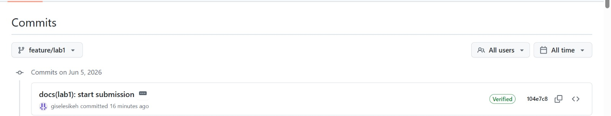
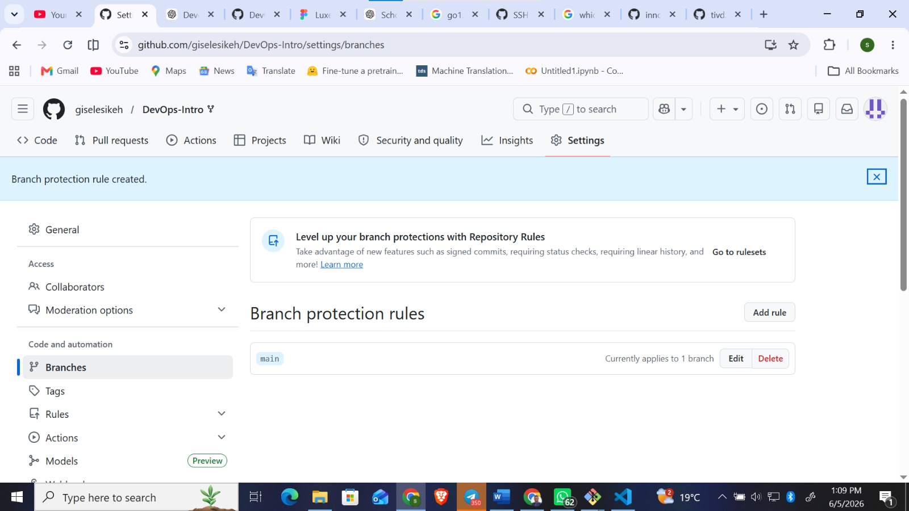

# Lab 1 Submission

## Task 1 — SSH Commit Signing and QuickNotes Run

### QuickNotes run

I ran the QuickNotes application locally from the `app/` directory using:

```bash
cd app
go run .
```

The server started successfully and printed:

```text
quicknotes listening on :8080 (notes loaded: 4)
```

### Health endpoint

Command:

```bash
curl -s http://localhost:8080/health | python -m json.tool
```

Output:

```json
{
    "notes": 4,
    "status": "ok"
}

```

### Notes endpoint

Command:

```bash
curl -s http://localhost:8080/notes | python -m json.tool
```

Output:

```json
[
    {
        "id": 1,
        "title": "Welcome to QuickNotes",
        "body": "This is the project you'll containerize, deploy, monitor, and harden across all 10 labs.",
        "created_at": "2026-01-15T10:00:00Z"
    },
    {
        "id": 2,
        "title": "Read app/main.go first",
        "body": "Start by understanding the entry point \u00e2\u20ac\u201d env vars, signal handling, graceful shutdown.",
        "created_at": "2026-01-15T10:05:00Z"
    },
    {
        "id": 3,
        "title": "DevOps mantra",
        "body": "If it hurts, do it more often.",
        "created_at": "2026-01-15T10:10:00Z"
    },
    {
        "id": 4,
        "title": "Endpoint cheat-sheet",
        "body": "GET /notes  GET /notes/{id}  POST /notes  DELETE /notes/{id}  GET /health  GET /metrics",
        "created_at": "2026-01-15T10:15:00Z"
    }
]

```

### POST /notes endpoint

Command:

```bash
curl -s -X POST http://localhost:8080/notes \
  -H 'Content-Type: application/json' \
  -d '{"title":"hello","body":"first POST"}' | python -m json.tool
```

Output:

```json
{
    "id": 5,
    "title": "hello",
    "body": "first POST",
    "created_at": "2026-06-05T08:21:48.7039563Z"
}

```

### Signature verification

Command:

```bash
git log --show-signature -1
```

Output:

```text
commit 104e7c8472e6e3f0e18e0538d115a271ac3ff255 (HEAD -> feature/lab1)
Good "git" signature for giselesikeh17@gmail.com with ED25519 key SHA256:pUth00w97iamHSgYiurlLAxO+foOF8m/sj25saSc0mU
Author: giselesikeh <giselesikeh17@gmail.com>
Date:   Fri Jun 5 11:40:14 2026 +0300

    docs(lab1): start submission

    Signed-off-by: giselesikeh <giselesikeh17@gmail.com>

```

### Verified badge

The commit `docs(lab1): start submission` on the `feature/lab1` branch shows the green `Verified` badge on GitHub.



### Why signed commits matter

Signed commits help reviewers confirm that a commit was created by the holder of a trusted cryptographic key, rather than by someone only using the same name or email. This matters for software supply-chain security because attackers can try to introduce malicious changes into trusted projects, as seen in the xz-utils backdoor case discussed in Lecture 1. Requiring signed commits gives teams stronger evidence about code provenance before accepting changes.

## Task 2 — Pull Request Template

I added the GitHub pull request template at:

```text
.github/pull_request_template.md
```

The template includes sections for the PR goal, changes, testing, and checklist. This makes reviews more structured and helps confirm that commits are signed and the correct lab submission file was updated.

## Task 3 — GitHub Community Engagement

I starred the course repository and the `simple-container-com/api` repository. I also followed the professor, the TAs, and at least three classmates.

Starring repositories helps bookmark useful projects and increases their visibility in the open-source community. Following developers helps me discover their work, learn from their activity, and build professional connections for future collaboration.

## Bonus Task — Branch Protection and Required Signed Commits

I configured branch protection on my fork's `main` branch with the following rules enabled:

- Require signed commits
- Require a pull request before merging
- Require linear history



To test the rule, I created an unsigned empty commit and tried to push it directly to `main`:

```bash
git commit --no-gpg-sign -s --allow-empty -m "test: unsigned commit should fail"
git push origin main
```

GitHub rejected the push with this message:

```text
remote: Bypassed rule violations for refs/heads/main:
remote:
remote: - Commits must have verified signatures.
remote:
remote: Found 1 violation:
remote:
remote: 4c47506d9eacc2d506e7eef7036cdaf76fc3d90
remote:
remote: - Changes must be made through a pull request.
```

If Knight Capital had used a protected production deployment branch with required signed commits and pull-request review, the risky release would have had stronger gates before reaching production. Branch protection would not solve every deployment problem by itself, but it would make unauthorized or unreviewed changes harder to ship. Combined with automated deployment checks, staged rollout, and rollback mechanisms, it would have reduced the chance of one missed or inconsistent server causing a major incident.


