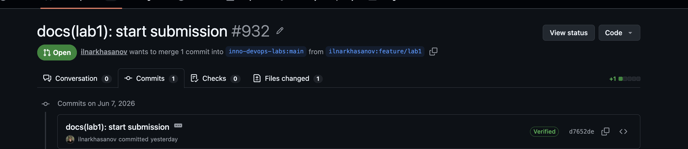

# Lab 1 submission

## `curl` outputs

Input:

`curl -s http://localhost:8080/health | python3 -m json.tool`

Output:

```sh
{
    "notes": 4,
    "status": "ok"
}
```

Input:

```sh
curl -s http://localhost:8080/notes  | python3 -m json.tool
```

Output:

```sh
[
    {
        "id": 1,
        "title": "Welcome to QuickNotes",
        "body": "This is the project you'll containerize, deploy, monitor, and harden across all 10 labs.",
        "created_at": "2026-01-15T10:00:00Z"
    },
    {
        "id": 2,
        "title": "Read app/main.go first",
        "body": "Start by understanding the entry point \u2014 env vars, signal handling, graceful shutdown.",
        "created_at": "2026-01-15T10:05:00Z"
    },
    {
        "id": 3,
        "title": "DevOps mantra",
        "body": "If it hurts, do it more often.",
        "created_at": "2026-01-15T10:10:00Z"
    },
    {
        "id": 4,
        "title": "Endpoint cheat-sheet",
        "body": "GET /notes  GET /notes/{id}  POST /notes  DELETE /notes/{id}  GET /health  GET /metrics",
        "created_at": "2026-01-15T10:15:00Z"
    }
]
```

## Log outputs

```
commit 8821e5be0ef113c5d974ed6b182bd36ee4ab5482 (HEAD -> feature/lab1)
Good "git" signature for 4sitescarp@gmail.com with RSA key SHA256:L9YcU19uqANokeYEFcfoGcw1x+8iay2DQmOf7/L64lM
Author: ilnarkhasanov <4sitescarp@gmail.com>
Date:   Sun Jun 7 14:54:44 2026 +0300

    docs(lab1): replace submission directory

    Signed-off-by: ilnarkhasanov <4sitescarp@gmail.com>
```

## Signed commit proof



## Explanation on why signed commits matter

Based on `xz-utils`, the key thing is the following: signed commits can verify the origin of the commit. There can be no other evidence that commit was done by someone who is not a maintainer. In that case one persona was maintaining the repo for 2 years and got privileges. Then they added the vulnerability using signed commits. This case shows that signed commits can help to locate the origin of problem, but do not solve the problem itself.
