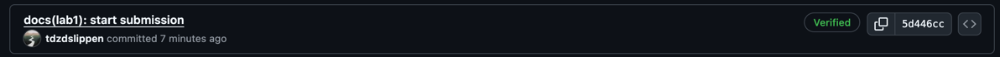
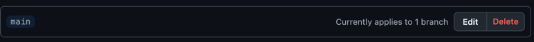
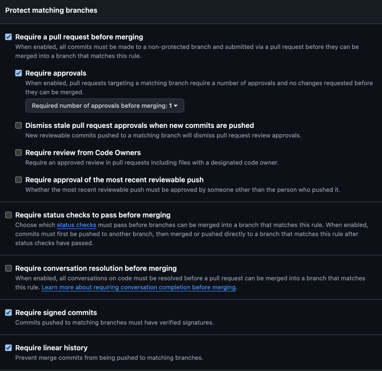

# Lab 1 submission

## 1.5 Document

### Output of curl against /health, /notes, and POST /notes

```json
curl -s http://localhost:8080/health | python3 -m json.tool
curl -s http://localhost:8080/notes  | python3 -m json.tool
curl -s -X POST http://localhost:8080/notes \
  -H 'Content-Type: application/json' \
  -d '{"title":"hello","body":"first POST"}' | python3 -m json.tool
{
    "notes": 4,
    "status": "ok"
}
[
    {
        "id": 1,
        "title": "Welcome to QuickNotes",
        "body": "This is the project you'll containerize, deploy, monitor, and harden across all 10 labs.",
        "created_at": "2026-01-15T10:00:00Z"
    },
    {
        "id": 2,
        "title": "Read app/main.go first",
        "body": "Start by understanding the entry point \u2014 env vars, signal handling, graceful shutdown.",
        "created_at": "2026-01-15T10:05:00Z"
    },
    {
        "id": 3,
        "title": "DevOps mantra",
        "body": "If it hurts, do it more often.",
        "created_at": "2026-01-15T10:10:00Z"
    },
    {
        "id": 4,
        "title": "Endpoint cheat-sheet",
        "body": "GET /notes  GET /notes/{id}  POST /notes  DELETE /notes/{id}  GET /health  GET /metrics",
        "created_at": "2026-01-15T10:15:00Z"
    }
]
{
    "id": 5,
    "title": "hello",
    "body": "first POST",
    "created_at": "2026-06-08T05:24:33.967393Z"
}
```
### Output of git log --show-signature -1
```bash
commit 5d446cc4ffa4ffa79cb98aa996f1986832ca1f26 (HEAD -> feature/lab1, origin/feature/lab1)
Good "git" signature for avlaptev@avito.ru with ED25519 key SHA256:exUDMmioM811FWmw8zr69z++b06Ukg8jWy2eA4V+Rtk
Author: tdzdslippen <avlaptev@avito.ru>
Date:   Mon Jun 8 09:02:15 2026 +0300

    docs(lab1): start submission
```
### A screenshot of the Verified badge on your platform's PR/commit page


### Why signed commits matter

Signed commits matter because anyone can set any name and email in Git, so an unsigned commit does not prove who actually created it. A signed commit is a cryptographic proof that the commit was made by the holder of a specific key, which helps reviewers trust the source of changes. The xz-utils incident in March 2024 showed why this matters: an attacker maintained the project for years and introduced a backdoor that nearly compromised SSH on Linux systems.

## GitHub Community

I starred the required repositories and followed the professor, TAs, and at least three classmates.

Stars help developers bookmark useful projects and show maintainers that their work is useful. Following developers helps track their public work, discover useful repositories, and build professional connections.

## Bonus Task


