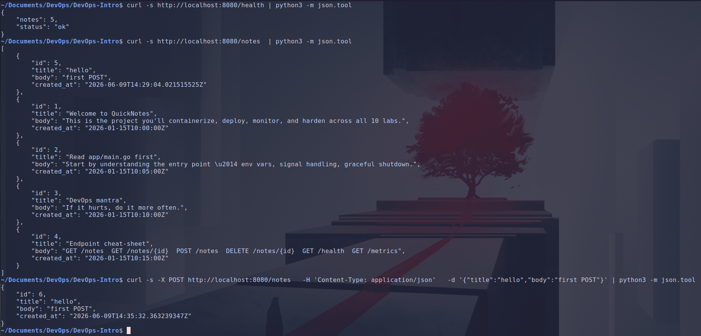
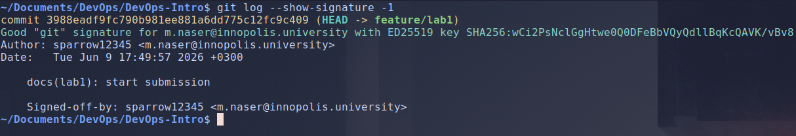
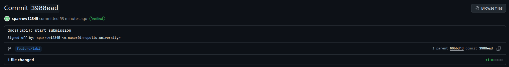
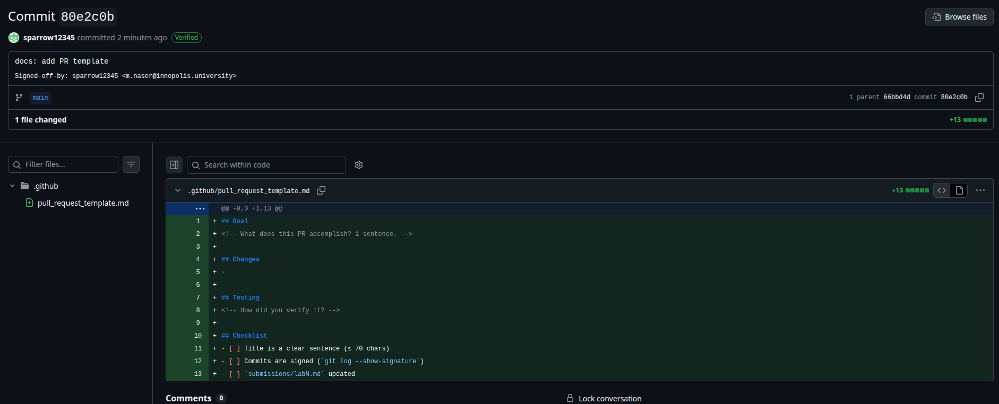

# Lab 1 submission

## Task 1: SSH Commit Signing & First Signed Commit

### `curl` output

### `git log` output

### Verification output

### *why signed commits matter*

Signing a commit cryptographically ties it to an identity, so a reviewer can check that a change really came from the person it claims to, not from someone who just set user.name and user.email to impersonate them. Git makes this easy to fake.
By default, anyone can author a commit. Looking at the xz-utils backdoor: an attacker using the name "Jia Tan" spent months building maintainer trust, then buried a backdoor in a compression library that ships in most Linux distros.
Require signing, keep a record of who signed what, and an unexpected or unverifiable commit sticks out instead of blending into the history. That alone won't stop a determined attacker, but it raises the cost.

## Task 2: Pull Request Template & First PR

## Task 3: GitHub Community Engagement

- **Why starring repositories matters in open source:**

    Starring is both a bookmark and a signal: it saves a project to your profile for later and publicly endorses it, and aggregate star counts act as a rough trust/popularity signal that helps others discover worthwhile tools and motivates maintainers who mostly work for free.

- **How following developers helps in team projects and professional growth:**

    Following developers turns GitHub into a feed of what your teammates and the wider community are building, you see their new projects and activity, which makes it easier to coordinate on team work, learn from how others structure code, and build the professional network that carries past a single course.
