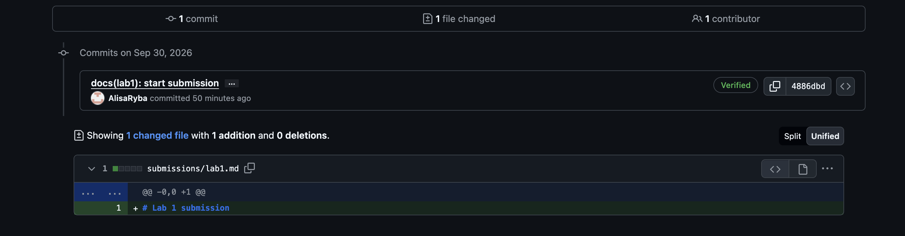

# Lab 1 Submission

## Task 1 — QuickNotes and SSH Commit Signing

### 1. Environment

QuickNotes was launched locally from the `app/` directory using:

```bash
go run .
```

The application was available on:

```text
http://localhost:8080
```

The API was tested using `curl`.

---

### 2. Health Check

To verify that the QuickNotes service was running correctly, I sent a request to the `/health` endpoint:

```bash
curl -s http://localhost:8080/health | python3 -m json.tool
```

Output:

```json
{
    "notes": 4,
    "status": "ok"
}
```

The response confirms that the service is running successfully (`"status": "ok"`) and initially contains 4 notes.

---

### 3. GET `/notes`

To retrieve all existing notes, I sent a `GET` request to the `/notes` endpoint:

```bash
curl -s http://localhost:8080/notes | python3 -m json.tool
```

Output:

```json
[
    {
        "id": 1,
        "title": "Welcome to QuickNotes",
        "body": "This is the project you'll containerize, deploy, monitor, and harden across all 10 labs.",
        "created_at": "2026-01-15T10:00:00Z"
    },
    {
        "id": 2,
        "title": "Read app/main.go first",
        "body": "Start by understanding the entry point — env vars, signal handling, graceful shutdown.",
        "created_at": "2026-01-15T10:05:00Z"
    },
    {
        "id": 3,
        "title": "DevOps mantra",
        "body": "If it hurts, do it more often.",
        "created_at": "2026-01-15T10:10:00Z"
    },
    {
        "id": 4,
        "title": "Endpoint cheat-sheet",
        "body": "GET /notes  GET /notes/{id}  POST /notes  DELETE /notes/{id}  GET /health  GET /metrics",
        "created_at": "2026-01-15T10:15:00Z"
    }
]
```

The application initially contained 4 predefined seed notes.

---

### 4. POST `/notes`

To verify that the API supports creating new notes, I sent a `POST` request with a JSON body:

```bash
curl -s -X POST http://localhost:8080/notes \
  -H 'Content-Type: application/json' \
  -d '{"title":"hello","body":"first POST"}' \
  | python3 -m json.tool
```

Output:

```json
{
    "id": 5,
    "title": "hello",
    "body": "first POST",
    "created_at": "2026-09-30T17:38:59.221085Z"
}
```

The server successfully created a new note and assigned it ID `5`.

---

### 5. Verification after POST

After creating the new note, I requested the `/notes` endpoint again:

```bash
curl -s http://localhost:8080/notes | python3 -m json.tool
```

Output:

```json
[
    {
        "id": 3,
        "title": "DevOps mantra",
        "body": "If it hurts, do it more often.",
        "created_at": "2026-01-15T10:10:00Z"
    },
    {
        "id": 4,
        "title": "Endpoint cheat-sheet",
        "body": "GET /notes  GET /notes/{id}  POST /notes  DELETE /notes/{id}  GET /health  GET /metrics",
        "created_at": "2026-01-15T10:15:00Z"
    },
    {
        "id": 5,
        "title": "hello",
        "body": "first POST",
        "created_at": "2026-09-30T17:38:59.221085Z"
    },
    {
        "id": 1,
        "title": "Welcome to QuickNotes",
        "body": "This is the project you'll containerize, deploy, monitor, and harden across all 10 labs.",
        "created_at": "2026-01-15T10:00:00Z"
    },
    {
        "id": 2,
        "title": "Read app/main.go first",
        "body": "Start by understanding the entry point — env vars, signal handling, graceful shutdown.",
        "created_at": "2026-01-15T10:05:00Z"
    }
]
```

The second `GET /notes` request shows 5 notes, confirming that the `POST` operation successfully changed the application state.

The order of notes in the response is different from the initial request, but this does not affect the result because the API still returned all five notes, including the newly created note with ID `5`.

---

### 6. SSH Commit Signing Configuration

Git was configured to use SSH keys for commit signing.

Command:

```bash
git config --global --list
```

Output:

```text
user.name=AlisaRyba
user.email=evdosenko.dds@gmail.com
user.signingkey=/Users/alisaevdosenko/.ssh/id_ed25519.pub
gpg.format=ssh
commit.gpgsign=true
gpg.ssh.allowedsignersfile=/Users/alisaevdosenko/.ssh/allowed_signers
```

The important settings are:

- `gpg.format=ssh` — tells Git to use SSH signatures instead of GPG signatures;
- `user.signingkey` — specifies the public SSH key associated with the signing key;
- `commit.gpgsign=true` — enables automatic commit signing;
- `gpg.ssh.allowedSignersFile` — specifies the list of trusted SSH public keys used for local signature verification.

The first Lab 1 commit was created with:

```bash
git commit -S -s -m "docs(lab1): start submission"
```

Commit hash:

```text
4886dbd382317fb9ccd72e0186ed211083aebc15
```

The `-S` option creates a cryptographic signature for the commit, while `-s` adds the `Signed-off-by` line to the commit message.

These two mechanisms have different purposes: the SSH signature provides cryptographic verification, while `Signed-off-by` is a declaration recorded in the commit message.

---

### 7. Local Signature Verification

To verify the commit signature locally, I used:

```bash
git log --show-signature -1
```

Output:

```text
commit 4886dbd382317fb9ccd72e0186ed211083aebc15 (HEAD -> feature/lab1, origin/feature/lab1)
Good "git" signature for evdosenko.dds@gmail.com with ED25519 key SHA256:Q7ijWjKndttr1JGzwLbdqqHIBHBt92SVt6n1rI2AxEA
Author: AlisaRyba <evdosenko.dds@gmail.com>
Date:   Wed Sep 30 20:54:15 2026 +0300

    docs(lab1): start submission

    Signed-off-by: AlisaRyba <evdosenko.dds@gmail.com>
```

The important line is:

```text
Good "git" signature for evdosenko.dds@gmail.com with ED25519 key SHA256:Q7ijWjKndttr1JGzwLbdqqHIBHBt92SVt6n1rI2AxEA
```

This confirms that the commit contains a valid SSH signature and that Git was able to verify it using the configured `allowed_signers` file.

---

### 8. Push to GitHub

The `feature/lab1` branch was pushed to the remote repository using:

```bash
git push -u origin feature/lab1
```

Output:

```text
Enter passphrase for key '/Users/alisaevdosenko/.ssh/id_ed25519':
Enumerating objects: 5, done.
Counting objects: 100% (5/5), done.
Delta compression using up to 15 threads
Compressing objects: 100% (2/2), done.
Writing objects: 100% (4/4), 596 bytes | 596.00 KiB/s, done.
Total 4 (delta 1), reused 0 (delta 0), pack-reused 0 (from 0)
remote: Resolving deltas: 100% (1/1), completed with 1 local object.
remote:
remote: Create a pull request for 'feature/lab1' on GitHub by visiting:
remote:      https://github.com/AlisaRyba/DevOps-Intro/pull/new/feature/lab1
remote:
To github.com:AlisaRyba/DevOps-Intro.git
 * [new branch]      feature/lab1 -> feature/lab1
branch 'feature/lab1' set up to track 'origin/feature/lab1'.
```

The push completed successfully.

The local branch:

```text
feature/lab1
```

is now configured to track:

```text
origin/feature/lab1
```

Because the upstream tracking relationship was created with `-u`, future pushes from this branch can be performed simply with:

```bash
git push
```

---

### 9. GitHub Verified Commit

After pushing the branch to GitHub, the signed commit should display the `Verified` badge.

Screenshot:

```text

```

The `Verified` badge demonstrates that GitHub was able to verify the cryptographic signature associated with the commit.

---

### 10. Why Signed Commits Matter

Signed commits make it possible to cryptographically verify that a commit was created by a holder of a particular private key and that the signed commit data has not been modified after signing. This is especially important for software supply-chain security: incidents such as the 2024 `xz-utils` backdoor demonstrate why the provenance and integrity of software changes must be verifiable. Commit signing does not prove that the code itself is safe, but it provides an additional layer of traceability, accountability, and integrity verification.

---

## Task 2 — Pull Request Template

### 1. Pull Request Template

A Pull Request template was created at:

```text
.github/pull_request_template.md
```

The template contains the following sections:

- `Goal` — describes the purpose of the Pull Request;
- `Changes` — lists the changes introduced by the PR;
- `Testing` — explains how the changes were verified;
- `Checklist` — provides a final self-check before submitting the PR.

The contents of the template were verified with:

```bash
cat .github/pull_request_template.md
```

Output:

```text
## Goal
<!-- What does this PR accomplish? 1 sentence. -->

## Changes
-

## Testing
<!-- How did you verify it? -->

## Checklist
- [ ] Title is a clear sentence (≤ 70 chars)
- [ ] Commits are signed (`git log --show-signature`)
- [ ] `submissions/labN.md` updated
```

The Pull Request template helps standardize PR descriptions and makes code review easier because reviewers can immediately see the purpose of the change, what was modified, and how the changes were tested.

### 2. Template Commit

The template was committed to the `main` branch of my fork and pushed to GitHub.

The commit was SSH-signed in the same way as the Lab 1 submission commits.

To verify the signature locally, the following command can be used:

```bash
git log --show-signature -1
```

The expected result contains:

```text
Good "git" signature
```

### 3. Pull Request

After completing the laboratory work, the Pull Request is created from:

```text
AlisaRyba:feature/lab1
```

to:

```text
inno-devops-labs:main
```

The PR description should use the structure defined in the Pull Request template:

- Goal
- Changes
- Testing
- Checklist

The checklist is completed before submission to confirm that the title is clear, the commits are signed, and the Lab 1 submission file has been updated.

```text
alisaevdosenko@MacBook-Pro-Alisa DevOps-Intro % git log --show-signature --oneline -5
b00d7e8 (HEAD -> feature/lab1, origin/feature/lab1) Good "git" signature for evdosenko.dds@gmail.com with ED25519 key SHA256:Q7ijWjKndttr1JGzwLbdqqHIBHBt92SVt6n1rI2AxEA
docs(lab1): document task 1
4886dbd Good "git" signature for evdosenko.dds@gmail.com with ED25519 key SHA256:Q7ijWjKndttr1JGzwLbdqqHIBHBt92SVt6n1rI2AxEA
docs(lab1): start submission
bad2887 (upstream/main, upstream/HEAD) Good "git" signature with ED25519 key SHA256:0cwLoNGahihJuXWFSCl5sAOX6EvXIfFHYf0uslyOECI
No principal matched.
docs(lab10): add GitHub Codespaces as Task 2 fallback for Render
c42ec18 Good "git" signature with ED25519 key SHA256:0cwLoNGahihJuXWFSCl5sAOX6EvXIfFHYf0uslyOECI
No principal matched.
docs(lab10): move Task 2 from Hugging Face Spaces to Render free tier
9f41b7d Good "git" signature with ED25519 key SHA256:0cwLoNGahihJuXWFSCl5sAOX6EvXIfFHYf0uslyOECI
No principal matched.
docs(lab7): make seed.json shipping explicit; require bonus artifacts, not logs
alisaevdosenko@MacBook-Pro-Alisa DevOps-Intro %
```

---

## Task 3 — GitHub Community

As part of the GitHub Community task, I starred the required repositories and followed the professor, teaching assistants, and classmates.

GitHub Stars are useful in open-source communities because they help users bookmark interesting repositories and also provide a visible indication of community interest in a project. Following developers makes it easier to discover their projects and activity, which can support collaboration, knowledge sharing, and professional growth in team-based engineering environments.

---

## Bonus — Branch Protection

To be completed if the bonus task is performed.
