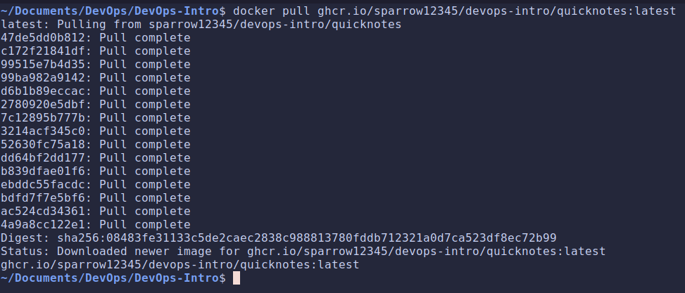
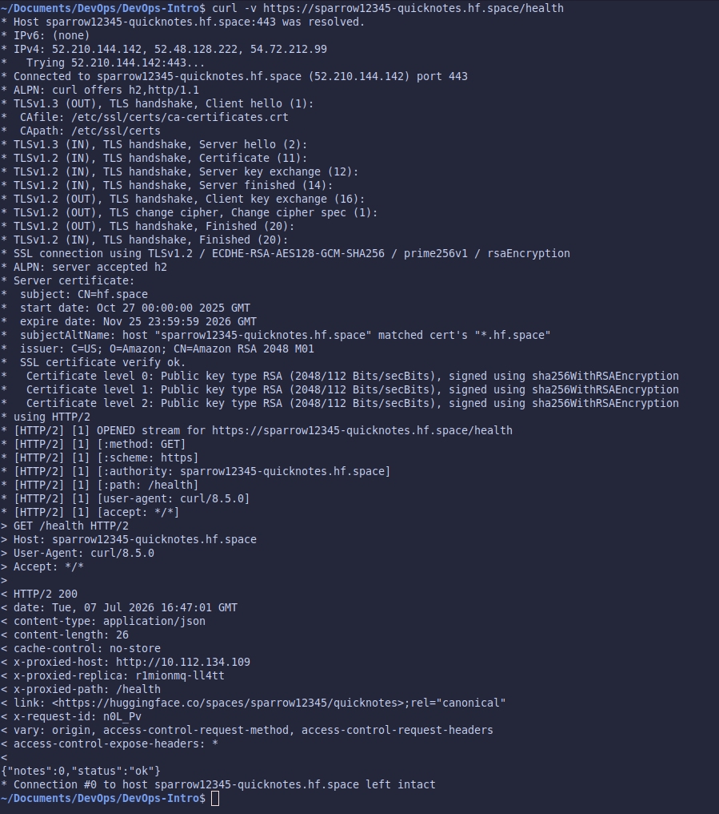
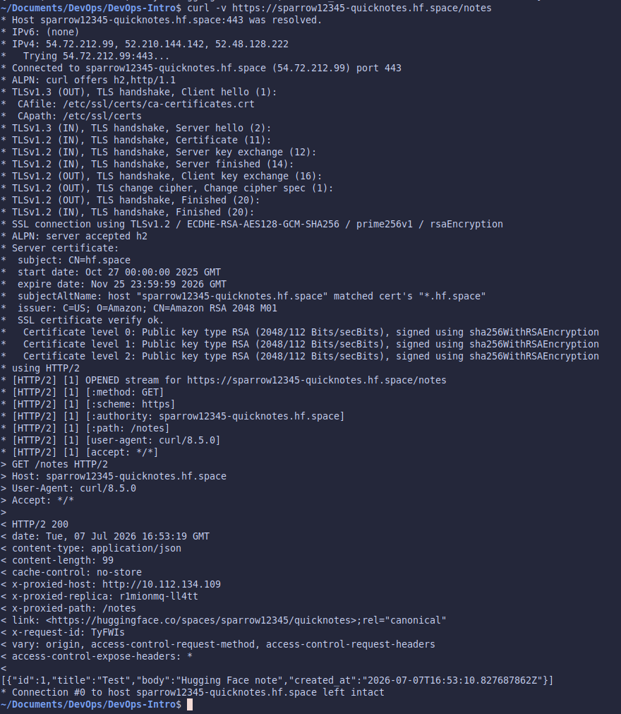
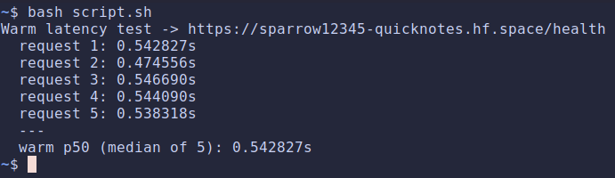
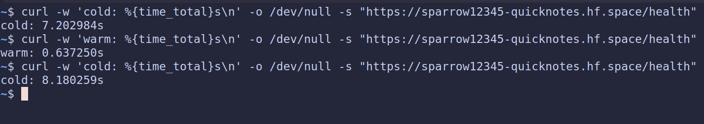

# Lab 10 submission

## Task 1: CI-Automated Push to `ghcr.io`

### Workflow

[**Release workflow**](https://github.com/sparrow12345/DevOps-Intro/blob/feature/lab10/.github/workflows/release.yml)

### Registry URL + successful pull

[**URL**](https://github.com/sparrow12345/DevOps-Intro/pkgs/container/devops-intro%2Fquicknotes)

### Green CI release

[**Green CI**](https://github.com/sparrow12345/DevOps-Intro/actions/runs/28874946885/job/85647391280)

### Design questions

- **OIDC vs `GITHUB_TOKEN` — for pushing to ghcr.io from the same repo, `GITHUB_TOKEN` with `packages: write` is enough. When would you reach for OIDC instead, and what does it give you that `GITHUB_TOKEN` doesn't?**

    For this lab `GITHUB_TOKEN` is enough, since ghcr.io is on GitHub and the token's already trusted there. We'd switch to OIDC when pushing to another cloud like AWS ECR, so we don't have to store a long-lived password in the repo. OIDC lets the workflow prove who it is and get a short-lived credential back instead.

- **`:latest` tag vs `:v0.1.0` immutable tag — Lab 6 covered why `:latest` is mutable. So why do you still ship a `:latest` tag alongside the immutable one in production releases?**

    `:latest` is mutable, so it's not safe to pin a real deploy to it. But it's convenient, people can pull without knowing the version number. So we ship both: `:v0.1.0` for actual deploys, `:latest` as the "newest" shortcut.

- **`packages:` write scope only — what's the principle, and what concrete attack does the narrow scope prevent vs `write: all`?**

    Least privilege, give the job only what it needs. With `write: all`, a malicious action or dependency could push commits or edit issues/releases. Locked to `packages: write`, the worst it can do is push an image, not touch the code.

## Task 2: Deploy to Hugging Face Spaces

### Space URL + `curl -v` health check

[**HF Space**](https://huggingface.co/spaces/sparrow12345/quicknotes)

## Space repo's `Dockerile` & `README.md`

- [**Dockerfile**](https://github.com/sparrow12345/DevOps-Intro/blob/feature/lab10/cloud/Dockerfile)

- [**README**](https://github.com/sparrow12345/DevOps-Intro/blob/feature/lab10/cloud/README.md)

## Warm p50 latency

## Cold latencies

## Design questions

- **HF Spaces "sleep" vs Cloud Run "scale to zero" — same idea, different orders of magnitude. Why is HF's wake so much slower? What does the platform optimize for differently?**

    Same idea: shut down to zero when idle, start back up on the next request. HF wakes slowly because it re-pulls the whole image and boots a full container on free shared hardware, they're optimizing for cheap, not fast. Cloud Run is a paid product that keeps the image cached and uses a fast sandbox, so it starts in under a second.

- **Why does the Space need `app_port: 8080`? What's HF's default and why do they default to that?**

    HF defaults to port 7860, but QuickNotes listens on 8080. Without setting it, HF's proxy hits 7860 where nothing runs and the Space looks broken. `app_port: 8080` points the proxy at the right port.

- **You pulled the image from ghcr.io into the Space. What's the trade-off vs building the Dockerfile inside the Space?**

    I pull the image CI already built instead of rebuilding in the Space.
    - **Good:** it's the exact image that passed CI, and no build step means a fast deploy.
    - **Bad:** I can't debug the build inside HF, and I depend on ghcr staying reachable. Building in-Space would let me debug and use HF's cache, but it could drift from CI. I picked pulling for the consistency.
