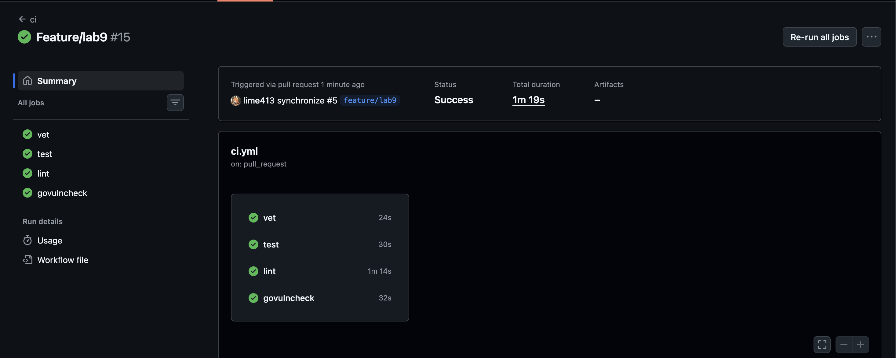
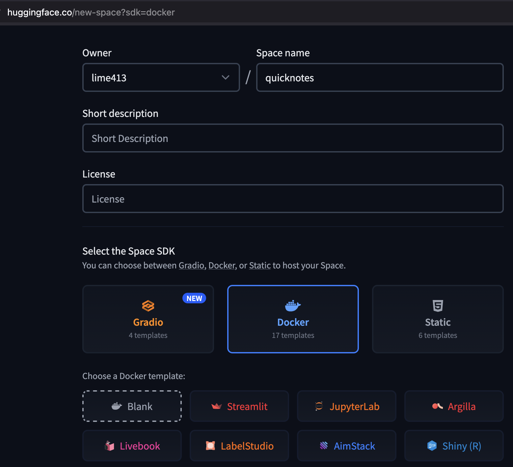
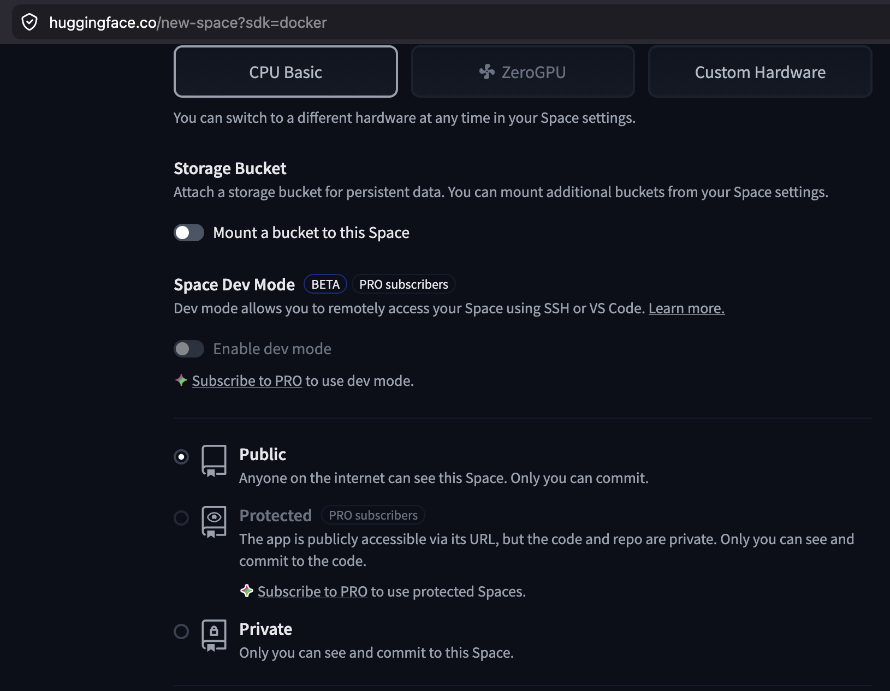
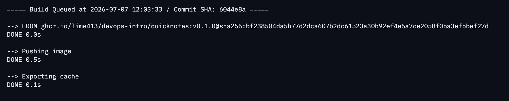
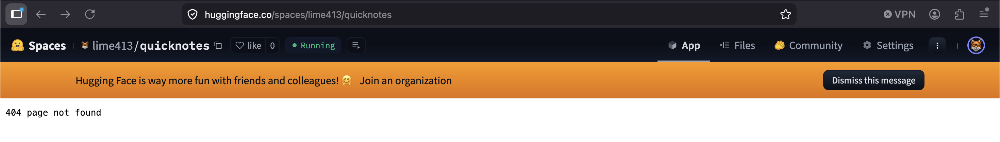
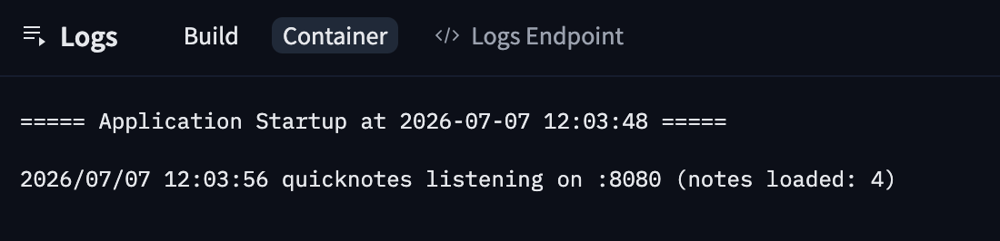

# Lab 10 submission

## Task 1 - CI automated push to GHCR

### What I changed

I added a dedicated release workflow at `.github/workflows/release.yml`. The workflow starts on Git tag pushes that match `v*`, builds the QuickNotes image from `app/`, logs in to `ghcr.io` with `GITHUB_TOKEN`, and pushes two tags: the Git tag itself and `latest`.

I also restored the Lab 3 CI workflow in `.github/workflows/ci.yml` because Lab 10 assumes that CI already exists. This branch now has the minimum base required by the lab: regular CI from Lab 3 and container packaging from Lab 6.

### Release workflow

File: `.github/workflows/release.yml`

Key implementation points:
- trigger on `push.tags: v*`
- minimum workflow permissions: `contents: read`, `packages: write`
- third-party actions pinned by full 40-character SHA
- image name derived from the real repository path in lowercase
- Docker tags published as both version tag and `latest`

### Command output

#### Docker availability on the local machine

```text
$ docker --version
Docker version 29.6.0, build fb59821d45
```

#### Go tests before release automation changes

```text
$ cd app && go test ./...
ok  	quicknotes	0.709s
?   	quicknotes/cmd/healthcheck	[no test files]
```

#### Exact action SHAs used in the workflow

```text
$ git ls-remote https://github.com/actions/checkout refs/tags/v6.0.3
9f698171ed81b15d1823a05fc7211befd50c8ae0	refs/tags/v6.0.3

$ git ls-remote https://github.com/docker/setup-buildx-action refs/tags/v3.11.1
e468171a9de216ec08956ac3ada2f0791b6bd435	refs/tags/v3.11.1

$ git ls-remote https://github.com/docker/login-action refs/tags/v3.6.0
5e57cd118135c172c3672efd75eb46360885c0ef	refs/tags/v3.6.0

$ git ls-remote https://github.com/docker/metadata-action refs/tags/v5.8.0
c1e51972afc2121e065aed6d45c65596fe445f3f	refs/tags/v5.8.0

$ git ls-remote https://github.com/docker/build-push-action refs/tags/v6.19.0
ee4ca427a2f43b6a16632044ca514c076267da23	refs/tags/v6.19.0
```

### Manual release steps still required

The steps below require GitHub access, so they must be done after pushing this branch:

```bash
git push -u origin feature/lab10
git push origin v0.1.0
```

The signed tag `v0.1.0` is already created locally on the Lab 10 commit.

```text
$ git tag -v v0.1.0
Good "git" signature for limefox413@gmail.com with ED25519 key SHA256:uILBmFloXYwLzB7ZEV76znUjoz28KKEF7OZWNJr7Jio
tag v0.1.0

Lab 10 release
```

After the workflow finishes:

```bash
docker pull ghcr.io/lime413/devops-intro/quicknotes:v0.1.0
docker pull ghcr.io/lime413/devops-intro/quicknotes:latest
```

If the first pull fails without authentication, the package visibility on GitHub must be changed to **Public** once in the package UI.
In my case, the package was already public, so no visibility change was needed.

### Evidence to paste after the manual GitHub run

```text
Release workflow run URL:
https://github.com/lime413/DevOps-Intro/actions/runs/28861442815

GHCR package URL:
https://github.com/lime413/DevOps-Intro/pkgs/container/devops-intro%2Fquicknotes

Clean pull output:
tatyana@Tatyanas-MacBook-Air DevOps-Intro copy % docker rmi ghcr.io/lime413/devops-intro/quicknotes:v0.1.0
Untagged: ghcr.io/lime413/devops-intro/quicknotes:v0.1.0
tatyana@Tatyanas-MacBook-Air DevOps-Intro copy % docker rmi ghcr.io/lime413/devops-intro/quicknotes:latest
Untagged: ghcr.io/lime413/devops-intro/quicknotes:latest
Deleted: sha256:bf238504da5b77d2dca607b2dc61523a30b92ef4e5a7ce2058f0ba3efbbef27d
tatyana@Tatyanas-MacBook-Air DevOps-Intro copy % docker pull ghcr.io/lime413/devops-intro/quicknotes:v0.1.0
v0.1.0: Pulling from lime413/devops-intro/quicknotes
990a9c434e5e: Pull complete
7c12895b777b: Pull complete
99514eb0c003: Pull complete
3214acf345c0: Pull complete
875ea9878944: Pull complete
52630fc75a18: Pull complete
39dc083afc39: Pull complete
dd64bf2dd177: Pull complete
bf7a4185f015: Pull complete
b839dfae01f6: Pull complete
2780920e5dbf: Pull complete
dcaa5a89b0cc: Pull complete
71a727d8ed44: Pull complete
069d1e267530: Pull complete
e07f673c5da8: Pull complete
Digest: sha256:bf238504da5b77d2dca607b2dc61523a30b92ef4e5a7ce2058f0ba3efbbef27d
Status: Downloaded newer image for ghcr.io/lime413/devops-intro/quicknotes:v0.1.0
ghcr.io/lime413/devops-intro/quicknotes:v0.1.0
tatyana@Tatyanas-MacBook-Air DevOps-Intro copy % docker pull ghcr.io/lime413/devops-intro/quicknotes:latest
latest: Pulling from lime413/devops-intro/quicknotes
Digest: sha256:bf238504da5b77d2dca607b2dc61523a30b92ef4e5a7ce2058f0ba3efbbef27d
Status: Downloaded newer image for ghcr.io/lime413/devops-intro/quicknotes:latest
ghcr.io/lime413/devops-intro/quicknotes:latest
```

### Analysis

The release workflow follows the lab requirements closely. Tag-based publishing keeps normal branch pushes separate from releases, which is safer and easier to audit. Full SHA pinning reduces supply-chain risk in the workflow itself because the pipeline does not silently move to a different third-party action revision.

Using `packages: write` without broader write access applies least privilege. If a workflow token is exposed inside a step, that narrow scope limits the damage: the token can publish a package, but it cannot modify repository contents or change unrelated resources.

Publishing both the immutable version tag and `latest` serves two different consumers. Automation and rollback logic should use the immutable version tag, while humans often want a fast way to pull the newest released image during testing or demos.

### Design questions

#### a) OIDC vs `GITHUB_TOKEN`

For `ghcr.io` in the same repository, `GITHUB_TOKEN` with `packages: write` is enough because GitHub already trusts the workflow identity inside that repository. I would use OIDC when the workflow needs to authenticate to an external cloud platform such as AWS, GCP, or Azure without storing long-lived secrets. OIDC gives short-lived credentials and stronger identity binding between the workflow run and the cloud role.

#### b) `latest` vs immutable version tags

`latest` is useful as a convenience tag for humans and simple environments that always want the newest release. The immutable version tag is the real deployment anchor because it makes rollback, auditing, and reproducibility possible. Shipping both keeps convenience without losing traceability.

#### c) Why only `packages: write`

This follows the principle of least privilege. The workflow only needs to publish a container image, so the token should not be able to change issues, pull requests, repository settings, or repository contents. Narrow scope reduces the blast radius of a compromised action step or a malicious dependency downloaded during the build.

## Task 2 - Deploy to Hugging Face Spaces

### What I prepared

I created the `cloud/` directory with the deployment artifacts needed for the Space repository:

- `cloud/huggingface/Dockerfile`
- `cloud/huggingface/README.md`
- `cloud/teardown.md`

The Dockerfile pulls the published GHCR image instead of rebuilding the application inside the Space. The README contains the required Hugging Face YAML frontmatter, including `sdk: docker` and `app_port: 8080`.
I also set `DATA_PATH=/tmp/notes.json` in the wrapper image because the original Lab 6 container expects the runtime to provide a writable data path. Without that change, the app fails on first boot in a plain container environment.

### Files prepared for the Space repository

#### `cloud/huggingface/Dockerfile`

```Dockerfile
ARG QUICKNOTES_IMAGE=ghcr.io/lime413/devops-intro/quicknotes:v0.1.0
FROM ${QUICKNOTES_IMAGE}

ENV ADDR=:8080 \
    DATA_PATH=/tmp/notes.json \
    SEED_PATH=/seed.json
```

#### `cloud/huggingface/README.md`

```yaml
---
title: QuickNotes
emoji: "📝"
colorFrom: blue
colorTo: green
sdk: docker
app_port: 8080
---
```

### Command output

#### QuickNotes listens on port 8080 by default

```text
$ sed -n '1,80p' app/main.go
addr := envOrDefault("ADDR", ":8080")
```

#### Current GitHub fork used as the registry source

```text
$ git remote -v
origin	https://github.com/lime413/DevOps-Intro.git (fetch)
origin	https://github.com/lime413/DevOps-Intro.git (push)
upstream	git@github.com:inno-devops-labs/DevOps-Intro.git (fetch)
upstream	git@github.com:inno-devops-labs/DevOps-Intro.git (push)
```

#### Why the Space wrapper sets `DATA_PATH`

```text
$ docker run --rm -p 18080:8080 quicknotes:lab10
2026/07/07 10:55:43 seed: mkdir data: permission denied
```

This local check showed that the raw Lab 6 image assumes the runtime injects a writable data directory. The Hugging Face wrapper fixes that by setting `DATA_PATH=/tmp/notes.json`, which is writable in a normal container runtime.

#### Wrapper image validation with a local health check

```text
$ docker build -t quicknotes:hf-test --build-arg QUICKNOTES_IMAGE=quicknotes:lab10 -f cloud/huggingface/Dockerfile cloud/huggingface
Successfully built ad53d2f08b8a
Successfully tagged quicknotes:hf-test

$ docker run -d --rm --name quicknotes-hf-test -p 18081:8080 quicknotes:hf-test
738c807e7e766ef94b8f44297e463b72ed031352d40cde95c657e27f0fbaba51

$ curl -s http://localhost:18081/health
{"notes":4,"status":"ok"}
```

### Manual deployment steps still required

This part needs a real Hugging Face account and a Space, so it cannot be completed from the local repository alone.

1. Create a new public Hugging Face Space with the Docker SDK.
2. Clone the Space repository locally.
3. Copy `cloud/huggingface/Dockerfile` and `cloud/huggingface/README.md` into the root of the Space repository.
4. Push the Space repository to Hugging Face.
5. Verify:

```bash
curl -v https://<your-space>.hf.space/health
curl -s https://<your-space>.hf.space/notes | python3 -m json.tool
```

6. Measure warm latency:

```bash
for i in 1 2 3 4 5; do
  curl -w '%{time_total}\n' -o /dev/null -s https://<your-space>.hf.space/health
done
```

7. After 35+ minutes of idle time, measure cold latency three times:

```bash
curl -w '%{time_total}\n' -o /dev/null -s https://<your-space>.hf.space/health
```

### Evidence to paste after the manual Hugging Face deployment

```text
Space URL:
https://huggingface.co/spaces/lime413/quicknotes

curl -v /health output:
* Host lime413-quicknotes.hf.space:443 was resolved.
* IPv6: (none)
* IPv4: 52.210.144.142, 54.72.212.99, 52.48.128.222
*   Trying 52.210.144.142:443...
* Connected to lime413-quicknotes.hf.space (52.210.144.142) port 443
* ALPN: curl offers h2,http/1.1
* (304) (OUT), TLS handshake, Client hello (1):
*  CAfile: /etc/ssl/cert.pem
*  CApath: none
* (304) (IN), TLS handshake, Server hello (2):
* TLSv1.2 (IN), TLS handshake, Certificate (11):
* TLSv1.2 (IN), TLS handshake, Server key exchange (12):
* TLSv1.2 (IN), TLS handshake, Server finished (14):
* TLSv1.2 (OUT), TLS handshake, Client key exchange (16):
* TLSv1.2 (OUT), TLS change cipher, Change cipher spec (1):
* TLSv1.2 (OUT), TLS handshake, Finished (20):
* TLSv1.2 (IN), TLS change cipher, Change cipher spec (1):
* TLSv1.2 (IN), TLS handshake, Finished (20):
* SSL connection using TLSv1.2 / ECDHE-RSA-AES128-GCM-SHA256 / [blank] / UNDEF
* ALPN: server accepted h2
* Server certificate:
*  subject: CN=hf.space
*  start date: Oct 27 00:00:00 2025 GMT
*  expire date: Nov 25 23:59:59 2026 GMT
*  subjectAltName: host "lime413-quicknotes.hf.space" matched cert's "*.hf.space"
*  issuer: C=US; O=Amazon; CN=Amazon RSA 2048 M01
*  SSL certificate verify ok.
* using HTTP/2
* [HTTP/2] [1] OPENED stream for https://lime413-quicknotes.hf.space/health
* [HTTP/2] [1] [:method: GET]
* [HTTP/2] [1] [:scheme: https]
* [HTTP/2] [1] [:authority: lime413-quicknotes.hf.space]
* [HTTP/2] [1] [:path: /health]
* [HTTP/2] [1] [user-agent: curl/8.7.1]
* [HTTP/2] [1] [accept: */*]
> GET /health HTTP/2
> Host: lime413-quicknotes.hf.space
> User-Agent: curl/8.7.1
> Accept: */*
>
* Request completely sent off
< HTTP/2 200
< date: Tue, 07 Jul 2026 11:53:16 GMT
< content-type: application/json
< content-length: 26
< x-proxied-host: http://10.111.85.248
< x-proxied-replica: vefsx90g-rz4sj
< x-proxied-path: /health
< link: <https://huggingface.co/spaces/lime413/quicknotes>;rel="canonical"
< x-request-id: a8J4ES
< vary: origin, access-control-request-method, access-control-request-headers
< access-control-expose-headers: *
<
{"notes":4,"status":"ok"}
* Connection #0 to host lime413-quicknotes.hf.space left intact

Warm latency samples:
0.694861
1.131063
0.544091
0.411258
0.411120

Warm p50:
0.544091 seconds

Cold latency sample 1:
<PASTE_COLD_SAMPLE_1_HERE>

Cold latency sample 2:
<PASTE_COLD_SAMPLE_2_HERE>

Cold latency sample 3:
<PASTE_COLD_SAMPLE_3_HERE>
```

### Visual evidence

#### GitHub Actions release run



#### Hugging Face Space creation





#### Hugging Face build and runtime state





#### Hugging Face app root response

The Space root page returns `404 page not found`, which is expected because QuickNotes is an API and does not serve `/`.



### Analysis

Pulling the already-built GHCR image into Hugging Face makes the Space deployment smaller and more reproducible. The exact artifact built by GitHub Actions is the artifact deployed in the cloud. This reduces “works in CI but not in production” drift because the Space does not rebuild the application with a separate toolchain.

The key Space settings are `app_port: 8080` and a writable runtime data path. QuickNotes already listens on port 8080, while Hugging Face Docker Spaces default to port 7860 because many Spaces run Gradio apps. It is better to declare the correct port in the Space config and override the runtime data path in the wrapper image than to change the application only for one platform.
I also cloned the real Space repository locally, replaced the placeholder README, added the deployment Dockerfile, and committed the result as `Deploy QuickNotes from GHCR`. The remaining step is an authenticated push to Hugging Face.

### Design questions

#### d) HF sleep vs Cloud Run scale to zero

Both platforms stop idle workloads to save money, but they optimize for different product goals. Hugging Face Spaces on the free tier are designed for low-cost public demos, so wake-up time can include slower image pull and container startup behavior. Cloud Run is designed for production-like request handling, so it invests more in fast cold starts, autoscaling, and request routing.

#### e) Why `app_port: 8080`

QuickNotes listens on port 8080 by default. Hugging Face Spaces often assume port 7860 because that matches Gradio-based apps, which are common on the platform. Without `app_port: 8080`, the platform may route traffic to the wrong internal port and the container can look unhealthy even if the app itself is fine.

#### f) Pull image from GHCR vs build in the Space

Pulling from GHCR improves reproducibility because GitHub Actions builds the release artifact once and the Space runs that exact image. It also makes debugging release history easier because the image tag directly matches the release tag. Building inside the Space can be simpler at first, but it adds another build environment, another cache behavior, and another place where the result can drift from CI.

## Bonus Task - Cloudflare Tunnel comparison

### What I prepared

I completed most of the bonus locally. `cloudflared` was already installed, `hyperfine` was installed with Homebrew, the Lab 6 QuickNotes container was already running on `localhost:8080`, and I started a quick tunnel that exposed the service at a public `trycloudflare.com` URL.

The repo already includes `cloud/teardown.md`, which documents how to clean up the quick tunnel after the measurement session.

### Manual steps still required

1. Install `cloudflared` locally.
2. Run QuickNotes on the local machine.
3. Start a quick tunnel:

```bash
cloudflared tunnel --url http://localhost:8080
```

4. Verify the public URL from another network, for example a phone on cellular.
5. Measure warm latency:

```bash
hyperfine --warmup 3 --runs 50 'curl -fsS https://<random>.trycloudflare.com/health > /dev/null'
```

### Evidence to paste after the bonus run

```text
Tunnel URL:
https://read-prototype-russell-champions.trycloudflare.com

Verification from another network:
$ curl -v https://read-prototype-russell-champions.trycloudflare.com/health
* Host read-prototype-russell-champions.trycloudflare.com:443 was resolved.
* IPv6: (none)
* IPv4: 104.16.230.132, 104.16.231.132
*   Trying 104.16.230.132:443...
* Connected to read-prototype-russell-champions.trycloudflare.com (104.16.230.132) port 443
* ALPN: curl offers h2,http/1.1
* (304) (OUT), TLS handshake, Client hello (1):
*  CAfile: /etc/ssl/cert.pem
*  CApath: none
* (304) (IN), TLS handshake, Server hello (2):
* (304) (IN), TLS handshake, Unknown (8):
* (304) (IN), TLS handshake, Certificate (11):
* (304) (IN), TLS handshake, CERT verify (15):
* (304) (IN), TLS handshake, Finished (20):
* (304) (OUT), TLS handshake, Finished (20):
* SSL connection using TLSv1.3 / AEAD-CHACHA20-POLY1305-SHA256 / [blank] / UNDEF
* ALPN: server accepted h2
* Server certificate:
*  subject: CN=trycloudflare.com
*  start date: Jun  9 19:45:39 2026 GMT
*  expire date: Sep  7 20:45:24 2026 GMT
*  subjectAltName: host "read-prototype-russell-champions.trycloudflare.com" matched cert's "*.trycloudflare.com"
*  issuer: C=US; O=Google Trust Services; CN=WE1
*  SSL certificate verify ok.
* using HTTP/2
* [HTTP/2] [1] OPENED stream for https://read-prototype-russell-champions.trycloudflare.com/health
* [HTTP/2] [1] [:method: GET]
* [HTTP/2] [1] [:scheme: https]
* [HTTP/2] [1] [:authority: read-prototype-russell-champions.trycloudflare.com]
* [HTTP/2] [1] [:path: /health]
* [HTTP/2] [1] [user-agent: curl/8.7.1]
* [HTTP/2] [1] [accept: */*]
> GET /health HTTP/2
> Host: read-prototype-russell-champions.trycloudflare.com
> User-Agent: curl/8.7.1
> Accept: */*
>
* Request completely sent off
< HTTP/2 200
< date: Tue, 07 Jul 2026 12:21:51 GMT
< content-type: application/json
< content-length: 27
< cf-ray: a176cfb46da71a5f-DFW
< cf-cache-status: DYNAMIC
< server: cloudflare
<
{"notes":84,"status":"ok"}
* Connection #0 to host read-prototype-russell-champions.trycloudflare.com left intact

Hyperfine summary:
Cloudflare quick tunnel creation:
2026-07-07T12:12:46Z INF Your quick Tunnel has been created!
2026-07-07T12:12:46Z INF https://read-prototype-russell-champions.trycloudflare.com

Local public-endpoint verification:
$ curl -v https://read-prototype-russell-champions.trycloudflare.com/health
...
< HTTP/2 200
< content-type: application/json
< cf-ray: a176c493cf33d40f-FRA
< cf-cache-status: DYNAMIC
< server: cloudflare
...
{"notes":84,"status":"ok"}

Hyperfine summary:
$ hyperfine --warmup 3 --runs 50 --export-json /tmp/cloudflare-hyperfine.json 'curl -fsS https://read-prototype-russell-champions.trycloudflare.com/health > /dev/null'
Time (mean ± σ):     333.5 ms ±  33.8 ms    [User: 13.9 ms, System: 8.1 ms]
Range (min … max):   292.1 ms … 475.0 ms    50 runs

Computed percentiles from the JSON export:
- warm p50: 0.326244 s
- warm p95: 0.403934 s
```

### Remaining manual evidence

The lab asks for proof from a different network. The only missing bonus evidence is a successful request to the tunnel URL from a phone on cellular or another machine on a different network.

Recommended command:

```bash
curl -v https://read-prototype-russell-champions.trycloudflare.com/health
```

If terminal access is not practical on the other device, a browser screenshot of the `/health` response from cellular is also reasonable evidence.

### Comparison table

| Metric | HF Spaces (hosted) | Cloudflare Tunnel (local-via-edge) |
|--------|-------------------:|-----------------------------------:|
| Warm p50 | 0.544091 s | 0.326244 s |
| Warm p95 | not measured | 0.403934 s |
| Cold start | pending 3 samples | N/A (continuously local) |
| Public URL stability | stable | ephemeral on restart |
| Cost | free | free |

### Analysis

The Cloudflare Tunnel bonus is useful because it exposes the same application with a very different delivery model. Hugging Face runs the container in their own environment, while Cloudflare Tunnel keeps the process on the local machine and only proxies public traffic through Cloudflare’s edge. That makes the latency profile and operational trade-offs easy to compare.

For real production systems, a quick tunnel is usually the wrong final architecture because the origin still depends on a developer laptop or a single local host. It is more appropriate for demos, short-lived reviews, home-lab services, or exposing an on-prem system without opening inbound firewall rules.

### Design questions

#### g) Which one is really cloud

Hugging Face Spaces is clearly cloud hosting because the application runs in provider-managed infrastructure. Cloudflare Tunnel is more of a cloud-assisted edge access layer because the workload still runs on the local machine. For users, the distinction matters only when reliability, availability, and latency become visible.

#### h) Main latency source

For Hugging Face warm requests, the dominant cost is usually the network path to the provider plus the platform’s routing layer. For the tunnel, the dominant cost is often the round trip through Cloudflare’s edge and then back to the local origin over the tunnel connection. In the HF cold-start case, container wake-up time dominates everything else.

#### i) When Cloudflare Tunnel is the right or wrong choice

It is a good fit for temporary demos, stakeholder review links, home labs, and externally exposing internal services without direct inbound access. It is usually the wrong choice for a serious public production API when the origin runs on an unreliable personal machine or when you need stable operational guarantees, durable capacity, and predictable incident response.
