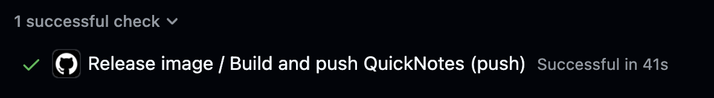

# Lab 10 Submission - Cloud Computing

## Task 1 - GHCR Release Image

Release workflow:

- `.github/workflows/release.yml`

The workflow triggers on tags matching `v*`, builds from `app/`, and pushes a multi-architecture image for `linux/amd64` and `linux/arm64`:

```text
ghcr.io/whynotgm/devops-intro/quicknotes:v0.1.0
ghcr.io/whynotgm/devops-intro/quicknotes:latest
```

The workflow uses only `contents: read` and `packages: write`. Third-party actions are pinned to 40-character SHAs:

- `actions/checkout@11bd71901bbe5b1630ceea73d27597364c9af683`
- `docker/setup-buildx-action@6524bf65af31da8d45b59e8c27de4bd072b392f5`
- `docker/login-action@9780b0c442fbb1117ed29e0efdff1e18412f7567`
- `docker/build-push-action@ca877d9245402d1537745e0e356eab47c3520991`

Release command:

```bash
git tag -a -s v0.1.0 -m "Lab 10 release"
git push origin v0.1.0
```

Clean pull evidence:

```bash
% docker pull ghcr.io/whynotgm/devops-intro/quicknotes:v0.1.0
v0.1.0: Pulling from whynotgm/devops-intro/quicknotes
fe52b65677f1: Pull complete
e75813d03227: Pull complete
a0295c8016b1: Pull complete
a7d03ba3f934: Pull complete
de8f9e6fb75f: Pull complete
a6186639cb8d: Download complete
Digest: sha256:2582654efcb5f9646f313deaae2cb26b9b1c4dfcb90afe7c234ee28ccd107598
Status: Downloaded newer image for ghcr.io/whynotgm/devops-intro/quicknotes:v0.1.0
ghcr.io/whynotgm/devops-intro/quicknotes:v0.1.0
```

Release run URL:

```text
https://github.com/whynotgm/DevOps-Intro/actions/runs/28794687688/job/85381927054?pr=10
```



### Design Questions

a) `GITHUB_TOKEN` is enough when GitHub Actions pushes to GHCR in the same repository because GitHub can scope the token directly to that repository package. I would reach for OIDC when the workflow needs to authenticate to an external cloud or a different trust domain, such as AWS, GCP, Azure, or a separate registry. OIDC gives short-lived federated credentials based on repository, branch, tag, and workflow claims, so there is no long-lived cloud secret stored in GitHub.

b) The immutable `:v0.1.0` tag is the deployment and rollback reference. The mutable `:latest` tag is still useful as a convenience pointer for humans, demos, smoke tests, and systems that intentionally follow the newest release. Production manifests should prefer immutable tags, while `latest` reduces friction for discovery.

c) The principle is least privilege: a workflow gets only the permissions needed for the job. Here it needs to read the repository and write packages, not change source code, issues, pull requests, or deployments. Compared with `write-all`, the narrower scope prevents a compromised build step from pushing commits, rewriting PRs, modifying releases, or changing unrelated repository state.

## Task 2 - Hugging Face Spaces

Space files:

- `cloud/huggingface/Dockerfile`
- `cloud/huggingface/README.md`

The Space uses Docker SDK metadata with `app_port: 8080`, because QuickNotes listens on port 8080.

Space URL:

```text
https://kotbanned-devops-intro.hf.space
```

Health check evidence:

```bash
curl -v https://kotbanned-devops-intro.hf.space/health
```

Response excerpt:

```text
> GET /health HTTP/2
< HTTP/2 200
< content-type: application/json
{"notes":4,"status":"ok"}
```

Warm latency command:

```bash
for i in 1 2 3 4 5; do
  curl -w "%{time_total}\n" -o /dev/null -s https://kotbanned-devops-intro.hf.space/health
done
```

Warm p50:

```text
0.468954s
```

Cold latency samples:

```text
1) 0.529927
2) 0.540441
3) 0.498121
```

### Design Questions

d) HF Spaces sleep and Cloud Run scale-to-zero are the same high-level idea, but HF Spaces are optimized for free demos, ML apps, and low-cost public hosting. A sleeping Space may need to allocate a worker, restore/build or pull the image, start the container, and route traffic back to it. Cloud Run is engineered as a serverless production runtime with faster instance scheduling, aggressive image caching, request-aware autoscaling, and configurable minimum instances.

e) HF Docker Spaces default to port `7860` because many Gradio and ML demo apps listen there. QuickNotes listens on `:8080`, so the Space metadata must set `app_port: 8080`; otherwise HF will route to the wrong port and the app will look unhealthy even though the container is running.

f) Pulling the GHCR image into the Space deploys the exact artifact that CI produced, which improves reproducibility and keeps release provenance simple. Building inside the Space can be easier to debug from source and may benefit from HF build logs, but it duplicates the CI build, can drift from the released image, and depends more heavily on Space-side build caching.

## Bonus - Cloudflare Tunnel Comparison

Tunnel notes:

- `cloud/cloudflare/quick-tunnel.md`

Quick tunnel command:

```bash
/opt/homebrew/opt/cloudflared/bin/cloudflared tunnel \
  --no-autoupdate \
  --protocol http2 \
  --edge-ip-version 4 \
  --url http://localhost:18080
```

External verification:

```text
Quick tunnel URL:
https://flame-occasionally-discussed-truck.trycloudflare.com

curl -v https://flame-occasionally-discussed-truck.trycloudflare.com/health

> GET /health HTTP/2
< HTTP/2 200
< content-type: application/json
{"notes":4,"status":"ok"}
```

Warm measurement:

```bash
for i in 1 2 3 4 5 6 7 8 9 10 11 12 13 14 15 16 17 18 19 20 \
  21 22 23 24 25 26 27 28 29 30 31 32 33 34 35 36 37 38 39 40 \
  41 42 43 44 45 46 47 48 49 50; do
  curl -w "%{time_total}\n" -o /dev/null -s \
    https://flame-occasionally-discussed-truck.trycloudflare.com/health
done
```

| Metric | HF Spaces (hosted) | Cloudflare Tunnel (local-via-edge) |
|--------|-------------------:|-----------------------------------:|
| Warm p50 | 0.386301s | 0.297083s |
| Warm p95 | 0.477753s | 0.394483s |
| Cold start | 92.823509s observed wake request | N/A, continuously local |
| Public URL stability | stable | ephemeral on restart |
| Cost | free | free |

Cloudflare attempt notes:

```text
Local QuickNotes container healthcheck passed.
Host port 8080 was already occupied by another local container, so QuickNotes
was published as 127.0.0.1:18080. Dockerized Cloudflared reached the quick
tunnel API after VPN reconnect but produced unstable edge connections, so the
final successful tunnel used native Homebrew `cloudflared` targeting
http://localhost:18080 over HTTP/2.
```

### Bonus Design Questions

g) HF Spaces is more obviously "cloud" because the container runs in HF infrastructure. Cloudflare Tunnel is still cloud-assisted, but the workload itself runs on my laptop and Cloudflare proxies traffic to it. Users mostly care about reachability, latency, uptime, and trust boundaries; the distinction matters when my laptop's power, network, and security posture become part of production.

h) For HF Spaces warm latency, the main costs are network distance, HF routing/proxy overhead, and the app container response time. For Cloudflare Tunnel, the dominating path is usually the round trip from the user to Cloudflare edge, from edge through the tunnel to my local machine, and then back over my residential or campus network.

i) Cloudflare Tunnel is a good production pick for controlled home labs, on-prem internal tools that need external access, webhook receivers, and temporary stakeholder review environments. It is not the right pick when the service must survive laptop sleep, local ISP outages, unstable Wi-Fi, or when compliance requires the workload to run in managed production infrastructure.
