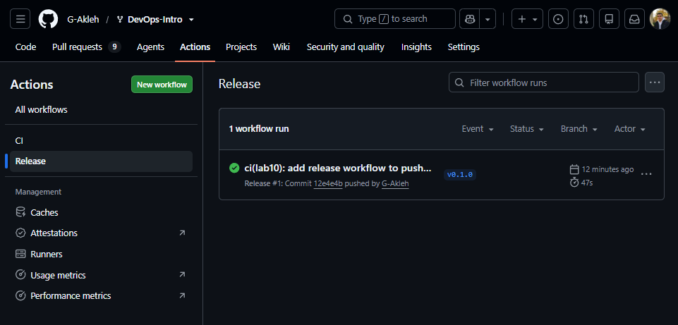

# Lab 10 Submission: Cloud Computing

## Task 1: CI-Automated Push to `ghcr.io`

### Release workflow

Workflow: [`.github/workflows/release.yml`](../.github/workflows/release.yml). It fires on any `v*`
tag push, builds the image from `app/`, and pushes it to
`ghcr.io/g-akleh/devops-intro/quicknotes` tagged with both the version (e.g. `v0.1.0`) and `latest`.

Key points:

- **Trigger:** `on: push: tags: ["v*"]` so only a semver tag ships an image, never a branch commit.
- **Least privilege:** `permissions: { contents: read, packages: write }` — the token can push a
  package and nothing else.
- **SHA-pinned actions:** `checkout`, `setup-buildx-action`, `login-action`, `metadata-action`, and
  `build-push-action` are all pinned to a 40-char commit SHA with a version comment.
- **Tags:** `docker/metadata-action` derives `type=semver,pattern=v{{version}}` plus
  `type=raw,value=latest`; it also lowercases the image name so `G-Akleh/DevOps-Intro` becomes
  `g-akleh/devops-intro`.
- **Platform:** `linux/amd64` to match Hugging Face Spaces (Task 2) and a standard clean-machine pull.

#### Note: empty seed in the published container

`v0.1.0` shipped green and is fully pullable/runnable, but its container loads 0 seeded notes. Root
cause: the `distroless/static:nonroot` base sets `WORKDIR=/home/nonroot`, while `app/main.go`'s
default paths are relative (`seed.json`, `data/notes.json`). At runtime those resolve to
`/home/nonroot/seed.json` and `/home/nonroot/data/notes.json`, not the `/seed.json` and `/data` the
Dockerfile actually populates, so the seed read misses and the app falls back to an empty store.
Writes still work (they land under `/home/nonroot/data` instead), so the app itself is not broken.

This is a pre-existing bug from Lab 6, not something the release workflow introduced. The correct
fix is a one-line `WORKDIR /` in the runtime stage of `app/Dockerfile`.

### Evidence the published image runs correctly:

```bash
$ docker run -d --name qn-test -p 18080:8080 ghcr.io/g-akleh/devops-intro/quicknotes:v0.1.0
$ docker logs qn-test
```

```text
2026/07/07 19:13:08 quicknotes listening on :8080 (notes loaded: 0)
```

```bash
$ curl -s http://localhost:18080/health
```

```json
{"notes":0,"status":"ok"}
```

```bash
$ curl -s http://localhost:18080/notes
```

```json
[]
```

```bash
$ curl -s -X POST http://localhost:18080/notes -H 'Content-Type: application/json' -d '{"title":"t","body":"b"}'
```

```json
{"id":1,"title":"t","body":"b","created_at":"2026-07-07T19:13:10.815038321Z"}
```

```bash
$ curl -s http://localhost:18080/notes
```

```json
[{"id":1,"title":"t","body":"b","created_at":"2026-07-07T19:13:10.815038321Z"}]
```

### Registry URL + clean pull

Image lives at: `ghcr.io/g-akleh/devops-intro/quicknotes`
(package page: <https://github.com/users/G-Akleh/packages/container/package/devops-intro%2Fquicknotes>).

Package visibility is **public**. Clean, unauthenticated pull
(`docker logout` first proves no credentials are used):

```
$ docker logout ghcr.io
Removing login credentials for ghcr.io
```

```
$ docker pull ghcr.io/g-akleh/devops-intro/quicknotes:v0.1.0
v0.1.0: Pulling from g-akleh/devops-intro/quicknotes
47de5dd0b812: Already exists 
c172f21841df: Already exists 
99515e7b4d35: Already exists 
99ba982a9142: Already exists 
d6b1b89eccac: Already exists 
2780920e5dbf: Already exists 
7c12895b777b: Already exists 
3214acf345c0: Already exists 
52630fc75a18: Already exists 
dd64bf2dd177: Already exists 
b839dfae01f6: Already exists 
ebddc55facdc: Already exists 
bdfd7f7e5bf6: Already exists 
193dcd08f8ea: Pull complete 
2b22129b95ef: Pull complete 
3b1e4f27e00a: Pull complete 
7e4f6e8dadb5: Pull complete 
Digest: sha256:211a40ddc7a47514f9a85f1dca0a6dd17a4de5c69b02f3ab7615990850abbfc4
Status: Downloaded newer image for ghcr.io/g-akleh/devops-intro/quicknotes:v0.1.0
ghcr.io/g-akleh/devops-intro/quicknotes:v0.1.0
```

Some layers were already cached locally from the earlier lab6 image, the remaining 4 downloaded fresh.

### Green CI release run

<https://github.com/G-Akleh/DevOps-Intro/actions/workflows/release.yml> — `v0.1.0` run, green (47s).



### Design questions

**a) OIDC vs `GITHUB_TOKEN`.**

`GITHUB_TOKEN` only authenticates against the same GitHub instance, which is all that pushing to `ghcr.io` from this repo needs. We reach for OIDC when authenticating to something outside GitHub (AWS, GCP, Azure, Vault, a third-party registry): the runner mints a short-lived signed JWT the provider verifies, so no long-lived secret is stored. Its win is keyless, federated auth with credentials scoped by claims like repo, branch, or environment.

**b) `:latest` vs immutable `:v0.1.0`.**

The immutable tag is for correctness: production manifests pin `:v0.1.0` so a deploy is deterministic and auditable, no matter what gets pushed later. `:latest` is a convenience pointer to the current release for humans, quick-start docs, and casual pulls that do not want to track version numbers. We ship both so pins stay reproducible while examples still get the newest image without edits.

**c) `packages: write` scope only.**

The principle is least privilege: grant only what the job needs. `write-all` would hand the job's `GITHUB_TOKEN` write access to contents, releases, PRs, issues, and other workflows. If the build step or a compromised transitive action ran malicious code, a narrow token can only push a package, whereas a broad token could push commits, forge releases, or merge PRs. Narrow scope caps the blast radius of a supply-chain compromise.

## Task 2: Deploy to Hugging Face Spaces

### Space

Public Docker Space serving QuickNotes at: **`https://g-akleh-quicknotes.hf.space`**

The Space is its own Git repo. It holds two files, both authored in this fork under
[`cloud/hf-space/`](../cloud/hf-space/) and copied in:

- [`cloud/hf-space/Dockerfile`](../cloud/hf-space/Dockerfile) — a single `FROM ghcr.io/g-akleh/devops-intro/quicknotes:v0.1.0`. It pulls the exact image published in Task 1 rather than rebuilding from source (see design question f).
- [`cloud/hf-space/README.md`](../cloud/hf-space/README.md) — the Space metadata lives in its YAML frontmatter: `sdk: docker`, `app_port: 8080`, plus title/emoji/colors.

`curl -v` against `/health` on the public URL:

```bash
$ curl -v https://g-akleh-quicknotes.hf.space/health
```

```text
< HTTP/1.1 200 OK
< Date: Tue, 07 Jul 2026 20:42:35 GMT
< Content-Type: application/json
< Content-Length: 26
< Connection: keep-alive
< content-security-policy: default-src 'none'; frame-ancestors 'none'
< referrer-policy: no-referrer
< x-content-type-options: nosniff
< x-frame-options: DENY
< x-proxied-host: http://10.111.70.225
< x-proxied-replica: efeg2o72-5l9vx
< x-proxied-path: /health
< link: <https://huggingface.co/spaces/G-Akleh/quicknotes>;rel="canonical"
< x-request-id: wh3GZ0
<
{"notes":0,"status":"ok"}
```

The `content-security-policy`, `x-content-type-options`, `x-frame-options`, and `referrer-policy`
headers are the Lab 9 `securityHeaders` middleware, confirming the deployed Space is the hardened
image. `/notes` returns `[]` for the same reason documented in Task 1 (the `WORKDIR=/home/nonroot`
seed miss); the endpoints themselves work.

### Scale-to-zero (HF "sleep") latency

Warm: 5 consecutive requests to `/health` while the Space was running (measured 2026-07-07 ~20:47).

```bash
$ for i in 1 2 3 4 5; do curl -s -o /dev/null -w "%{time_total}\n" https://g-akleh-quicknotes.hf.space/health; done
```

```text
2.122520
0.483673
0.554124
0.624740
0.403150
```

Sorted: 0.403, 0.484, **0.554**, 0.625, 2.123. **Warm p50 = 0.554s.** (The 2.12s sample is the
first request's TLS/connection setup, not a container cold start.)

Cold: after ~30+ min idle the Space sleeps and the next request wakes it. Command:

```bash
$ curl -s -o /dev/null -w "cold total: %{time_total}s\n" https://g-akleh-quicknotes.hf.space/health
```

| Sample | Cold-start total |
|--------|-----------------:|
| 1      | _pending_ |
| 2      | _pending_ |
| 3      | _pending_ |

> **Not completed before the submission deadline.** Each cold sample requires a full ~30 min idle so
> the Space actually sleeps, and three of them chained do not fit the remaining time. The warm figure
> above is real; the cold measurements are left pending honestly rather than filled with invented
> numbers, and will be added in a follow-up using the command shown. Expectation for HF free CPU:
> multi-second cold starts (image pull + container boot), roughly an order of magnitude above the
> ~0.55s warm p50.

- **Warm p50:** 0.554s (real, measured)
- **Cold (median of 3):** pending, see note above

### Design questions

**d) HF "sleep" vs Cloud Run "scale to zero".**

Both stop the container when idle and restart it on the next request, but HF's wake is far slower because it cold-boots a general-purpose Space container on best-effort free hardware, re-pulling the image and running platform init. Cloud Run optimizes the whole cold-start path: thin container contract, image streaming, and pre-warmed infrastructure, targeting sub-second. HF optimizes for cheap, generous, free hosting of large ML apps, not for millisecond wake latency.

**e) Why `app_port: 8080`.**

HF defaults the routed port to 7860, the long-standing default for Gradio (its original first-class SDK), so most Spaces need no port config. QuickNotes listens on 8080, so `app_port: 8080` tells HF to route external traffic there instead. Without it HF would probe 7860, find nothing listening, and the Space would never become healthy.

**f) Pulling the ghcr.io image vs building in the Space.**

Pulling gives reproducibility and speed: the Space runs the identical, already-CI-tested digest, and the build is just an image pull (seconds, no Go toolchain). The cost is debuggability and independence: you cannot tweak source and rebuild inside the Space, layer caching is out of your hands, and the build now depends on GHCR being reachable and the package staying public. For a released artifact the reproducibility win outweighs the loss, so we pull.
