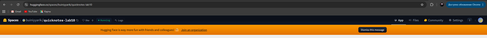
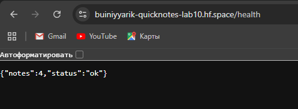

# Lab 10 Submission

## Task 1. CI-Automated Push to GHCR

### Release Workflow

Workflow file:

```text
.github/workflows/release.yml
```

The workflow triggers on Git tags matching `v*`, builds the QuickNotes image from `app/`, and pushes it to GitHub Container Registry.

Image:

```text
ghcr.io/buiniyyarik/devops-intro/quicknotes
```

Tags:

```text
v0.1.0
latest
```

Green release run:

```text
https://github.com/BuiniyYarik/DevOps-Intro/actions/runs/28896001776
```

---

### Release Tag

Command:

```powershell
git tag -a v0.1.0 -m "Lab 10 release"
git push origin v0.1.0
```

The pushed tag triggered the release workflow.

---

### Clean Pull from GHCR

Source file:

```text
submissions/src/lab10/ghcr_pull.txt
```

Command:

```powershell
docker pull ghcr.io/buiniyyarik/devops-intro/quicknotes:v0.1.0
```

Output:

```text
Status: Image is up to date for ghcr.io/buiniyyarik/devops-intro/quicknotes:v0.1.0
```

---

### Run Pulled Image Locally

Source file:

```text
submissions/src/lab10/ghcr_image_health.txt
```

Command:

```powershell
docker run --rm -d `
  --name qn-lab10-pull `
  -p 18081:8080 `
  -e DATA_PATH=/data/notes.json `
  -e SEED_PATH=/seed.json `
  -v "${PWD}\submissions\src\lab10\pull-data:/data" `
  ghcr.io/buiniyyarik/devops-intro/quicknotes:v0.1.0

curl.exe -s http://localhost:18081/health
docker stop qn-lab10-pull
```

Output:

```json
{"notes":4,"status":"ok"}
```

The image was successfully pulled from GHCR and started locally.

---

## Task 1 Design Questions

### Question a. OIDC vs `GITHUB_TOKEN`

For pushing to GHCR from the same repository, `GITHUB_TOKEN` with `packages: write` is enough.

I would use OIDC when GitHub Actions needs to access an external cloud provider such as AWS, GCP, or Azure. OIDC avoids long-lived static credentials and lets the cloud provider issue short-lived tokens based on the workflow identity.

### Question b. Why publish both `latest` and `v0.1.0`?

The immutable version tag `v0.1.0` is used for reproducibility and rollback.

The `latest` tag is useful for convenience, demos, and simple deployments that always want the newest release. Production systems should prefer immutable version tags, but publishing `latest` helps humans and simple consumers discover the current release quickly.

### Question c. Why only `packages: write`?

This follows the principle of least privilege.

The workflow only needs to read repository contents and write container packages. Giving broader permissions such as `write-all` would increase the blast radius if the workflow or one of its actions were compromised. Narrow permissions prevent an attacker from modifying issues, pull requests, repository contents, or other unrelated resources.

---

## Task 2. Deploy to Hugging Face Spaces

### Hugging Face Space

Space repository:

```text
https://huggingface.co/spaces/buiniyyarik/quicknotes-lab10
```

Public application URL:

```text
https://buiniyyarik-quicknotes-lab10.hf.space
```

Health endpoint:

```text
https://buiniyyarik-quicknotes-lab10.hf.space/health
```

---

### Space Dockerfile

Source file:

```text
cloud/hf-space/Dockerfile
```

Content:

```dockerfile
FROM ghcr.io/buiniyyarik/devops-intro/quicknotes:v0.1.0

ENV ADDR=:8080
ENV DATA_PATH=/tmp/notes.json
ENV SEED_PATH=/seed.json
```

The Space pulls the already-built GHCR image instead of rebuilding QuickNotes from source. This makes the deployed image match the CI release artifact exactly.

---

### Space README Metadata

Source file:

```text
cloud/hf-space/README.md
```

Content:

```markdown
---
title: QuickNotes Lab 10
emoji: 🚀
colorFrom: blue
colorTo: green
sdk: docker
app_port: 8080
pinned: false
---

# QuickNotes Lab 10

QuickNotes is deployed from the GHCR image built by GitHub Actions.
```

The important setting is:

```yaml
app_port: 8080
```

QuickNotes listens on port `8080`, while Hugging Face Spaces defaults to port `7860`.

---

### Push to Hugging Face Space

Commands:

```powershell
git clone https://huggingface.co/spaces/buiniyyarik/quicknotes-lab10
cd quicknotes-lab10

git add README.md Dockerfile
git commit -m "Deploy QuickNotes"
git push
```

After authentication with a Hugging Face access token, the Space repository was pushed successfully.

---

### Hugging Face Build

Screenshot:

```text
submissions/screenshots/lab10/hf_build.png
```



---

### Health Check

Source file:

```text
submissions/src/lab10/hf_health_verbose.txt
```

Command:

```powershell
curl.exe -v https://buiniyyarik-quicknotes-lab10.hf.space/health
```

Important output:

```text
HTTP/1.1 200 OK
Content-Type: application/json
cache-control: no-store
content-security-policy: default-src 'none'
x-content-type-options: nosniff
x-frame-options: DENY
```

Response:

```json
{"notes":4,"status":"ok"}
```

Screenshot:

```text
submissions/screenshots/lab10/hf_health.png
```



---

## Latency Measurements

### Warm Latency

Source file:

```text
submissions/src/lab10/hf_warm_latency.txt
```

Command:

```powershell
1..5 | ForEach-Object {
  curl.exe -w "%{time_total}`n" -o NUL -s https://buiniyyarik-quicknotes-lab10.hf.space/health
}
```

Results:

```text
0.495001
0.587811
0.367137
0.371308
0.590430
```

Warm p50:

```text
0.495001 seconds
```

---

### Cold Latency

Source files:

```text
submissions/src/lab10/hf_cold_latency_1.txt
submissions/src/lab10/hf_cold_latency_2.txt
submissions/src/lab10/hf_cold_latency_3.txt
```

Results:

```text
0.358509
0.370716
0.369523
```

Cold samples were approximately:

```text
0.36–0.37 seconds
```

In these measurements the Space responded quickly, so it was likely already warm or had not fully gone to sleep.

---

## Task 2 Design Questions

### Question d. HF Spaces sleep vs Cloud Run scale-to-zero

Both systems can stop idle workloads and restart them on demand.

Hugging Face Spaces usually has slower cold starts because it is optimized for free hosted demos, ML applications, and simple public deployments. Cloud Run is a production serverless platform optimized for fast autoscaling, container startup, concurrency, and regional routing.

### Question e. Why does the Space need `app_port: 8080`?

Hugging Face Spaces defaults to port `7860`, which is common for Gradio and ML demo apps.

QuickNotes listens on port `8080`, so the Space metadata must explicitly set:

```yaml
app_port: 8080
```

Without this, HF would route traffic to the wrong port and the app would appear unavailable.

### Question f. Pulling from GHCR vs building inside the Space

Pulling from GHCR improves reproducibility because the Space runs the exact image produced by the release workflow.

Advantages:

- same artifact as CI
- faster Space builds
- fewer build differences between platforms
- easier rollback by changing the image tag

Trade-off:

- debugging build failures inside HF is less direct
- the Space depends on the GHCR image being public and available

Building inside the Space is easier for quick experiments, but pulling the released image is better for production-style deployment.

---

## Observations

- The release workflow successfully pushed QuickNotes to GHCR.
- The GHCR image was publicly pullable and runnable locally.
- Running the pulled image required a writable data path, so `/data/notes.json` was mounted locally and `/tmp/notes.json` was used in Hugging Face Spaces.
- Hugging Face Spaces successfully served QuickNotes at a public HTTPS URL.
- Security headers from Lab 9 were visible in the public HF response.
- Warm HF latency was around 0.5 seconds.
- The recorded cold latency samples were close to warm latency, likely because the Space had not fully slept before the measurements.