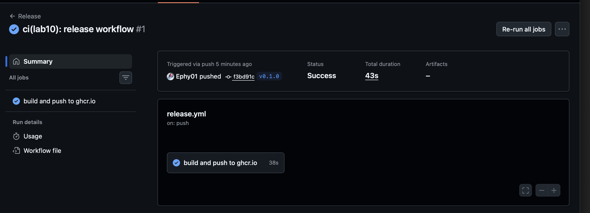
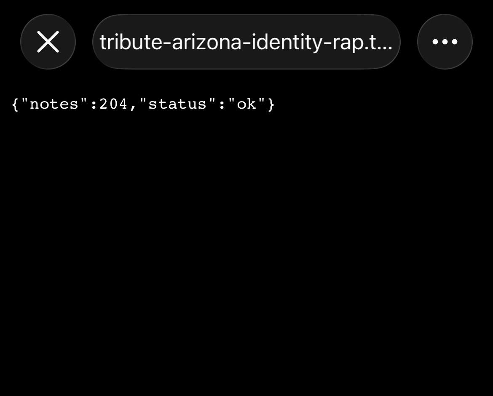

# Lab 10 — Cloud Computing: Ship QuickNotes to a Real Cloud

> Lab was done on my MacBook Air M4. Builds on lab 6 (image), lab 9 (hardened app)
> and lab 3 (CI). Registry is `ghcr.io`, hosting is a Hugging Face Docker Space,
> bonus is a Cloudflare quick tunnel — same trick I already used in the lab 8 bonus.

What I have done?

---

## Task 1 — tag → CI → ghcr.io

### The release workflow

Added `.github/workflows/release.yml`. Deliberately no `docker/build-push-action` —
plain `docker build` + `docker push` in run-steps. So the only third-party action is
`actions/checkout`, pinned by the same 40-char SHA as in my lab 3 CI. 

```
name: Release
on:
  push:
    tags: ["v*"]
permissions:
  contents: read
  packages: write
env:
  IMAGE: ghcr.io/ephy01/devops-intro/quicknotes   # ghcr requires lowercase
jobs:
  push-image:
    name: build and push to ghcr.io
    runs-on: ubuntu-24.04
    steps:
      - uses: actions/checkout@11bd71901bbe5b1630ceea73d27597364c9af683 # v4.2.2
      - name: Log in to ghcr.io (GITHUB_TOKEN is enough for same-repo push)
        run: echo "${{ secrets.GITHUB_TOKEN }}" | docker login ghcr.io -u ${{ github.actor }} --password-stdin
      - name: Build (immutable tag + latest)
        run: docker build -t "$IMAGE:${{ github.ref_name }}" -t "$IMAGE:latest" ./app
      - name: Push both tags
        run: |
          docker push "$IMAGE:${{ github.ref_name }}"
          docker push "$IMAGE:latest"
```

### Tag → run

```
$ git tag -a -s v0.1.0 -m "lab10: first release"
$ git push origin v0.1.0
```

Green release run:



Package that was created by first push was already public

### Clean pull proof

Logged out + removed the local copy, pulled from scratch, ran it:

```
ephy@Starless-night DevOps-Intro % docker logout ghcr.io
Removing login credentials for ghcr.io
ephy@Starless-night DevOps-Intro % docker rmi ghcr.io/ephy01/devops-intro/quicknotes:v0.1.0 2>/dev/null
ephy@Starless-night DevOps-Intro % docker pull ghcr.io/ephy01/devops-intro/quicknotes:v0.1.0
v0.1.0: Pulling from ephy01/devops-intro/quicknotes
1c193acf1cd1: Pulling fs layer
...
Digest: sha256:82c39eeaae6dec9e7625049cce6649a5b7b5b3c9c75580278fcab255497ed8d1
Status: Downloaded newer image for ghcr.io/ephy01/devops-intro/quicknotes:v0.1.0

ephy@Starless-night DevOps-Intro % docker run --rm -p 8081:8080 ghcr.io/ephy01/devops-intro/quicknotes:v0.1.0 &
WARNING: The requested image's platform (linux/amd64) does not match the detected host platform (linux/arm64/v8) and no specific platform was requested
2026/07/06 14:05:49 quicknotes listening on :8080 (notes loaded: 4)

ephy@Starless-night DevOps-Intro % curl -s localhost:8081/health
{"notes":4,"status":"ok"}

ephy@Starless-night DevOps-Intro % docker stop $(docker ps -q --filter ancestor=ghcr.io/ephy01/devops-intro/quicknotes:v0.1.0)
2026/07/06 14:10:40 shutting down
```

Two things worth reading in that output. The platform WARNING means:
CI built `linux/amd64` on a GitHub runner, my Mac is arm64 — the image runs under
emulation, which proves the pull really came from the registry and not from any
local build cache. And `notes loaded: 4` is the fresh seed baked into the image —
not my local data volume.

### Design questions

**a) OIDC vs `GITHUB_TOKEN` — when would I reach for OIDC?**
For pushing to ghcr from the same repo `GITHUB_TOKEN` + `packages: write` is
exactly right: short-lived, auto-scoped to this repo, zero secrets to store. OIDC is
for when CI has to talk to somebody else's cloud — AWS/GCP/Fly, another registry.
Instead of storing a long-lived cloud key as a repo secret, the workflow presents
GitHub's signed identity token and the
cloud exchanges it for short-lived creds with a trust policy. What it gives that
`GITHUB_TOKEN` can't: identity outside GitHub + no stored secret to leak or rotate.

**b) Why still ship `:latest` next to the immutable `:v0.1.0`?**
Two different consumers. The immutable tag is for machines and rollbacks — deploys
pin it,  incident means "roll back to v0.0.9" and that tag will never change
under you. `:latest` is a moving convenience pointer for humans — `docker pull` in a
quickstart. You publish both: humans get just give
me the newest, production only ever references the immutable one. Using `:latest`
in a deploy is anti-pattern.

**c) `packages: write` scope only — what attack does the narrow scope prevent?**
Least privilege. The job's token can push packages and read contents — and nothing
else. If the workflow gets compromised (malicious PR, poisoned action, leaked
token), the blast radius is "attacker can push an image", not "attacker can push
commits, rewrite releases, edit workflows" which is what a broad write-all token
hands out.

---

## Task 2 — Hugging Face Space

### The Space

Space: https://huggingface.co/spaces/Ephyrr/quicknotes — Docker SDK, public.
Serves at https://ephyrr-quicknotes.hf.space. Two files in the Space repo (also
committed to my fork under `cloud/hf-space/`):

`Dockerfile` — I **pull the CI-built image** instead of rebuilding from source:

```dockerfile
FROM ghcr.io/ephy01/devops-intro/quicknotes:v0.1.0
```

`README.md` frontmatter — the part HF actually reads:

```yaml
---
title: QuickNotes
emoji: 📝
colorFrom: green
colorTo: gray
sdk: docker
app_port: 8080
pinned: false
---
```

`app_port: 8080` because QuickNotes listens on 8080 (HF defaults to 7860)

### It is public and alive

```
ephy@Starless-night ~ % curl -v https://ephyrr-quicknotes.hf.space/health
* Host ephyrr-quicknotes.hf.space:443 was resolved.
*   Trying 54.72.212.99:443...
* Connected to ephyrr-quicknotes.hf.space (54.72.212.99) port 443
* Server certificate:
*  subject: CN=hf.space
*  subjectAltName: host "ephyrr-quicknotes.hf.space" matched cert's "*.hf.space"
*  issuer: C=US; O=Amazon; CN=Amazon RSA 2048 M01
*  SSL certificate verify ok.
* using HTTP/2
> GET /health HTTP/2
> Host: ephyrr-quicknotes.hf.space
< HTTP/2 200
< date: Tue, 07 Jul 2026 07:35:23 GMT
< content-type: application/json
< content-security-policy: default-src 'none'
< cross-origin-resource-policy: same-origin
< referrer-policy: no-referrer
< x-content-type-options: nosniff
< x-frame-options: DENY
< x-proxied-replica: bov1e9h7-vnw42
<
{"notes":4,"status":"ok"}
```

The response headers are the best part: all five **lab 9 security headers** are
right there, served from HF's cloud — the hardened image and the deployed image are
provably the same artifact, straight from ghcr.

`/notes` works too:

```
ephy@Starless-night ~ % curl -s https://ephyrr-quicknotes.hf.space/notes
[{"id":1,"title":"Welcome to QuickNotes","body":"This is the project you'll containerize, deploy, monitor, and harden across all 10 labs.","created_at":"2026-01-15T10:00:00Z"},
 {"id":2,"title":"Read app/main.go first", ...},
 {"id":3,"title":"DevOps mantra", ...},
 {"id":4,"title":"Endpoint cheat-sheet", ...}]
```

Four notes — the seed baked into the image, same `notes loaded: 4` the container
logged locally. The Space has no volume, so this is exactly what "stateless free
tier" means: every wake starts from the seed again.

### Measurements

Warm — 5 consecutive requests:

```
ephy@Starless-night ~ % for i in 1 2 3 4 5; do curl -s -o /dev/null -w '%{time_total}\n' https://ephyrr-quicknotes.hf.space/health; done
0.755309
0.583810
0.621472
0.616768
0.531723
```

warm p50 ≈ **617 ms** (median of 5; the first request is the slowest — fresh TLS
handshake, not a cold start; my requests travel Sirius (Sochi) → HF's eu-west datacenter,
so most of this is RTT, not the app)

Cold start needed a different method than the lab suggests. Two surprises:

1. The free CPU-basic Space doesn't sleep after ~30 min — it idles for 48 hours
   first. Waiting 48h × 3 is not a lab-scale experiment, so I trigger the wake
   manually with **Settings → Factory rebuild**, which does the same work a real
   wake does: re-schedule + pull the image + boot the container.
2. Measuring from outside with `curl` always returned ~0 s, because HF does a
   graceful restart — the old replica keeps serving 200 until the new one is
   ready, so the public URL never has a down window. The cold start is only visible
   from inside, via the Space's log API (`/api/spaces/.../logs/{build,run}`).

So I define cold start as `Build Queued` → `quicknotes listening` — from the
moment HF accepts the wake to the moment the app serves. One clean cycle:

```
===== Build Queued at 2026-07-07 08:54:23 =====        (wake accepted)
===== Application Startup at 2026-07-07 08:54:32 =====  (container scheduled + booting)
2026/07/07 08:54:40 quicknotes listening on :8080 (notes loaded: 4)   (serving)
```

| Cold sample (Factory rebuild) | Queued → serving |
|---|---|
| 1 | 17.4 s |
| 2 | 15.0 s |
| 3 | 15.9 s |

Median ≈ **15.9 s** (container boot is a steady ~8 s across all three; the variance
lives in the pull/schedule half).

Breakdown of sample 1: image pull + schedule ≈ 9 s, container boot to `listening`
≈ 8 s. versus warm p50 of 0.6 s — the free tier trades ~30× latency on the first
hit for $0 while idle.

### Design questions

**d) HF "sleep" vs Cloud Run "scale to zero" — why is HF's wake so much slower?**
Same idea (idle → evict → cold start on demand), different targets. Cloud Run is
built to serve production HTTP: tiny per-instance startup budget, aggressive image
streaming/caching, pre-warmed infra — wakes in hundreds of ms. HF Spaces optimizes
for free demo hosting of ML apps: wake = re-schedule the container, pull/extract
the image, boot — seconds to tens of seconds, and nobody at HF is paid to shave
that. 

**e) Why does the Space need `app_port: 8080`? Why is HF's default 7860?**
HF has to know which container port to route the public URL to. 7860 is Gradio's
default port — most Spaces are Gradio apps, so it's their sensible default.
QuickNotes listens on `:8080`, so I declare that in the
frontmatter instead of touching the app.

**f) Pull from ghcr vs build inside the Space — the trade-off.**
I pull. Why? Because: the Space runs the same digest CI produced — one artifact
everywhere, and the Space build step is
basically just a pull. Con: debugging is worse (HF build logs can not show my compile
errors — they happen in my CI instead), the ghcr package must stay public, and
updating means pushing a new tag + bumping the FROM line. 

Building in the Space is
the opposite: self-contained and easy to hack on, but now there are two build
pipelines that can drift and the "what exactly is deployed" question appears.

For a course lab — pulling wins.

---

## Bonus — Cloudflare Tunnel + comparison

Started QuickNotes locally (lab 6 compose), then:

```
ephy@Starless-night DevOps-Intro % cloudflared tunnel --url http://localhost:8080
...
https://tribute-arizona-identity-rap.trycloudflare.com
```

Checked from my phone on  cellular(Wi-Fi off — different network, so it is
really public, not my LAN):



Note the body: `{"notes":204,"status":"ok"}` — **204** notes, not the seed's 4.

The tunnel serves my local container with its lab 6 data volume (the notes I
load-tested in lab 8), while the HF Space answers 4 from a fresh seed. Same image,
two very different states — a one-line proof of which deployment you are talking to.

Measured with hyperfine, 50 runs each, warm:

```
Benchmark 1: curl -s -o /dev/null https://ephyrr-quicknotes.hf.space/health
  Time (mean ± σ):     686.8 ms ± 151.6 ms    [User: 22.4 ms, System: 10.3 ms]
  Range (min … max):   531.4 ms … 1209.9 ms    50 runs

Benchmark 1: curl -s -o /dev/null https://tribute-arizona-identity-rap.trycloudflare.com/health
  Time (mean ± σ):     537.3 ms ± 116.9 ms    [User: 25.0 ms, System: 12.0 ms]
  Range (min … max):   439.1 ms … 999.1 ms    50 runs
```

The tunnel — a container on my laptop — is consistently faster than the hosted
cloud: my nearest Cloudflare edge is much closer than HF's eu-west datacenter, and
the edge→laptop hop is short. Geography beats "real cloud" here (see design q. h).

| Metric | HF Spaces (hosted) | Cloudflare Tunnel (local-via-edge) |
|--------|-------------------:|-----------------------------------:|
| Warm p50               | 635 ms | 492 ms |
| Warm p95               | 969 ms | 768 ms |
| Cold start             | 15.9 s (median of 3) | N/A (continuously local) |
| Public URL stability   |             stable | ephemeral on restart |
| Cost                   |               free | free |


### Design questions

**g) Which one is "really cloud" — and do users care?**
By the textbook definition HF is the CLOUD: my container runs in their
datacenter, they own capacity. The tunnel is my laptop
wearing a cloud costume — Cloudflare's edge just proxies into it. And users
genuinely don't care until: laptop lid closes, home Wi-Fi
drops — tunnel users see downtime, HF users don't. Users care about the URL
answering, not about where the process lives; the operator is the one who should
care about the distinction.

**h) Latency dominator for each.**
HF warm: the request crosses the public internet to HF's region and back — network RTT to their datacenter dominates. The app itself answers in microseconds. 
Tunnel: the path is me → nearest Cloudflare edge → tunnel back to my laptop → app — so the
dominator is that extra edge→origin hop over my home uplink.

Both are network-dominated; QuickNotes compute is noise in both columns.

**i) When is the tunnel the right production pick, and when never?**

Right: exposing something that must stay on-prem/home-lab (internal dashboard,
a service pinned to local hardware), or a quick "look at my dev branch" URL for a
stakeholder — no port-forwarding, no VPS, and the origin stays firewalled. 

Never:
anything needing real availability or scale — the origin is a single machine behind
one uplink. Laptop sleeps → production sleeps. Also never for the ephemeral quick
tunnel specifically: the URL changes on every restart, so nothing durable may point
at it.
