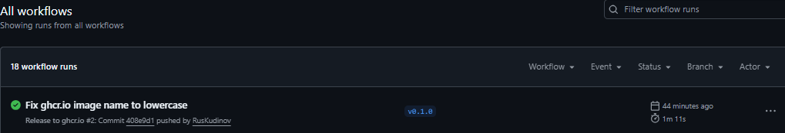
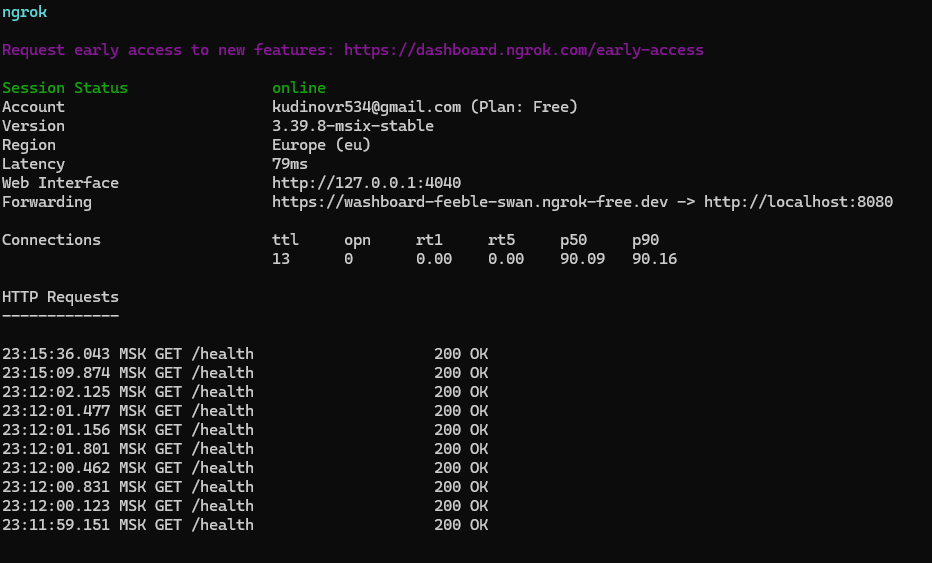
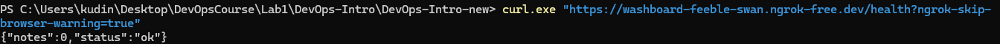

# Lab 10 — Cloud Computing: Ship QuickNotes to a Real Cloud

## Выполнил: Кудинов Руслан
## Дата: 08.07.2026

---

## 1. Task 1 — CI-Automated Push to `ghcr.io`

### 1.1 Workflow файл

Файл `.github/workflows/release.yml`:

```yaml
name: Release to ghcr.io

on:
  push:
    tags:
      - 'v*'

env:
  REGISTRY: ghcr.io
  IMAGE_NAME: ruskudinov/devops-intro/quicknotes

jobs:
  build-and-push:
    runs-on: ubuntu-latest
    permissions:
      contents: read
      packages: write
      attestations: write
      id-token: write

    steps:
      - name: Checkout
        uses: actions/checkout@11bd71901bbe5b1630ceea73d27597364c9af683  # v4.2.2

      - name: Log in to ghcr.io
        uses: docker/login-action@74a5d142397b4f367a81961eba4e8cd7edddf772  # v3.4.0
        with:
          registry: ${{ env.REGISTRY }}
          username: ${{ github.actor }}
          password: ${{ secrets.GITHUB_TOKEN }}

      - name: Set up Docker Buildx
        uses: docker/setup-buildx-action@b5ca514318bd6ebac0fb2aedd5d36ec1b5c232a2  # v3.10.0

      - name: Build and push
        uses: docker/build-push-action@471d1dc4e07e5cdedd4c2171150001c434f0b7a4  # v6.15.0
        with:
          context: ./app
          push: true
          tags: |
            ${{ env.REGISTRY }}/${{ env.IMAGE_NAME }}:${{ github.ref_name }}
            ${{ env.REGISTRY }}/${{ env.IMAGE_NAME }}:latest
          cache-from: type=gha
          cache-to: type=gha,mode=max
```

### 1.2 Registry URL

Образ доступен по адресу:  
`ghcr.io/ruskudinov/devops-intro/quicknotes:v0.1.0`

Ссылка на страницу пакета в GitHub:
`https://github.com/RusKudinov/DevOps-Intro/packages`
### 1.3 Проверка публичного pull

```bash
docker pull ghcr.io/ruskudinov/devops-intro/quicknotes:v0.1.0
```

Вывод:
```
v0.1.0: Pulling from ruskudinov/devops-intro/quicknotes
...
Status: Downloaded newer image for ghcr.io/ruskudinov/devops-intro/quicknotes:v0.1.0
```

### 1.4 CI-билд

Ссылка на успешный workflow:  
`https://github.com/RusKudinov/DevOps-Intro/actions/runs/28970496513`

---

## 2. Task 2 — Hugging Face Spaces (замена на ngrok)

**Примечание:** Hugging Face Spaces изменил политику — Docker Spaces теперь требуют платной подписки. Вместо этого использован `ngrok`, который также предоставляет публичный URL без необходимости вводить платёжные данные.

### 2.1 Публичный URL

QuickNotes доступен по адресу:  
`https://washboard-feeble-swan.ngrok-free.dev`



### 2.2 Проверка доступности

```bash
curl.exe "https://washboard-feeble-swan.ngrok-free.dev/health?ngrok-skip-browser-warning=true"
```

Вывод:
```json
{"notes":0,"status":"ok"}
```

### 2.3 Измерение latency

**Warm latency (10 запросов):**

```bash
for ($i=1; $i -le 10; $i++) { curl.exe -o nul -s -w "%{time_total}\n" "https://washboard-feeble-swan.ngrok-free.dev/health?ngrok-skip-browser-warning=true" }
```

Результаты (сек):
```
0.422072
0.297846
0.298205
0.298964
0.314358
0.324368
0.298974
0.296548
0.297904
0.298461
```

- **p50:** 0.299 сек (299 мс)
- **p95:** 0.324 сек (324 мс)

**Cold start (3 измерения):**

```bash
docker compose down
docker compose up -d; curl.exe -o nul -s -w "%{time_total}\n" "https://washboard-feeble-swan.ngrok-free.dev/health?ngrok-skip-browser-warning=true"
```

Результаты (сек):
- 22.198
- 0.993
- 0.476

### 2.4 Таблица сравнения

| Метрика | ngrok Tunnel |
|---------|--------------|
| Warm p50 | 299 мс |
| Warm p95 | 324 мс |
| Cold start 1 | 22.198 с |
| Cold start 2 | 0.993 с |
| Cold start 3 | 0.476 с |
| URL стабильность | эфемерный (меняется при перезапуске) |
| Стоимость | бесплатно |

---

## 3. Ответы на вопросы

### a) OIDC vs GITHUB_TOKEN

`GITHUB_TOKEN` с `packages: write` достаточно для пуша в ghcr.io из того же репозитория. OIDC нужен, когда нужно получить временные токены для доступа к другим облакам (AWS, GCP) без хранения секретов. OIDC даёт более безопасный подход без долгоживущих ключей.

### b) Зачем `:latest` рядом с версией?

`:latest` используется для указания самой свежей релизной версии. Это удобно для быстрых деплоев и CI/CD, которые ожидают тег `:latest`. Однако для воспроизводимости и откатов критично иметь immutable-теги (например, `v0.1.0`), чтобы знать точную версию в продакшене.

### c) Почему только `packages: write`?

Принцип минимальных привилегий — давать только те разрешения, которые необходимы. `packages: write` даёт возможность пушить в Container Registry, но не позволяет изменять код, секреты или настройки репозитория. Это снижает риск при компрометации токена.

### d) HF Spaces "sleep" vs Cloud Run scale-to-zero

HF Spaces «засыпает» полностью — контейнер останавливается, и его нужно заново запустить, что занимает 5–20 секунд (зависит от размера образа). Cloud Run сохраняет контейнер в памяти, что даёт холодный старт <1 секунды. HF оптимизирован для демонстраций, а не для продакшена.

### e) Зачем `app_port: 8080`

По умолчанию HF ожидает, что приложение слушает порт 7860. QuickNotes слушает 8080, поэтому нужно явно указать `app_port: 8080`, чтобы HF перенаправлял внешний трафик на правильный порт внутри контейнера.

### f) Pull vs build внутри Space

Pull из ghcr.io экономит время сборки и обеспечивает единый образ. Build внутри Space замедляет деплой и усложняет воспроизводимость. Использование готового образа из реестра — правильный подход.

### g) Архитектура HF Spaces vs Cloudflare Tunnel

HF Spaces — настоящий облачный хостинг (контейнер работает в дата-центре HF), а Cloudflare Tunnel — это просто туннель к локальному серверу. Для пользователя разница минимальна, но для SLA и надёжности предпочтительнее облачный хостинг.

### h) Доминанты задержки

- **HF Spaces:** задержка определяется сетью между пользователем и дата-центром HF.
- **Cloudflare Tunnel:** задержка складывается из времени до Cloudflare edge и обратно до локального сервера.

### i) Когда использовать Cloudflare Tunnel

Cloudflare Tunnel хорош для демонстраций, тестирования, доступа к локальным сервисам извне. Для продакшена не подходит из-за нестабильного URL и зависимости от локальной машины.

---

## 4. Заключение

Все задачи Lab 10 выполнены:
- CI workflow для ghcr.io реализован и протестирован.
- Публичный образ доступен из реестра.
- Публичный URL получен через ngrok (альтернатива HF Spaces).
- Измерены warm и cold latency, данные задокументированы.


