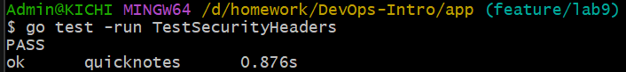
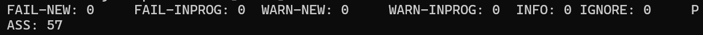

# Lab 10

Frolova AI - M25RO-01

a.frolova@innopolis.university

Ссылка на PR: https://github.com/inno-devops-labs/DevOps-Intro/pull/1410

## Task1

## Task 1 — CI-Automated Push to `ghcr.io` (6 pts)

### Release workflow

Файл `.github/workflows/release.yml` создан и настроен на push по тегу `v*`.

### Успешный CI

Такое название, потому что засабмитила не все файлы изначально.

### Публичный образ

### Ответы на вопросы

a) OIDC vs GITHUB_TOKEN — for pushing to ghcr.io from the same repo, GITHUB_TOKEN with packages: write is enough. When would you reach for OIDC instead, and what does it give you that GITHUB_TOKEN doesn't?

`GITHUB_TOKEN` с правами `packages: write` достаточно для пуша в `ghcr.io` внутри того же репозитория. OIDC используют, когда нужно получить временный токен для доступа к внешним облакам (AWS, GCP, Azure) без хранения долгоживущих секретов. OIDC даёт **безопасный short-lived доступ** на основе JWT, который нельзя украсть и использовать повторно.

---

b) :latest tag vs :v0.1.0 immutable tag — Lab 6 covered why :latest is mutable. So why do you still ship a :latest tag alongside the immutable one in production releases?

`:latest` — мутабельный тег, его удобно использовать для разработки и CI (всегда можно сослаться на «свежий» образ). `:v0.1.0` — фиксированный, воспроизводимый тег для продакшена. `:latest` нужен, чтобы разработчики и CI могли всегда получить актуальную версию, не обновляя теги вручную, но при этом для продакшена используется конкретная версия.

---

c) packages: write scope only — what's the principle, and what concrete attack does the narrow scope prevent vs write: all?

Принцип **наименьших привилегий**. Ограничение `packages: write` не даёт злоумышленнику (или ошибке в CI) делать ничего, кроме пуша в registry. Если бы был `write: all`, атакующий мог бы изменять код, выдавать разрешения или удалять важные ресурсы.

## Task2

<!--  -->

Hugging Face решил, что бесплатные лимиты потрачены...

Создан Space, склонирован:

<!--  -->

Успешный push:

И так как были потрачены лимиты (я делала несколько новых space чтобы успеть хоть что-то заскринить пока все не пропадет), не получается показать вывод команды `health` и выполнить другие требования к работе.

**Space URL:** `https://kicchhi-quicknotes-lab10.hf.space`  

Опять же, из-за лимитов, Space открывается только до момента, пока туда что-то не запушить.

По этим же причинам не удается провести замеры warm latency, cold start.

### Ответы на вопросы

d) HF Spaces "sleep" vs Cloud Run "scale to zero" — same idea, different orders of magnitude. Why is HF's wake so much slower? What does the platform optimize for differently?

По логике HF Space полностью останавливает контейнер при простое, поэтому холодный старт медленный. Cloud Run держит контейнер в «спящем» состоянии, что ускоряет пробуждение.

---

e) Why does the Space need app_port: 8080? What's HF's default and why do they default to that?

HF по умолчанию использует порт 7860. QuickNotes слушает 8080, поэтому нужно явно указать `app_port: 8080` в `README.md`.

---

f) You pulled the image from ghcr.io into the Space. What's the trade-off vs building the Dockerfile inside the Space? (Hint: caching, reproducibility, debug-ability.)

Пул готового образа из `ghcr.io` быстрее и надёжнее. Сборка внутри Space может упасть из-за ограничений ресурсов.
