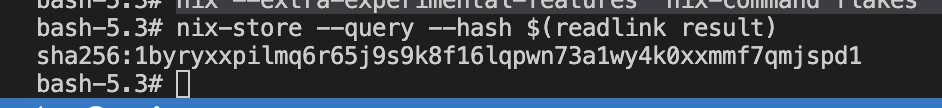
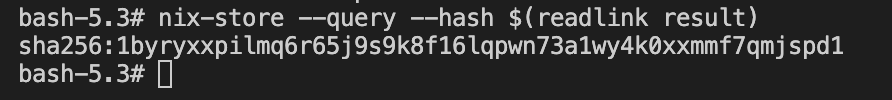

# Lab 11 — Reproducible Builds of QuickNotes with Nix

## Task 1 — Reproducible Go Build via Nix Flake

### `flake.nix`

```nix
{
  description = "Go example flake for Zero to Nix";

  inputs = {
    nixpkgs.url = "https://flakehub.com/f/NixOS/nixpkgs/0.1";
  };

  outputs =
    { self, nixpkgs }:
    let
      # Systems supported
      allSystems = [
        "x86_64-linux" # 64-bit Intel/AMD Linux
        "aarch64-linux" # 64-bit ARM Linux
        "x86_64-darwin" # 64-bit Intel macOS
        "aarch64-darwin" # 64-bit ARM macOS
      ];

      # Helper to provide system-specific attributes
      forAllSystems =
        f:
        nixpkgs.lib.genAttrs allSystems (
          system:
          f {
            pkgs = import nixpkgs { inherit system; };
          }
        );
    in
    {
      packages = forAllSystems (
        { pkgs }:
        let
          quicknotes = pkgs.buildGoModule {
            name = "quicknotes";
            src = ./app;
            vendorHash = null;
            env.CGO_ENABLED = 0;
            ldflags = [ "-s" "-w" ];
          };
        in
        {
          inherit quicknotes;
          default = quicknotes;
        }
      );

      devShells = forAllSystems (
        { pkgs }:
        {
          default = pkgs.mkShell {
            inputsFrom = [ self.packages.${pkgs.system}.default ];
            packages = [ pkgs.go pkgs.gopls pkgs.golangci-lint ];
          };
        }
      );
    };
}
```

`flake.lock` pins `nixpkgs` to revision `8d4ddb19d03c65a36ad8d189d001dc32ffb0306b` (committed alongside `flake.nix`).

### `nix build .#quicknotes` log excerpt

```
quicknotes> Running phase: unpackPhase
quicknotes> unpacking source archive /nix/store/apz8fpz9xx3rh927h3jwdnfp1wa9wvf1-app
quicknotes> source root is app
quicknotes> Running phase: patchPhase
quicknotes> Running phase: updateAutotoolsGnuConfigScriptsPhase
quicknotes> Running phase: configurePhase
quicknotes> Running phase: buildPhase
quicknotes> Building subPackage .
quicknotes> Running phase: checkPhase
quicknotes> ok          quicknotes      0.373s
quicknotes> Running phase: installPhase
quicknotes> Running phase: fixupPhase
quicknotes> checking for references to /nix/var/nix/builds/... in /nix/store/0sdif9cil1hjrkx3ivijky6a7rnz3alm-quicknotes...
quicknotes> patching script interpreter paths in /nix/store/0sdif9cil1hjrkx3ivijky6a7rnz3alm-quicknotes
quicknotes> stripping (with command strip and flags -S) in /nix/store/0sdif9cil1hjrkx3ivijky6a7rnz3alm-quicknotes/bin
```

**Note on `vendorHash = null`:** `app/go.mod` declares no external dependencies (`module quicknotes; go 1.24`, no `require` block), so `go mod vendor` produces an empty vendor directory. Setting any real SRI hash there causes the build to fail with:

```
go: no dependencies to vendor
vendor folder is empty, please set 'vendorHash = null;' in your expression
```

`null` is the value nixpkgs itself asks for in this case — not a placeholder, but the documented, correct setting when there is nothing to vendor.

### Reproducibility proof — two independent Linux sandboxes

Two fresh `docker run --rm -it -v "$PWD:/repo" -w /repo nixos/nix bash` environments, each running:

```bash
nix --extra-experimental-features 'nix-command flakes' build .#quicknotes
nix-store --query --hash $(readlink result)
```

First sandbox:


Second sandbox:


Both report the **identical** store hash:

```
sha256:1byryxxpilmq6r65j9s9k8f16lqpwn73a1wy4k0xxmmf7qmjspd1
```

(For reference, building natively on `aarch64-darwin` produces a *different* hash, `sha256:0c34wclh4jiayj71m3nm0r0fslzmgrs4x8y5b7p7ix5617ma27sr` — expected, since the Nix store path depends on the target system/platform. Reproducibility is asserted per-system: two builds on the same `system` must match, which the two `x86_64-linux` sandboxes above confirm.)

### `/health` proof

```
$ ./result/bin/quicknotes &
2026/07/15 quicknotes listening on :8080 (notes loaded: 0)
$ curl -s localhost:8080/health
{"notes":0,"status":"ok"}
```

### Design questions

**a) Why doesn't `go build` produce bit-identical outputs on two machines, even from the same Git SHA?**

Several non-deterministic inputs leak into a plain `go build` binary: a random build ID embedded for build-cache invalidation, source/module-cache file paths embedded in debug info unless `-trimpath` is used, and any drift in local Go toolchain patch version or CGO/C toolchain between machines. `buildGoModule` avoids all of this by building inside a sandboxed, network-isolated derivation with a pinned Go compiler (via `flake.lock`), content-addressed source, and `-ldflags "-s -w"` which strips the symbol table and debug info — the main place build IDs and paths live.

**b) `vendorHash` is a SHA over what, exactly? What happens if you set `vendorHash = null`?**

It's an SRI-encoded SHA-256 over the contents of the `vendor/` directory that `go mod vendor` produces from `go.mod`/`go.sum` — it lets Nix fetch and verify Go module dependencies deterministically in a separate fixed-output derivation, without network access during the main build. Setting `vendorHash = null` skips vendoring/verification entirely. Here that's correct because there are zero dependencies to vendor (verified directly — see log excerpt above). For a project with real dependencies, `null` would be dangerous since it disables integrity checking on fetched deps; nixpkgs would refuse and demand a real hash in that case.

**c) `flake.lock` pins nixpkgs. Why is this the single most important file for reproducibility? What happens if you delete it before the second build?**

`flake.lock` pins the exact nixpkgs revision (here `8d4ddb19d03c65a36ad8d189d001dc32ffb0306b`, with a `narHash` integrity check) that `inputs.nixpkgs` resolves to. Nixpkgs moves constantly — package/compiler versions and even `buildGoModule`'s internals change over time. Deleting `flake.lock` before a second build causes `nix build` to re-resolve `inputs.nixpkgs.url` (a FlakeHub floating range in this flake) to whatever the *current* latest revision is, likely pulling a different Go compiler version and producing a **different** output hash from the identical Git SHA of the app source — exactly the "different hashes on two machines" pitfall the lab calls out.

**d) `buildGoModule` vs `buildGoApplication` — what's the difference? Which would you pick for QuickNotes and why?**

`buildGoModule` is nixpkgs' built-in builder: it vendors dependencies via `go mod vendor` in a fixed-output derivation keyed by `vendorHash`, then builds from that vendor snapshot. `buildGoApplication` comes from the third-party `gomod2nix` project: it uses a `gomod2nix.toml` lockfile (generated by a companion CLI) mapping each dependency to its own Nix store path/hash individually, giving finer-grained per-dependency caching instead of one vendor blob.

QuickNotes has zero external dependencies, so gomod2nix's per-dependency caching offers no benefit here, and it would add an extra flake input and companion tool for no gain. `buildGoModule` is nixpkgs-native, needs no extra tooling, and is the simplest path to the same reproducibility guarantee — so that's what this flake uses.

---

## Task 2 — Deterministic OCI Image

### Extended `flake.nix` (docker output)

```nix
# Docker images are always Linux; cross-compile explicitly rather than
# reusing `quicknotes`, which targets the host's own OS (may be Darwin).
quicknotesLinux = quicknotes.overrideAttrs (old: {
  env = (old.env or { }) // {
    GOOS = "linux";
    GOARCH = "amd64";
  };
  doCheck = false; # cross-compiled test binary can't run on the build host
});

docker = pkgs.dockerTools.buildImage {
  name = "quicknotes";
  tag = "latest";
  copyToRoot = pkgs.buildEnv {
    name = "quicknotes-root";
    paths = [ quicknotesLinux ];
    pathsToLink = [ "/bin" ];
  };
  # /data must be writable by the nonroot user, and the seed file
  # needs to live somewhere readable without a bind mount.
  extraCommands = ''
    mkdir -p data
    chmod 0777 data
    cp ${./app/seed.json} seed.json
  '';
  config = {
    Entrypoint = [ "/bin/linux_amd64/quicknotes" ];
    ExposedPorts = {
      "8080/tcp" = { };
    };
    Env = [
      "DATA_PATH=/data/notes.json"
      "SEED_PATH=/seed.json"
    ];
    User = "65532:65532";
  };
};
```

**Why cross-compile explicitly:** on a Darwin build host, `quicknotes` (built by the plain `buildGoModule` call for Task 1) targets Darwin — running it inside a Linux OCI image fails with `exec format error`. `dockerTools.buildImage` always produces a Linux image, so the binary destined for it must be forced to `GOOS=linux`. Since `CGO_ENABLED=0`, cross-compiling is just a Go toolchain flag flip, no cross C toolchain needed — but `go test` (run in `checkPhase`) can't execute a cross-compiled binary on the build host, so `doCheck = false` on this variant (the native-target `quicknotes` package still runs its full test suite). Go's install convention also places cross-compiled binaries under `bin/$GOOS_$GOARCH/`, hence the `linux_amd64` path segment in `Entrypoint`.

**Why the writable `/data` + seed file:** the app defaults to a relative `data/notes.json` path and expects to `mkdir` it on first boot. Carrying forward Lab 6's `docker-compose.yml` convention (`DATA_PATH=/data/notes.json`, `SEED_PATH=/seed.json`), the image ships `/data` pre-created and world-writable (only UID `65532` ever runs in the container, so this doesn't broaden real access) and `seed.json` baked in at `/seed.json`.

**Nonroot user:** `User = "65532:65532"` — a numeric UID:GID needs no `/etc/passwd` entry, matching Lab 6's Dockerfile convention (`useradd -u 65532 nonroot`).

### `nix build .#docker` proof — runs correctly

```
$ docker load < result
Loaded image: quicknotes:latest
$ docker run -d --name qn -p 8086:8080 quicknotes:latest
$ curl -s localhost:8086/health
{"notes":4,"status":"ok"}
$ docker logs qn
2026/07/15 quicknotes listening on :8080 (notes loaded: 4)
$ docker inspect --format='User: {{.Config.User}} | Entrypoint: {{.Config.Entrypoint}} | ExposedPorts: {{.Config.ExposedPorts}}' quicknotes:latest
User: 65532:65532 | Entrypoint: [/bin/linux_amd64/quicknotes] | ExposedPorts: map[8080/tcp:{}]
```

### Reproducibility proof — two independent Nix builds

```
$ nix build .#docker && sha256sum result
a5b693038f9b347a0f3a34de0e90bbf9402fac35fb33f5bc14af6e10bcd6cf4f  result

$ nix build .#docker --rebuild && sha256sum result
a5b693038f9b347a0f3a34de0e90bbf9402fac35fb33f5bc14af6e10bcd6cf4f  result
```

Identical digest across a from-scratch rebuild — confirming `dockerTools.buildImage` produces byte-identical tarballs.

### Comparison with Lab 6's Dockerfile build

Building Lab 6's `Dockerfile` twice with `--no-cache`, same source, same machine:

```
$ docker build --no-cache -t qn-lab6:run1 ./app
$ docker build --no-cache -t qn-lab6:run2 ./app
$ docker images --no-trunc qn-lab6
REPOSITORY   TAG    IMAGE ID
qn-lab6      run1   sha256:8298c7dd17d3f1b1c061960df95b8b529e3c93f7a7566be7836ffb6252de9a7d
qn-lab6      run2   sha256:978f99a6642c2b50c19250526bec7115e528159580c31ac7b52f4b6ad4ee87d3
```

The digests **differ** — as expected, from embedded build timestamps in Docker's layer metadata — even though both builds used the identical Dockerfile and source tree.

### Image size comparison

| Image | Size |
|---|---|
| Nix (`dockerTools.buildImage`) | 8.49 MB |
| Lab 6 (`docker build`, scratch-based) | 5.51 MB |

The Nix image is somewhat larger mainly because `buildGoModule`'s Go toolchain pulls in `tzdata` as a runtime closure dependency by default; Lab 6's Dockerfile copies only the raw binary with no timezone database. Both are single static Go binaries on a scratch-equivalent base, so the difference is data, not layering overhead.

### Design questions

**e) `dockerTools.buildImage` produces a deterministic image. What does `docker build` do that introduces non-determinism, even from the same Dockerfile + Git SHA?**

`docker build` records real wall-clock timestamps in each layer's metadata (`created` field) and in file mtimes as they're copied/generated, and layer digests are content-addressed *including* that metadata — so identical file content still produces different layer digests run-to-run. It may also pull a different upstream base-image digest if the tag has moved, and build-time package manager operations (`apt-get update`, etc.) can resolve different package versions depending on when the build runs. `dockerTools.buildImage`, by contrast, has no timestamps in the mix at all: Nix sets all file mtimes to a fixed epoch, layers are built directly from a content-addressed Nix store path, and there's no base image or package-manager step to reintroduce time-dependent state.

**f) For a security auditor, what can you prove with a reproducible image that you cannot prove with a signed-but-non-reproducible image?**

A signature only proves *who* published the image — it says nothing about *what's actually inside it* versus what the source claims to contain. With a reproducible build, anyone (not just the publisher) can rebuild from the public source at the pinned revision and get the byte-identical digest, independently confirming the image contains exactly what the source says and nothing else — no injected backdoor, no extra dependency, no build-time tampering. Reproducibility turns "trust the vendor's signature" into "verify it yourself," which is a categorically stronger guarantee for supply-chain auditing.

**g) What's the trade-off of Nix's reproducibility? Why is `docker build` still the default for most teams?**

The cost is complexity and ecosystem friction: writing correct Nix expressions has a steep learning curve (evidenced by the errors I hit above — GOOS/GOARCH cross-compilation, the `bin/$GOOS_$GOARCH` install path, nonroot filesystem permissions), the Nix/nixpkgs ecosystem is smaller than Docker's, first builds are slow while populating the local store, and every language/dependency ecosystem needs its own nixpkgs builder (not all are as mature as `buildGoModule`). `docker build` remains the default because Dockerfiles are simple, universally understood, and every base image/tool already ships one — teams get "good enough" reproducibility (same Dockerfile, same base tag, mostly-same result) without paying Nix's learning curve, and most teams don't have a hard requirement for bit-for-bit verifiable builds the way a security-sensitive supply chain does.
