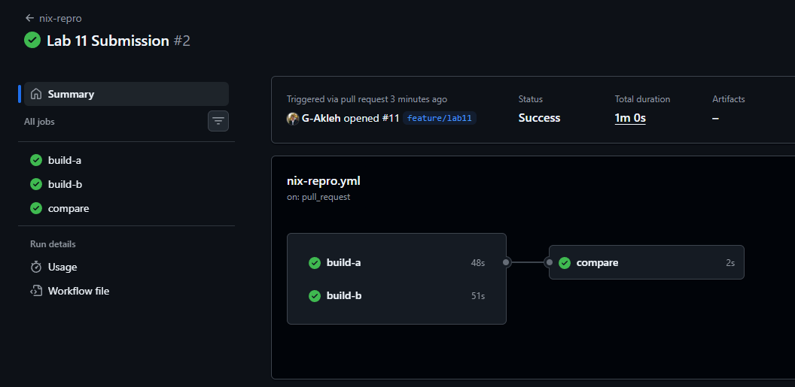

# Lab 11 Submission

## Task 1: Reproducible Go Build via Nix Flake

### Environment

Nix is not installed on my Windows host (it does not run natively on Windows),
so I ran every Nix command in this lab inside the official `nixos/nix` Docker
image. "Two independent environments" means two separate 
`docker run --rm nixos/nix` containers, each with its own empty `/nix` store.

Extra Windows specific detail: this repo checks files out with CRLF line endings
(`core.autocrlf=true`) while git stores LF, so building from the mounted
working tree would hash bytes that no Linux clone (grader, CI runner) would
ever see. Each container therefore unpacks a `git archive` tarball of the git
index at `/work`: exactly the LF bytes of a fresh Linux clone, tracked files
only. Note the `-c core.autocrlf=false` below: without it `git archive` applies
the same CRLF conversion as checkout, which we caught when a CRLF-poisoned
build script broke the Task 2 image build. I executed commands
non-interactively in each container; the full build logs are captured in the
linked files in `submissions/artifactsLab11/`.

Source tarball preparation (on the host):

```
git add flake.nix flake.lock
git write-tree
git -c core.autocrlf=false archive -o <scratch>/src.tar <tree-id>
```

Container entry and source setup (identical for both environments):

```
docker run --rm -v "<scratch>:/host" nixos/nix ...
mkdir -p /work && tar -xf /host/src.tar -C /work && cd /work
```

### flake.nix

See [`flake.nix`](/flake.nix) and the committed [`flake.lock`](/flake.lock), pasted for reference
(the Task 2 `docker` output is shown in the Task 2 section):

```nix
{
  description = "QuickNotes: reproducible Go build + OCI image (DevOps-Intro Lab 11)";

  inputs = {
    # Pinned channel; nixos-25.11 ships Go >= 1.24 as the default toolchain,
    # which app/go.mod requires. The exact revision is locked in flake.lock.
    nixpkgs.url = "github:NixOS/nixpkgs/nixos-25.11";
  };

  outputs = { self, nixpkgs }:
    let
      systems = [ "x86_64-linux" "aarch64-linux" ];
      forAllSystems = f: nixpkgs.lib.genAttrs systems (system: f nixpkgs.legacyPackages.${system});
    in
    {
      packages = forAllSystems (pkgs:
        let
          quicknotes = pkgs.buildGoModule {
            pname = "quicknotes";
            version = "0.1.0";
            src = ./app;

            # QuickNotes has no third-party Go dependencies (go.mod has no
            # require block), so there is no vendor tree to hash. The first
            # build with a placeholder hash fails with:
            #   "vendor folder is empty, please set 'vendorHash = null;'"
            # null skips the fixed-output vendor derivation entirely; builds
            # are network-isolated regardless, so nothing is left unpinned.
            vendorHash = null;

            # Static binary: no cgo, no libc, runs on scratch/distroless.
            # (This nixpkgs revision keeps CGO_ENABLED inside `env`, so it
            # must be set there; a top-level attr collides.)
            env.CGO_ENABLED = 0;

            # Strip symbol table + DWARF (carried over from Lab 6).
            # buildGoModule already passes -trimpath by itself.
            ldflags = [ "-s" "-w" ];
          };

          docker = ...;  # Task 2, see below
        in
        {
          inherit quicknotes docker;
          default = quicknotes;
        });

      devShells = forAllSystems (pkgs: {
        default = pkgs.mkShell {
          packages = with pkgs; [ go gopls golangci-lint ];
        };
      });
    };
}
```

`flake.lock` pins nixpkgs to `nixos-25.11` at commit
`b6018f87da91d19d0ab4cf979885689b469cdd41` (2026-06-30).

### The vendorHash flow (first build fails on purpose)

The "`got:` hash" flow ends differently for a zero-dependency
module. The first build ran with the placeholder `vendorHash = pkgs.lib.fakeHash`:

```
nix --extra-experimental-features 'nix-command flakes' build .#quicknotes --out-link /tmp/result
```

Output (last lines; full log output in
[`artifactsLab11/task1-vendorhash-fail.log`](artifactsLab11/task1-vendorhash-fail.log)):

```
building '/nix/store/m09qz3c4plp1ncbc33zr3rh4mnm4w73n-quicknotes-0.1.0-go-modules.drv'...
error: Cannot build '/nix/store/m09qz3c4plp1ncbc33zr3rh4mnm4w73n-quicknotes-0.1.0-go-modules.drv'.
       Reason: builder failed with exit code 10.
       Last 10 log lines:
       > Running phase: buildPhase
       > go: no dependencies to vendor
       > Running phase: installPhase
       > vendor folder is empty, please set 'vendorHash = null;' in your expression
```

`app/go.mod` has no `require` block, so `go mod vendor` produces an empty tree
and there is nothing to pin. The builder itself names the correct value:
`vendorHash = null`. With null the vendor derivation is skipped; the build is
still fully network-isolated.

### Build

Command (environment A) (the flag enables flakes, which the container image
does not enable by default):

```
nix --extra-experimental-features 'nix-command flakes' build .#quicknotes --out-link /tmp/result
```

Output (last lines; full log output in
[`artifactsLab11/task1-build-envA.log`](artifactsLab11/task1-build-envA.log)):

```
copying path '/nix/store/hqkszxk2c0cxvd04xa4gsaqs182dw8l2-coreutils-9.8' from 'https://cache.nixos.org'...
copying path '/nix/store/cw3a3yz8vrfsz53ypjw8hspy5hzzx2py-diffutils-3.12' from 'https://cache.nixos.org'...
copying path '/nix/store/8xhaz2ysixijy8sgzmwmhlialqqind1p-findutils-4.10.0' from 'https://cache.nixos.org'...
copying path '/nix/store/iz5lckcsg66r223si2gck7csk2hihj0m-binutils-wrapper-2.44' from 'https://cache.nixos.org'...
copying path '/nix/store/8v97ngkcpfzgghwnnr7fsz33p2x22gy9-gcc-wrapper-14.3.0' from 'https://cache.nixos.org'...
copying path '/nix/store/0i25iw4373868kjqhafvmd6pn1wwzkh3-stdenv-linux' from 'https://cache.nixos.org'...
building '/nix/store/v4q2ddc492hzmiwv3r5jw0nmvib6j046-quicknotes-0.1.0.drv'...
```

```
ls -l /tmp/result/bin/
```

```
total 11284
-r-xr-xr-x 1 root root 5628304 Jan  1  1970 healthcheck
-r-xr-xr-x 1 root root 5918800 Jan  1  1970 quicknotes
```

Both binaries come from the module build (`.` and `./healthcheck`). The
Jan 1 1970 timestamps are Nix normalizing mtimes in the store.

### Runtime verification

The Nix-built binary was started with the app's env vars and probed
(environment A):

```
DATA_PATH=/tmp/data/notes.json SEED_PATH=/work/app/seed.json /tmp/result/bin/quicknotes &
sleep 2
curl -s http://localhost:8080/health
```

```
{"notes":4,"status":"ok"}
```

Application log:

```
2026/07/15 00:07:07 quicknotes listening on :8080 (notes loaded: 4)
```

The companion `/tmp/result/bin/healthcheck` binary (Lab 6's probe) was also run
against the server and exited 0.

### Reproducibility proof

#### Environment A (container 1, own empty /nix store)

```
readlink /tmp/result
nix-store --query --hash $(readlink /tmp/result)
```

```
/nix/store/jsx5jn50f1mbms9ma9k4bv4b9w90w9m2-quicknotes-0.1.0
sha256:1r9ihzwixzas6h920ifdaaznhfk7dybjqdxq0drl7crw110q46hf
```

#### Environment B (container 2, own empty /nix store, same source tarball)

Same build command; full log output in
[`artifactsLab11/task1-build-envB.log`](artifactsLab11/task1-build-envB.log).

```
readlink /tmp/result
nix-store --query --hash $(readlink /tmp/result)
```

```
/nix/store/jsx5jn50f1mbms9ma9k4bv4b9w90w9m2-quicknotes-0.1.0
sha256:1r9ihzwixzas6h920ifdaaznhfk7dybjqdxq0drl7crw110q46hf
```

Identical store path and identical NAR hash across two independent builds.
(Environment B also served `/health` with the same `{"notes":4,"status":"ok"}`
response.)

### Design Questions

**a) Why does `go build` not produce bit-identical outputs on two machines?**

Plain `go build` bakes in machine-specific state: absolute paths (without
`-trimpath`), a build ID derived from the local toolchain, and VCS dirty-state.
Two machines can also use different Go patch versions, so the bytes differ even
from the same Git SHA.

**b) `vendorHash` is a SHA over what? What does `vendorHash = null;` do?**

It is the SRI SHA-256 of the vendored Go dependency tree (`go mod vendor`),
pinning those dependencies byte-for-byte. `null` skips that vendor derivation,
which is correct only when there are no external dependencies to pin, as with
QuickNotes.

**c) Why is `flake.lock` the single most important file for reproducibility?**

`nixos-25.11` in `inputs` is a moving branch; `flake.lock` freezes it to one
commit, which transitively pins the Go toolchain, stdenv, and every nixpkgs
build flag. Delete it before the second build and Nix re-resolves the branch
head, giving a different derivation and a different hash.

**d) `buildGoModule` vs `buildGoApplication`, which for QuickNotes?**

`buildGoModule` (in nixpkgs) pins all dependencies with one `vendorHash`;
`buildGoApplication` (gomod2nix) needs an extra tool and a generated manifest
to get per-dependency caching. QuickNotes has no dependencies, so that
granularity buys nothing and I chose `buildGoModule`.

## Task 2: Deterministic OCI Image

### Flake extension

The `docker` package in [`flake.nix`](/flake.nix) builds the OCI image with
`pkgs.dockerTools.buildImage`, using only Nix (no Docker daemon, no `FROM`):

```nix
          # Deterministic OCI image, built by Nix alone (no Docker daemon,
          # no FROM). Contents: the static quicknotes closure + the few
          # files created in extraCommands.
          docker = pkgs.dockerTools.buildImage {
            name = "quicknotes";
            tag = "lab11";

            copyToRoot = quicknotes;

            # Filesystem extras, packed into the single layer as uid 0.
            # /etc/passwd + /etc/group define the nonroot user (65532,
            # same as distroless in Lab 6). /data is world-writable so the
            # nonroot app can seed notes.json when no volume is mounted;
            # in real deployments a volume mounts over it (Lab 6 compose).
            extraCommands = ''
              mkdir -p data etc
              chmod 0777 data
              printf 'root:x:0:0:root:/root:/sbin/nologin\nnonroot:x:65532:65532:nonroot:/:/sbin/nologin\n' > etc/passwd
              printf 'root:x:0:\nnonroot:x:65532:\n' > etc/group
              cp ${./app/seed.json} seed.json
            '';

            # Fixed creation time (the buildImage default, made explicit):
            # wall-clock time must not leak into the image metadata.
            created = "1970-01-01T00:00:01Z";

            config = {
              Entrypoint = [ "/bin/quicknotes" ];
              ExposedPorts."8080/tcp" = { };
              User = "nonroot:nonroot";
              Env = [
                "ADDR=:8080"
                "DATA_PATH=/data/notes.json"
                "SEED_PATH=/seed.json"
              ];
            };
          };
```

The env vars mirror Lab 6's compose file, so the image is a drop-in
replacement for the Dockerfile-built one.

### Build

Command (same two containers as Task 1; each environment built the image
right after its Task 1 build):

```
nix --extra-experimental-features 'nix-command flakes' build .#docker --out-link /tmp/image
```

Output (last lines; full log output in
[`artifactsLab11/task2-build-envA.log`](artifactsLab11/task2-build-envA.log)):

```
building '/nix/store/lzazs42qw2xhmvr5m0pzb36blp0mxfpa-docker-layer-quicknotes.drv'...
building '/nix/store/awha70hl0nh2f1j1pl7vrc06s08mxn7i-runtime-deps.drv'...
copying path '/nix/store/329mivmib3802jlxh28x068s5w12l814-perl-5.40.0-env' from 'https://cache.nixos.org'...
copying path '/nix/store/l0qhyid5kagg1b8zss8im3brp6xmbj8s-moreutils-0.70' from 'https://cache.nixos.org'...
building '/nix/store/lbg0xqhlcmfqjdvig8k591rrsifwrwnm-docker-image-quicknotes.tar.gz.drv'...
```

### Reproducibility proof

#### Environment A (container 1)

```
readlink /tmp/image
sha256sum /tmp/image
```

```
/nix/store/h2b3lmhhfaf9m92qpbkx0yc5l43rw46g-docker-image-quicknotes.tar.gz
af01698521b3a17e7dd169db1eb6107c6481d8e5f4d55155fd7c4700100f3834  /tmp/image
```

#### Environment B (container 2, own empty /nix store)

Same build command; full log output in
[`artifactsLab11/task2-build-envB.log`](artifactsLab11/task2-build-envB.log).

```
readlink /tmp/image
sha256sum /tmp/image
```

```
/nix/store/h2b3lmhhfaf9m92qpbkx0yc5l43rw46g-docker-image-quicknotes.tar.gz
af01698521b3a17e7dd169db1eb6107c6481d8e5f4d55155fd7c4700100f3834  /tmp/image
```

Identical SHA-256 image tarball digest across two independent builds.

### Load and run with Docker (host)

The environment A tarball was copied to the host and loaded:

```
docker load -i quicknotes-lab11-image.tar.gz
```

```
Loaded image: quicknotes:lab11
```

```
docker image inspect quicknotes:lab11 --format 'Entrypoint={{json .Config.Entrypoint}} User={{json .Config.User}} Ports={{json .Config.ExposedPorts}} Env={{json .Config.Env}}'
```

```
Entrypoint=["/bin/quicknotes"] User="nonroot:nonroot" Ports={"8080/tcp":{}} Env=["ADDR=:8080","DATA_PATH=/data/notes.json","SEED_PATH=/seed.json"]
```

```
docker run --rm -d --name quicknotes-nix -p 18080:8080 quicknotes:lab11
sleep 3
curl -s http://localhost:18080/health
```

```
c00cd6af8b16bc4f1a7f9b1e95946b60b37d4dcc0a220526a2d2f6a97712f78e
{"notes":4,"status":"ok"}
```

```
docker logs quicknotes-nix
docker stop quicknotes-nix
```

```
2026/07/15 00:02:15 quicknotes listening on :8080 (notes loaded: 4)
```

### Comparison with the Lab 6 Dockerfile build

The Lab 6 image was built twice from the same context with `--no-cache`
(full build logs at [`artifactsLab11/task2-lab6-docker-run1.log`](artifactsLab11/task2-lab6-docker-run1.log)
and [`artifactsLab11/task2-lab6-docker-run2.log`](artifactsLab11/task2-lab6-docker-run2.log)):

```bash
docker build --no-cache -t qn-lab6:run1 ./app
docker build --no-cache -t qn-lab6:run2 ./app
docker images --no-trunc qn-lab6
```
Output:
```
REPOSITORY   TAG       IMAGE ID                                                                  CREATED                  SIZE
qn-lab6      run2      sha256:91dbb521b156f1a1adcb6c15f6dfa31e8aa772b57b762ec505d5d39c4e113f4c   Less than a second ago   13.7MB
qn-lab6      run1      sha256:3a198f4d86eee0df75faf1e687789dc9e766f8c67ae768d40c973e8511bbf39c   10 seconds ago           13.7MB
```

Two back-to-back `--no-cache` builds of the identical Dockerfile and context
produced different image IDs. The Nix image digest was identical across two
independent environments.

### Image-size comparison

```
docker images --format 'table {{.Repository}}:{{.Tag}}\t{{.Size}}' quicknotes:lab11 qn-lab6
```

| Image | Size |
| ----- | ---- |
| `quicknotes:lab11` (Nix, loaded) | 14.1 MB |
| `quicknotes:lab11` tarball (`.tar.gz` as built) | 5.6 MB |
| `qn-lab6:run1` / `run2` (Dockerfile, distroless) | 13.7 MB |

Comparable size: the Nix image carries the same two static binaries plus the
seed file; the extra 0.4 MB versus distroless static comes mostly from image
packaging differences, not from a base layer.

### Design Questions

**e) What does `docker build` do that introduces non-determinism?**

`docker build` stamps build-time mtimes into every layer and a wall-clock
`created` into the config, so identical content still hashes differently each
run; mutable `FROM` tags and networked `RUN` steps add more drift.
`dockerTools.buildImage` avoids all of it with normalized mtimes, a fixed
`created`, and no network during the build.

**f) What can an auditor prove with a reproducible image that a signature cannot?**

A signature proves who approved the bytes, not how they were produced. A
reproducible image lets an auditor rebuild from source with the locked inputs
and byte-compare digests, proving the artifact really is that source with no
build-time injection (the xz-utils lesson). The two are complementary:
reproducibility ties artifact to source, signing ties it to a publisher.

**g) What is the trade-off? Why is `docker build` still the default?**

Nix costs an unusual language, strict purity, slow cold builds, and a large
`/nix` store. Dockerfiles are familiar and wired into every CI system and
registry, and most teams only need "repeatable enough", so they reach for Nix
only when supply-chain proof or hermetic builds are a real requirement.

## Bonus Task: CI-Verified Reproducibility

### Workflow

The gate lives at [`.github/workflows/nix-repro.yml`](/.github/workflows/nix-repro.yml).
Two jobs (`build-a`, `build-b`) run on two independently provisioned
`ubuntu-latest` runners; each installs Nix, runs `nix build .#docker`, and
publishes `sha256sum result` as a job output. A third job (`compare`) reads
both outputs and fails the workflow if they differ. Both actions are pinned by
40-char commit SHA (Lab 3 rule).

On the Linux runners no `git archive` dance is needed: a plain checkout is
already LF (the runner is the "real Linux clone" the Task 1 CRLF workaround was
protecting against), and the Determinate installer enables flakes, so the bare
`nix build .#docker` from the lab works as-is.

```yaml
name: nix-repro

on:
  push:
  pull_request:
  workflow_dispatch:
    inputs:
      break_repro:
        description: "Force a digest mismatch in build-a (red-run demo)"
        type: boolean
        default: false

permissions:
  contents: read

jobs:
  build-a:
    runs-on: ubuntu-latest
    outputs:
      digest: ${{ steps.digest.outputs.sha256 }}
    steps:
      - uses: actions/checkout@9c091bb21b7c1c1d1991bb908d89e4e9dddfe3e0 # v7.0.0
      - name: Install Nix
        uses: DeterminateSystems/nix-installer-action@ef8a148080ab6020fd15196c2084a2eea5ff2d25 # v22
      - name: Break reproducibility (demo only)
        if: ${{ inputs.break_repro }}
        run: |
          sed -i 's/created = "1970-01-01T00:00:01Z";/created = "2020-02-02T02:02:02Z";/' flake.nix
          echo "::warning::break_repro enabled: build-a flake.created changed to force a digest mismatch"
      - name: Build OCI image
        run: nix build .#docker
      - name: Compute image digest
        id: digest
        run: echo "sha256=$(sha256sum result | awk '{print $1}')" >> "$GITHUB_OUTPUT"
      - name: Show digest
        run: echo "build-a digest = ${{ steps.digest.outputs.sha256 }}"

  build-b:
    runs-on: ubuntu-latest
    outputs:
      digest: ${{ steps.digest.outputs.sha256 }}
    steps:
      - uses: actions/checkout@9c091bb21b7c1c1d1991bb908d89e4e9dddfe3e0 # v7.0.0
      - name: Install Nix
        uses: DeterminateSystems/nix-installer-action@ef8a148080ab6020fd15196c2084a2eea5ff2d25 # v22
      - name: Build OCI image
        run: nix build .#docker
      - name: Compute image digest
        id: digest
        run: echo "sha256=$(sha256sum result | awk '{print $1}')" >> "$GITHUB_OUTPUT"
      - name: Show digest
        run: echo "build-b digest = ${{ steps.digest.outputs.sha256 }}"

  compare:
    needs: [build-a, build-b]
    runs-on: ubuntu-latest
    steps:
      - name: Compare digests
        run: |
          a='${{ needs.build-a.outputs.digest }}'
          b='${{ needs.build-b.outputs.digest }}'
          echo "build-a: $a"
          echo "build-b: $b"
          if [ -z "$a" ] || [ -z "$b" ]; then
            echo "::error::a digest is empty (a build job failed)"
            exit 1
          fi
          if [ "$a" != "$b" ]; then
            echo "::error::Reproducibility FAILED: the two runners produced different digests"
            exit 1
          fi
          echo "Reproducibility OK: identical digest on two independent runners"
```

### Green run (digests match)

A normal push runs both build jobs identically, so `compare` passes.

Run URL: <https://github.com/G-Akleh/DevOps-Intro/actions/runs/29439184731>

Evidence: [`artifactsLab11/bonus-green-run.png`](artifactsLab11/bonus-green-run.png)

The Actions run graph, all three jobs green


[`artifactsLab11/bonus-green-compare.png`](artifactsLab11/bonus-green-compare.png)

The `compare` step log showing the two equal digests and "Reproducibility OK".

The `compare` log excerpt:

```
build-a: af01698521b3a17e7dd169db1eb6107c6481d8e5f4d55155fd7c4700100f3834
build-b: af01698521b3a17e7dd169db1eb6107c6481d8e5f4d55155fd7c4700100f3834
Reproducibility OK: identical digest on two independent runners
```

### Red run (deliberate divergence)

I temporarily commit a break, push, observe red, then commit the
fix. Concretely, `build-a`'s break step had its `if: ${{ inputs.break_repro }}`
guard removed for one commit, making it run unconditionally on every push. That
commit was pushed, producing the red run below.

Run URL: <https://github.com/G-Akleh/DevOps-Intro/actions/runs/29441158240>

Evidence: [`artifactsLab11/bonus-red-run.png`](artifactsLab11/bonus-red-run.png)

Run graph, `build-a`/`build-b` green but `compare` red.

[`artifactsLab11/bonus-red-compare.png`](artifactsLab11/bonus-red-compare.png)

The `compare` step log showing the two differing digests and "Reproducibility FAILED".

The `compare` log excerpt:

```
build-a: 6c7d22cf031d4747083a1b0e00edef6ee80b0d102564ab3538ee31b51c872e29
build-b: af01698521b3a17e7dd169db1eb6107c6481d8e5f4d55155fd7c4700100f3834
Error: Reproducibility FAILED: the two runners produced different digests
Error: Process completed with exit code 1.
```

The guard shown in the final workflow is the reverted, final state: the break step only runs on an
explicit `workflow_dispatch` with `break_repro = true`, once this PR is on `main` and the dropdown becomes available.

### Design Questions

**h) What makes the CI proof load-bearing versus "reproducible on my laptop"?**

A laptop match is self-attested and may lean on unrecorded local state (your
`nix.conf`, extra substituters, a warm `/nix/store`). CI builds from a clean
checkout on a fresh ephemeral runner using a committed recipe, so an auditor
can read exactly how the artifact was made and re-run it, turning "trust me"
into an independent proof.

**i) Why two parallel jobs instead of one job that builds twice?**

Two jobs land on two separately provisioned runners, so a digest match proves
the build is independent of host and runtime state. One job building twice
shares a runner and a warm `/nix/store`, so the second build just replays the
cached path and proves almost nothing.

**j) Where would a timestamp leak in, and how does `dockerTools.buildImage` handle it?**

The timestamp normally leaks through the image config's `created` field and the
file mtimes baked into the layer tarballs. `dockerTools.buildImage` defaults
`created` to the Unix epoch and normalizes store mtimes, hardcoding determinism
rather than reading `SOURCE_DATE_EPOCH`, which is why the red-run demo must
patch `created` instead.