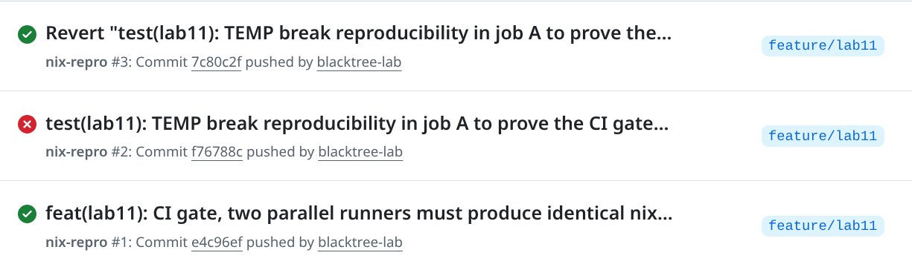

# Lab 11 Submission - Bonus: Reproducible Builds of QuickNotes with Nix

> Nix 2.31.5 (flakes enabled) · nixpkgs pinned to `nixos-25.11` via `flake.lock`

---

## Task 1 - Reproducible Go Build via Nix Flake

### 1.1 `flake.nix` (repo root)

```nix
{
  description = "QuickNotes - reproducible build (DevOps-Intro Lab 11)";

  # Pinned channel. app/go.mod requires Go >= 1.24 (nixos-24.11 only shipped 1.23).
  # flake.lock pins this to an exact revision - that lockfile is what makes the
  # build reproducible for anyone who clones the repo.
  inputs.nixpkgs.url = "github:NixOS/nixpkgs/nixos-25.11";

  outputs = { self, nixpkgs }:
    let
      system = "x86_64-linux";
      pkgs = nixpkgs.legacyPackages.${system};

      quicknotes = pkgs.buildGoModule {
        pname = "quicknotes";
        version = "0.1.0";

        src = ./app;            # go.mod lives in app/, not the repo root

        # app/go.mod declares ZERO third-party deps (pure stdlib) and there is no
        # go.sum, so there is nothing to vendor. null skips the vendor phase.
        vendorHash = null;

        env.CGO_ENABLED = 0;    # fully static binary, as in Lab 6
        ldflags = [ "-s" "-w" ];  # strip symbols + DWARF

        meta.mainProgram = "quicknotes";
      };
    in
    {
      packages.${system} = {
        inherit quicknotes;
        default = quicknotes;

        # Task 2: OCI image built by Nix - no Docker daemon, no FROM.
        docker = pkgs.dockerTools.buildImage {
          name = "quicknotes-nix";
          tag = "0.1.0";
          created = "1970-01-01T00:00:00Z";   # fixed clock, not "now"
          extraCommands = ''
            mkdir -p tmp
            chmod 1777 tmp
          '';
          config = {
            Entrypoint = [ "${quicknotes}/bin/quicknotes" ];
            ExposedPorts = { "8080/tcp" = { }; };
            User = "65532:65532";              # nonroot
            Env = [ "ADDR=:8080" "DATA_PATH=/tmp/notes.json" ];
          };
        };
      };

      devShells.${system}.default = pkgs.mkShell {
        packages = [ pkgs.go pkgs.gopls pkgs.golangci-lint ];
      };
    };
}
```

`flake.lock` is committed alongside it (nixpkgs pinned to `b6018f87da91d19d0ab4cf979885689b469cdd41`, 2026-06-30).

### 1.2 Build

```text
$ nix build .#quicknotes
warning: creating lock file "flake.lock":
- Added input 'nixpkgs':
    'github:NixOS/nixpkgs/b6018f87da91d19d0ab4cf979885689b469cdd41' (2026-06-30)

$ ls -l result
result -> /nix/store/2ssrzf1bnc848aqh4hrg4bn6zbfspjvb-quicknotes-0.1.0

$ file result/bin/quicknotes
result/bin/quicknotes: ELF 64-bit LSB executable, x86-64, statically linked, stripped
```

### 1.3 It runs

```text
$ ADDR=":8099" DATA_PATH=/tmp/qn-nix.json SEED_PATH=app/seed.json ./result/bin/quicknotes &
2026/07/12 21:49:41 quicknotes listening on :8099 (notes loaded: 4)

$ curl -s http://127.0.0.1:8099/health
{"notes":4,"status":"ok"}
```

### 1.4 Reproducibility - two independent environments

**Environment A** - Fedora host, Nix 2.31.5:
```text
$ readlink -f result
/nix/store/2ssrzf1bnc848aqh4hrg4bn6zbfspjvb-quicknotes-0.1.0

$ nix path-info --json ./result
  "narHash": "sha256-E3EjHMkKuOmVLfthPPmjfg7z+4aRgy/QZ/gDSdcEaMM=",
  "narSize": 5919288,
  "references": [ iana-etc, mailcap, tzdata ]
```

**Environment B** - fresh `nixos/nix` container (empty `/nix` store, builds from scratch):
```text
$ docker run --rm -v "$PWD:/repo" -w /repo nixos/nix bash -c '
    nix ... build .#quicknotes --no-link --print-out-paths'
building '/nix/store/rqr8c0cg970n5qz1jbf9r63a9fjanlcw-quicknotes-0.1.0.drv'...
ENV B store path: /nix/store/2ssrzf1bnc848aqh4hrg4bn6zbfspjvb-quicknotes-0.1.0
```

Note the `building '...drv'` line: the container's store was **empty**, so this was a genuine
from-scratch compile (fetching the Go toolchain from cache.nixos.org), not a cache hit — and it
still landed on the **same store path**:

```text
ENV A (Fedora host, Nix 2.31.5):  /nix/store/2ssrzf1bnc848aqh4hrg4bn6zbfspjvb-quicknotes-0.1.0
ENV B (nixos/nix container):      /nix/store/2ssrzf1bnc848aqh4hrg4bn6zbfspjvb-quicknotes-0.1.0
                                              ^^^^^^^^^^^^^^^^^^^^^^^^^^^^^^^^ identical
```

**Identical store path from two independent environments** -> the build depends only on the pinned inputs, not on the machine.

### 1.5 Design Questions

**a) Why doesn't `go build` produce bit-identical output on two machines, even from the same Git SHA?**
Several inputs leak in that Git doesn't pin:
- **Paths and build IDs** - Go embeds the build path and a build ID derived from its inputs, so building in `/home/alice/app` vs `/home/bob/app` yields different bytes (that's what `-trimpath` is for).
- **Toolchain version** - machine A has Go 1.24.3, machine B 1.25.1: different codegen and different stdlib compiled in.
- **Dependency resolution** - module downloads come from the proxy/module cache; and with CGO enabled, the host's libc/headers get linked in.
- **Environment** - `CGO_ENABLED`, `GOFLAGS`, `GOOS/GOARCH`, locale, and any `-X` ldflags that stamp a timestamp or commit.

Git pins the *source*; none of the above. Nix pins **all** of it, source, compiler, flags, and every transitive dependency, by hashing them into the store path, so any difference changes the hash rather than silently changing the binary.

**b) `vendorHash` is a SHA over what? What happens with `vendorHash = null;`?**
It's the hash of the **vendored dependency tree** - the `vendor/` directory `buildGoModule` produces by running `go mod vendor`, i.e. the exact bytes of every third-party module your `go.mod`/`go.sum` resolves to. Pinning it makes Nix verify that whole tree byte-for-byte before building: if an upstream module changed, or a proxy served tampered bytes, the hash mismatches and the build **fails loudly** instead of quietly building something else.

`vendorHash = null` tells `buildGoModule` there is **nothing to vendor** - skip the vendor fetch phase entirely. That's correct only when the module has no third-party dependencies. **QuickNotes is exactly that case**: `app/go.mod` declares zero `require`s and there is no `go.sum`, it's pure stdlib. So `null` is the honest value; a hash here would just be the hash of an empty vendor tree. If the app later gained a dependency, `null` would no longer be right and we'd have to pin a real hash.

**c) Why is `flake.lock` the single most important file for reproducibility? What if you delete it before the second build?**
`flake.nix` names a *branch* (`nixpkgs/nixos-25.11`) - and branches move. `flake.lock` pins that input to an **exact commit** (`b6018f87…`, 2026-06-30) plus its `narHash`. Everything downstream is transitively determined by that revision: the Go compiler version and its patches, stdenv, every build dependency. The lockfile is what converts "some recent nixpkgs" into "exactly these bits", which is why it matters more than any other file.

Delete it before the second build and Nix **re-resolves `nixos-25.11` to whatever it points at now**. If the channel advanced at all (a Go patch release, a stdenv tweak), you get a different compiler -> a different derivation -> a **different store path**. Same source, different result, precisely the drift the lockfile exists to eliminate. That's also why the lab's "different hashes on two machines" pitfall is almost always an uncommitted `flake.lock`.

**d) `buildGoModule` vs `buildGoApplication` — which for QuickNotes and why?**
`buildGoModule` (in nixpkgs) is the standard builder: it runs `go mod vendor` inside a fixed-output derivation whose hash you pin (`vendorHash`), then builds offline from that vendor tree. Simple — one hash to maintain, but that single hash covers **all** dependencies as one opaque blob, so bumping any dep changes it and cache reuse is coarse.

`buildGoApplication` (from `gomod2nix`) instead maps **each Go module to its own Nix derivation** via a generated `gomod2nix.toml`. That gives per-dependency granularity: change one dep and only that one rebuilds, with much better caching and no monolithic `vendorHash`. Cost: an extra tool plus a generated lockfile to keep in sync.

**For QuickNotes I chose `buildGoModule`.** The app has **zero third-party dependencies**, so per-dependency granularity buys literally nothing, `vendorHash` is simply `null`, and `buildGoModule` ships in nixpkgs with no extra tooling. Reaching for `gomod2nix` here would be complexity with no benefit.

---

## Task 2 - Deterministic OCI Image

### 2.1 The `dockerTools` output

(See the `docker` package in the flake above — `pkgs.dockerTools.buildImage`, no Docker daemon, no `FROM`; the image is exactly the runtime closure of the binary, with a fixed `created` timestamp, `Entrypoint`, `8080/tcp`, and a nonroot `User`.)

```text
$ nix build .#docker
$ ls -l result
result -> /nix/store/3frmkcy0in02ljm5q4p2sl3sjzr2n8gi-docker-image-quicknotes-nix.tar.gz

$ docker load < result
Loaded image: quicknotes-nix:0.1.0

$ docker run --rm -d -p 127.0.0.1:8097:8080 --name qn-nix quicknotes-nix:0.1.0
$ curl -s http://127.0.0.1:8097/health
{"notes":0,"status":"ok"}
```

It loads and runs as the nonroot user. (`notes:0` rather than `4` simply because no
`seed.json` is baked into the Nix image — the service itself is healthy.)

### 2.2 Two builds -> identical digest (Nix)

```text
# Environment A - Fedora host
$ nix build .#docker && sha256sum result
95377af65af7db70b39e030814c86c8d7123a43a8fa0f4df11b9ab2ac4c880ee  result

# Environment B - fresh nixos/nix container (empty /nix store, rebuilt from scratch)
$ docker run --rm -v "$PWD:/repo" -w /repo nixos/nix bash -c '... nix build .#docker ...'
ENV B store path: /nix/store/3frmkcy0in02ljm5q4p2sl3sjzr2n8gi-docker-image-quicknotes-nix.tar.gz
95377af65af7db70b39e030814c86c8d7123a43a8fa0f4df11b9ab2ac4c880ee  /nix/store/3frmkcy0in02ljm5q4p2sl3sjzr2n8gi-...tar.gz
```

**Identical SHA-256 tarball digest from two independent environments.** Unlike the store
path (which is input-addressed), `sha256sum` is a pure *content* comparison — so this proves
the produced **bytes** are the same, not merely the recipe.

### 2.3 Lab 6's `docker build` is NOT reproducible

Same Dockerfile, same source, same machine, builds minutes apart:

```text
$ docker build --no-cache -t qn-lab6:run1 ./app
$ docker build --no-cache -t qn-lab6:run2 ./app

$ docker inspect --format '{{.Id}}' qn-lab6:run1 qn-lab6:run2
sha256:69acab451b79350cd384bd2111b5b25f60f43d025825fca3e1d57ec86e446c97   <- run1
sha256:984dca5a87c6d4c4f1eba37f6d0129bbfa337f727b318ca8f8f946c451451aae   <- run2   DIFFERENT
```

The divergence goes all the way down, even the **config** blobs differ
(`sha256:69dd0e5b…` vs `sha256:f5d8d4ee…`), as do the manifests
(`sha256:61b6d21b…` vs `sha256:fd714f49…`). Nothing about the source changed; only the
build *time* did. This is exactly the non-determinism described in question (e).

| Build | Nix (`.#docker`) | Docker (`--no-cache`) |
|-------|------------------|-----------------------|
| Run 1 | `95377af6…c880ee` | `sha256:69acab45…446c97` |
| Run 2 | `95377af6…c880ee` | `sha256:984dca5a…1451aae` |
| Match? | **identical** | **different** |

### 2.4 Image size comparison

| Image | Built by | Disk usage | Content size |
|-------|----------|-----------:|-------------:|
| `quicknotes-nix:0.1.0` | Nix `dockerTools.buildImage` (no `FROM`, no Docker) | **21.6 MB** | 9.55 MB |
| `qn-lab6:run1` | Docker multi-stage + distroless | 23.6 MB | 5.8 MB |
| `qn-lab6:run2` | Docker multi-stage + distroless | 23.6 MB | 5.8 MB |

Two observations:

1. **The Nix image is smaller on disk (21.6 MB vs 23.6 MB) despite having no base image at all**,  it is *exactly* the runtime closure of the binary (plus `iana-etc`, `mailcap`, `tzdata`). Its larger "content size" is that closure being explicit, where distroless hides equivalent data in its base layer.

2. **The most damning line in the whole lab:** `run1` and `run2` have **identical sizes (23.6 MB / 5.8 MB)** and functionally identical contents — yet **different digests**. The divergence isn't content at all; it's pure **metadata** (layer mtimes + the config's `created` timestamp). A registry, a signature, and a `docker pull` would all treat these as two entirely different artifacts.

### 2.5 Design Questions

**e) What does `docker build` do that introduces non-determinism, even from the same Dockerfile + Git SHA?**
- **Timestamps everywhere.** The image config carries a `created` field set to *now*, and every layer tar embeds file **mtimes**. Identical content, different bytes -> different digest.
- **Unpinned bases and package installs.** `FROM golang:1.25-alpine` resolves to whatever that tag points at today; `apk add` / `apt-get install` pulls *today's* package index, so transitive versions drift.
- **A live, networked build environment.** `RUN` steps execute with network access against mutable mirrors, the same command can produce different results on different days.
- **Ordering/metadata.** tar entry order, uid/gid, and the parent-chain-derived layer IDs all vary.

Nix avoids all of it: builds run in a **sandbox with no network** (every input is pre-fetched and hash-verified), timestamps are pinned to the epoch, the layer tar is emitted in a deterministic order, and the image content *is* the hash-addressed closure. Same inputs -> same bytes, always.

**f) For a security auditor, what can a reproducible image prove that a signed-but-non-reproducible one cannot?**
A **signature proves provenance and integrity**: "this artifact came from key K and hasn't been modified since it was signed." It says nothing about *what's inside*, if the build machine, the builder's account, or the toolchain was compromised, the signature cheerfully attests the backdoored artifact. The auditor must **trust the builder**.

**Reproducibility proves correspondence between source and binary**: anyone can rebuild from the published source and obtain a bit-identical artifact. The auditor doesn't have to trust the builder at all, they can **verify**. Together they answer both questions: *"did this come from you?"* (signature) and *"is it actually what the source says?"* (reproducibility).

The **xz-utils backdoor (2024)** is the canonical case: the malicious code lived in the *release tarball* but was not reproducible from the git source. Signatures were valid the whole time. A reproducible-build check would have surfaced the divergence immediately.

**g) What's the trade-off of Nix's reproducibility — why is `docker build` still the default for most teams?**
- **Steep learning curve.** The Nix language is lazy/functional and unusual; error messages are dense; the mental model (derivations, store, closures) is a genuine investment.
- **Ecosystem friction.** Go is well supported, but Node/Python and others have rough edges, and many upstreams ship no Nix expressions, so you write and maintain them.
- **Slow cold builds + a large store.** You realistically need a binary cache (Cachix/Attic) to make CI fast.
- **Small talent pool.** Every engineer can read a Dockerfile; few can debug a flake.

`docker build` remains the default because it is **good enough and universally understood**: a Dockerfile is imperative shell that anyone can read, it works with each ecosystem's native tooling, and the cache model is simple. For most teams the occasional cost of non-determinism ("works on my machine") is lower than the cost of adopting Nix. Reproducibility is a **goal**, not a feature, teams pay for it when supply-chain risk or audit/regulatory pressure makes it worth the price.

---

## Bonus Task - CI-Verified Reproducibility

### B.1 Workflow (`.github/workflows/nix-repro.yml`)

```yaml
name: nix-repro

on:
  push:
  pull_request:

permissions:
  contents: read

jobs:
  # Two separate jobs, NOT a matrix: matrix cells overwrite each other's job
  # outputs, so distinct jobs are what actually let the compare step read both.
  build-a:
    name: build A (fresh runner)
    runs-on: ubuntu-latest
    outputs:
      digest: ${{ steps.build.outputs.digest }}
    steps:
      - uses: actions/checkout@34e114876b0b11c390a56381ad16ebd13914f8d5 # v4
      - uses: DeterminateSystems/nix-installer-action@ef8a148080ab6020fd15196c2084a2eea5ff2d25 # v22
      - id: build
        run: |
          nix build .#docker
          DIGEST=$(sha256sum result | awk '{print $1}')
          echo "digest=$DIGEST" >> "$GITHUB_OUTPUT"
          echo "Build A digest: $DIGEST"

  build-b:
    # ... identical, on its own fresh runner ...

  compare:
    name: assert digests match
    needs: [build-a, build-b]
    runs-on: ubuntu-latest
    steps:
      - run: |
          A="${{ needs.build-a.outputs.digest }}"
          B="${{ needs.build-b.outputs.digest }}"
          echo "runner A: $A"
          echo "runner B: $B"
          if [ "$A" != "$B" ]; then
            echo "::error::REPRODUCIBILITY FAILURE - the two runners produced different images"
            exit 1
          fi
          echo "Reproducible: both independent runners produced $A"
```

Both third-party actions are pinned by 40-char commit SHA (`actions/checkout` v4,
`DeterminateSystems/nix-installer-action` v22), per the Lab 3 rule.

### B.2 / B.3 Green -> Red -> Green

| Run | Commit | Change | Result |
|-----|--------|--------|--------|
| `nix-repro #1` | `e4c96ef` | baseline - both runners build the unmodified flake | **green** |
| `nix-repro #2` | `f76788c` | `created` timestamp mutated in **job A only** | **RED** - compare job failed |
| `nix-repro #3` | `7c80c2f` | revert of the sabotage | **green** |



**B.2 - Green run (`nix-repro #3`), `assert digests match` job:**

```text
runner A: 95377af65af7db70b39e030814c86c8d7123a43a8fa0f4df11b9ab2ac4c880ee
runner B: 95377af65af7db70b39e030814c86c8d7123a43a8fa0f4df11b9ab2ac4c880ee
Reproducible: both independent runners produced
              95377af65af7db70b39e030814c86c8d7123a43a8fa0f4df11b9ab2ac4c880ee
```

This is the same digest produced by the Fedora host and by the `nixos/nix` container in
Task 2 - so **four independent environments** (laptop, container, and two GitHub runners
that never touched this code before) all produced byte-identical images.

**B.3 - Red run (`nix-repro #2`), same job:**

```text
runner A: 65f96476160c87584709dba754e11f857d636e306fd2ccb458edd181e0e0ea1f
runner B: 95377af65af7db70b39e030814c86c8d7123a43a8fa0f4df11b9ab2ac4c880ee
Error: REPRODUCIBILITY FAILURE - the two runners produced different images
Error: Process completed with exit code 1.
```

The deliberate break (job A only, before its build):

```yaml
      - name: BREAK reproducibility (job A only)
        run: |
          sed -i 's|created = "1970-01-01T00:00:00Z"|created = "2026-01-01T00:00:00Z"|' flake.nix
```

One changed character of metadata, a timestamp nobody would notice in a diff, produced a
**completely different digest** (`65f96476…` vs `95377af6…`). The gate caught it.

Note **both build jobs still succeeded** in the red run, each compiled fine. It is the
**compare** job that went red. That is the whole point: the *gate*, not the build, is what
catches non-determinism. A build that "works" tells you nothing about reproducibility.


### B.4 Design Questions

**h) What's the difference between "reproducible on my laptop" and "reproducible in CI" - why is the CI proof load-bearing for an auditor?**
On one laptop, both builds share **everything**: the same Nix store (so the second "build" is very likely just a cache hit returning the existing store path, you'd be comparing an artifact to itself), the same kernel, environment, filesystem, paths, and the same person. It proves nothing to a third party: the auditor has only your word, and a compromised laptop would happily emit two *identically backdoored* outputs.

In CI, each run is a **fresh, ephemeral, independently provisioned runner** with an empty store, and the runs are **executed and logged by a neutral third party**. Two parallel runners landing on the same digest is evidence that the output depends only on the **committed inputs**, not on anything local to one machine or one person. That independent verifiability, rather than self-attestation, is exactly what an auditor needs.

**i) Why two parallel jobs instead of one job that runs `nix build` twice?**
A single job runs on **one machine with one Nix store**. The second `nix build` would almost certainly be a **no-op cache hit**, Nix sees the derivation is already realised and just hands back the existing store path, so you'd "compare" the artifact against itself and always pass. Even forcing `--rebuild`, you'd still share the same kernel, CPU, hostname, locale, timezone, filesystem, and machine-local state.

That means a single-job comparison **misses precisely the class of non-determinism that varies between machines**: host-dependent leakage (hostname, CPU features, locale, timezone), runner-image differences, parallelism/ordering effects, and anything escaping the sandbox. Two parallel jobs each build **from an empty store on a different machine**, so a matching digest is real evidence of machine-independence.

**j) `SOURCE_DATE_EPOCH` — where would a timestamp normally leak into the flake, and how does `dockerTools.buildImage` handle it?**
In container images, timestamps leak in two places: (1) the image **config's `created` field**, Docker sets it to *now*; and (2) the **mtimes of files inside the layer tarballs**. Either one makes two otherwise-identical builds produce different bytes, hence a different digest.

`dockerTools.buildImage` neutralises both: it defaults `created` to **`"1970-01-01T00:00:00Z"`** (the Unix epoch) instead of the current time, we set it **explicitly in the flake** to make the intent visible — and it normalises mtimes/ownership and emits tar entries in a deterministic order. More broadly, Nix builds run in a sandbox with `SOURCE_DATE_EPOCH` fixed, so any build tool honouring it produces stable output; our Go build doesn't embed a timestamp at all (no `-X` stamping, and `-s -w` strips the rest). So the flake never has to set `SOURCE_DATE_EPOCH` by hand `dockerTools` already pins the container's clock to the epoch.

Conversely, setting `created = "now"` is the one-line way to *deliberately* break reproducibility, which is the lever pulled in the red CI run below.
