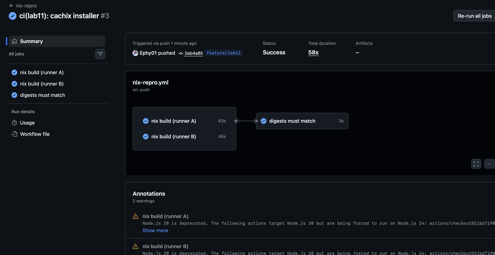
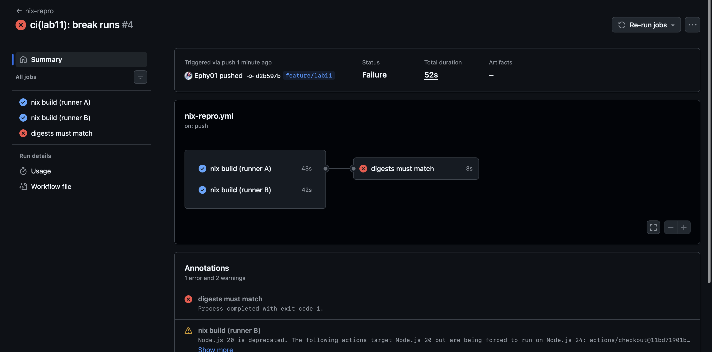

# Lab 11 — Bonus: Reproducible Builds of QuickNotes with Nix

> Lab was done on my MacBook Air M4, Nix installed via the Determinate installer.

What I have done?

---

## Task 1 — reproducible Go build via flake

### flake.nix

```
{
  description = "Reproducible QuickNotes: static Go binary + deterministic OCI image";

  inputs.nixpkgs.url = "github:NixOS/nixpkgs/nixos-25.05";

  outputs = { self, nixpkgs }:
    let
      systems = [ "x86_64-linux" "aarch64-linux" "aarch64-darwin" ];
      forAll = f: nixpkgs.lib.genAttrs systems (system: f nixpkgs.legacyPackages.${system});
    in
    {
      packages = forAll (pkgs:
        let
          quicknotes = pkgs.buildGoModule {
            pname = "quicknotes";
            version = "0.1.0";
            src = ./app;
            vendorHash = null;          # zero third-party deps — nothing to vendor
            env.CGO_ENABLED = "0";      
            ldflags = [ "-s" "-w" ];    
          };
        in
        { inherit quicknotes; default = quicknotes; }
        // pkgs.lib.optionalAttrs pkgs.stdenv.isLinux {
          docker = pkgs.dockerTools.buildImage {
            name = "quicknotes-nix";
            tag = "lab11";
            copyToRoot = pkgs.buildEnv {
              name = "image-root";
              paths = [ quicknotes ];
              pathsToLink = [ "/bin" ];
            };
            extraCommands = ''
              mkdir -p data tmp
              chmod 0777 data tmp
              cp ${./app/seed.json} seed.json
            '';
            config = {
              Entrypoint = [ "/bin/quicknotes" ];
              ExposedPorts."8080/tcp" = { };
              User = "65532:65532";
              Env = [ "ADDR=:8080" "DATA_PATH=/data/notes.json" "SEED_PATH=/seed.json" ];
            };
          };
        });

      devShells = forAll (pkgs: {
        default = pkgs.mkShell { packages = [ pkgs.go pkgs.gopls pkgs.golangci-lint ]; };
      });
    };
}
```

Decisions comments:

- **`buildGoModule`** — the standard nixpkgs builder for a plain Go module.
  `buildGoApplication` (gomod2nix) would only add a generated deps file, and
  QuickNotes has no deps to map.
- **`vendorHash = null`** — the lab tasks say "pin the value from the first failed
  build", but QuickNotes has zero third-party deps , so
  there is nothing to vendor and `null` is the documented way to state it
- **`CGO_ENABLED=0` + `ldflags -s -w`** — from lab6 docker


### Build it +  runs it

```
ephy@Starless-night DevOps-Intro % nix build .#quicknotes
ephy@Starless-night DevOps-Intro % ADDR=:8090 ./result/bin/quicknotes &
2026/07/10 20:12:14 quicknotes listening on :8090 (notes loaded: 0)
ephy@Starless-night DevOps-Intro % curl -s localhost:8090/health
{"notes":0,"status":"ok"}
```

### Two independent environments — identical store hash

Two fresh `nixos/nix` containers, each cloning the repo and building from scratch:

```
# host (darwin/aarch64, for reference — a different platform, so a different binary):
sha256:0a49hni7b87aqkxfp231vpccfzp1s5pdskh9a08x606p6pdc3cqn

# container A (aarch64-linux):
sha256:0bjcz56cdqhckzfdd4v3akpvs84kij4ji5bxyf0hw31q8665gas5
# container B (aarch64-linux):
sha256:0bjcz56cdqhckzfdd4v3akpvs84kij4ji5bxyf0hw31q8665gas5
```

A and B are identical — so the reproducibility proofed. The host hash differs, which
is just as it should be: reproducibility is per-platform feature

### Design questions

**a) Why doesn't plain `go build` give bit-identical outputs on two machines?**
Because the binary quietly absorbs the environment. Build IDs derived from the
toolchain + flags, absolute paths of the build dir and GOPATH baked into debug info, the exact toolchain patch version, cgo bits, VCS stamping —
all differ machine to machine. Same Git SHA in, different bytes out. What Nix do? Nix's answer is to pin every input (toolchain, flags, source, even env) and build in a sandbox, so
there is nothing left to vary.


**b) What exactly is `vendorHash`? What does `null` do?**
It is the fixed-output hash of the derivation that vendors the module's dependencies. Nix has to download deps — so
it demands a hash up front and verifies the result, turning an  potential problem fetch into a
checked one. `vendorHash = null` means "skip vendoring entirely" —
correct only*when the module has no deps, which is exactly QuickNotes. 

**c) Why is `flake.lock` the single most important file here?**
`inputs.nixpkgs.url = "nixos-25.05"` is moving branch; the lock file pins it to
one exact revision + content hash. Every builder that clones my repo evaluates the
identical nixpkgs — identical Go, identical stdenv, everything. Delete it
before the second build and Nix re-resolves the branch to whatever it points at
today — so it leads to reproducibility and reliability problems.

**d) `buildGoModule` vs `buildGoApplication`?**
`buildGoModule`: one derivation, deps handled via `vendorHash`,
zero extra tooling. 

`buildGoApplication`: generates a Nix file mapping
every dependency to its own fetch — better per-dep caching, at the cost of  generated
file to keep in sync.

Since QuickNotes has zero deps - there is no final distiction. 

---

## Task 2 — deterministic OCI image

### The `docker` output

### Two environments — identical tarball sha256

```
# container A:
1c983abfd27915df8d63da96ad04aa16b091b355846f079744098cdb21b46d1c 
# container B:
1c983abfd27915df8d63da96ad04aa16b091b355846f079744098cdb21b46d1c  
```

Byte-identical across two independent builds — the Task 2 proved.

### It actually runs

```
ephy@Starless-night DevOps-Intro % docker load < quicknotes-nix.tar.gz
Loaded image: quicknotes-nix:lab11
ephy@Starless-night DevOps-Intro % docker images quicknotes-nix
IMAGE                  ID             DISK USAGE   CONTENT SIZE
quicknotes-nix:lab11   94c1c675214d       31.1MB         14.3MB
ephy@Starless-night DevOps-Intro % docker run --rm -p 8092:8080 -e ADDR=:8080 quicknotes-nix:lab11 &
2026/07/10 17:47:49 quicknotes listening on :8080 (notes loaded: 4)
ephy@Starless-night DevOps-Intro % curl -s localhost:8092/health
{"notes":4,"status":"ok"}
```

The Nix image serves the seed's 4 notes — same runtime behaviour as the lab 6 image,
built by a completely different toolchain.

### Lab 6 build is not deterministic — proof

```
ephy@Starless-night DevOps-Intro % docker build --no-cache -q -t qn-lab6:run1 ./app
ephy@Starless-night DevOps-Intro % docker build --no-cache -q -t qn-lab6:run2 ./app
sha256:976fc8fafd2841db14397564d58a14457f7a42328819483e419d67b10b4a180e
sha256:5164d868e7ea9121c14d899f03b7af1c2815553067174c543e71a6a01312407f
ephy@Starless-night DevOps-Intro % docker images --no-trunc qn-lab6
REPOSITORY   TAG    IMAGE ID                                                                  SIZE
qn-lab6      run2   sha256:5164d868e7ea9121c14d899f03b7af1c2815553067174c543e71a6a01312407f   21.7MB
qn-lab6      run1   sha256:976fc8fafd2841db14397564d58a14457f7a42328819483e419d67b10b4a180e   21.7MB
```

Same Dockerfile, same sources, two different digests (`976fc8fa…` vs
`5164d868…`) — identical 21.7 MB size, different bytes. That's exactly the
non-determinism `dockerTools` removes: my Nix tarball above hashed the same across
two independent machines; `docker build` can't manage it across two runs on the
same machine.

### Design questions

**e) What does `docker build` do that breaks determinism?**
It stamps time and order into everything: layer tarballs carry file **mtimes**, image config carries `created:`", `RUN` steps execute in a live
container where network/filesystem noise can differ, and caching changes what gets
rebuilt. Even with identical inputs the metadata alone (timestamps) yields a new
digest every run. `dockerTools.buildImage` builds the tarball as  pure derivation:
mtimes normalized to the epoch, `created` fixed, content derived only from pinned
inputs — nothing "now"-shaped can leak in.

**f) What can a reproducible image prove to an auditor that a signed one can't?**
A signature proves who published the artifact and that it wasn't modified after
signing, and nothing about what's inside. A compromised build box signs backdoors
just fine. 

A reproducible image proves the artifact is the source: the auditor
rebuilds from the audited Git SHA and gets the byte-identical digest, so binary ==
source, no trust in my build machine required. 

**g) The trade-off — why is `docker build` still the default?**
Cost of entry. Nix demands learning a language(or playing around docs/ modern technologies) and a model, porting the build, and
fighting corner cases. 

Dockerfiles are ten lines of shell every hire already reads.
Docker's ecosystem (registries, caching, buildkit, docs) is everywhere. And most
teams' real requirement is same image for everyone today, which a registry
digest already gives — full input-level reproducibility is an audit*property most
products never get asked for. 

Nix is what you
reach for when the trust question become absolute.

---

## Bonus — CI-verified reproducibility

`.github/workflows/nix-repro.yml` — two independent jobs on fresh runners build
`.#docker`, each exports `sha256sum result` as a job output, a third job compares and
fails on mismatch.

```yaml
name: nix-repro
on:
  push:
  pull_request:
permissions:
  contents: read
jobs:
  build-a:
    name: nix build (runner A)
    runs-on: ubuntu-24.04
    outputs:
      digest: ${{ steps.digest.outputs.digest }}
    steps:
      - uses: actions/checkout@11bd71901bbe5b1630ceea73d27597364c9af683 # v4.2.2
      - uses: DeterminateSystems/nix-installer-action@cd46bde16ab981b0a7b2dce0574509104543276e # v9
      - run: nix build .#docker
      - id: digest
        run: echo "digest=$(sha256sum result | awk '{print $1}')" >> "$GITHUB_OUTPUT"
  build-b:
    name: nix build (runner B)
    runs-on: ubuntu-24.04
    outputs:
      digest: ${{ steps.digest.outputs.digest }}
    steps:
      - uses: actions/checkout@11bd71901bbe5b1630ceea73d27597364c9af683 # v4.2.2
      - uses: DeterminateSystems/nix-installer-action@cd46bde16ab981b0a7b2dce0574509104543276e # v9
      - run: nix build .#docker
      - id: digest
        run: echo "digest=$(sha256sum result | awk '{print $1}')" >> "$GITHUB_OUTPUT"
  compare:
    name: digests must match
    runs-on: ubuntu-24.04
    needs: [build-a, build-b]
    steps:
      - run: |
          echo "A: ${{ needs.build-a.outputs.digest }}"
          echo "B: ${{ needs.build-b.outputs.digest }}"
          test "${{ needs.build-a.outputs.digest }}" = "${{ needs.build-b.outputs.digest }}"
```

Installer action pinned to `7e1d5bd…` (cachix/install-nix-action **v31**, the current
release), resolved via `git ls-remote`. Flakes are enabled on the `nix build` command
itself (`--extra-experimental-features "nix-command flakes"`) rather than through a
`with:` input — that keeps the step working regardless of the action's input schema.

> **Something that I found during work.** My first pick,
> `DeterminateSystems/nix-installer-action@v9` (its latest tag), died on every run
> with `TypeError: Invalid URL` while fetching the installer binary — a bug in that
> release's own fetch code, and with no newer tag to bump to there was nothing to
> patch. (I first suspected the Node 20 → Node 24 runner switch and tried
> `ACTIONS_ALLOW_USE_UNSECURE_NODE_VERSION`, but the error survived, so it wasn't
> that.) I switched to `cachix/install-nix-action`, the other installer the lab
> explicitly sanctions, pinned by 40-char SHA.

### Green — digests match across two runners



### Red — deliberately broken divergence

I changed the input in job A only (`echo "// diverge" >> app/main.go` before the
build) -> different source -> different digest -> `compare` goes red:
ы


Then reverted -> green again.

### Design questions

**h) "Reproducible on my laptop" vs "reproducible in CI" — why is CI load-bearing?**
My laptop is one opaque environment, while CI runs are fresh, disposable machines I
don't control, with public logs anyone can audit — two strangers independently
arriving.  The difference is like: "one says
it reproduces" and "here are two independent witnesses with timestamps". Plus it
re-proves itself on every push.

**i) Why two parallel jobs, not one job building twice?**
One job = one machine, one Nix store. The second `nix build` in the same job would
mostly just hit the store cache and come back the first result — a "proof" that
can't fail even if the build is wildly non-reproducible. It also shares anything
machine-specific (CPU, kernel, disk state). 

Two runners = two independent
environments - agreement between them is actual evidence that  we want.

**j) Where would `SOURCE_DATE_EPOCH` timestamps leak in**
The classic leaks are the image's `created:` field and the mtimes of every file in
the layer tarballs. `dockerTools.buildImage` normalizes both
to the Unix epoch, so there is no timestamp left for `SOURCE_DATE_EPOCH` to
influence and the sandbox wouldn not let a runner env var in anyway. 
In Nix the only way to change
the output is to change an input.
