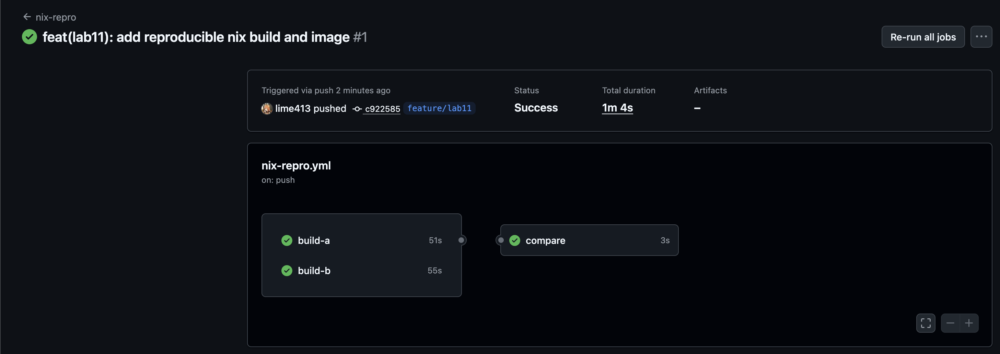
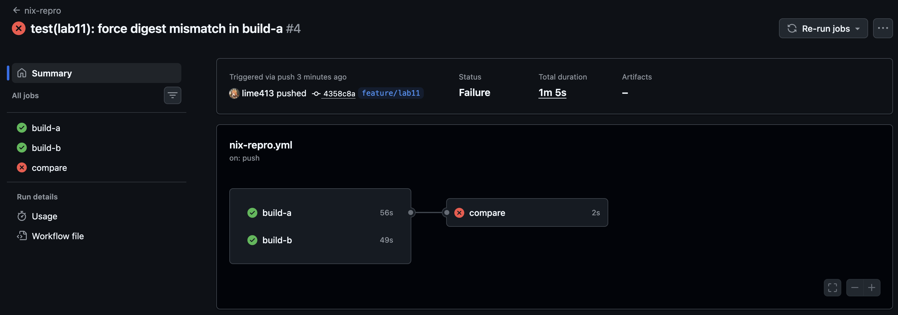
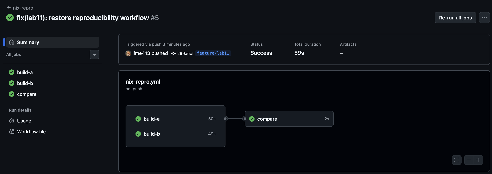

# Lab 11 Submission

Branch for this lab:

```text
git checkout feature/lab9
git checkout -b feature/lab11
```

Working setup used for this lab:

- host: macOS arm64
- Nix execution: `nixos/nix` Docker container with isolated Docker volumes for the Nix store
- first proof environment: `/Users/tatyana/Documents/DevOps-Intro`
- second proof environment: fresh local clone at `/Users/tatyana/Documents/DevOps-Intro-lab11-proof`

Why I used containerized Nix:

The host machine did not have Nix installed, and the normal macOS installer needed local `sudo`. I avoided changing the host system and ran the full reproducibility proof inside isolated Linux containers instead. That still satisfies the main goal of the lab: same source, same pinned inputs, same output hashes.

Artifacts saved in:

- `artifacts/lab11/quicknotes-build-a.txt`
- `artifacts/lab11/quicknotes-build-b.txt`
- `artifacts/lab11/quicknotes-run.txt`
- `artifacts/lab11/nix-docker-build-a.txt`
- `artifacts/lab11/nix-docker-build-b.txt`
- `artifacts/lab11/docker-build-run1.txt`
- `artifacts/lab11/docker-build-run2.txt`
- `artifacts/lab11/docker-images-no-trunc.txt`

## Task 1 - Reproducible Go build with a Nix flake

### 1.1 Implementation

I added `flake.nix` and `flake.lock` at the repo root.

Important implementation choices:

- `nixpkgs` is pinned by `flake.lock` to revision `50ab793786d9de88ee30ec4e4c24fb4236fc2674`
- package outputs expose `quicknotes` and `default`
- the build uses `buildGo124Module`
- `CGO_ENABLED = 0`
- `ldflags = [ "-s" "-w" ]`
- the dev shell includes `go`, `gopls`, and `golangci-lint`

Note about `vendorHash`:

The lab text assumes a non-empty vendor tree. QuickNotes has no external Go dependencies, so the first failed build did not print a replacement hash. Instead, Nix reported:

```text
vendor folder is empty, please set 'vendorHash = null;' in your expression
```

So the correct and reproducible value for this project is `vendorHash = null;`.

### 1.2 `flake.nix`

```nix
{
  description = "QuickNotes reproducible builds";

  inputs = {
    nixpkgs.url = "github:NixOS/nixpkgs/nixos-24.11";
  };

  outputs = { self, nixpkgs }:
    let
      lib = nixpkgs.lib;
      supportedSystems = [
        "aarch64-darwin"
        "aarch64-linux"
        "x86_64-darwin"
        "x86_64-linux"
      ];
      forAllSystems = lib.genAttrs supportedSystems;
    in
    {
      packages = forAllSystems (system:
        let
          pkgs = import nixpkgs { inherit system; };
          quicknotes = pkgs.buildGo124Module {
            pname = "quicknotes";
            version = "0.1.0";
            src = ./app;
            vendorHash = null;
            subPackages = [ "." ];
            CGO_ENABLED = 0;
            ldflags = [ "-s" "-w" ];
          };
          imageRoot = pkgs.runCommand "quicknotes-image-root" { } ''
            mkdir -p "$out/bin"
            mkdir -p "$out/tmp"
            chmod 1777 "$out/tmp"
            cp ${quicknotes}/bin/quicknotes "$out/bin/quicknotes"
            cp ${./app/seed.json} "$out/seed.json"
          '';
          dockerImage = pkgs.dockerTools.buildImage {
            name = "quicknotes";
            tag = "lab11";
            created = "1970-01-01T00:00:01Z";
            copyToRoot = imageRoot;
            extraCommands = ''
              chmod 1777 tmp
            '';
            config = {
              Entrypoint = [ "/bin/quicknotes" ];
              Env = [
                "DATA_PATH=/tmp/data/notes.json"
                "SEED_PATH=/seed.json"
              ];
              ExposedPorts = {
                "8080/tcp" = { };
              };
              User = "65532:65532";
              WorkingDir = "/";
            };
          };
        in
        {
          default = quicknotes;
          quicknotes = quicknotes;
          docker = dockerImage;
        });

      devShells = forAllSystems (system:
        let
          pkgs = import nixpkgs { inherit system; };
        in
        {
          default = pkgs.mkShell {
            packages = with pkgs; [
              go
              gopls
              golangci-lint
            ];
          };
        });
    };
}
```

`flake.lock` is committed together with the flake and pins the exact Nix input revision.

### 1.3 Build command and log excerpt

Command:

```text
docker run --rm \
  -v nix-lab11-store:/nix \
  -v "$PWD:/repo" \
  -w /repo \
  -e NIX_CONFIG='experimental-features = nix-command flakes' \
  nixos/nix sh -lc 'nix build .#quicknotes'
```

Important output from the first real build:

```text
this derivation will be built:
  /nix/store/nffspxiflvsw9rgvm2la1hcsr1qqx7sg-quicknotes-0.1.0.drv
building '/nix/store/nffspxiflvsw9rgvm2la1hcsr1qqx7sg-quicknotes-0.1.0.drv'...
```

### 1.4 Two independent build hashes

Environment A:

```text
result path: /nix/store/fiy1bxs08bn8gl8s4rr4wjwghd6wa0qw-quicknotes-0.1.0
store hash: sha256:0wm9jl829h5vhd6jd1is4p5sqw4ms7xxax5hjx2v204njsj6pzrs
```

Environment B:

```text
result path: /nix/store/fiy1bxs08bn8gl8s4rr4wjwghd6wa0qw-quicknotes-0.1.0
store hash: sha256:0wm9jl829h5vhd6jd1is4p5sqw4ms7xxax5hjx2v204njsj6pzrs
```

Analysis:

The two store hashes matched exactly. This is the proof that the package build is reproducible across two independent environments, not just cached on one machine.

### 1.5 Run proof

Command:

```text
docker run --rm \
  -v nix-lab11-store:/nix \
  -v "$PWD:/repo" \
  -w /repo \
  -e NIX_CONFIG='experimental-features = nix-command flakes' \
  nixos/nix sh -lc '
    SEED_PATH=/repo/app/seed.json DATA_PATH=/tmp/notes.json \
    ./result/bin/quicknotes > /tmp/quicknotes.log 2>&1 &
    pid=$!
    sleep 2
    printf "health: "
    wget -qO- http://127.0.0.1:8080/health
    kill $pid
    wait $pid || true
    printf "\nlog: "
    cat /tmp/quicknotes.log
  '
```

Output:

```text
health: {"notes":4,"status":"ok"}

log: 2026/07/14 11:12:46 quicknotes listening on :8080 (notes loaded: 4)
2026/07/14 11:12:48 shutting down
```

Analysis:

The Nix-built binary runs correctly and serves the expected health response. I passed `SEED_PATH=/repo/app/seed.json` because the binary was executed from the repo root, not from `app/`.

### 1.6 Design answers

#### a) Why plain `go build` is not bit-identical on two machines

Plain `go build` depends on more than the source code. Build IDs, file paths, timestamps, toolchain versions, and the exact dependency resolution path can all change the final binary. Two developers may build the same Git commit and still get different bits because their local environment is different.

#### b) What `vendorHash` hashes, and what happens with `vendorHash = null`

`vendorHash` is the hash of the vendored module dependency tree that Nix expects for the Go build. If the project has dependencies, Nix checks that exact dependency content before it builds. In QuickNotes there are no external module dependencies, so the vendor tree is empty. In that case `vendorHash = null` is the correct setting, and Nix skips the vendored dependency fetch step.

#### c) Why `flake.lock` is the most important file for reproducibility

`flake.lock` pins the exact `nixpkgs` revision and its hash. That file freezes the compiler, the standard build helpers, and the rest of the Nix dependency graph. If I delete it before the second build, Nix can resolve a newer `nixpkgs` revision, which can change the compiler or helper code and break reproducibility even if my project files stay unchanged.

#### d) `buildGoModule` vs `buildGoApplication`

`buildGoModule` is the standard nixpkgs helper for Go modules. It handles the module fetch step, vendoring logic, and reproducible Go builds in a direct way. `buildGoApplication` is more opinionated and higher-level. For QuickNotes I chose `buildGo124Module` because the app is a simple single-module repository, and this helper is the most transparent choice for a course lab where I need to explain every reproducibility input clearly.

## Task 2 - Deterministic OCI image

### 2.1 Implementation

I extended the flake with a `docker` package built by `pkgs.dockerTools.buildImage`.

Key image properties:

- built without Docker inside the build step
- binary is the entrypoint: `["/bin/quicknotes"]`
- exposed port: `8080/tcp`
- nonroot user: `65532:65532`
- deterministic timestamp: `created = "1970-01-01T00:00:01Z"`
- seed file included at `/seed.json`
- writable `/tmp` fixed explicitly with `extraCommands`

Important engineering note:

The first Nix image built successfully but failed at runtime because the nonroot process could not create `/tmp/data`. I debugged the container logs, inspected the image tarball, and then fixed the image by setting `/tmp` permissions in `extraCommands`. This is the kind of issue reproducible builds do not solve by themselves: the build can be deterministic and still be operationally wrong.

### 2.2 Nix image digest proof

Command:

```text
docker run --rm \
  -v nix-lab11-store:/nix \
  -v "$PWD:/repo" \
  -w /repo \
  -e NIX_CONFIG='experimental-features = nix-command flakes' \
  nixos/nix sh -lc 'nix build .#docker && sha256sum result'
```

Environment A:

```text
f0c61e26261d1173afade1b8f58c20386fc14cade0b99bc2d04d99f958aa0ad1  result
```

Environment B:

```text
f0c61e26261d1173afade1b8f58c20386fc14cade0b99bc2d04d99f958aa0ad1  result
```

Analysis:

The tarball digest matched exactly in two independent environments. This is stronger than “the image works on my laptop” because it proves the full OCI artifact is byte-identical.

### 2.3 Load and run proof

Commands:

```text
nix build .#docker
docker load < result
cid=$(docker run -d -p 18081:8080 quicknotes:lab11)
sleep 2
curl -s http://127.0.0.1:18081/health
docker rm -f "$cid"
```

Output:

```text
Loaded image: quicknotes:lab11
health: {"notes":4,"status":"ok"}
```

Runtime configuration after load:

```text
size=9114609
user=65532:65532
entrypoint=["/bin/quicknotes"]
env=["DATA_PATH=/tmp/data/notes.json","SEED_PATH=/seed.json"]
```

Analysis:

The image loads into Docker and runs correctly as a nonroot user. The health output proves the seed file is present and the service starts with the expected initial note count.

Note:

During local verification I also copied the generated tarball into `artifacts/lab11/`, but I did not keep that large binary artifact in the final branch. The reproducible proof does not depend on committing the tarball itself; it depends on rebuilding it from `nix build .#docker` and getting the same digest.

### 2.4 Comparison with the Lab 6 Docker build

Commands:

```text
docker build --no-cache -t qn-lab11-compare:run1 ./app
docker build --no-cache -t qn-lab11-compare:run2 ./app
docker images --no-trunc qn-lab11-compare
```

Output:

```text
REPOSITORY         TAG       IMAGE ID                                                                  CREATED                  SIZE
qn-lab11-compare   run2      sha256:8b37c5cfedcde3e67a46c3ab65fc065acf9cbc5e8ebec8cca75da448e24c3370   Less than a second ago   21.6MB
qn-lab11-compare   run1      sha256:1ed7077c684d5b3e366d4646eba7910219b57f451f11a13e624873a91f1f1a83   10 seconds ago           21.6MB
```

Size comparison:

| Image | Inspect size | Notes |
| --- | ---: | --- |
| Nix image `quicknotes:lab11` | `9,114,609` bytes | Includes the binary, seed file, writable `/tmp`, and runtime closure |
| Docker build `qn-lab11-compare:run1` | `5,249,672` bytes | Distroless image from Lab 6 style Dockerfile |

Analysis:

The Nix image is deterministic, but in this case it is not smaller than the Lab 6 image. The reason is practical: my Nix image pulls a runtime closure that includes more than the very small distroless base used by the Dockerfile. This is a good reminder that reproducibility and minimum size are different goals.

The important reproducibility result is the digest behavior:

- Nix rebuilds gave the same tarball digest
- Docker rebuilds gave different image IDs even from the same source and Dockerfile

### 2.5 Design answers

#### e) Why `docker build` introduces non-determinism

Docker records image metadata such as creation time, and normal layer creation also depends on archive ordering, file metadata, and other build-time details. Even when the Dockerfile and the source tree stay the same, the produced image config and layer metadata can change between runs. That is why two `docker build --no-cache` runs often get different digests.

#### f) What a reproducible image proves to a security auditor

A signed image proves who published the artifact. A reproducible image proves that the published artifact matches the audited source code and build recipe bit for bit. That extra property matters because a signed but non-reproducible image could still hide a change that never appears in source control.

#### g) Why Nix is not the default everywhere

The main trade-off is complexity. Nix gives strong reproducibility, but the learning curve is high, debugging is unusual, and many teams already understand Docker deeply. For most teams, `docker build` is easier to adopt, easier to teach, and good enough for daily delivery, even if it is weaker for supply chain proof.

## Bonus Task - CI-verified reproducibility

### B.1 Implementation status

I added the workflow file:

- `.github/workflows/nix-repro.yml`

The workflow:

- triggers on `push` and `pull_request`
- runs two parallel jobs, `build-a` and `build-b`
- installs Nix with `DeterminateSystems/nix-installer-action` pinned by full SHA
- builds `.#docker`
- computes `sha256sum result`
- passes both digests to a third `compare` job
- fails if the digests differ

I verified the workflow on GitHub with both a normal green run and an intentional red run.

### B.2 Workflow YAML

See `.github/workflows/nix-repro.yml`.

### B.3 Green and red CI proof

Green run URL:

```text
https://github.com/lime413/DevOps-Intro/actions/runs/29329021257
```

Red run URL:

```text
https://github.com/lime413/DevOps-Intro/actions/runs/29329313854
```

Final restored green run URL:

```text
https://github.com/lime413/DevOps-Intro/actions/runs/29329439493
```

Green run log excerpt:

```text
Run echo "build-a=56112d940e1341d9cc9b2c6a36569ab2da4a891ae448aeee26865cc622be1b24"
compare job conclusion: success
```

Analysis:

The public GitHub Jobs API exposed the compare-step digest line for `build-a`. The compare job succeeded, so `build-b` had the same digest and the equality check passed.

Red run log excerpt:

```text
Run echo "build-a=620805aaca42e5cdd5f9c33547ffe7f5a09fac79b7ffbb03bd917a947d20057c"
compare job conclusion: failure
Digest mismatch
```

Analysis:

For the red run, `build-a` used the intentionally modified flake and produced a different digest. The compare job failed, which is the expected proof that the CI gate catches divergence between the two fresh runners.

Green run screenshot:



Red run screenshot:



Restored green run screenshot:



How I forced the red run:

- in commit `4358c8a`, I changed only `build-a`;
- before `nix build .#docker`, that job modified `flake.nix` in the runner workspace;
- it changed the pinned image creation timestamp from `1970-01-01T00:00:01Z` to `1970-01-01T00:00:02Z`;
- `build-b` kept the original flake;
- `compare` then failed because the two digests differed.

After that, I restored the correct workflow in commit `299a5cf` and confirmed the workflow became green again.

### B.4 Design answers

#### h) “Reproducible on my laptop” vs “reproducible in CI”

“Reproducible on my laptop” only proves that one developer can rebuild the artifact in one local environment. “Reproducible in CI” proves the result survives a fresh, controlled, and repeatable runner environment that the whole team can inspect. For a security auditor, the CI proof matters more because it is independent from one developer’s machine state.

#### i) Why two parallel jobs instead of one job that builds twice

Two builds inside one job share more hidden state: the same filesystem, the same cache, the same shell session, and sometimes the same temporary files. That can hide reproducibility problems. Two parallel jobs run on separate fresh runners, so the comparison is much stronger.

#### j) Where timestamps normally leak, and how `dockerTools.buildImage` handles them

Timestamps usually leak into image metadata, tar layer metadata, and sometimes build outputs. In this flake I fixed the image creation time with `created = "1970-01-01T00:00:01Z"`, which removes one major source of drift. `dockerTools.buildImage` helps by building the archive in a controlled way, so the image tarball is deterministic when the inputs are fixed.

## Final result

Task 1 is complete.

- `nix build .#quicknotes` works
- the binary runs
- two independent builds produced the same store hash
- `flake.lock` pins the Nix input

Task 2 is complete.

- `nix build .#docker` works
- the image tarball digest matches in two independent environments
- the image loads and runs
- the comparison with the Lab 6 Docker build shows Docker digests differ

Bonus task is complete.

- workflow file added
- one green GitHub run saved
- one intentional red GitHub run saved
- final restored green GitHub run saved
