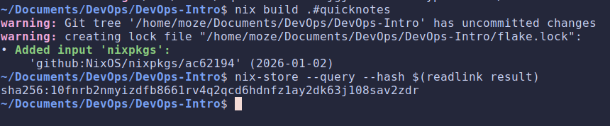
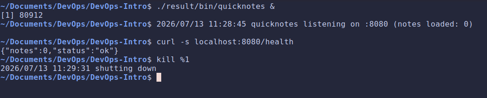
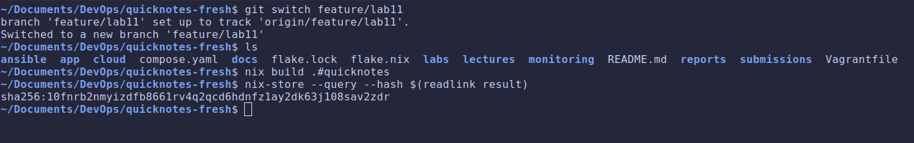
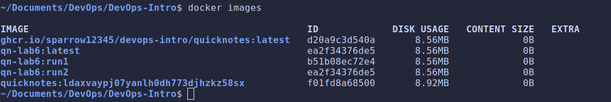
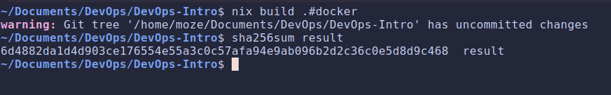
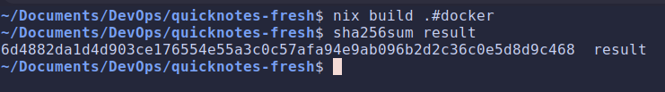
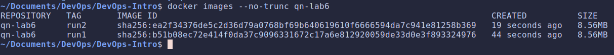
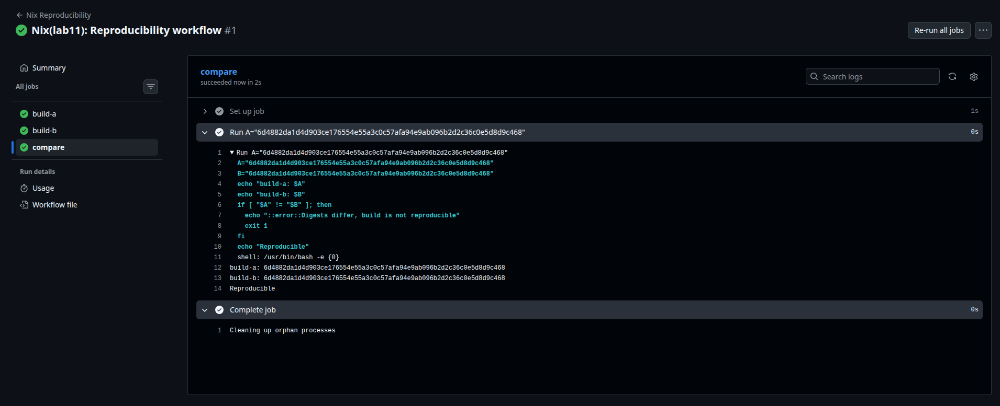
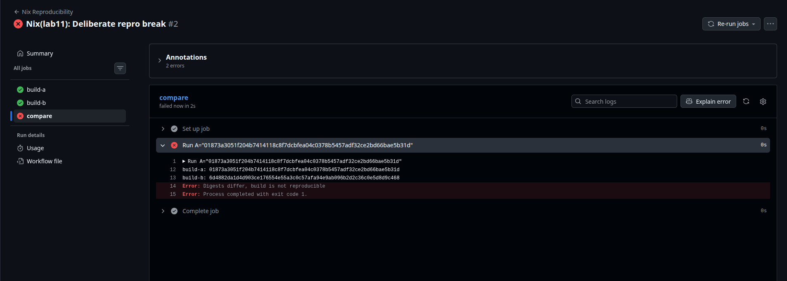

# Lab 11 submission

## Task 1: Reproducible Go Build via Nix Flake

### Nix files

- **`flake.nix`:**

    ```nix
    {
    description = "QuickNotes";

    inputs.nixpkgs.url = "github:NixOS/nixpkgs/nixos-25.05";

    outputs = { self, nixpkgs }:
        let
        system = "x86_64-linux";
        pkgs = nixpkgs.legacyPackages.${system};

        quicknotes = pkgs.buildGoModule {
            pname = "quicknotes";
            version = "0.1.0";
            src = ./app;

            vendorHash = null;

            env.CGO_ENABLED = 0;
            ldflags = [ "-s" "-w" ];
        };
        in
        {
        packages.${system} = {
            quicknotes = quicknotes;
            default = quicknotes;
        };

        devShells.${system}.default = pkgs.mkShell {
            packages = [ pkgs.go pkgs.gopls pkgs.golangci-lint ];
        };
        };
    }
    ```

- [**`flake.lock`**](https://github.com/sparrow12345/DevOps-Intro/blob/feature/lab11/flake.lock)

### Build & verify





### Hashes comparison




### Design questions

- **Why does `go build` not produce bit-identical outputs on two machines, even from the same Git SHA?**

    Go can bake in build timestamps, absolute file paths, and build IDs, dependency resolution can pull slightly different versions. Nix fixes the compiler version, strips paths (-trimpath), and pins everything, so the inputs are identical.

- **`vendorHash` is a SHA over what, exactly? What happens if you set `vendorHash = null;`?**

    The full fetched Go dependency (vendor) tree. `vendorHash = null` means "no dependencies to fetch". A wrong value makes Nix fail and print the correct one.

- **`flake.lock` pins nixpkgs. Why is this the single most important file for reproducibility? What happens if you delete it before the second build?**

    It pins the exact nixpkgs revision (compiler, tooling, everything). Delete it and the second build may resolve a different nixpkgs leading to a  different compiler and a different hash.

- **`buildGoModule` vs `buildGoApplication` — what's the difference? Which would you pick for QuickNotes and why?**

    `buildGoModule` (from nixpkgs) uses one `vendorHash` for all dependencies which makes it simple, standard. `buildGoApplication` (from gomod2nix) maps each dependency separately for finer caching. We picked `buildGoModule`: it's built in, and with zero dependencies it's the simplest choice.

## Task 2: Deterministic OCI Image

### Nix extended snippet

```nix
{
  description = "QuickNotes";

  inputs.nixpkgs.url = "github:NixOS/nixpkgs/nixos-25.05";

  outputs = { self, nixpkgs }:
    let
      system = "x86_64-linux";
      pkgs = nixpkgs.legacyPackages.${system};

      quicknotes = pkgs.buildGoModule {
        pname = "quicknotes";
        version = "0.1.0";
        src = ./app;

        vendorHash = null;

        env.CGO_ENABLED = 0;
        ldflags = [ "-s" "-w" ];
      };

      dockerImage = pkgs.dockerTools.buildImage {
        name = "quicknotes";

        config = {
          Entrypoint = [ "${quicknotes}/bin/quicknotes" ];
          ExposedPorts = { "8080/tcp" = {}; };
          User = "65532:65532";
        };
      };

    in
    {
      packages.${system} = {
        quicknotes = quicknotes;
        default = quicknotes;
        docker = dockerImage;
      };

      devShells.${system}.default = pkgs.mkShell {
        packages = [ pkgs.go pkgs.gopls pkgs.golangci-lint ];
      };
    };
}
```

### Image size comparison



### Hashes comparison





### Two images diff



### Design questions

- **`dockerTools.buildImage` produces a deterministic image. What does Docker's `docker build` do that introduces non-determinism, even from the same Dockerfile + Git SHA?**

    It stamps layer creation timestamps, may pull different base-image/apt versions, and records build metadata so identical Dockerfiles produce different layer SHAs.

- **For a security auditor, what can you prove with a reproducible image that you cannot prove with a signed-but-non-reproducible image?**

    A signature only proves who built it. A reproducible build lets anyone rebuild from source and confirm the bits match proving no hidden backdoor was slipped in.

- **What's the trade-off of Nix's reproducibility? Why is `docker build` still the default for most teams?**

    Nix has a steep learning curve, dense error messages, and slow builds. docker build is familiar and "good enough" for most teams, so it stays the default.

## Bonus Task: CI-Verified Reproducibility

### Workflow

[**`Reproducibility Workflow`**](https://github.com/sparrow12345/DevOps-Intro/blob/feature/lab11/.github/workflows/nix-repro.yml)

### Green CI



### Red CI



### Design questions

- **What's the difference between "reproducible on my laptop" and "reproducible in CI" that makes the CI proof load-bearing for a security auditor?**

    Your laptop may carry hidden state (env vars, cached deps). CI runs on fresh, clean runners, so a match there proves the build depends only on the committed source and that's what an auditor trusts.

- **Why two parallel jobs instead of one job that runs `nix build` twice? What could a single-job two-build comparison miss?**

    One job shares the same machine, filesystem, and cache, it can hide machine-specific leakage. Two separate runners prove independence across environments.

- **`SOURCE_DATE_EPOCH` is the canonical env var for forcing build timestamps. Where in your Nix flake would the timestamp normally leak in, and how does `dockerTools.buildImage` handle it?**

    It's the standard env var for forcing a fixed build timestamp. Timestamps normally leak into the image's created field and layer metadata, `dockerTools.buildImage` avoids this by letting us set created to a fixed value, so no wall-clock time gets baked in.
