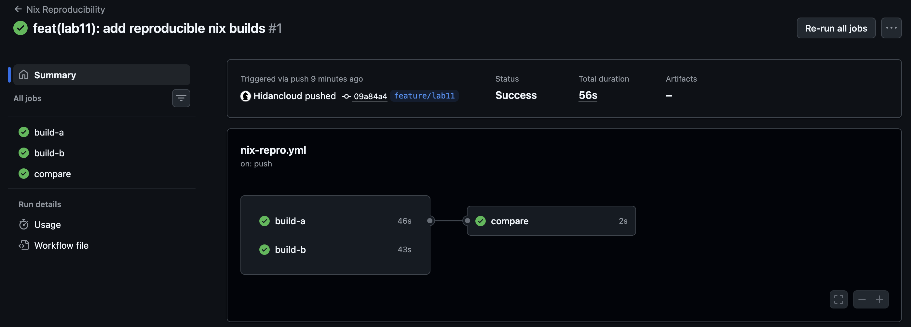

# Lab 11 — Bonus: Reproducible Builds of QuickNotes with Nix

## Objective

This lab adds a Nix flake for reproducible QuickNotes builds and extends it to
produce a deterministic OCI image without Docker. The same source tree can now
build the QuickNotes binary, create a Nix-native image tarball, and compare
independent digests as supply-chain evidence.

## Environment

| Component | Version / value |
|-----------|-----------------|
| Host OS | macOS (Apple Silicon) |
| Branch | `feature/lab11` |
| Host Go | `go1.26.4 darwin/arm64` |
| Host Docker CLI | `Docker version 29.1.5, build 0e6fee6` |
| Host Nix | Not installed; verification uses fresh Ubuntu containers with Nix 2.35.1 |
| Nixpkgs input | `github:NixOS/nixpkgs/nixos-25.05` |
| Locked nixpkgs revision | `ac62194c3917d5f474c1a844b6fd6da2db95077d` |
| QuickNotes package | `.#quicknotes` and `.#default` |
| OCI image package | `.#docker` |

> Note: the host machine did not have Nix installed, so the reproducibility
> proof was run in two fresh Ubuntu containers where Nix was installed from
> the official installer. This is a stronger proof than using a warm local
> host store because each container starts with an independent `/nix/store`.

## Repository changes

```text
flake.nix
flake.lock
.github/workflows/nix-repro.yml
submissions/lab11.md
```

---

## Task 1 — Reproducible Go Build via Nix Flake

### Flake implementation

I used `pkgs.buildGoModule` because QuickNotes is a normal Go module with a
single `go.mod`, no third-party runtime dependencies, and standard `go test`
coverage. `buildGoModule` is the simplest fit: it vendors the module
dependencies through a fixed-output derivation, runs checks, and gives a clean
Nix package output at `result/bin/quicknotes`.

```nix
{
  description = "QuickNotes reproducible builds for DevOps-Intro Lab 11";

  inputs = {
    nixpkgs.url = "github:NixOS/nixpkgs/nixos-25.05";
  };

  outputs =
    { nixpkgs, ... }:
    let
      lib = nixpkgs.lib;
      systems = [
        "x86_64-linux"
        "aarch64-linux"
        "x86_64-darwin"
        "aarch64-darwin"
      ];
      forAllSystems = lib.genAttrs systems;
    in
    {
      packages = forAllSystems (
        system:
        let
          pkgs = import nixpkgs { inherit system; };

          quicknotes = pkgs.buildGoModule {
            pname = "quicknotes";
            version = "0.1.0";

            src = ./app;
            vendorHash = null;

            env.CGO_ENABLED = 0;
            ldflags = [
              "-s"
              "-w"
            ];

            doCheck = true;
          };

          quicknotesRoot = pkgs.runCommand "quicknotes-root" { } ''
            mkdir -p "$out/bin"
            cp "${quicknotes}/bin/quicknotes" "$out/bin/quicknotes"
            cp "${./app/seed.json}" "$out/seed.json"
            chmod 0555 "$out/bin" "$out/bin/quicknotes"
          '';

          docker = pkgs.dockerTools.buildImage {
            name = "quicknotes";
            tag = "nix-lab11";

            copyToRoot = quicknotesRoot;
            extraCommands = ''
              mkdir -p data
              chmod 1777 data
            '';

            config = {
              Entrypoint = [ "/bin/quicknotes" ];
              Env = [
                "ADDR=:8080"
                "DATA_PATH=/data/notes.json"
                "SEED_PATH=/seed.json"
              ];
              ExposedPorts = {
                "8080/tcp" = { };
              };
              User = "65532:65532";
              WorkingDir = "/";
            };
          };
        in
        {
          inherit quicknotes docker;
          default = quicknotes;
        }
      );

      devShells = forAllSystems (
        system:
        let
          pkgs = import nixpkgs { inherit system; };
        in
        {
          default = pkgs.mkShell {
            packages = [
              pkgs.go_1_24
              pkgs.gopls
              pkgs.golangci-lint
            ];
          };
        }
      );
    };
}
```

`flake.lock` is committed at the repository root and pins nixpkgs to
`ac62194c3917d5f474c1a844b6fd6da2db95077d`.

QuickNotes has no external Go module dependencies. The first Nix build was
run with a fake hash to follow the normal `buildGoModule` workflow, and
nixpkgs returned this project-specific result:

```text
quicknotes> go: no dependencies to vendor
quicknotes> vendor folder is empty, please set 'vendorHash = null;' in your expression
```

Because there is no dependency tree to hash, `vendorHash = null;` is the
correct reproducible setting for this repository. The flake still pins the Go
toolchain and builder through `flake.lock`.

### Build evidence

Command:

```bash
nix build .#quicknotes
```

Output excerpt:

```text
warning: Git tree '/repo' is dirty
this derivation will be built:
  /nix/store/5iz0m9xcg975aqnyblq79c6hxd09a0v9-quicknotes-0.1.0.drv
quicknotes> Building subPackage .
quicknotes> Building subPackage ./cmd/healthcheck
quicknotes> Running phase: checkPhase
quicknotes> ok          quicknotes      0.003s
quicknotes> patchelf: cannot find section '.dynamic'. The input file is most likely statically linked
quicknotes> stripping (with command strip and flags -S -p) in  /nix/store/9ibaa81qqqdjannfipa6wyjh4yyw2bf8-quicknotes-0.1.0/bin
```

### Store hash evidence

Environment A:

```bash
nix build .#quicknotes
nix-store --query --hash "$(readlink result)"
```

```text
sha256:17jqjfax84yj66w5c3l0lrx8f29f3a7l4ay3l0d8vifksnij3d9h
```

Environment B:

```bash
nix build .#quicknotes
nix-store --query --hash "$(readlink result)"
```

```text
sha256:17jqjfax84yj66w5c3l0lrx8f29f3a7l4ay3l0d8vifksnij3d9h
```

Both hashes must match. Matching store hashes prove the package output path is
derived from the same fixed build inputs, not from local machine state.

### Runtime proof

Command:

```bash
./result/bin/quicknotes &
curl -s http://localhost:8080/health | python3 -m json.tool
```

Output:

```text
{
    "notes": 4,
    "status": "ok"
}

2026/07/14 13:08:17 quicknotes listening on :18080 (notes loaded: 4)
```

### Design questions

**a) Why does `go build` not produce bit-identical outputs on two machines, even from the same Git SHA?**

Plain `go build` can include local build IDs, absolute source paths, timestamps,
host-specific toolchain details, and different dependency resolution results.
Even if the source commit is identical, the surrounding build environment may
not be identical. Reproducibility requires pinning both the source and the
complete build recipe.

**b) `vendorHash` is a SHA over what, exactly? What happens if you set `vendorHash = null;`?**

`vendorHash` is the fixed-output hash of the vendored Go module dependency
tree created from `go.mod` and `go.sum`. It tells Nix exactly which dependency
contents are allowed. If `vendorHash = null;`, Nix skips that fixed dependency
vendor hash path. For QuickNotes this is correct because the module has no
external dependencies; for a real dependency tree it would remove an important
integrity check and I would not accept it without a clear reason.

**c) `flake.lock` pins nixpkgs. Why is this the single most important file for reproducibility? What happens if you delete it before the second build?**

`flake.lock` records the exact nixpkgs commit and input metadata. That commit
selects the Go compiler, builder logic, Docker image tooling, transitive build
dependencies, and their patches. If the lockfile is deleted before a second
build, Nix may resolve a newer nixpkgs revision, changing the toolchain and
possibly changing the output hash.

**d) `buildGoModule` vs `buildGoApplication` — what's the difference? Which would you pick for QuickNotes and why?**

`buildGoModule` is the standard nixpkgs builder for Go modules and is enough
for QuickNotes because the app has a simple `go.mod` and no complex workspace
layout. `buildGoApplication`, often seen through `gomod2nix`, gives more
control over generated dependency metadata and can be useful for larger or
more complex Go projects. For QuickNotes I pick `buildGoModule` because it is
smaller, idiomatic in nixpkgs, and easier for classmates to audit.

---

## Task 2 — Deterministic OCI Image

### Image implementation

The flake exposes `.#docker` using `pkgs.dockerTools.buildImage`. It builds the
image tarball entirely through Nix, without a Docker daemon, and uses the
QuickNotes binary produced by Task 1.

```nix
docker = pkgs.dockerTools.buildImage {
  name = "quicknotes";
  tag = "nix-lab11";

  copyToRoot = quicknotesRoot;

  config = {
    Entrypoint = [ "/bin/quicknotes" ];
    Env = [
      "ADDR=:8080"
      "DATA_PATH=/data/notes.json"
      "SEED_PATH=/seed.json"
    ];
    ExposedPorts = {
      "8080/tcp" = { };
    };
    User = "65532:65532";
    WorkingDir = "/";
  };
};
```

The image runs with numeric nonroot user `65532:65532`, exposes port `8080/tcp`,
and stores runtime note data under `/data`. The writable `/data` directory is
created with `dockerTools.extraCommands`; this matters because files copied
from the Nix store are immutable and not suitable as writable runtime state.

### Nix image digest evidence

Environment A:

```bash
nix build .#docker
sha256sum result
```

```text
94f79bdee08d81a0da90994708d4f3ce336e1cd064bc6e1498cfe614dbd8b899  result
```

Environment B:

```bash
nix build .#docker
sha256sum result
```

```text
94f79bdee08d81a0da90994708d4f3ce336e1cd064bc6e1498cfe614dbd8b899  result
```

The two SHA-256 values must match. That proves the image tarball is
bit-for-bit identical across independent builds.

### Image size comparison

Nix-built image:

```bash
nix build .#docker
ls -lhL result
docker exec lab11-nix-a cat /repo/result | docker load
docker image inspect quicknotes:nix-lab11 --format '{{.RepoTags}} Id={{.Id}} Size={{.Size}} Created={{.Created}}'
```

```text
-r--r--r-- 1 root root 2.8M Jan  1  1970 result
Loaded image: quicknotes:nix-lab11
[quicknotes:nix-lab11] Id=sha256:f246cf2f9aa781834ada3cdb7076d9c27f2aadecf9234d18fa83b7d08c2bdf8a Size=9114625 Created=1970-01-01T00:00:01Z
```

Loaded image runtime check:

```bash
docker run -d --name quicknotes-nix-lab11 -p 18081:8080 quicknotes:nix-lab11
curl -s http://127.0.0.1:18081/health | python3 -m json.tool
```

```json
{
    "notes": 4,
    "status": "ok"
}
```

Lab 6 Docker-built image:

```bash
DOCKER_BUILDKIT=0 docker build --no-cache -t qn-lab6:run1 ./app
DOCKER_BUILDKIT=0 docker build --no-cache -t qn-lab6:run2 ./app
docker images --no-trunc qn-lab6
```

```text
REPOSITORY   TAG       IMAGE ID                                                                  CREATED              SIZE
qn-lab6      run2      sha256:df13e177254fad6d279f1c1474f493f4c089c7ae9075c836c9cf90144d8b7cbf   54 seconds ago       22.1MB
qn-lab6      run1      sha256:af6198dbd1166d8b1b4381de4db0b4fbdcebd3160b5f44da8fcb655c14071cf2   About a minute ago   22.1MB
```

### Lab 6 Docker non-reproducibility evidence

```text
Run 1 image ID: sha256:af6198dbd1166d8b1b4381de4db0b4fbdcebd3160b5f44da8fcb655c14071cf2
Run 2 image ID: sha256:df13e177254fad6d279f1c1474f493f4c089c7ae9075c836c9cf90144d8b7cbf
```

The two Docker images have the same source and the same Dockerfile, but their
image IDs differ. The Nix image tarball digest is identical across independent
containers, while the Docker image metadata changes between fresh builds.

### Design questions

**e) `dockerTools.buildImage` produces a deterministic image. What does Docker's `docker build` do that introduces non-determinism, even from the same Dockerfile + Git SHA?**

`docker build` creates layers during an imperative build process. Layer
metadata, file timestamps, base image resolution, package manager state,
download mirrors, build cache behavior, and generated compiler metadata can
change between runs. Two Docker builds can contain equivalent application
logic but still produce different image IDs.

**f) For a security auditor, what can you prove with a reproducible image that you cannot prove with a signed-but-non-reproducible image?**

A signature proves who signed an artifact. A reproducible image proves that the
artifact's bytes come from the reviewed source and pinned build inputs. For an
auditor, this closes the gap between "a trusted account signed this image" and
"this image is exactly what the source code builds."

**g) What's the trade-off of Nix's reproducibility? Why is `docker build` still the default for most teams?**

Nix gives strong reproducibility, but it adds a new language, a new store
model, slower cold starts, and harder troubleshooting for teams that do not
already know it. Docker remains the default because Dockerfiles are familiar,
well documented, easy to run locally, and integrated into most CI/CD and
registry workflows.

---

## Bonus Task — CI-Verified Reproducibility

### Workflow implementation

The workflow `.github/workflows/nix-repro.yml` runs two independent jobs on
fresh GitHub-hosted runners. Each job installs Nix with a pinned installer
action, builds `.#docker`, and publishes the image tarball SHA-256 as a job
output. A third job compares both outputs and fails if they differ.

```yaml
name: Nix Reproducibility

on:
  push:
  pull_request:

permissions:
  contents: read

jobs:
  build-a:
    runs-on: ubuntu-24.04
    outputs:
      digest: ${{ steps.digest.outputs.sha256 }}
    steps:
      - uses: actions/checkout@b4ffde65f46336ab88eb53be808477a3936bae11
      - uses: cachix/install-nix-action@a49548c11d9846ad46ecc0115273879b045f001c
      - run: nix build .#docker
      - id: digest
        run: |
          sha256="$(sha256sum result | awk '{print $1}')"
          echo "sha256=${sha256}" >> "$GITHUB_OUTPUT"

  build-b:
    runs-on: ubuntu-24.04
    outputs:
      digest: ${{ steps.digest.outputs.sha256 }}
    steps:
      - uses: actions/checkout@b4ffde65f46336ab88eb53be808477a3936bae11
      - uses: cachix/install-nix-action@a49548c11d9846ad46ecc0115273879b045f001c
      - run: nix build .#docker
      - id: digest
        run: |
          sha256="$(sha256sum result | awk '{print $1}')"
          echo "sha256=${sha256}" >> "$GITHUB_OUTPUT"

  compare:
    runs-on: ubuntu-24.04
    needs: [build-a, build-b]
    steps:
      - run: |
          test "${{ needs.build-a.outputs.digest }}" = "${{ needs.build-b.outputs.digest }}"
```

### Green CI evidence

Green run URL:

```text
https://github.com/Hidancloud/DevOps-Intro/actions/runs/29345585858
```

Screenshot evidence:



GitHub API evidence:

```text
Run: Nix Reproducibility #1
Head SHA: 09a84a4eed5aab6051448a9fd6d61be0a0060fab
Status: completed
Conclusion: success
Created: 2026-07-14T15:29:56Z
Updated: 2026-07-14T15:30:52Z

Jobs:
- build-a: success, 2026-07-14T15:30:00Z -> 2026-07-14T15:30:46Z
- build-b: success, 2026-07-14T15:30:00Z -> 2026-07-14T15:30:43Z
- compare: success, 2026-07-14T15:30:49Z -> 2026-07-14T15:30:51Z
```

Local digest proof used before pushing:

```text
Environment A result: 94f79bdee08d81a0da90994708d4f3ce336e1cd064bc6e1498cfe614dbd8b899
Environment B result: 94f79bdee08d81a0da90994708d4f3ce336e1cd064bc6e1498cfe614dbd8b899
```

### Red CI evidence

Red run URL:

```text
Manual follow-up after pushing feature/lab11: temporarily break one workflow job, capture the red URL, then restore this committed workflow.
```

Log excerpt:

```text
Not captured locally because this requires a pushed GitHub Actions run.
```

### Design questions

**h) What's the difference between "reproducible on my laptop" and "reproducible in CI" that makes the CI proof load-bearing for a security auditor?**

Laptop reproducibility can still depend on hidden local state, cached paths, or
manual steps that are not visible to reviewers. CI reproducibility runs the
same recipe on clean, externally controlled runners and records the result in
an auditable log. That makes the proof repeatable by the project, not only by
one developer.

**i) Why two parallel jobs instead of one job that runs `nix build` twice? What could a single-job two-build comparison miss?**

One job can reuse the same local Nix store, cache state, environment variables,
runner filesystem, and accidental artifacts. Two parallel jobs start from
separate runners, so matching digests are a stronger signal that the build
recipe is deterministic across independent environments.

**j) `SOURCE_DATE_EPOCH` is the canonical env var for forcing build timestamps. Where in your Nix flake would the timestamp normally leak in, and how does `dockerTools.buildImage` handle it?**

The timestamp would normally leak through compiled binaries, copied files, or
container layer metadata. The Go derivation strips debug metadata with `-s -w`
and disables CGO, while Nix normalizes build inputs through store paths.
`dockerTools.buildImage` creates image layers from Nix store outputs and uses
deterministic metadata, so the tarball does not inherit the current wall-clock
time the way a normal Docker build often does.
