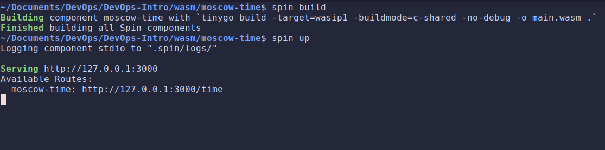
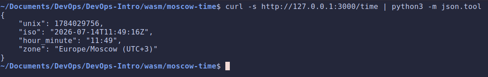
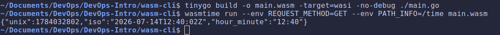

# Lab 12 submission

## Task 1: Build the WASM Endpoint

### `main.go` & `spin.toml`

- [**`main.go`**](https://github.com/sparrow12345/DevOps-Intro/blob/feature/lab12/wasm/moscow-time/main.go)

- [**`spin.toml`**](https://github.com/sparrow12345/DevOps-Intro/blob/feature/lab12/wasm/moscow-time/spin.toml)

### `spin build` output

### `curl` output

### Design questions

- **Browser WASM vs server WASM: `go build -o m.wasm -target=js/wasm` vs `tinygo build -target=wasip1`. What's missing in the server target, and what do you gain?**

    `-target=js/wasm` builds for a browser (needs JS glue, DOM). `wasip1` builds for a server, no DOM/JS runtime, but we gain WASI (filesystem, env, stdio) and it runs standalone.

- **Why does the build command need `-buildmode=c-shared`?**

    It makes the module export the handler symbols the Spin host calls. Without it the module only has a `_start` main, so Spin can't find the handler and we get 500 with empty logs.

- **`allowed_outbound_hosts = []` is the strictest setting. Explain the capability-based security model and compare it to Docker's `--network none`.**

    Capability-based security, the module gets zero permissions by default and each must be granted explicitly. Empty list = no network. Same goal as Docker's `--network none`, but stronger.

- **TinyGo stdlib gaps: which part of upstream Go's stdlib does TinyGo not fully support that you hit during this lab?**

    No embedded tzdata (`LoadLocation` fails) and limited reflection in `encoding/json`.

## Task 2: Perf Comparison vs Lab 6

### Test rig

- **Machine:** Intel Core i5-9300H @ 2.40GHz (8 cores), 15 GiB RAM
- **OS:** Linux Mint 22.1, kernel 6.8.0-124-generic
- **Docker:** 29.5.3
- **Spin:** 3.4 / TinyGo 0.41.1

### Results

| Dimension        | Lab 6 Docker | Lab 12 WASM/Spin |
|------------------|-------------:|-----------------:|
| Artifact size    |      8.56 MB |           362 KB |
| Cold start (p50) |       236 ms |            89 ms |
| Warm latency p50 |      5.72 ms |          6.74 ms |
| Warm latency p95 |      6.68 ms |          7.96 ms |

### Design questions

- **What dominates each platform's cold start?**

    Docker = image extract + namespace/cgroup setup.
    Spin = wasmtime instantiation + loading the (tiny) WASM module.

- **For what workloads is WASM clearly better, and where is Docker still right?**

    WASM wins for tiny, short-lived, high-density functions (fast cold start, small size, safe multi-tenancy).
    Docker wins for full apps needing the OS, existing images, or libraries TinyGo can't compile.

- **Multi-tenant safety: WASM's capability sandbox is stronger than Linux namespaces. What concrete attack does a WASM platform make harder?**

    WASM makes container escape / host filesystem or network access much harder, a module has no syscall access unless granted, so a compromised module can't reach the host or other tenants.

## Bonus Task: Two WASM Execution Models

### `main.go`

- [**`wasm-cli/main.go`**](https://github.com/sparrow12345/DevOps-Intro/blob/feature/lab12/wasm-cli/main.go)

### Build & run

- **`wasi-http`:**

    

- **`wasm-cli`:**

    

### Comparison: two execution models

| Dimension        | Spin (wasi-http server) | wasmtime run (CLI) |
|------------------|------------------------:|-------------------:|
| Module size      |                  362 KB |             192 KB |
| Cold start (p50) |                   89 ms |              10 ms |
| Model            |    persistent server    |  per-invocation    |

### Design questions

- **Why can't the Task 1 Spin component run under bare `wasmtime run`?**

    It exports a wasi-http handler, not a `_start` entrypoint. `wasmtime run` calls `_start`, so it can't launch it (`wasmtime serve` would). The CLI module has `_start`, so `wasmtime run` works.

- **Spin uses wasmtime internally. So what does Spin add on top of bare wasmtime?**

    Instance pooling, the wasi-http server loop, the manifest/routing layer, and outbound-host policy.

- **Two execution models, when does each fit?**

    Per-invocation `wasmtime run` (CGI-style) fits rare/batch/one-off jobs (e.g. a cron task).
    Spin's persistent server fits a live HTTP API serving many requests.
