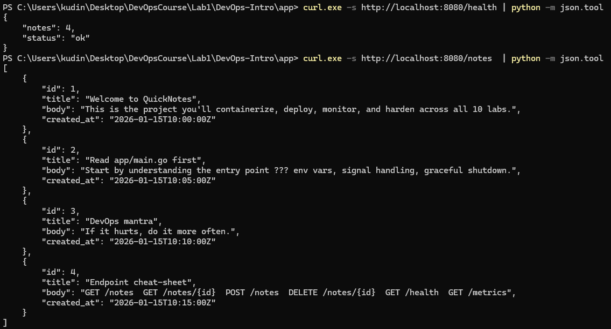
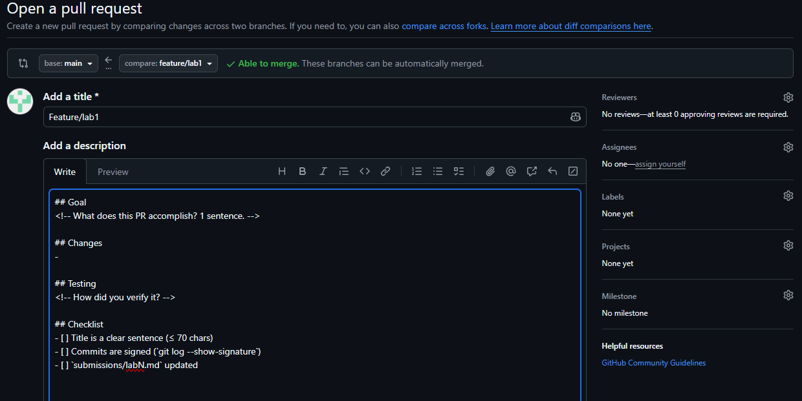
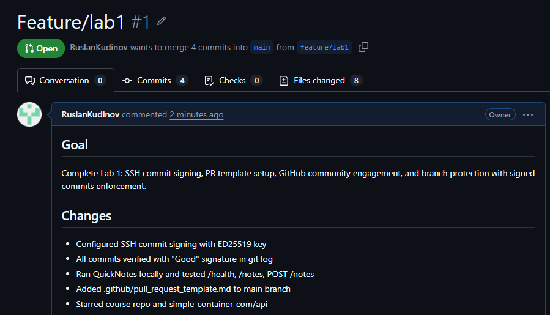
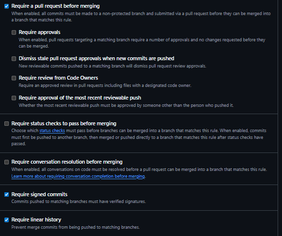
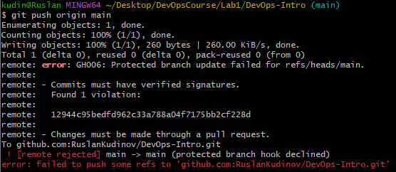
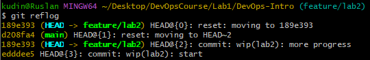
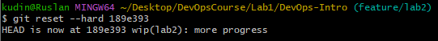

# Task1: Git Object Model + Reflog Recovery
## 1.1:
PS C:\Users\kudin\Desktop\DevOpsCourse\Lab1\DevOps-Intro> git rev-parse HEAD
d208fa4dc95b62226d666a91d321b9c7456b72c6
PS C:\Users\kudin\Desktop\DevOpsCourse\Lab1\DevOps-Intro> git cat-file -t HEAD
commit
PS C:\Users\kudin\Desktop\DevOpsCourse\Lab1\DevOps-Intro> git cat-file -p HEAD
tree 2a14077718263b85661b8c6f2f7d67e346098abc
parent e10ea7a8a01f0998ac2f06275c77ed6600cfbdb1
author Руслан Кудинов <r.kudinov@innopolis.university> 1781116123 +0300
committer Руслан Кудинов <r.kudinov@innopolis.university> 1781116123 +0300
gpgsig -----BEGIN SSH SIGNATURE-----
 U1NIU0lHAAAAAQAAADMAAAALc3NoLWVkMjU1MTkAAAAgfvRU4IbBAh2v6uscELCut5+irH
 hDEAikK0knuv2kMrEAAAADZ2l0AAAAAAAAAAZzaGE1MTIAAABTAAAAC3NzaC1lZDI1NTE5
 AAAAQJd7ln1nHB7/pYRcHTdhEMJF0kUe+Xvk2i70Ig0va7aRknoX9CuMK3ZKmBn+HCEen6
 sz9OLJaqZzva2lI+SeIwU=
 -----END SSH SIGNATURE-----

docs:(lab1) finish submission

Signed-off-by: Руслан Кудинов <r.kudinov@innopolis.university>
PS C:\Users\kudin\Desktop\DevOpsCourse\Lab1\DevOps-Intro> git cat-file -p 2a14077718263b85661b8c6f2f7d67e346098abc
040000 tree 1d07791eee3c3dd0955a02402b05b3a357816d8d    .github
100644 blob 1c0a1e94b7bbdd951f456cda51af6b8484cc3cee    .gitignore
100644 blob d10c04c6e7e0014f4fe883599c11747c15012d4e    README.md
040000 tree 7d0898a908e274ea809722844cdbd836f3b1c05a    app
040000 tree 6db686e340ecdd318fa43375e26254293371942a    labs
040000 tree 3f11973a71be5915539cb53313149aa319d69cb5    lectures
040000 tree 1998af089c92a1931e21df107ba6f78bcd7410ee    submissions
PS C:\Users\kudin\Desktop\DevOpsCourse\Lab1\DevOps-Intro> git cat-file -p 1998af089c92a1931e21df107ba6f78bcd7410ee
100644 blob 94977c7c9d9f42aefcf138d47128e119674212d2    BranchProtection.png
100644 blob 41ae314b96f4a86e00cfa7ac6a0bb8bfbb5b4820    BranchProtectionOutput.png
100644 blob f8baa65576d06257a2e9ef16c3a3a35c37abeaa9    PR1.png
100644 blob c56da38fd644b1eca5282370af26138ffae65fbe    PR2.png
100644 blob 80eb3ecbe350a2760c92a48076bf4ef0f5d0b75b    QN1.png
100644 blob 264e322df25ae493a048c4113d11a03073c9335a    QN2.png
100644 blob 15b5e28f78861a55b839f2058d6f325c4dbbf898    Screenshot 2026-06-10 182034.png
100644 blob 49a544c3df34d8c62fef5079f1a3d9d15dfb1b5e    Screenshot 2026-06-10 182613.png
100644 blob b0d048d99391d0dbf1ca2233060000c2566acc6f    lab1.md
PS C:\Users\kudin\Desktop\DevOpsCourse\Lab1\DevOps-Intro> git cat-file -p b0d048d99391d0dbf1ca2233060000c2566acc6f
��# Lab 1 submission
## Task 1: SSH Commit Signing $ First Signed Commit

#### QuickNotes Output

### Signature Verification

### Verified Badge

### Why Signed Commits Matter

>4?8AL :><<8B0 :@8?B>3@0D8G5A:8 4>:07K205B, GB> :>4 =0?8A0; 8<5==> O, 0 =5 :B>-B>, ?>445;02H89 email. =0 70I8I05B @5?>78B>@89 8 ?>2KH05B 4>25@85 : :>4C.

## Task 2: Pull Request Template & First PR

### PR Template Added
- Created .github/pull_request_template.md in main branch
- Template contains structured sections: Goal, Changes, Testing, Checklist

### PR Template Auto-Population
Pull request template auto-populated successfully.
Description includes Goal, Changes, Testing, and Checklist sections
as defined in .github/pull_request_template.md.

### PR Checklist
- [x] Title is clear sentence
- [x] Commits are signed (git log --show-signature)
- [x] submissions/lab1.md updated

## Task 3: GitHub Community Engagement

### Stars & Follows
- Starred the course repo and simple-container-com/api.
- Following professor @Cre-eD, TAs @Naghme98 and @pierrepicaud, and least 3 classmates:

### Why It Matters
2Q74K ?>:07K20NB 8=B5@5A : ?@>5:BC 8 ?>2KH0NB 53> 2848<>ABL; ?>4?8A:8 ?>72>;ONB A;548BL 70 @01>B>9 :>;;53, =0E>48BL =>2K5 8458 8 AB@>8BL ?@>D5AA8>=0;L=CN A5BL.

## Bonus Task: Branch Protection & Required Signed Commits

### Branch Protection Rules

### Unsigned Push Attempt

### Reflection (3-4 ?@54;>65=8O)
QAB:89 70?@5B =0 ?@O<>9 push 2 main 2K=C48; 1K @07@01>BG8:>2 Knight Capital ?@>E>48BL ?>;=>F5==K9 PR-?@>F5AA, GB> =5 ?>72>;8;> 1K AB0@><C, =5A>2<5AB8<><C :>4C ?>?0ABL 2 ?@>40:H5= 157 @52LN. >4?8A0==K5 :><<8BK 30@0=B8@>20;8 1K, GB> 87<5=5=8O 459AB28B5;L=> 8AE>4OB >B C?>;=><>G5==>3> 8=65=5@0, 0 =5 ?>4AB02=>3> ;8F0 8;8 A:><?@><5B8@>20==>9 CGQB=>9 70?8A8.  >1O70B5;L=>5 :>4-@52LN AB0;> 1K ?>A;54=8< 10@L5@><, 345 =5AB0=40@B=>5 8A?>;L7>20=85 D;030 0:B820F88 70<5B8;8 1K :>;;538, ?@54>B2@0B82 <8;;8>==K5 C1KB:8 70 AG8B0==K5 <8=CBK.

## 1.2:

kudin@Ruslan MINGW64 ~/Desktop/DevOpsCourse/Lab1/DevOps-Intro (main)
$ ls -la .git/
total 34
drwxr-xr-x 1 kudin 197609    0 Jun 10 22:04 ./
drwxr-xr-x 1 kudin 197609    0 Jun 10 20:55 ../
-rw-r--r-- 1 kudin 197609  107 Jun 10 21:28 COMMIT_EDITMSG
-rw-r--r-- 1 kudin 197609  100 Jun 10 22:04 FETCH_HEAD
-rw-r--r-- 1 kudin 197609   21 Jun 10 22:04 HEAD
-rw-r--r-- 1 kudin 197609   41 Jun 10 22:04 ORIG_HEAD
-rw-r--r-- 1 kudin 197609  567 Jun 10 20:03 config
-rw-r--r-- 1 kudin 197609   73 Jun 10 17:03 description
drwxr-xr-x 1 kudin 197609    0 Jun 10 17:03 hooks/
-rw-r--r-- 1 kudin 197609 4083 Jun 10 22:04 index
drwxr-xr-x 1 kudin 197609    0 Jun 10 17:03 info/
drwxr-xr-x 1 kudin 197609    0 Jun 10 17:03 logs/
drwxr-xr-x 1 kudin 197609    0 Jun 10 22:04 objects/
-rw-r--r-- 1 kudin 197609  112 Jun 10 17:03 packed-refs
drwxr-xr-x 1 kudin 197609    0 Jun 10 17:03 refs/
Смотрим на внутреннюю структурц папки .git

kudin@Ruslan MINGW64 ~/Desktop/DevOpsCourse/Lab1/DevOps-Intro (main)
$ cat .git/HEAD
ref: refs/heads/main
Мы находимся в ветке main

kudin@Ruslan MINGW64 ~/Desktop/DevOpsCourse/Lab1/DevOps-Intro (main)
$ ls .git/refs/heads/
feature/  main
Смотрим, какие ветки есть

kudin@Ruslan MINGW64 ~/Desktop/DevOpsCourse/Lab1/DevOps-Intro (main)
$ find .git/objects -type f | wc -l
63
В git сейчас лежит 63 объекта, каждый - слепок состояния контента

## 1.3:
git reflog output:

git reset --hard 189e393 output:

Если бы успел отработать git gc, он бы удалил коммит "more progress", и reflog не помог бы нам восстановиться.

# Task2: Tag a Release & Rebase a Feature