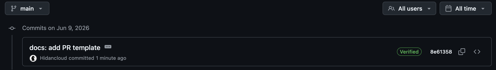

# Lab 2 — Version Control Deep Dive: Internals, Recovery, Rebase


## Task 1 — Git Object Model + Reflog Recovery

What have I done?
### Explored my repo

`git rev-parse HEAD`:

```

7213a6fd82b08375c0e5a5356cf6ca71f1324e18

```

`git cat-file -t HEAD ` 
```

commit

```

`git cat-file -p HEAD ` 
```

tree b2fe0c7c5e1b86c2995fdccb8e8b18e8a19fd322 \
parent 66bbd4db9228bc9a4cab7439746b993749c026ab \
author Ephy01 <hydrogenim@yandex.ru> 1780459207 +0300 \
committer Ephy01 <hydrogenim@yandex.ru> 1780459207 +0300 \
gpgsig -----BEGIN SSH SIGNATURE----- 
 U1NIU0lHAAAAAQAAADMAAAALc3NoLWVkMjU1MTkAAAAge97OKIxCHeCbzOiv9oZ1Nm5Dzz \
 7juGFSTt6rnU0py2IAAAADZ2l0AAAAAAAAAAZzaGE1MTIAAABTAAAAC3NzaC1lZDI1NTE5 \
 AAAAQLvvhavSnriry1gFwyRl+0tC+Q0MtD/K7GUdj9ON0/GRN7q3b2gRyAdWbDwMswiFF3 \
 iyNyOB22nTqXnjcZi+Sg4= \
 -----END SSH SIGNATURE----- 

docs: add PR template 

Signed-off-by: Ephy01 <hydrogenim@yandex.ru> \

```

`git cat-file -p b2fe0c7c5e1b86c2995fdccb8e8b18e8a19fd322` 

```

040000 tree 1d07791eee3c3dd0955a02402b05b3a357816d8d	.github 
100644 blob 1c0a1e94b7bbdd951f456cda51af6b8484cc3cee	.gitignore 
100644 blob d10c04c6e7e0014f4fe883599c11747c15012d4e	README.md 
040000 tree 7d0898a908e274ea809722844cdbd836f3b1c05a	app 
040000 tree 6db686e340ecdd318fa43375e26254293371942a	labs 
040000 tree 3f11973a71be5915539cb53313149aa319d69cb5	lectures 

```

`git cat-file -p 1c0a1e94b7bbdd951f456cda51af6b8484cc3cee ` 

here should be content of .gitignore,
I decided not to include it since its too large, so submission file would be clumsy


### Looked inside `.git/`

`ls -la .git` lists all files from .git with access rights:

```
total 56 \
drwxr-xr-x  14 ephy  staff   448 Jun  6 10:59 . 
drwxr-xr-x@ 11 ephy  staff   352 Jun  6 11:17 .. 
-rw-r--r--   1 ephy  staff    73 Jun  3 15:31 COMMIT_EDITMSG 
-rw-r--r--   1 ephy  staff    29 Jun  3 16:09 HEAD 
-rw-r--r--   1 ephy  staff    41 Jun  3 13:15 ORIG_HEAD 
-rw-r--r--@  1 ephy  staff   628 Jun  3 15:44 config 
-rw-r--r--   1 ephy  staff    73 Jun  3 06:24 description 
drwxr-xr-x  16 ephy  staff   512 Jun  3 06:24 hooks 
-rw-r--r--   1 ephy  staff  3183 Jun  6 10:59 index 
drwxr-xr-x   3 ephy  staff    96 Jun  3 06:24 info 
drwxr-xr-x   4 ephy  staff   128 Jun  3 16:09 logs  
drwxr-xr-x  29 ephy  staff   928 Jun  3 15:31 objects 
-rw-r--r--   1 ephy  staff   112 Jun  3 06:24 packed-refs 
drwxr-xr-x   5 ephy  staff   160 Jun  3 15:44 refs 
```

`cat .git/HEAD` shows content of .git/HEAD, this file is a pointer that shows where I am now, in my case: 

```
ref: refs/heads/feature/lab2
```

`ls .git/refs/heads/` returns all files from heads - each file is one local branch. Each file contains SHA of commit this branch points. 

```
feature main
```
`ls .git/objects/ | head` - returns first 10(head = 10) subfolders in /objects. Since everything(commit, trees, files) is stored as SHA in git, I got 10 two-characters directories(08, 13 etc)

`find .git/objects -type f | wc -l` - counts how many loose objects are in /objects. Loose means that these files have not been combined in one pack file(basically, compression, just not to have 1000 files, because, as I mentioned above, each commit is a file). In my case I got 29.


### Simulated disaster and recovered

I did two commits that rewrote my submission file. Then, I did `git reset --hard HEAD~2`. This command change commit history - it moves HEAD two commits backword, flag 'hard' removes them from working directory. 

However, `git reflog` exists. This command returns history of HEAD movements. 

```

7213a6f (HEAD -> feature/lab2, origin/main, origin/HEAD, main) HEAD@{0}: reset: moving to HEAD~2
037abd4 HEAD@{1}: commit: wip(lab2): more progress
3df2142 HEAD@{2}: commit: wip(lab2): start
7213a6f (HEAD -> feature/lab2, origin/main, origin/HEAD, main) HEAD@{3}: checkout: moving from main to feature/lab2
7213a6f (HEAD -> feature/lab2, origin/main, origin/HEAD, main) HEAD@{4}: checkout: moving from feature/lab2 to main
7213a6f (HEAD -> feature/lab2, origin/main, origin/HEAD, main) HEAD@{5}: checkout: moving from main to feature/lab2
7213a6f (HEAD -> feature/lab2, origin/main, origin/HEAD, main) HEAD@{6}: checkout: moving from main to main
7213a6f (HEAD -> feature/lab2, origin/main, origin/HEAD, main) HEAD@{7}: checkout: moving from lab2 to main
4e331ef (origin/feature/lab1, feature/lab1) HEAD@{8}: checkout: moving from feature/lab1 to lab2
4e331ef (origin/feature/lab1, feature/lab1) HEAD@{9}: commit: docs(lab1): lab1 completed
54ad602 HEAD@{10}: commit: docs(lab1): bonus task completed

```

From this, I can easily find SHA of my 'wasted' commits. I picked 037abd4, and returned to pre disaster state. 

```
git reset --hard 037abd4
HEAD is now at 037abd4 wip(lab2): more progress
```

What is the role of `git gc` ? 

`git gc`  compresses loose objects into packfiles and prunes objects that are no longer reachable from any branch, tag, reflog. After my `git reset --hard`, the two `wasted` commits became unreachable objects, but `git reflog` still pointed at them(30 days usually), which is why `git reset --hard <SHA>` brought them back. Running `git gc` in this case would not destroy them. Only an aggressive prune such as `git gc --prune=now` would erase them. 


Good "git" signature for hydrogenim@yandex.ru with ED25519 key SHA256:A4DMi3JBqhY4gzOwwFEp42EaHJwR+5cF6LIWpVPtyYs

Verified badge on GitHub:



### Why signed commits matter

Signed commits cryptographically bind each commit to a verified identity (proving the code truly came from that person). This provenance is core to supply-chain security: the March 2024 xz-utils incident showed how attackers exploit trust in the contribution pipeline. To be honest, signing alone would not have stopped them, because the malicious maintainer was trusted and much of the malicious code was in the release tarballs(differed from the git source). And that is the lesson: if everyone had built from the git repository (with verified commits), those malicious build-script changes simply would not have appeared.

---

## Task 2 — Tag a Release & Rebase a Feature

What have I done?

### 2.1: Annotated, signed release tag

### 2.2: Rebase + force-with-lease

### 2.3: Document
---


## Bonus Task — Bisect a Real Bug 

What have I done?


