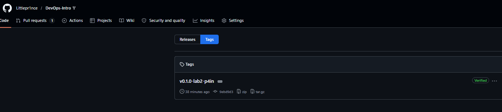

# Lab 2 submission

# Lab 2 — Version Control Deep Dive: Internals, Recovery, Rebase

**Student:** T.R. Shekhmametyev

## Task 1 — Git Object Model + Reflog Recovery

### 1.1 Explore Git Object Model

First, I inspected the current HEAD commit.

```bash
┌──(p4in㉿kali)-[~/Desktop/DevOps-Intro]
└─$ git rev-parse HEAD
9ebd9d302bd158506d7c009b96c4845da0b94925
```
Then I checked the object type stored at HEAD.

```bash
┌──(p4in㉿kali)-[~/Desktop/DevOps-Intro]
└─$ git cat-file -t HEAD
commit
```

Next, I inspected the commit object itself.

```bash
┌──(p4in㉿kali)-[~/Desktop/DevOps-Intro]
└─$ git cat-file -p HEAD
tree b2fe0c7c5e1b86c2995fdccb8e8b18e8a19fd322
parent 66bbd4db9228bc9a4cab7439746b993749c026ab
author T. R. Shekhmametyev <ssssasaskfrjd@gmail.com> 1780954910 -0400
committer T. R. Shekhmametyev <ssssasaskfrjd@gmail.com> 1780954910 -0400
gpgsig -----BEGIN SSH SIGNATURE-----
 U1NIU0lHAAAAAQAAADMAAAALc3NoLWVkMjU1MTkAAAAgZtwj+wzePcwUxnAQDmsXhuxOA8
 ....
 -----END SSH SIGNATURE-----

docs: add PR template

Signed-off-by: T. R. Shekhmametyev <ssssasaskfrjd@gmail.com>
```
The commit object references a tree object.
I inspected the tree:

```bash
┌──(p4in㉿kali)-[~/Desktop/DevOps-Intro]
└─$ git cat-file -p b2fe0c7c5e1b86c2995fdccb8e8b18e8a19fd322
040000 tree 1d07791eee3c3dd0955a02402b05b3a357816d8d    .github
100644 blob 1c0a1e94b7bbdd951f456cda51af6b8484cc3cee    .gitignore
100644 blob d10c04c6e7e0014f4fe883599c11747c15012d4e    README.md
040000 tree 7d0898a908e274ea809722844cdbd836f3b1c05a    app
040000 tree 6db686e340ecdd318fa43375e26254293371942a    labs
040000 tree 3f11973a71be5915539cb53313149aa319d69cb5    lectures
```
Finally, I inspected the README blob (Output truncated)

```bash
┌──(p4in㉿kali)-[~/Desktop/DevOps-Intro]
└─$ git cat-file -p d10c04c6e7e0014f4fe883599c11747c15012d4e
# DevOps Intro — Modern DevOps Practices Through One Project

[](#course-roadmap)
[-success)](#the-project-quicknotes)
[](#course-roadmap)
[](#grading)

A 10-week practical introduction to DevOps at Innopolis University. You will package, ship, observe, harden, and deploy **one** Go service — QuickNotes — across every lab. The discipline you learn here is the spine of modern production engineering.

> 💬 *"If it hurts, do it more often."* — Jez Humble

---

## Course Roadmap

10 weekly labs + 2 optional bonus labs:
```

### Object Chain

The explored chain was:

```text
HEAD
↓
Commit 9ebd9d302bd158506d7c009b96c4845da0b94925
↓
Tree b2fe0c7c5e1b86c2995fdccb8e8b18e8a19fd322
↓
Blob d10c04c6e7e0014f4fe883599c11747c15012d4e
↓
README.md
```

### Reflection

This exercise demonstrated Git's internal object model. A commit does not directly store files. Instead, a commit references a tree object, which represents the directory structure. Trees reference blobs, and blobs contain the actual file contents.

---

### 1.2 Explore the .git Directory

I inspected the repository internals.
The directory contains configuration files, logs, references, objects, hooks, and the index.

```bash
┌──(p4in㉿kali)-[~/Desktop/DevOps-Intro]
└─$ ls -la .git/
total 60
drwxrwxr-x  7 p4in p4in 4096 Jun  9 14:04 .
drwxrwxr-x  7 p4in p4in 4096 Jun  9 13:57 ..
-rw-rw-r--  1 p4in p4in   96 Jun  8 19:20 COMMIT_EDITMSG
-rw-rw-r--  1 p4in p4in  466 Jun  9 14:04 config
-rw-rw-r--  1 p4in p4in   73 Jun  8 10:51 description
-rw-rw-r--  1 p4in p4in  108 Jun  9 13:57 FETCH_HEAD
-rw-rw-r--  1 p4in p4in   29 Jun  9 14:04 HEAD
drwxrwxr-x  2 p4in p4in 4096 Jun  8 10:51 hooks
-rw-rw-r--  1 p4in p4in 3183 Jun  9 14:04 index
drwxrwxr-x  2 p4in p4in 4096 Jun  8 10:51 info
drwxrwxr-x  3 p4in p4in 4096 Jun  8 10:51 logs
drwxrwxr-x 66 p4in p4in 4096 Jun  9 13:57 objects
-rw-rw-r--  1 p4in p4in   41 Jun  9 13:57 ORIG_HEAD
-rw-rw-r--  1 p4in p4in  112 Jun  8 10:51 packed-refs
drwxrwxr-x  5 p4in p4in 4096 Jun  8 10:51 refs
```
Current HEAD:

```bash
┌──(p4in㉿kali)-[~/Desktop/DevOps-Intro]
└─$ cat .git/HEAD
ref: refs/heads/feature/lab2
```

This shows that HEAD currently points to the `feature/lab2` branch.

Branches:

```bash
┌──(p4in㉿kali)-[~/Desktop/DevOps-Intro]
└─$ ls .git/refs/heads/
feature  main
```

Objects:

```bash
┌──(p4in㉿kali)-[~/Desktop/DevOps-Intro]
└─$ ls .git/objects/ | head
06
0a
0b
0c
0d
0e
0f
13
18
1a
```

Number of loose objects:

```bash
┌──(p4in㉿kali)-[~/Desktop/DevOps-Intro]
└─$ find .git/objects -type f | wc -l
72
```

### Reflection

The `.git` directory is the actual Git repository. Branches are stored as references that point to commit SHAs. Objects are stored inside `.git/objects` and are organized by the first two characters of their SHA hash. Git tracks commits, trees, and blobs using this object database.

---

### 1.3 Simulate Disaster and Recover Using Reflog

I created two commits with 2 lines like in lab description:

```bash
┌──(p4in㉿kali)-[~/Desktop/DevOps-Intro]
└─$ git commit -S -s -m "wip(lab2): start"
Enter passphrase for "/home/p4in/.ssh/id_ed25519": 
[feature/lab2 77f0a55] wip(lab2): start
 1 file changed, 1 insertion(+)
 create mode 100644 submissions/lab2.md

┌──(p4in㉿kali)-[~/Desktop/DevOps-Intro]
└─$ git commit -S -s -am "wip(lab2): more progress"
Enter passphrase for "/home/p4in/.ssh/id_ed25519": 
[feature/lab2 4772151] wip(lab2): more progress
 1 file changed, 1 insertion(+)
```

Then I intentionally removed them:

```bash
┌──(p4in㉿kali)-[~/Desktop/DevOps-Intro]
└─$ git reset --hard HEAD~2
HEAD is now at 9ebd9d3 docs: add PR template
```

After the reset:

```bash
┌──(p4in㉿kali)-[~/Desktop/DevOps-Intro]
└─$ git status 
On branch feature/lab2
nothing to commit, working tree clean
```

The commits disappeared from `git log`.
Then I inspected the reflog (i put here only relevant output out of all output):

```bash
┌──(p4in㉿kali)-[~/Desktop/DevOps-Intro]
└─$ git reflog
9ebd9d3 (HEAD -> feature/lab2, origin/main, origin/HEAD, main) HEAD@{0}: reset: moving to HEAD~2
4772151 HEAD@{1}: commit: wip(lab2): more progress
77f0a55 HEAD@{2}: commit: wip(lab2): start
9ebd9d3 (HEAD -> feature/lab2, origin/main, origin/HEAD, main) HEAD@{3}: checkout: moving from main to feature/lab2
9ebd9d3 (HEAD -> feature/lab2, origin/main, origin/HEAD, main) HEAD@{4}: checkout: moving from feature/lab2 to main
666f982 HEAD@{5}: checkout: moving from main to feature/lab2
.....
```

The reflog preserved the previous commit locations.
I restored the branch using:

```bash
┌──(p4in㉿kali)-[~/Desktop/DevOps-Intro]
└─$ git reset --hard 4772151
HEAD is now at 4772151 wip(lab2): more progress
```

Verification:

```bash
┌──(p4in㉿kali)-[~/Desktop/DevOps-Intro]
└─$ git log --oneline -5
4772151 (HEAD -> feature/lab2) wip(lab2): more progress
77f0a55 wip(lab2): start
9ebd9d3 (origin/main, origin/HEAD, main) docs: add PR template
```


### What if `git gc` had run?

After the hard reset, the commits became unreachable. However, Git still retained them because they were referenced by the reflog. If aggressive garbage collection (`git gc`) had removed unreachable objects after the reflog entries expired, those commits could have been permanently deleted. In that situation recovery would become significantly more difficult or impossible.

This task demonstrated that Git rarely deletes data immediately. Even after a destructive reset, previously reachable commits can often be recovered through the reflog. Understanding reflog recovery is one of the most important safety skills when working with Git.


## Task 2 — Tags and Rebase

### 2.1 Annotated Signed Tag

I created an annotated and signed release tag:

```bash                                                                                                  
┌──(p4in㉿kali)-[~/Desktop/DevOps-Intro]
└─$ git pull --ff-only upstream main
From https://github.com/inno-devops-labs/DevOps-Intro
 * branch            main       -> FETCH_HEAD
Already up to date.

┌──(p4in㉿kali)-[~/Desktop/DevOps-Intro]
└─$ git tag -a -s "v0.1.0-lab2-p4in" -m "Lab 2 milestone — version control deep dive"
Enter passphrase for "/home/p4in/.ssh/id_ed25519": 

```
The tag was pushed to GitHub:

```bash
┌──(p4in㉿kali)-[~/Desktop/DevOps-Intro]
└─$ git push origin "v0.1.0-lab2-p4in"
Enter passphrase for key '/home/p4in/.ssh/id_ed25519': 
Enumerating objects: 1, done.
Counting objects: 100% (1/1), done.
Writing objects: 100% (1/1), 426 bytes | 426.00 KiB/s, done.
Total 1 (delta 0), reused 0 (delta 0), pack-reused 0 (from 0)
To github.com:Littlepr1nce/DevOps-Intro.git
 * [new tag]         v0.1.0-lab2-p4in -> v0.1.0-lab2-p4in
```


Verification:

```bash
┌──(p4in㉿kali)-[~/Desktop/DevOps-Intro]
└─$ git tag -l --format='%(refname:short) %(objecttype) %(*objecttype)'
v0.0.1 tag commit
v0.1.0-lab2-p4in tag commit
```

Signature verification:

```bash
┌──(p4in㉿kali)-[~/Desktop/DevOps-Intro]
└─$ git tag -v "v0.1.0-lab2-p4in"
object 9ebd9d302bd158506d7c009b96c4845da0b94925
type commit
tag v0.1.0-lab2-p4in
tagger T. R. Shekhmametyev <ssssasaskfrjd@gmail.com> 1781036095 -0400

Lab 2 milestone — version control deep dive
Good "git" signature for ssssasaskfrjd@gmail.com with ED25519 key SHA256:i4koMK7Uh+hVaJ/BHiDLUKUHyOvpzeSvUpi4....
```

### Reflection

Annotated tags are first-class Git objects that can store metadata, messages, and cryptographic signatures. Signed tags provide authenticity and are commonly used to mark release versions in CI/CD pipelines.

---

### 2.2 Rebase and Force-With-Lease

Before rebase(only relevant text):

```bash
┌──(p4in㉿kali)-[~/Desktop/DevOps-Intro]
└─$ git log --oneline --graph --decorate -10
* 5e653d3 (HEAD -> feature/lab2, origin/feature/lab2) docs(lab2): complete task 1
* 4772151 wip(lab2): more progress
* 77f0a55 wip(lab2): start
* 9ebd9d3 (tag: v0.1.0-lab2-p4in, origin/main, origin/HEAD, main) docs: add PR template 
* 66bbd4d (upstream/main, upstream/HEAD) docs(lab1): align Task 3 GitHub Community engagement with other courses
....
```
To simulate upstream progress, I created a new commit on main. Direct pushing to the protected main branch was rejected by GitHub branch protection rules configured during Lab 1. The rebase demonstration was therefore performed against the updated local main branch:
```bash
┌──(p4in㉿kali)-[~/Desktop/DevOps-Intro]
└─$ git commit -S -s --allow-empty -m "docs: upstream moved while you worked"
Enter passphrase for "/home/p4in/.ssh/id_ed25519": 
[main 49607e8] docs: upstream moved while you worked
                                                                                                                  
┌──(p4in㉿kali)-[~/Desktop/DevOps-Intro]
└─$ git push origin main
Enter passphrase for key '/home/p4in/.ssh/id_ed25519': 
Enumerating objects: 1, done.
Counting objects: 100% (1/1), done.
Writing objects: 100% (1/1), 459 bytes | 459.00 KiB/s, done.
Total 1 (delta 0), reused 0 (delta 0), pack-reused 0 (from 0)
remote: error: GH013: Repository rule violations found for refs/heads/main.
remote: Review all repository rules at https://github.com/Littlepr1nce/DevOps-Intro/rules?ref=refs%2Fheads%2Fmain
remote: 
remote: - Changes must be made through a pull request.
remote: 
To github.com:Littlepr1nce/DevOps-Intro.git
 ! [remote rejected] main -> main (push declined due to repository rule violations)
error: failed to push some refs to 'github.com:Littlepr1nce/DevOps-Intro.git'
```
Then I rebased the feature branch:

```bash
┌──(p4in㉿kali)-[~/Desktop/DevOps-Intro]
└─$ git rebase main
Enter passphrase for "/home/p4in/.ssh/id_ed25519": 
Enter passphrase for "/home/p4in/.ssh/id_ed25519": 
Enter passphrase for "/home/p4in/.ssh/id_ed25519": 
Successfully rebased and updated refs/heads/feature/lab2.
```
After rebase:

```bash
┌──(p4in㉿kali)-[~/Desktop/DevOps-Intro]
└─$ git log --oneline --graph --decorate -10
* c0943f6 (HEAD -> feature/lab2) docs(lab2): complete task 1
* c002069 wip(lab2): more progress
* 60c284a wip(lab2): start
* 49607e8 (main) docs: upstream moved while you worked
* 9ebd9d3 (tag: v0.1.0-lab2-p4in, origin/main, origin/HEAD) docs: add PR template
* 66bbd4d (upstream/main, upstream/HEAD) docs(lab1): align Task 3 GitHub Community engagement with other courses
*   170000c Merge pull request #907 from inno-devops-labs/s26-refactor
|\  .....
```

The commit messages remained the same, but all commit hashes changed because Git recreated the commits on top of a new parent commit.
To update the remote branch, I used:

```bash
┌──(p4in㉿kali)-[~/Desktop/DevOps-Intro]
└─$ git push --force-with-lease origin feature/lab2
Enter passphrase for key '/home/p4in/.ssh/id_ed25519': 
Enumerating objects: 16, done.
Counting objects: 100% (16/16), done.
Delta compression using up to 8 threads
Compressing objects: 100% (10/10), done.
Writing objects: 100% (15/15), 206.16 KiB | 1.42 MiB/s, done.
Total 15 (delta 6), reused 0 (delta 0), pack-reused 0 (from 0)
remote: Resolving deltas: 100% (6/6), completed with 1 local object.
To github.com:Littlepr1nce/DevOps-Intro.git
 + 5e653d3...c0943f6 feature/lab2 -> feature/lab2 (forced update)
```

### Merge vs Rebase

I would use merge when preserving the exact historical development process is important, especially on shared branches. 
And I would use rebase when preparing a feature branch for integration because it creates a cleaner and more linear commit history. 
Rebase should be used carefully because it rewrites commit history and changes commit hashes.

## Bonus Task — Git Bisect

### B1 - Bisect Setup

I fetched the branch containing a deliberately introduced bug and started a bisect session.

```bash
┌──(p4in㉿kali)-[~/Desktop/DevOps-Intro]
└─$ git fetch upstream
                                                                                                                  
┌──(p4in㉿kali)-[~/Desktop/DevOps-Intro]
└─$ git switch -c bisect-quickn upstream/bug/bisect-me
branch 'bisect-quickn' set up to track 'upstream/bug/bisect-me'.
Switched to a new branch 'bisect-quickn'

┌──(p4in㉿kali)-[~/Desktop/DevOps-Intro]
└─$ git bisect start
status: waiting for both good and bad commits
                                                                                                                  
┌──(p4in㉿kali)-[~/Desktop/DevOps-Intro]
└─$ git bisect bad HEAD
status: waiting for good commit(s), bad commit known
                                                                                                                  
┌──(p4in㉿kali)-[~/Desktop/DevOps-Intro]
└─$ git bisect good v0.0.1
Bisecting: 1 revision left to test after this (roughly 1 step)
[f285ede8611e55ac0a7d01100891c0cc775e0709] refactor(store): simplify nextID restoration in load()
```

### Manual Testing

Git selected intermediate commits between the known-good and known-bad revisions.

At commit:

```bash
┌──(p4in㉿kali)-[~/Desktop/DevOps-Intro]
└─$ git log --oneline -3
f285ede (HEAD) refactor(store): simplify nextID restoration in load()
cb89bb9 docs(store): comment the load() decode step
0ec87b8 (tag: v0.0.1) chore(app): document versioning scheme (bisect fixture baseline)
                                                                                                               
┌──(p4in㉿kali)-[~/Desktop/DevOps-Intro]
└─$ cd app
                                                                                                                 
┌──(p4in㉿kali)-[~/Desktop/DevOps-Intro/app]
└─$ go build ./...
```

The application built successfully, but the test suite failed.
Therefore this revision was marked as bad and Git moved to the next candidate commit:

```bash
┌──(p4in㉿kali)-[~/Desktop/DevOps-Intro/app]
└─$ go test ./...
--- FAIL: TestStore_PersistsAcrossReload (0.00s)
    store_test.go:78: nextID not restored: got 1, want 2
FAIL
FAIL    quicknotes      0.003s
FAIL
                                                                                                                 
┌──(p4in㉿kali)-[~/Desktop/DevOps-Intro/app]
└─$ git bisect bad     
Bisecting: 0 revisions left to test after this (roughly 0 steps)
[cb89bb9ee2ee5010b166061447eaca3ae0da2378] docs(store): comment the load() decode step
```

All tests passed successfully, so the revision was marked as good:

```bash                                                                                                           
┌──(p4in㉿kali)-[~/Desktop/DevOps-Intro/app]
└─$ go build ./...
                                                                                                                  
┌──(p4in㉿kali)-[~/Desktop/DevOps-Intro/app]
└─$ go test ./...
ok      quicknotes      0.003s
                                                                                                                  
┌──(p4in㉿kali)-[~/Desktop/DevOps-Intro/app]
└─$ git bisect good       
f285ede8611e55ac0a7d01100891c0cc775e0709 is the first bad commit
commit f285ede8611e55ac0a7d01100891c0cc775e0709
Author: Dmitrii Creed <creeed22@gmail.com>
Date:   Fri Jun 5 13:36:56 2026 +0400
    refactor(store): simplify nextID restoration in load()
    Signed-off-by: Dmitrii Creed <creeed22@gmail.com>
 app/store.go | 2 +-
 1 file changed, 1 insertion(+), 1 deletion(-)
```
### B2 - Automated Bisect

I also automated the search using:

```bash
┌──(p4in㉿kali)-[~/Desktop/DevOps-Intro/app]
└─$ git bisect run sh -c 'cd app && go test ./... && go build ./...'
running 'sh' '-c' 'cd app && go test ./... && go build ./...'
--- FAIL: TestStore_PersistsAcrossReload (0.00s)
    store_test.go:78: nextID not restored: got 1, want 2
FAIL
FAIL    quicknotes      0.004s
FAIL
Bisecting: 0 revisions left to test after this (roughly 0 steps)
[cb89bb9ee2ee5010b166061447eaca3ae0da2378] docs(store): comment the load() decode step
running 'sh' '-c' 'cd app && go test ./... && go build ./...'
ok      quicknotes      (cached)
f285ede8611e55ac0a7d01100891c0cc775e0709 is the first bad commit
commit f285ede8611e55ac0a7d01100891c0cc775e0709
Author: Dmitrii Creed <creeed22@gmail.com>
Date:   Fri Jun 5 13:36:56 2026 +0400
    refactor(store): simplify nextID restoration in load()
    Signed-off-by: Dmitrii Creed <creeed22@gmail.com>
 app/store.go | 2 +-
 1 file changed, 1 insertion(+), 1 deletion(-)
bisect found first bad commit

```

Git automatically executed the test suite and build process on each candidate commit. The failing commit produced:

```text
--- FAIL: TestStore_PersistsAcrossReload
nextID not restored: got 1, want 2
```

After evaluating the remaining candidates, Git reported:

```text
f285ede8611e55ac0a7d01100891c0cc775e0709 is the first bad commit
```

The automated search reached the same conclusion as the manual investigation while requiring no further user interaction.

### Full bisect log

```bash
┌──(p4in㉿kali)-[~/Desktop/DevOps-Intro/app]
└─$ git bisect log
git bisect start
# status: waiting for both good and bad commits
# bad: [f0c9243b7c80ebb930a1ce7048a1d65b4c2ac493] docs(app): mention go test invocation
git bisect bad f0c9243b7c80ebb930a1ce7048a1d65b4c2ac493
# status: waiting for good commit(s), bad commit known
# good: [0ec87b808ae6a257a98ecea4a3c8d38a7f2c5ac7] chore(app): document versioning scheme (bisect fixture baseline)
git bisect good 0ec87b808ae6a257a98ecea4a3c8d38a7f2c5ac7
# bad: [f285ede8611e55ac0a7d01100891c0cc775e0709] refactor(store): simplify nextID restoration in load()
git bisect bad f285ede8611e55ac0a7d01100891c0cc775e0709
# good: [cb89bb9ee2ee5010b166061447eaca3ae0da2378] docs(store): comment the load() decode step
git bisect good cb89bb9ee2ee5010b166061447eaca3ae0da2378
# first bad commit: [f285ede8611e55ac0a7d01100891c0cc775e0709] refactor(store): simplify nextID restoration in load()
```

### Reflection

Git bisect performs a binary search through commit history. Instead of checking commits one by one, Git repeatedly selects a commit near the middle of the remaining search space. After each good/bad decision, approximately half of the candidate commits are eliminated. Because of this, the number of required tests grows roughly as log₂(N), making bisect extremely efficient even in repositories with thousands of commits.
