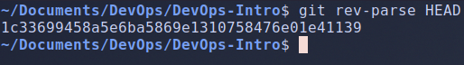
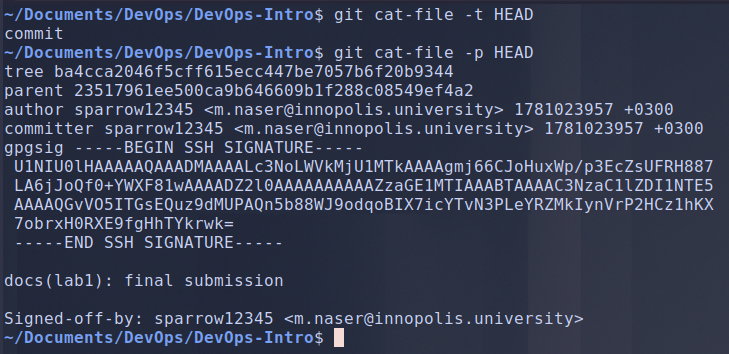
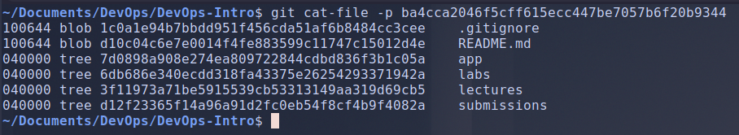
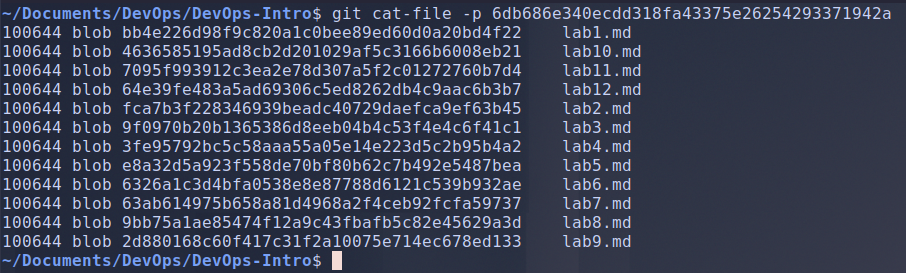
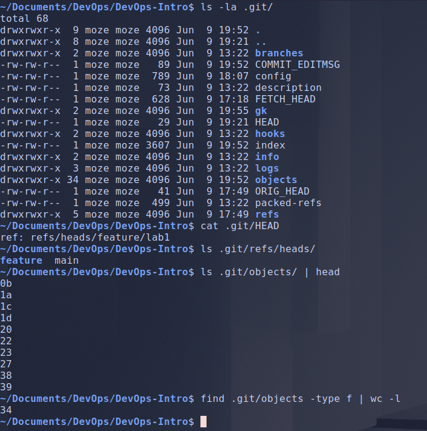
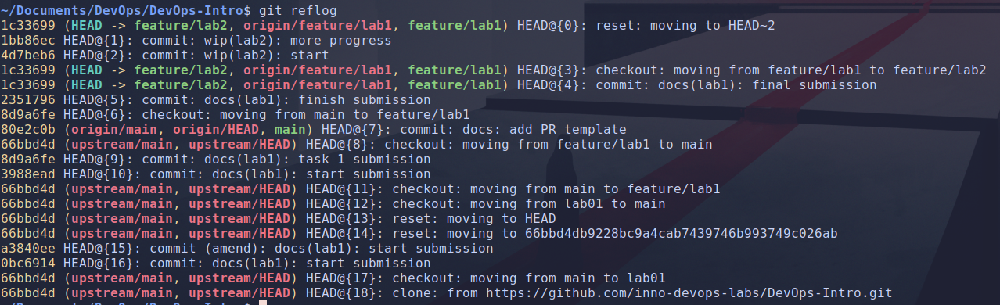
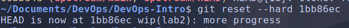

# Lab 2 submission

## Task 1: Git Object Model + Reflog Recovery

### 1.1: Explore your repo's plumbing

- **`HEAD`:**

    

- **tree:**

    

- **blob:**

    

- **file contents:**

    

### 1.2 Inside `.git/`

### 1.2 — .git/ interpretation

- `cat .git/HEAD` → `ref: refs/heads/feature/lab1`: it stores the current branch name, not a commit SHA.
- `ls .git/refs/heads/` → `feature  main`: `feature` is a directory, not a branch. Slashes in branch names (`feature/lab1`, `feature/lab2`) become real folders, so a branch is just a file holding a commit SHA.
- `.git/objects/`: loose objects sharded into dirs by the first 2 chars of their SHA. 
- `find .git/objects -type f | wc -l` counted 34 files

### 1.3: Simulate disaster + recover

- **`git reflog` output:**

    

- **`git reset --hard` output:**

    

- ***what would happen if git gc had run between the bad reset and your recovery?***

    `git gc` prunes unreachable objects, but it respects the reflog and a grace period: by default it only prunes objects older than two weeks and keeps reflog entries for 90 days. Because the reflog still referenced my two commits, an ordinary git gc would not have deleted them, they were seconds old and still reachable via the reflog. The real danger is an aggressive prune that ignores the grace window — `git gc --prune=now` or `git reflog expire --expire=now --all` followed by `git prune` which removes unreachable objects immediately, if that had run, the commits would be unrecoverable.
